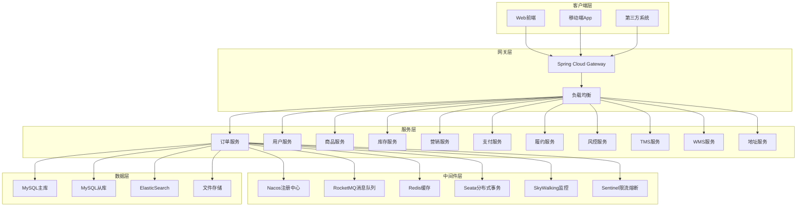
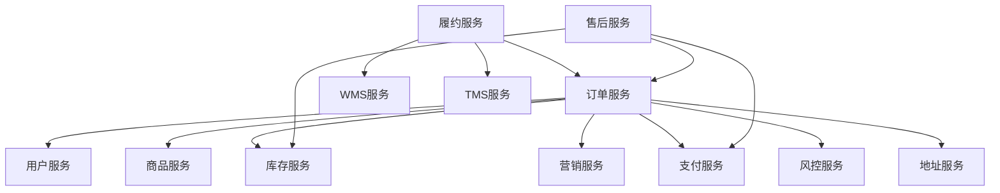
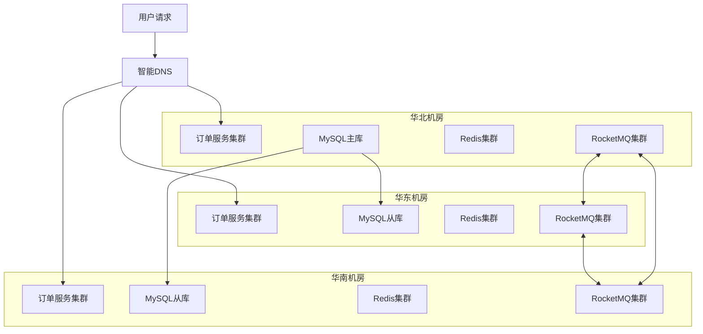

# 系统整体架构设计

## 1. 架构概览

### 1.1 整体架构图


### 1.2 架构特点

#### 1.2.1 微服务架构
- **服务拆分**：按业务域进行服务拆分，每个服务职责单一
- **独立部署**：每个服务可以独立开发、测试、部署
- **技术栈自由**：不同服务可以选择适合的技术栈
- **团队自治**：不同团队可以独立负责不同的服务

#### 1.2.2 分布式架构
- **水平扩展**：服务可以根据负载进行水平扩展
- **故障隔离**：单个服务故障不会影响整个系统
- **异地多活**：支持多机房部署，提高可用性
- **弹性伸缩**：根据业务量自动调整服务实例数量

## 2. 技术架构详解

### 2.1 服务治理架构

#### 2.1.1 Dubbo + Nacos架构
```java
// Dubbo服务提供者配置
@Service(version = "1.0.0")
public class OrderServiceImpl implements OrderService {
    // 服务实现
}

// Dubbo服务消费者配置
@DubboReference(version = "1.0.0", timeout = 3000, retries = 2)
private ProductApi productApi;
```

**架构优势**：
- **高性能RPC**：Dubbo提供高性能的RPC通信
- **服务发现**：Nacos提供服务注册与发现
- **负载均衡**：支持多种负载均衡策略
- **容错机制**：提供超时、重试、降级等容错机制

#### 2.1.2 服务依赖关系


### 2.2 数据架构

#### 2.2.1 数据库分片策略
```java
// 订单数据按用户ID分片
@Configuration
public class ShardingDataSourceConfig {
    
    @Bean
    public DataSource dataSource() {
        ShardingRuleConfiguration shardingRuleConfig = new ShardingRuleConfiguration();
        
        // 订单表分片规则
        TableRuleConfiguration orderTableRule = new TableRuleConfiguration("order_info");
        orderTableRule.setActualDataNodes("ds${0..3}.order_info_${0..15}");
        
        // 分库策略：按用户ID哈希分库
        orderTableRule.setDatabaseShardingStrategyConfig(
            new InlineShardingStrategyConfiguration("user_id", "ds${user_id.hashCode() % 4}"));
        
        // 分表策略：按订单ID分表
        orderTableRule.setTableShardingStrategyConfig(
            new InlineShardingStrategyConfiguration("order_id", "order_info_${order_id.hashCode() % 16}"));
        
        shardingRuleConfig.getTableRuleConfigs().add(orderTableRule);
        
        return ShardingDataSourceFactory.createDataSource(dataSourceMap, shardingRuleConfig, new Properties());
    }
}
```

#### 2.2.2 读写分离配置
```yaml
spring:
  datasource:
    master:
      url: jdbc:mysql://master-db:3306/ruyuan_eshop_order
      username: root
      password: password
    slave:
      url: jdbc:mysql://slave-db:3306/ruyuan_eshop_order
      username: readonly
      password: password
```

### 2.3 缓存架构

#### 2.3.1 多级缓存策略
```java
@Service
public class OrderCacheService {
    
    // L1缓存：本地缓存
    @Cacheable(value = "orderInfo", cacheManager = "localCacheManager")
    public OrderInfoDTO getOrderInfoFromLocal(String orderId) {
        return null; // 缓存未命中
    }
    
    // L2缓存：Redis缓存
    @Cacheable(value = "orderInfo", cacheManager = "redisCacheManager")
    public OrderInfoDTO getOrderInfoFromRedis(String orderId) {
        return orderInfoDAO.getByOrderId(orderId);
    }
    
    public OrderInfoDTO getOrderInfo(String orderId) {
        // 先查本地缓存
        OrderInfoDTO orderInfo = getOrderInfoFromLocal(orderId);
        if (orderInfo != null) {
            return orderInfo;
        }
        
        // 再查Redis缓存
        orderInfo = getOrderInfoFromRedis(orderId);
        if (orderInfo != null) {
            // 异步写入本地缓存
            asyncWriteToLocalCache(orderId, orderInfo);
        }
        
        return orderInfo;
    }
}
```

#### 2.3.2 缓存一致性策略
```java
@Component
public class CacheConsistencyManager {
    
    // 缓存更新策略：先更新数据库，再删除缓存
    @Transactional
    public void updateOrderInfo(OrderInfoDO orderInfo) {
        // 1. 更新数据库
        orderInfoDAO.updateById(orderInfo);
        
        // 2. 删除缓存
        String cacheKey = "orderInfo:" + orderInfo.getOrderId();
        redisTemplate.delete(cacheKey);
        
        // 3. 发送缓存失效消息
        CacheInvalidateMessage message = new CacheInvalidateMessage();
        message.setCacheKey(cacheKey);
        defaultProducer.sendMessage("CACHE_INVALIDATE_TOPIC", JSON.toJSONString(message));
    }
}
```

### 2.4 消息架构

#### 2.4.1 RocketMQ集群架构
```yaml
# RocketMQ集群配置
rocketmq:
  name-server: nameserver1:9876;nameserver2:9876
  producer:
    group: order-producer-group
    send-message-timeout: 3000
    retry-times-when-send-failed: 2
  consumer:
    group: order-consumer-group
    consume-thread-min: 20
    consume-thread-max: 64
    consume-message-batch-max-size: 1
```

#### 2.4.2 消息分类设计
```java
public class MessageTopicConstants {
    // 订单相关消息
    public static final String ORDER_CREATED_TOPIC = "ORDER_CREATED";
    public static final String ORDER_PAID_TOPIC = "ORDER_PAID";
    public static final String ORDER_CANCELED_TOPIC = "ORDER_CANCELED";
    
    // 履约相关消息
    public static final String ORDER_FULFILL_TOPIC = "ORDER_FULFILL";
    public static final String ORDER_SHIPPED_TOPIC = "ORDER_SHIPPED";
    public static final String ORDER_DELIVERED_TOPIC = "ORDER_DELIVERED";
    
    // 延迟消息
    public static final String PAY_TIMEOUT_DELAY_TOPIC = "PAY_TIMEOUT_DELAY";
    
    // 事务消息
    public static final String PAID_ORDER_SUCCESS_TOPIC = "PAID_ORDER_SUCCESS";
}
```

### 2.5 分布式事务架构

#### 2.5.1 Seata AT模式
```java
// 全局事务注解
@GlobalTransactional(rollbackFor = Exception.class)
public void createOrder(CreateOrderRequest request) {
    // 1. 本地事务：插入订单数据
    orderManager.insertOrderData(request);
    
    // 2. 远程事务：扣减库存
    inventoryApi.deductProductStock(request);
    
    // 3. 远程事务：锁定优惠券
    marketApi.lockUserCoupon(request);
}

// 分支事务资源管理
@Configuration
public class SeataDataSourceConfig {
    
    @Bean
    @Primary
    public DataSource dataSource(DataSource druidDataSource) {
        return new DataSourceProxy(druidDataSource);
    }
}
```

#### 2.5.2 事务消息模式
```java
// 事务消息发送
public void sendTransactionMessage() {
    TransactionMQProducer producer = defaultProducer.getProducer();
    
    producer.setTransactionListener(new TransactionListener() {
        @Override
        public LocalTransactionState executeLocalTransaction(Message message, Object arg) {
            try {
                // 执行本地事务
                OrderInfoDO orderInfo = (OrderInfoDO) arg;
                orderManager.updateOrderStatusPaid(orderInfo);
                return LocalTransactionState.COMMIT_MESSAGE;
            } catch (Exception e) {
                return LocalTransactionState.ROLLBACK_MESSAGE;
            }
        }
        
        @Override
        public LocalTransactionState checkLocalTransaction(MessageExt msg) {
            // 事务状态回查
            String orderId = new String(msg.getBody());
            OrderInfoDO orderInfo = orderInfoDAO.getByOrderId(orderId);
            
            if (orderInfo != null && OrderStatusEnum.PAID.getCode().equals(orderInfo.getOrderStatus())) {
                return LocalTransactionState.COMMIT_MESSAGE;
            }
            return LocalTransactionState.ROLLBACK_MESSAGE;
        }
    });
    
    // 发送事务消息
    Message message = new Message("PAID_ORDER_SUCCESS_TOPIC", orderInfo.getOrderId().getBytes());
    TransactionSendResult result = producer.sendMessageInTransaction(message, orderInfo);
}
```

## 3. 高可用架构设计

### 3.1 服务高可用

#### 3.1.1 服务多实例部署
```yaml
# Docker Compose部署配置
version: '3.8'
services:
  order-service-1:
    image: ruyuan/order-service:latest
    ports:
      - "8081:8080"
    environment:
      - SPRING_PROFILES_ACTIVE=prod
      - SERVER_PORT=8080
      
  order-service-2:
    image: ruyuan/order-service:latest
    ports:
      - "8082:8080"
    environment:
      - SPRING_PROFILES_ACTIVE=prod
      - SERVER_PORT=8080
      
  order-service-3:
    image: ruyuan/order-service:latest
    ports:
      - "8083:8080"
    environment:
      - SPRING_PROFILES_ACTIVE=prod
      - SERVER_PORT=8080
```

#### 3.1.2 健康检查配置
```java
@Component
public class OrderServiceHealthIndicator implements HealthIndicator {
    
    @Autowired
    private DataSource dataSource;
    
    @Autowired
    private RedisTemplate<String, String> redisTemplate;
    
    @Override
    public Health health() {
        try {
            // 检查数据库连接
            checkDatabase();
            
            // 检查Redis连接
            checkRedis();
            
            // 检查关键业务功能
            checkBusinessFunction();
            
            return Health.up()
                .withDetail("database", "UP")
                .withDetail("redis", "UP")
                .withDetail("business", "UP")
                .build();
                
        } catch (Exception e) {
            return Health.down()
                .withDetail("error", e.getMessage())
                .build();
        }
    }
    
    private void checkDatabase() throws Exception {
        try (Connection connection = dataSource.getConnection()) {
            connection.prepareStatement("SELECT 1").execute();
        }
    }
    
    private void checkRedis() throws Exception {
        redisTemplate.opsForValue().get("health_check");
    }
    
    private void checkBusinessFunction() throws Exception {
        // 检查关键业务功能是否正常
        // 例如：生成订单号功能
        orderNoManager.genOrderId(OrderNoTypeEnum.SALE_ORDER.getCode(), "health_check");
    }
}
```

### 3.2 数据高可用

#### 3.2.1 MySQL主从复制
```yaml
# MySQL主从配置
mysql-master:
  image: mysql:8.0
  environment:
    - MYSQL_ROOT_PASSWORD=password
    - MYSQL_REPLICATION_MODE=master
    - MYSQL_REPLICATION_USER=replica
    - MYSQL_REPLICATION_PASSWORD=replica_password
  volumes:
    - master-data:/var/lib/mysql
    - ./config/master.cnf:/etc/mysql/conf.d/mysql.cnf

mysql-slave:
  image: mysql:8.0
  environment:
    - MYSQL_ROOT_PASSWORD=password
    - MYSQL_REPLICATION_MODE=slave
    - MYSQL_REPLICATION_USER=replica
    - MYSQL_REPLICATION_PASSWORD=replica_password
    - MYSQL_MASTER_HOST=mysql-master
    - MYSQL_MASTER_PORT_NUMBER=3306
  volumes:
    - slave-data:/var/lib/mysql
    - ./config/slave.cnf:/etc/mysql/conf.d/mysql.cnf
```

#### 3.2.2 Redis集群模式
```yaml
# Redis Cluster配置
redis-cluster:
  image: redis:6.2
  command: redis-cli --cluster create 
    redis-node-1:6379 redis-node-2:6379 redis-node-3:6379
    redis-node-4:6379 redis-node-5:6379 redis-node-6:6379
    --cluster-replicas 1 --cluster-yes
```

### 3.3 容灾架构

#### 3.3.1 异地多活部署


#### 3.3.2 故障切换策略
```java
@Component
public class FailoverManager {
    
    @Autowired
    private LoadBalancer loadBalancer;
    
    // 健康检查失败时的处理
    @EventListener
    public void handleHealthCheckFailed(HealthCheckFailedEvent event) {
        String serviceInstance = event.getServiceInstance();
        
        // 1. 从负载均衡器中移除故障实例
        loadBalancer.removeInstance(serviceInstance);
        
        // 2. 发送告警通知
        alertService.sendFailoverAlert(serviceInstance);
        
        // 3. 记录故障日志
        log.error("服务实例故障，已从负载均衡器中移除: {}", serviceInstance);
        
        // 4. 启动故障恢复检查
        scheduleRecoveryCheck(serviceInstance);
    }
    
    // 定期检查故障实例是否恢复
    @Async
    public void scheduleRecoveryCheck(String serviceInstance) {
        ScheduledExecutorService executor = Executors.newSingleThreadScheduledExecutor();
        
        executor.scheduleWithFixedDelay(() -> {
            if (checkInstanceHealth(serviceInstance)) {
                // 实例恢复，重新加入负载均衡
                loadBalancer.addInstance(serviceInstance);
                log.info("服务实例已恢复，重新加入负载均衡: {}", serviceInstance);
                executor.shutdown();
            }
        }, 30, 30, TimeUnit.SECONDS);
    }
}
```

## 4. 性能架构设计

### 4.1 性能优化策略

#### 4.1.1 数据库性能优化
```java
// 数据库连接池配置
@Configuration
public class DataSourcePerformanceConfig {
    
    @Bean
    public DataSource dataSource() {
        HikariDataSource dataSource = new HikariDataSource();
        
        // 连接池配置
        dataSource.setMaximumPoolSize(50);        // 最大连接数
        dataSource.setMinimumIdle(10);            // 最小空闲连接数
        dataSource.setConnectionTimeout(30000);   // 连接超时时间
        dataSource.setIdleTimeout(600000);        // 空闲连接超时时间
        dataSource.setMaxLifetime(1800000);       // 连接最大生存时间
        
        // 性能优化配置
        dataSource.setLeakDetectionThreshold(60000); // 连接泄漏检测
        dataSource.setPrepStmtCacheSize(250);         // PreparedStatement缓存大小
        dataSource.setPrepStmtCacheSqlLimit(2048);    // 缓存SQL语句长度限制
        dataSource.setCachePrepStmts(true);           // 开启PreparedStatement缓存
        dataSource.setUseServerPrepStmts(true);       // 使用服务器端PreparedStatement
        
        return dataSource;
    }
}

// 批量操作优化
@Service
public class BatchOrderService {
    
    @Transactional(rollbackFor = Exception.class)
    public void batchCreateOrders(List<CreateOrderRequest> requests) {
        int batchSize = 100;
        
        for (int i = 0; i < requests.size(); i += batchSize) {
            int endIndex = Math.min(i + batchSize, requests.size());
            List<CreateOrderRequest> batchRequests = requests.subList(i, endIndex);
            
            // 批量插入订单信息
            List<OrderInfoDO> orderInfoList = buildOrderInfoList(batchRequests);
            orderInfoDAO.saveBatch(orderInfoList);
            
            // 批量插入订单条目
            List<OrderItemDO> orderItemList = buildOrderItemList(batchRequests);
            orderItemDAO.saveBatch(orderItemList);
            
            // 批量插入其他相关数据...
        }
    }
}
```

#### 4.1.2 缓存性能优化
```java
@Service
public class OrderCacheOptimizationService {
    
    // 缓存预热
    @PostConstruct
    public void warmUpCache() {
        // 预热热点数据
        List<String> hotOrderIds = getHotOrderIds();
        
        for (String orderId : hotOrderIds) {
            try {
                OrderInfoDO orderInfo = orderInfoDAO.getByOrderId(orderId);
                if (orderInfo != null) {
                    String cacheKey = "order:info:" + orderId;
                    redisTemplate.opsForValue().set(cacheKey, JSON.toJSONString(orderInfo), 
                                                   Duration.ofHours(2));
                }
            } catch (Exception e) {
                log.warn("缓存预热失败, orderId: {}", orderId, e);
            }
        }
    }
    
    // 缓存穿透防护
    public OrderInfoDO getOrderInfoWithBloomFilter(String orderId) {
        // 1. 布隆过滤器检查
        if (!bloomFilter.mightContain(orderId)) {
            return null; // 一定不存在
        }
        
        // 2. 查询缓存
        String cacheKey = "order:info:" + orderId;
        String orderJson = redisTemplate.opsForValue().get(cacheKey);
        
        if (StringUtils.isNotEmpty(orderJson)) {
            if ("NULL".equals(orderJson)) {
                return null; // 缓存空值
            }
            return JSON.parseObject(orderJson, OrderInfoDO.class);
        }
        
        // 3. 查询数据库
        OrderInfoDO orderInfo = orderInfoDAO.getByOrderId(orderId);
        
        if (orderInfo != null) {
            // 缓存有效数据
            redisTemplate.opsForValue().set(cacheKey, JSON.toJSONString(orderInfo), 
                                           Duration.ofMinutes(30));
        } else {
            // 缓存空值，防止缓存穿透
            redisTemplate.opsForValue().set(cacheKey, "NULL", Duration.ofMinutes(5));
        }
        
        return orderInfo;
    }
    
    // 缓存雪崩防护
    public void setCacheWithRandomExpire(String key, Object value) {
        // 随机过期时间，防止缓存雪崩
        int randomMinutes = 30 + new Random().nextInt(30); // 30-60分钟随机过期
        redisTemplate.opsForValue().set(key, JSON.toJSONString(value), 
                                       Duration.ofMinutes(randomMinutes));
    }
}
```

### 4.2 异步处理架构

#### 4.2.1 异步任务处理
```java
@Configuration
@EnableAsync
public class AsyncConfig {
    
    @Bean("orderTaskExecutor")
    public TaskExecutor taskExecutor() {
        ThreadPoolTaskExecutor executor = new ThreadPoolTaskExecutor();
        executor.setCorePoolSize(20);           // 核心线程数
        executor.setMaxPoolSize(50);            // 最大线程数
        executor.setQueueCapacity(200);         // 队列容量
        executor.setKeepAliveSeconds(60);       // 线程空闲时间
        executor.setThreadNamePrefix("order-async-");
        executor.setRejectedExecutionHandler(new ThreadPoolExecutor.CallerRunsPolicy());
        executor.initialize();
        return executor;
    }
}

@Service
public class AsyncOrderService {
    
    @Async("orderTaskExecutor")
    public CompletableFuture<Void> asyncProcessOrder(String orderId) {
        try {
            // 异步处理订单相关逻辑
            processOrderAsync(orderId);
            return CompletableFuture.completedFuture(null);
        } catch (Exception e) {
            log.error("异步处理订单失败, orderId: {}", orderId, e);
            return CompletableFuture.failedFuture(e);
        }
    }
    
    // 异步发送通知
    @Async("orderTaskExecutor")
    public void asyncSendNotification(String orderId, NotificationType type) {
        try {
            notificationService.sendNotification(orderId, type);
        } catch (Exception e) {
            log.error("异步发送通知失败, orderId: {}, type: {}", orderId, type, e);
        }
    }
}
```

## 5. 安全架构设计

### 5.1 接口安全

#### 5.1.1 API网关安全
```java
@Component
public class SecurityFilter implements GlobalFilter, Ordered {
    
    @Override
    public Mono<Void> filter(ServerWebExchange exchange, GatewayFilterChain chain) {
        ServerHttpRequest request = exchange.getRequest();
        
        // 1. IP白名单检查
        if (!isAllowedIP(getClientIP(request))) {
            return buildErrorResponse(exchange, "IP not allowed");
        }
        
        // 2. 请求频率限制
        if (!checkRateLimit(request)) {
            return buildErrorResponse(exchange, "Rate limit exceeded");
        }
        
        // 3. Token验证
        String token = request.getHeaders().getFirst("Authorization");
        if (!validateToken(token)) {
            return buildErrorResponse(exchange, "Invalid token");
        }
        
        // 4. 签名验证
        if (!validateSignature(request)) {
            return buildErrorResponse(exchange, "Invalid signature");
        }
        
        return chain.filter(exchange);
    }
    
    private boolean validateSignature(ServerHttpRequest request) {
        String timestamp = request.getHeaders().getFirst("timestamp");
        String nonce = request.getHeaders().getFirst("nonce");
        String signature = request.getHeaders().getFirst("signature");
        
        // 检查时间戳（防止重放攻击）
        long requestTime = Long.parseLong(timestamp);
        long currentTime = System.currentTimeMillis();
        if (Math.abs(currentTime - requestTime) > 5 * 60 * 1000) { // 5分钟有效期
            return false;
        }
        
        // 生成签名
        String expectedSignature = generateSignature(request, timestamp, nonce);
        return signature.equals(expectedSignature);
    }
}
```

#### 5.1.2 数据加密
```java
@Service
public class DataEncryptionService {
    
    private final AESUtil aesUtil;
    private final RSAUtil rsaUtil;
    
    // 敏感数据加密存储
    public void saveOrderWithEncryption(OrderInfoDO orderInfo) {
        // 加密用户敏感信息
        if (StringUtils.isNotEmpty(orderInfo.getUserId())) {
            orderInfo.setUserId(aesUtil.encrypt(orderInfo.getUserId()));
        }
        
        // 加密收货人信息
        OrderDeliveryDetailDO deliveryDetail = orderInfo.getDeliveryDetail();
        if (deliveryDetail != null) {
            deliveryDetail.setReceiverName(aesUtil.encrypt(deliveryDetail.getReceiverName()));
            deliveryDetail.setReceiverPhone(aesUtil.encrypt(deliveryDetail.getReceiverPhone()));
            deliveryDetail.setDetailAddress(aesUtil.encrypt(deliveryDetail.getDetailAddress()));
        }
        
        orderInfoDAO.save(orderInfo);
    }
    
    // 查询时解密
    public OrderInfoDO getOrderWithDecryption(String orderId) {
        OrderInfoDO orderInfo = orderInfoDAO.getByOrderId(orderId);
        
        if (orderInfo != null) {
            // 解密用户信息
            orderInfo.setUserId(aesUtil.decrypt(orderInfo.getUserId()));
            
            // 解密收货人信息
            OrderDeliveryDetailDO deliveryDetail = orderInfo.getDeliveryDetail();
            if (deliveryDetail != null) {
                deliveryDetail.setReceiverName(aesUtil.decrypt(deliveryDetail.getReceiverName()));
                deliveryDetail.setReceiverPhone(aesUtil.decrypt(deliveryDetail.getReceiverPhone()));
                deliveryDetail.setDetailAddress(aesUtil.decrypt(deliveryDetail.getDetailAddress()));
            }
        }
        
        return orderInfo;
    }
}
```

### 5.2 权限控制

#### 5.2.1 RBAC权限模型
```java
@Service
public class OrderPermissionService {
    
    public boolean hasOrderPermission(String userId, String orderId, OrderOperation operation) {
        // 1. 获取用户角色
        List<String> userRoles = userService.getUserRoles(userId);
        
        // 2. 获取订单信息
        OrderInfoDO orderInfo = orderInfoDAO.getByOrderId(orderId);
        
        // 3. 权限检查
        switch (operation) {
            case VIEW:
                return canViewOrder(userId, orderInfo, userRoles);
            case MODIFY:
                return canModifyOrder(userId, orderInfo, userRoles);
            case CANCEL:
                return canCancelOrder(userId, orderInfo, userRoles);
            default:
                return false;
        }
    }
    
    private boolean canViewOrder(String userId, OrderInfoDO orderInfo, List<String> userRoles) {
        // 用户可以查看自己的订单
        if (userId.equals(orderInfo.getUserId())) {
            return true;
        }
        
        // 管理员可以查看所有订单
        if (userRoles.contains("ADMIN")) {
            return true;
        }
        
        // 客服可以查看订单
        if (userRoles.contains("CUSTOMER_SERVICE")) {
            return true;
        }
        
        return false;
    }
}
```

## 6. 监控架构设计

### 6.1 APM监控

#### 6.1.1 SkyWalking集成
```yaml
# SkyWalking Agent配置
skywalking:
  agent:
    service_name: order-service
    collector:
      backend_service: skywalking-oap:11800
    logging:
      level: INFO
      file_name: skywalking-api.log
```

#### 6.1.2 自定义监控指标
```java
@Component
public class OrderMetrics {
    
    private final MeterRegistry meterRegistry;
    private final Counter orderCreateCounter;
    private final Timer orderProcessTimer;
    private final Gauge orderQueueGauge;
    
    public OrderMetrics(MeterRegistry meterRegistry) {
        this.meterRegistry = meterRegistry;
        
        // 订单创建计数器
        this.orderCreateCounter = Counter.builder("order.create")
            .description("订单创建总数")
            .tag("service", "order-service")
            .register(meterRegistry);
        
        // 订单处理耗时
        this.orderProcessTimer = Timer.builder("order.process.duration")
            .description("订单处理耗时")
            .register(meterRegistry);
        
        // 订单队列长度
        this.orderQueueGauge = Gauge.builder("order.queue.size")
            .description("订单处理队列长度")
            .register(meterRegistry, this, OrderMetrics::getQueueSize);
    }
    
    public void recordOrderCreate(boolean success) {
        orderCreateCounter.increment(Tags.of("result", success ? "success" : "failure"));
    }
    
    public Timer.Sample startOrderProcessTimer() {
        return Timer.start(meterRegistry);
    }
    
    private double getQueueSize() {
        // 获取当前队列长度
        return orderProcessQueue.size();
    }
}
```

### 6.2 业务监控

#### 6.2.1 关键业务指标
```java
@Component
public class BusinessMetricsCollector {
    
    @Scheduled(fixedRate = 60000) // 每分钟统计一次
    public void collectBusinessMetrics() {
        Date now = new Date();
        Date oneMinuteAgo = new Date(now.getTime() - 60 * 1000);
        
        // 订单创建数量
        long orderCreateCount = orderInfoDAO.countCreatedOrdersBetween(oneMinuteAgo, now);
        meterRegistry.gauge("business.order.create.count", orderCreateCount);
        
        // 订单支付数量
        long orderPaidCount = orderInfoDAO.countPaidOrdersBetween(oneMinuteAgo, now);
        meterRegistry.gauge("business.order.paid.count", orderPaidCount);
        
        // 订单取消数量
        long orderCancelCount = orderInfoDAO.countCanceledOrdersBetween(oneMinuteAgo, now);
        meterRegistry.gauge("business.order.cancel.count", orderCancelCount);
        
        // 支付成功率
        double paySuccessRate = orderPaidCount * 100.0 / Math.max(orderCreateCount, 1);
        meterRegistry.gauge("business.order.pay.success.rate", paySuccessRate);
        
        // 平均订单金额
        BigDecimal avgOrderAmount = orderInfoDAO.getAvgOrderAmountBetween(oneMinuteAgo, now);
        meterRegistry.gauge("business.order.avg.amount", avgOrderAmount.doubleValue());
    }
}
```

## 7. 系统方案缺陷分析

### 7.1 架构层面缺陷

#### 7.1.1 服务拆分过细
**问题描述**：
- 服务数量过多（11个微服务），增加了系统复杂度
- 服务间调用链路复杂，排查问题困难
- 分布式事务使用过多，性能开销大

**改进建议**：
```java
// 可以考虑合并部分相关性强的服务
// 例如：TMS和WMS可以合并为物流服务
// 地址服务可以合并到用户服务中

@Service
public class LogisticsService {
    // 整合TMS和WMS功能
    public void processShipment(ShipmentRequest request) {
        // WMS出库处理
        wmsService.processOutbound(request);
        
        // TMS配送处理
        tmsService.arrangeDelivery(request);
    }
}
```

#### 7.1.2 数据一致性方案复杂
**问题描述**：
- 同时使用Seata AT模式和事务消息，增加了复杂度
- 缺乏统一的一致性策略
- 补偿机制不够完善

**改进建议**：
```java
// 统一使用Saga模式处理长事务
@SagaOrchestrationStart
public class OrderSagaOrchestrator {
    
    @SagaOrchestrationTask
    public void deductInventory(String orderId) {
        inventoryService.deduct(orderId);
    }
    
    @SagaOrchestrationTask(compensationMethod = "releaseInventory")
    public void lockCoupon(String orderId) {
        couponService.lock(orderId);
    }
    
    public void releaseInventory(String orderId) {
        inventoryService.release(orderId);
    }
}
```

### 7.2 性能层面缺陷

#### 7.2.1 数据库查询性能
**问题描述**：
- 缺乏合适的索引设计
- 复杂查询没有优化
- 没有使用分区表

**改进建议**：
```sql
-- 添加复合索引优化查询
CREATE INDEX idx_order_user_status_time ON order_info(user_id, order_status, gmt_create);
CREATE INDEX idx_order_status_time ON order_info(order_status, gmt_create);

-- 使用分区表优化大表查询
CREATE TABLE order_info (
    -- 字段定义...
) PARTITION BY RANGE (YEAR(gmt_create)) (
    PARTITION p2023 VALUES LESS THAN (2024),
    PARTITION p2024 VALUES LESS THAN (2025),
    PARTITION p2025 VALUES LESS THAN (2026)
);
```

#### 7.2.2 缓存策略不完善
**问题描述**：
- 缓存穿透、击穿、雪崩防护不够
- 缓存更新策略单一
- 热点数据识别不准确

**改进建议**：
```java
@Service
public class ImprovedCacheService {
    
    // 使用Redisson分布式锁防止缓存击穿
    public OrderInfoDO getOrderInfoWithLock(String orderId) {
        String cacheKey = "order:info:" + orderId;
        String lockKey = "lock:order:info:" + orderId;
        
        RLock lock = redissonClient.getLock(lockKey);
        
        try {
            // 尝试获取锁
            if (lock.tryLock(100, 10, TimeUnit.SECONDS)) {
                // 双重检查
                String cached = redisTemplate.opsForValue().get(cacheKey);
                if (cached != null) {
                    return JSON.parseObject(cached, OrderInfoDO.class);
                }
                
                // 查询数据库
                OrderInfoDO orderInfo = orderInfoDAO.getByOrderId(orderId);
                if (orderInfo != null) {
                    redisTemplate.opsForValue().set(cacheKey, JSON.toJSONString(orderInfo), 
                                                   Duration.ofMinutes(30));
                }
                return orderInfo;
            }
        } catch (InterruptedException e) {
            Thread.currentThread().interrupt();
        } finally {
            if (lock.isHeldByCurrentThread()) {
                lock.unlock();
            }
        }
        
        // 获取锁失败，直接查询数据库
        return orderInfoDAO.getByOrderId(orderId);
    }
}
```

### 7.3 可靠性层面缺陷

#### 7.3.1 消息可靠性保证不足
**问题描述**：
- 消息重复消费处理不够完善
- 消息顺序性没有保证
- 死信队列处理机制缺失

**改进建议**：
```java
@Service
public class ReliableMessageService {
    
    // 幂等消息处理
    @RocketMQMessageListener(topic = "ORDER_PAID", consumerGroup = "order-consumer")
    public class OrderPaidListener implements RocketMQListener<String> {
        
        @Override
        public void onMessage(String message) {
            PaidOrderMessage paidOrder = JSON.parseObject(message, PaidOrderMessage.class);
            String messageId = paidOrder.getMessageId();
            
            // 幂等性检查
            if (messageProcessedCache.containsKey(messageId)) {
                log.info("消息已处理，跳过: {}", messageId);
                return;
            }
            
            try {
                // 处理业务逻辑
                processOrderPaid(paidOrder);
                
                // 记录处理状态
                messageProcessedCache.put(messageId, true);
                
            } catch (Exception e) {
                log.error("处理支付消息失败: {}", messageId, e);
                throw e; // 抛出异常触发重试
            }
        }
    }
    
    // 顺序消息处理
    public void sendOrderedMessage(String orderId, String message) {
        // 使用订单ID作为分区键保证顺序
        Message msg = new Message("ORDER_EVENT", message.getBytes());
        msg.setKeys(orderId);
        
        producer.send(msg, new MessageQueueSelector() {
            @Override
            public MessageQueue select(List<MessageQueue> mqs, Message msg, Object arg) {
                String orderId = (String) arg;
                int hash = orderId.hashCode();
                int index = Math.abs(hash) % mqs.size();
                return mqs.get(index);
            }
        }, orderId);
    }
}
```

### 7.4 安全层面缺陷

#### 7.4.1 数据安全防护不足
**问题描述**：
- 敏感数据没有加密存储
- 缺乏数据脱敏机制
- 审计日志不完整

**改进建议**：
```java
@Service
public class DataSecurityService {
    
    // 字段级加密
    @Entity
    @Table(name = "order_info")
    public class OrderInfoDO {
        
        @Encrypted // 自定义注解
        private String userId;
        
        @Encrypted
        private String receiverPhone;
        
        @Sensitive(type = SensitiveType.NAME) // 脱敏注解
        private String receiverName;
    }
    
    // 数据访问审计
    @Aspect
    @Component
    public class DataAccessAuditAspect {
        
        @Around("@annotation(DataAccess)")
        public Object auditDataAccess(ProceedingJoinPoint joinPoint) throws Throwable {
            String userId = getCurrentUserId();
            String operation = joinPoint.getSignature().getName();
            Object[] args = joinPoint.getArgs();
            
            // 记录访问日志
            AuditLog auditLog = new AuditLog();
            auditLog.setUserId(userId);
            auditLog.setOperation(operation);
            auditLog.setArgs(JSON.toJSONString(args));
            auditLog.setAccessTime(new Date());
            
            try {
                Object result = joinPoint.proceed();
                auditLog.setStatus("SUCCESS");
                return result;
            } catch (Exception e) {
                auditLog.setStatus("FAILED");
                auditLog.setErrorMessage(e.getMessage());
                throw e;
            } finally {
                auditLogService.save(auditLog);
            }
        }
    }
}
```

### 7.5 运维层面缺陷

#### 7.5.1 监控体系不完善
**问题描述**：
- 缺乏业务监控大盘
- 告警规则不够精细
- 链路追踪覆盖不全

**改进建议**：
```java
// 完善的监控体系
@Component
public class ComprehensiveMonitoring {
    
    // 业务监控大盘
    @Scheduled(fixedRate = 30000)
    public void businessDashboard() {
        // 实时订单数据
        OrderStatistics stats = orderStatisticsService.getRealTimeStats();
        
        // 推送到监控系统
        monitoringService.pushMetrics("order.realtime.count", stats.getTotalCount());
        monitoringService.pushMetrics("order.realtime.amount", stats.getTotalAmount());
        monitoringService.pushMetrics("order.success.rate", stats.getSuccessRate());
        
        // 异常检测
        if (stats.getSuccessRate() < 0.95) {
            alertService.sendAlert("订单成功率异常", AlertLevel.HIGH);
        }
    }
    
    // 自定义告警规则
    @EventListener
    public void handleOrderException(OrderExceptionEvent event) {
        OrderBizException exception = event.getException();
        
        // 根据异常类型和频率决定告警级别
        String errorCode = exception.getErrorCode();
        int recentCount = getRecentExceptionCount(errorCode, Duration.ofMinutes(5));
        
        AlertLevel level = AlertLevel.LOW;
        if (recentCount > 100) {
            level = AlertLevel.HIGH;
        } else if (recentCount > 50) {
            level = AlertLevel.MEDIUM;
        }
        
        alertService.sendAlert("订单异常: " + errorCode, level, exception.getMessage());
    }
}
```

## 总结

如意订单系统的整体架构设计体现了现代微服务架构的特点，具有以下优势：

**优势**：
1. **微服务架构**：服务拆分清晰，职责单一
2. **高可用设计**：多实例部署，故障隔离
3. **分布式事务**：保证数据一致性
4. **消息驱动**：异步处理，提高性能
5. **监控完善**：全链路监控，及时发现问题

**主要缺陷**：
1. **复杂度过高**：服务数量多，调用链路复杂
2. **性能瓶颈**：数据库查询、缓存策略需优化
3. **可靠性不足**：消息处理、异常恢复机制需完善
4. **安全防护**：数据加密、权限控制需加强
5. **运维困难**：监控体系、告警机制需完善

通过针对性的改进，可以进一步提升系统的稳定性、性能和安全性。
