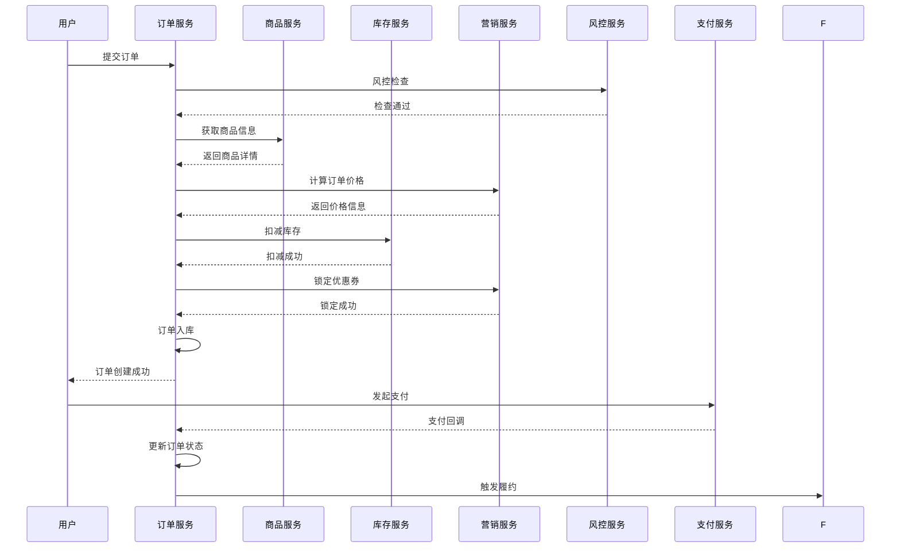

# 业务场景分析

## 1. 核心业务场景

### 1.1 正常下单场景

#### 1.1.1 场景描述
用户正常浏览商品，加入购物车，选择收货地址，使用优惠券，完成支付的完整流程。

#### 1.1.2 业务流程


#### 1.1.3 关键业务规则
- 商品必须有效且有库存
- 优惠券必须可用且满足使用条件
- 用户必须通过风控检查
- 支付金额必须与计算金额一致
- 30分钟内必须完成支付

#### 1.1.4 异常处理
```java
// 库存不足处理
if (!inventoryResult.getSuccess()) {
    // 回滚已锁定的优惠券
    if (StringUtils.isNotEmpty(couponId)) {
        marketApi.releaseUserCoupon(couponId);
    }
    throw new OrderBizException(OrderErrorCodeEnum.INVENTORY_NOT_ENOUGH);
}

// 优惠券锁定失败处理
if (!couponResult.getSuccess()) {
    // 回滚已扣减的库存
    inventoryApi.releaseProductStock(orderId);
    throw new OrderBizException(OrderErrorCodeEnum.COUPON_LOCK_FAILED);
}
```

### 1.2 高并发抢购场景

#### 1.2.1 场景描述
限时抢购、秒杀活动等高并发场景下的订单处理。

#### 1.2.2 技术挑战
- 大量用户同时下单
- 库存超卖风险
- 系统性能压力
- 用户体验保证

#### 1.2.3 解决方案
```java
@Service
public class SecKillOrderService {
    
    @Autowired
    private RedisTemplate<String, String> redisTemplate;
    
    public CreateOrderDTO createSecKillOrder(CreateOrderRequest request) {
        String skuCode = request.getOrderItemRequestList().get(0).getSkuCode();
        String userId = request.getUserId();
        
        // 1. Redis预扣减库存
        String stockKey = "seckill:stock:" + skuCode;
        Long remainStock = redisTemplate.opsForValue().decrement(stockKey);
        
        if (remainStock < 0) {
            // 库存不足，回滚Redis库存
            redisTemplate.opsForValue().increment(stockKey);
            throw new OrderBizException(OrderErrorCodeEnum.SECKILL_STOCK_NOT_ENOUGH);
        }
        
        // 2. 防止重复下单
        String userOrderKey = "seckill:user:" + skuCode + ":" + userId;
        Boolean lockResult = redisTemplate.opsForValue().setIfAbsent(userOrderKey, "1", Duration.ofMinutes(30));
        
        if (!lockResult) {
            // 用户重复下单，回滚库存
            redisTemplate.opsForValue().increment(stockKey);
            throw new OrderBizException(OrderErrorCodeEnum.DUPLICATE_SECKILL_ORDER);
        }
        
        try {
            // 3. 异步创建订单
            return asyncCreateOrder(request);
        } catch (Exception e) {
            // 创建失败，回滚所有操作
            redisTemplate.opsForValue().increment(stockKey);
            redisTemplate.delete(userOrderKey);
            throw e;
        }
    }
}
```

#### 1.2.4 限流策略
```java
@Component
public class SecKillRateLimiter {
    
    // 令牌桶限流
    private final RateLimiter rateLimiter = RateLimiter.create(1000.0); // 每秒1000个请求
    
    public boolean tryAcquire() {
        return rateLimiter.tryAcquire(100, TimeUnit.MILLISECONDS);
    }
}

// 使用Sentinel限流
@SentinelResource(value = "createSecKillOrder", 
                  blockHandler = "handleBlock",
                  fallback = "handleFallback")
public CreateOrderDTO createSecKillOrder(CreateOrderRequest request) {
    // 秒杀订单创建逻辑
}
```

### 1.3 预售订单场景

#### 1.3.1 场景描述
商品预售，用户支付定金，商品到货后支付尾款的场景。

#### 1.3.2 业务特点
- 分两次支付：定金 + 尾款
- 有预售期和尾款支付期
- 库存预占机制
- 取消规则特殊

#### 1.3.3 实现方案
```java
@Service
public class PreSaleOrderService {
    
    public CreateOrderDTO createPreSaleOrder(CreateOrderRequest request) {
        // 1. 创建预售主订单
        OrderInfoDO mainOrder = createMainOrder(request);
        mainOrder.setOrderType(OrderTypeEnum.PRESALE.getCode());
        mainOrder.setOrderStatus(OrderStatusEnum.PRESALE_DEPOSIT_UNPAID.getCode());
        
        // 2. 创建定金子订单
        OrderInfoDO depositOrder = createDepositOrder(mainOrder, request);
        depositOrder.setParentOrderId(mainOrder.getOrderId());
        depositOrder.setPayAmount(calculateDepositAmount(request));
        
        // 3. 创建尾款子订单（待支付状态）
        OrderInfoDO finalPaymentOrder = createFinalPaymentOrder(mainOrder, request);
        finalPaymentOrder.setParentOrderId(mainOrder.getOrderId());
        finalPaymentOrder.setPayAmount(calculateFinalPaymentAmount(request));
        finalPaymentOrder.setOrderStatus(OrderStatusEnum.PRESALE_FINAL_UNPAID.getCode());
        
        // 4. 预占库存（不扣减）
        reserveInventory(request);
        
        // 5. 设置定金支付超时时间
        scheduleDepositPaymentTimeout(depositOrder.getOrderId());
        
        return new CreateOrderDTO(mainOrder.getOrderId());
    }
    
    public void handleDepositPaid(String depositOrderId) {
        OrderInfoDO depositOrder = orderInfoDAO.getByOrderId(depositOrderId);
        String mainOrderId = depositOrder.getParentOrderId();
        
        // 更新主订单状态
        OrderInfoDO mainOrder = orderInfoDAO.getByOrderId(mainOrderId);
        mainOrder.setOrderStatus(OrderStatusEnum.PRESALE_DEPOSIT_PAID.getCode());
        orderInfoDAO.updateById(mainOrder);
        
        // 等待商品到货通知
        waitForProductArrival(mainOrderId);
    }
    
    public void notifyProductArrival(String mainOrderId) {
        // 商品到货，通知用户支付尾款
        OrderInfoDO mainOrder = orderInfoDAO.getByOrderId(mainOrderId);
        mainOrder.setOrderStatus(OrderStatusEnum.PRESALE_FINAL_PAYMENT_PERIOD.getCode());
        orderInfoDAO.updateById(mainOrder);
        
        // 激活尾款订单
        activateFinalPaymentOrder(mainOrderId);
        
        // 设置尾款支付超时时间
        scheduleFinalPaymentTimeout(mainOrderId);
    }
}
```

### 1.4 拼团订单场景

#### 1.4.1 场景描述
多人拼团购买，达到拼团人数后自动成团，未成团则退款的场景。

#### 1.4.2 业务逻辑
```java
@Service
public class GroupBuyOrderService {
    
    public CreateOrderDTO createGroupBuyOrder(CreateOrderRequest request) {
        String groupId = request.getGroupId();
        String userId = request.getUserId();
        
        // 1. 检查拼团活动是否有效
        GroupBuyActivity activity = groupBuyActivityService.getActivity(request.getActivityId());
        validateActivity(activity);
        
        // 2. 检查用户是否已参团
        if (hasUserJoinedGroup(groupId, userId)) {
            throw new OrderBizException(OrderErrorCodeEnum.USER_ALREADY_IN_GROUP);
        }
        
        // 3. 创建拼团订单
        OrderInfoDO order = createOrder(request);
        order.setOrderType(OrderTypeEnum.GROUP_BUY.getCode());
        order.setOrderStatus(OrderStatusEnum.GROUP_BUY_UNPAID.getCode());
        
        // 4. 加入拼团
        GroupBuyRecord record = new GroupBuyRecord();
        record.setGroupId(groupId);
        record.setUserId(userId);
        record.setOrderId(order.getOrderId());
        record.setJoinTime(new Date());
        groupBuyRecordService.save(record);
        
        // 5. 检查是否成团
        checkGroupBuySuccess(groupId);
        
        return new CreateOrderDTO(order.getOrderId());
    }
    
    private void checkGroupBuySuccess(String groupId) {
        GroupBuyActivity activity = groupBuyActivityService.getByGroupId(groupId);
        int currentCount = groupBuyRecordService.countByGroupId(groupId);
        
        if (currentCount >= activity.getRequiredCount()) {
            // 成团成功
            handleGroupBuySuccess(groupId);
        } else if (isGroupBuyExpired(groupId)) {
            // 拼团失败
            handleGroupBuyFailed(groupId);
        }
    }
    
    private void handleGroupBuySuccess(String groupId) {
        List<GroupBuyRecord> records = groupBuyRecordService.getByGroupId(groupId);
        
        for (GroupBuyRecord record : records) {
            // 更新订单状态为待履约
            OrderInfoDO order = orderInfoDAO.getByOrderId(record.getOrderId());
            order.setOrderStatus(OrderStatusEnum.GROUP_BUY_SUCCESS.getCode());
            orderInfoDAO.updateById(order);
            
            // 触发履约流程
            fulfillService.triggerFulfill(record.getOrderId());
        }
        
        // 扣减真实库存
        deductRealInventory(groupId);
    }
    
    private void handleGroupBuyFailed(String groupId) {
        List<GroupBuyRecord> records = groupBuyRecordService.getByGroupId(groupId);
        
        for (GroupBuyRecord record : records) {
            // 更新订单状态为拼团失败
            OrderInfoDO order = orderInfoDAO.getByOrderId(record.getOrderId());
            order.setOrderStatus(OrderStatusEnum.GROUP_BUY_FAILED.getCode());
            orderInfoDAO.updateById(order);
            
            // 自动退款
            processRefund(record.getOrderId());
        }
    }
}
```

### 1.5 订单取消场景

#### 1.5.1 用户主动取消
```java
public void userCancelOrder(String orderId, String userId, String cancelReason) {
    OrderInfoDO order = orderInfoDAO.getByOrderId(orderId);
    
    // 1. 权限校验
    if (!userId.equals(order.getUserId())) {
        throw new OrderBizException(OrderErrorCodeEnum.NO_PERMISSION);
    }
    
    // 2. 状态校验
    if (!OrderStatusEnum.CREATED.getCode().equals(order.getOrderStatus())) {
        throw new OrderBizException(OrderErrorCodeEnum.ORDER_CANNOT_CANCEL);
    }
    
    // 3. 执行取消逻辑
    CancelOrderRequest cancelRequest = new CancelOrderRequest();
    cancelRequest.setOrderId(orderId);
    cancelRequest.setCancelType(OrderCancelTypeEnum.USER_CANCELED.getCode());
    cancelRequest.setCancelReason(cancelReason);
    
    cancelOrder(cancelRequest);
}
```

#### 1.5.2 系统自动取消
```java
@Scheduled(fixedRate = 60000) // 每分钟检查一次
public void autoCancel

ExpiredOrders() {
    Date expireTime = new Date(System.currentTimeMillis() - 30 * 60 * 1000);
    List<OrderInfoDO> expiredOrders = orderInfoDAO.findExpiredOrders(expireTime);
    
    for (OrderInfoDO order : expiredOrders) {
        try {
            CancelOrderRequest cancelRequest = new CancelOrderRequest();
            cancelRequest.setOrderId(order.getOrderId());
            cancelRequest.setCancelType(OrderCancelTypeEnum.TIMEOUT_CANCELED.getCode());
            cancelRequest.setCancelReason("支付超时自动取消");
            
            cancelOrder(cancelRequest);
        } catch (Exception e) {
            log.error("自动取消订单失败, orderId: {}", order.getOrderId(), e);
        }
    }
}
```

### 1.6 订单修改场景

#### 1.6.1 修改收货地址
```java
public boolean adjustDeliveryAddress(AdjustDeliveryAddressRequest request) {
    String orderId = request.getOrderId();
    OrderInfoDO order = orderInfoDAO.getByOrderId(orderId);
    
    // 1. 订单状态校验
    if (!OrderStatusEnum.unOutStockStatus().contains(order.getOrderStatus())) {
        throw new OrderBizException(OrderErrorCodeEnum.ORDER_NOT_ALLOW_TO_ADJUST_ADDRESS);
    }
    
    // 2. 查询配送信息
    OrderDeliveryDetailDO deliveryDetail = orderDeliveryDetailDAO.getByOrderId(orderId);
    if (deliveryDetail == null) {
        throw new OrderBizException(OrderErrorCodeEnum.ORDER_DELIVERY_NOT_FOUND);
    }
    
    // 3. 修改次数限制
    if (deliveryDetail.getModifyAddressCount() > 0) {
        throw new OrderBizException(OrderErrorCodeEnum.ORDER_DELIVERY_ADDRESS_HAS_BEEN_ADJUSTED);
    }
    
    // 4. 更新地址信息
    deliveryDetail.setProvince(request.getProvince());
    deliveryDetail.setCity(request.getCity());
    deliveryDetail.setArea(request.getArea());
    deliveryDetail.setStreet(request.getStreet());
    deliveryDetail.setDetailAddress(request.getDetailAddress());
    deliveryDetail.setReceiverName(request.getReceiverName());
    deliveryDetail.setReceiverPhone(request.getReceiverPhone());
    deliveryDetail.setModifyAddressCount(deliveryDetail.getModifyAddressCount() + 1);
    
    orderDeliveryDetailDAO.updateById(deliveryDetail);
    
    // 5. 记录操作日志
    saveAddressChangeLog(orderId, request);
    
    return true;
}
```

### 1.7 售后场景

#### 1.7.1 申请退款
```java
public String applyRefund(ApplyRefundRequest request) {
    String orderId = request.getOrderId();
    OrderInfoDO order = orderInfoDAO.getByOrderId(orderId);
    
    // 1. 状态校验
    if (!canApplyRefund(order.getOrderStatus())) {
        throw new OrderBizException(OrderErrorCodeEnum.ORDER_CANNOT_REFUND);
    }
    
    // 2. 生成售后单号
    String afterSaleId = orderNoManager.genOrderId(OrderNoTypeEnum.AFTER_SALE.getCode(), order.getUserId());
    
    // 3. 创建售后信息
    AfterSaleInfoDO afterSaleInfo = new AfterSaleInfoDO();
    afterSaleInfo.setAfterSaleId(Long.valueOf(afterSaleId));
    afterSaleInfo.setOrderId(orderId);
    afterSaleInfo.setUserId(order.getUserId());
    afterSaleInfo.setAfterSaleType(AfterSaleTypeEnum.RETURN_MONEY.getCode());
    afterSaleInfo.setAfterSaleStatus(AfterSaleStatusEnum.APPLY.getCode());
    afterSaleInfo.setApplyTime(new Date());
    afterSaleInfo.setApplyReason(request.getApplyReason());
    afterSaleInfo.setApplyRefundAmount(request.getRefundAmount());
    afterSaleInfoDAO.save(afterSaleInfo);
    
    // 4. 创建售后条目
    createAfterSaleItems(afterSaleId, request.getAfterSaleItems());
    
    // 5. 记录售后日志
    recordAfterSaleLog(afterSaleId, AfterSaleStatusEnum.UN_CREATED.getCode(), 
                      AfterSaleStatusEnum.APPLY.getCode(), "用户申请退款");
    
    // 6. 通知客服审核
    notifyCustomerService(afterSaleId);
    
    return afterSaleId;
}
```

#### 1.7.2 申请退货退款
```java
public String applyReturnGoods(ApplyReturnGoodsRequest request) {
    // 类似退款流程，但需要用户先寄回商品
    String afterSaleId = createAfterSaleRecord(request, AfterSaleTypeEnum.RETURN_GOODS.getCode());
    
    // 生成退货地址
    ReturnAddress returnAddress = generateReturnAddress(request.getOrderId());
    
    // 通知用户寄回商品
    notifyUserReturnGoods(afterSaleId, returnAddress);
    
    return afterSaleId;
}
```

### 1.8 缺货处理场景

#### 1.8.1 发货时缺货
```java
public void handleLackOfStock(String orderId, List<LackItemDTO> lackItems) {
    OrderInfoDO order = orderInfoDAO.getByOrderId(orderId);
    
    // 1. 状态校验 - 只有已出库状态才能发起缺品
    if (!OrderStatusEnum.canLack().contains(order.getOrderStatus())) {
        throw new OrderBizException(OrderErrorCodeEnum.ORDER_CANNOT_LACK);
    }
    
    // 2. 创建缺货记录
    OrderLackInfoDO lackInfo = new OrderLackInfoDO();
    lackInfo.setOrderId(orderId);
    lackInfo.setLackStatus(LackStatusEnum.LACK.getCode());
    lackInfo.setLackTime(new Date());
    orderLackInfoDAO.save(lackInfo);
    
    // 3. 处理缺货商品
    for (LackItemDTO lackItem : lackItems) {
        // 部分退款
        processPartialRefund(orderId, lackItem);
        
        // 释放缺货商品库存
        releaseItemInventory(lackItem.getSkuCode(), lackItem.getLackQuantity());
    }
    
    // 4. 更新订单状态
    if (isAllItemsLack(orderId, lackItems)) {
        // 全部缺货，取消订单
        order.setOrderStatus(OrderStatusEnum.CANCELED.getCode());
    } else {
        // 部分缺货，继续配送
        order.setOrderStatus(OrderStatusEnum.DELIVERY.getCode());
    }
    orderInfoDAO.updateById(order);
    
    // 5. 通知用户
    notifyUserLackOfStock(orderId, lackItems);
}
```

### 1.9 订单拆分场景

#### 1.9.1 按商品类型拆分
```java
private void splitOrderByProductType(CreateOrderRequest request, List<ProductSkuDTO> productSkuList) {
    Map<Integer, List<ProductSkuDTO>> productTypeMap = 
        productSkuList.stream().collect(Collectors.groupingBy(ProductSkuDTO::getProductType));
    
    if (productTypeMap.keySet().size() > 1) {
        // 创建主订单
        OrderInfoDO mainOrder = createMainOrder(request);
        mainOrder.setOrderStatus(OrderStatusEnum.INVALID.getCode()); // 主订单设为无效
        
        // 为每种商品类型创建子订单
        for (Map.Entry<Integer, List<ProductSkuDTO>> entry : productTypeMap.entrySet()) {
            Integer productType = entry.getKey();
            List<ProductSkuDTO> typeProducts = entry.getValue();
            
            // 创建子订单
            OrderInfoDO subOrder = createSubOrder(mainOrder, productType, typeProducts);
            
            // 分摊金额
            allocateAmountToSubOrder(subOrder, typeProducts, request);
        }
    }
}
```

#### 1.9.2 按仓库拆分
```java
private void splitOrderByWarehouse(String orderId) {
    List<OrderItemDO> orderItems = orderItemDAO.getByOrderId(orderId);
    Map<String, List<OrderItemDO>> warehouseMap = new HashMap<>();
    
    // 根据商品所在仓库分组
    for (OrderItemDO item : orderItems) {
        String warehouseCode = getWarehouseBySkuCode(item.getSkuCode());
        warehouseMap.computeIfAbsent(warehouseCode, k -> new ArrayList<>()).add(item);
    }
    
    if (warehouseMap.size() > 1) {
        // 需要拆分成多个发货单
        for (Map.Entry<String, List<OrderItemDO>> entry : warehouseMap.entrySet()) {
            String warehouseCode = entry.getKey();
            List<OrderItemDO> warehouseItems = entry.getValue();
            
            // 创建发货单
            createShipmentOrder(orderId, warehouseCode, warehouseItems);
        }
    }
}
```

### 1.10 异常恢复场景

#### 1.10.1 支付回调丢失恢复
```java
@Scheduled(fixedRate = 300000) // 每5分钟检查一次
public void recoverLostPaymentCallback() {
    // 查找状态为已创建但支付时间超过5分钟的订单
    Date fiveMinutesAgo = new Date(System.currentTimeMillis() - 5 * 60 * 1000);
    List<OrderInfoDO> suspiciousOrders = orderInfoDAO.findSuspiciousOrders(fiveMinutesAgo);
    
    for (OrderInfoDO order : suspiciousOrders) {
        try {
            // 主动查询支付状态
            PaymentStatusQuery query = new PaymentStatusQuery();
            query.setOrderId(order.getOrderId());
            JsonResult<PaymentStatusDTO> result = payApi.queryPaymentStatus(query);
            
            if (result.getSuccess() && result.getData().isPaid()) {
                // 支付成功但回调丢失，手动触发回调处理
                PayCallbackRequest callbackRequest = new PayCallbackRequest();
                callbackRequest.setOrderId(order.getOrderId());
                callbackRequest.setPayAmount(order.getPayAmount());
                callbackRequest.setOutTradeNo(result.getData().getOutTradeNo());
                callbackRequest.setPayType(result.getData().getPayType());
                
                payCallback(callbackRequest);
                log.info("恢复丢失的支付回调, orderId: {}", order.getOrderId());
            }
        } catch (Exception e) {
            log.error("恢复支付回调失败, orderId: {}", order.getOrderId(), e);
        }
    }
}
```

#### 1.10.2 消息丢失恢复
```java
@Component
public class MessageLossRecoveryService {
    
    @Scheduled(fixedRate = 600000) // 每10分钟检查一次
    public void recoverLostMessages() {
        // 检查支付成功但未履约的订单
        recoverFulfillmentMessages();
        
        // 检查出库但未配送的订单
        recoverDeliveryMessages();
    }
    
    private void recoverFulfillmentMessages() {
        Date tenMinutesAgo = new Date(System.currentTimeMillis() - 10 * 60 * 1000);
        List<OrderInfoDO> paidOrders = orderInfoDAO.findPaidOrdersBefore(tenMinutesAgo);
        
        for (OrderInfoDO order : paidOrders) {
            if (OrderStatusEnum.PAID.getCode().equals(order.getOrderStatus())) {
                // 重新发送履约消息
                PaidOrderSuccessMessage message = new PaidOrderSuccessMessage();
                message.setOrderId(order.getOrderId());
                
                defaultProducer.sendMessage(RocketMqConstant.PAID_ORDER_SUCCESS_TOPIC, 
                                          JSON.toJSONString(message), "恢复履约消息");
                
                log.info("重新发送履约消息, orderId: {}", order.getOrderId());
            }
        }
    }
}
```

## 2. 边界场景处理

### 2.1 极限并发场景

#### 2.1.1 库存超卖防护
```java
@Service
public class InventoryProtectionService {
    
    // 使用Redis Lua脚本保证原子性
    private static final String DEDUCT_STOCK_SCRIPT = 
        "local stock = redis.call('get', KEYS[1]) " +
        "if stock and tonumber(stock) >= tonumber(ARGV[1]) then " +
        "  redis.call('decrby', KEYS[1], ARGV[1]) " +
        "  return 1 " +
        "else " +
        "  return 0 " +
        "end";
    
    public boolean deductStock(String skuCode, Integer quantity) {
        String stockKey = "inventory:stock:" + skuCode;
        Long result = (Long) redisTemplate.execute(
            new DefaultRedisScript<>(DEDUCT_STOCK_SCRIPT, Long.class),
            Collections.singletonList(stockKey),
            quantity.toString()
        );
        return result != null && result == 1;
    }
}
```

#### 2.1.2 数据库连接池耗尽
```java
@Configuration
public class DataSourceConfig {
    
    @Bean
    public DataSource dataSource() {
        HikariDataSource dataSource = new HikariDataSource();
        dataSource.setMaximumPoolSize(50); // 最大连接数
        dataSource.setMinimumIdle(10);     // 最小空闲连接
        dataSource.setConnectionTimeout(30000); // 连接超时30秒
        dataSource.setLeakDetectionThreshold(60000); // 连接泄露检测
        return dataSource;
    }
}

// 连接池监控
@Component
public class DataSourceMonitor {
    
    @Scheduled(fixedRate = 30000)
    public void monitorDataSource() {
        HikariDataSource dataSource = (HikariDataSource) applicationContext.getBean(DataSource.class);
        HikariPoolMXBean poolBean = dataSource.getHikariPoolMXBean();
        
        int activeConnections = poolBean.getActiveConnections();
        int totalConnections = poolBean.getTotalConnections();
        
        if (activeConnections > totalConnections * 0.8) {
            log.warn("数据库连接池使用率过高: {}/{}", activeConnections, totalConnections);
            // 发送告警
            alertService.sendDataSourceAlert(activeConnections, totalConnections);
        }
    }
}
```

### 2.2 系统故障场景

#### 2.2.1 Redis故障降级
```java
@Service
public class OrderCacheService {
    
    @Autowired
    private RedisTemplate<String, String> redisTemplate;
    
    @Autowired
    private OrderInfoDAO orderInfoDAO;
    
    public OrderInfoDO getOrderInfo(String orderId) {
        try {
            // 优先从Redis获取
            String cacheKey = "order:info:" + orderId;
            String orderJson = redisTemplate.opsForValue().get(cacheKey);
            
            if (StringUtils.isNotEmpty(orderJson)) {
                return JSON.parseObject(orderJson, OrderInfoDO.class);
            }
            
            // Redis miss，从数据库获取
            OrderInfoDO orderInfo = orderInfoDAO.getByOrderId(orderId);
            if (orderInfo != null) {
                // 异步写入缓存
                asyncCacheOrderInfo(cacheKey, orderInfo);
            }
            return orderInfo;
            
        } catch (Exception e) {
            log.warn("Redis获取订单信息失败，降级到数据库查询, orderId: {}", orderId, e);
            // Redis故障，直接查询数据库
            return orderInfoDAO.getByOrderId(orderId);
        }
    }
}
```

#### 2.2.2 MQ故障降级
```java
@Service
public class MessageFallbackService {
    
    public void sendMessageWithFallback(String topic, String message) {
        try {
            // 优先使用MQ发送
            defaultProducer.sendMessage(topic, message);
        } catch (Exception e) {
            log.error("MQ发送失败，使用数据库补偿机制, topic: {}", topic, e);
            
            // MQ故障，写入补偿表
            MessageCompensationDO compensation = new MessageCompensationDO();
            compensation.setTopic(topic);
            compensation.setMessage(message);
            compensation.setStatus(CompensationStatusEnum.PENDING.getCode());
            compensation.setRetryCount(0);
            messageCompensationDAO.save(compensation);
        }
    }
    
    // 定时补偿任务
    @Scheduled(fixedRate = 60000)
    public void compensateFailedMessages() {
        List<MessageCompensationDO> pendingMessages = 
            messageCompensationDAO.findPendingMessages();
        
        for (MessageCompensationDO compensation : pendingMessages) {
            try {
                defaultProducer.sendMessage(compensation.getTopic(), compensation.getMessage());
                
                // 发送成功，更新状态
                compensation.setStatus(CompensationStatusEnum.SUCCESS.getCode());
                messageCompensationDAO.updateById(compensation);
                
            } catch (Exception e) {
                // 重试次数+1
                compensation.setRetryCount(compensation.getRetryCount() + 1);
                
                if (compensation.getRetryCount() >= 3) {
                    // 超过最大重试次数，标记为失败
                    compensation.setStatus(CompensationStatusEnum.FAILED.getCode());
                }
                messageCompensationDAO.updateById(compensation);
            }
        }
    }
}
```

### 2.3 数据一致性场景

#### 2.3.1 分布式事务失败恢复
```java
@Service
public class DistributedTransactionRecoveryService {
    
    @Scheduled(fixedRate = 300000) // 每5分钟检查一次
    public void recoverFailedTransactions() {
        // 查找长时间未完成的分布式事务
        Date fiveMinutesAgo = new Date(System.currentTimeMillis() - 5 * 60 * 1000);
        List<TransactionLogDO> pendingTransactions = 
            transactionLogDAO.findPendingTransactionsBefore(fiveMinutesAgo);
        
        for (TransactionLogDO transaction : pendingTransactions) {
            try {
                // 查询Seata事务状态
                GlobalTransactionStatus status = 
                    seataTransactionManager.getStatus(transaction.getGlobalTxId());
                
                if (status == GlobalTransactionStatus.TimeoutRollbacked) {
                    // 事务已回滚，清理本地数据
                    rollbackLocalTransaction(transaction);
                } else if (status == GlobalTransactionStatus.Committed) {
                    // 事务已提交，补偿本地数据
                    compensateLocalTransaction(transaction);
                }
                
            } catch (Exception e) {
                log.error("分布式事务恢复失败, txId: {}", transaction.getGlobalTxId(), e);
            }
        }
    }
}
```

### 2.4 业务规则边界场景

#### 2.4.1 价格精度处理
```java
@Service
public class PriceCalculationService {
    
    // 使用BigDecimal避免精度丢失
    public OrderAmountDTO calculateOrderAmount(List<OrderItemDTO> items, CouponDTO coupon) {
        BigDecimal totalAmount = BigDecimal.ZERO;
        BigDecimal totalDiscount = BigDecimal.ZERO;
        
        // 计算商品总金额
        for (OrderItemDTO item : items) {
            BigDecimal itemAmount = new BigDecimal(item.getSalePrice())
                .multiply(new BigDecimal(item.getQuantity()));
            totalAmount = totalAmount.add(itemAmount);
        }
        
        // 计算优惠券抵扣
        if (coupon != null) {
            totalDiscount = calculateCouponDiscount(totalAmount, coupon);
        }
        
        // 计算实付金额
        BigDecimal realPayAmount = totalAmount.subtract(totalDiscount);
        
        // 金额分摊到商品
        List<OrderAmountDetailDTO> itemAmounts = 
            allocateAmountToItems(items, totalAmount, totalDiscount);
        
        OrderAmountDTO result = new OrderAmountDTO();
        result.setTotalAmount(totalAmount.multiply(new BigDecimal(100)).intValue()); // 转为分
        result.setDiscountAmount(totalDiscount.multiply(new BigDecimal(100)).intValue());
        result.setRealPayAmount(realPayAmount.multiply(new BigDecimal(100)).intValue());
        result.setItemAmounts(itemAmounts);
        
        return result;
    }
    
    private BigDecimal calculateCouponDiscount(BigDecimal totalAmount, CouponDTO coupon) {
        if (coupon.getType() == CouponTypeEnum.PERCENTAGE.getCode()) {
            // 百分比优惠券
            BigDecimal discount = totalAmount.multiply(coupon.getDiscount())
                .divide(new BigDecimal(100), 2, RoundingMode.HALF_UP);
            
            // 不能超过最大优惠金额
            BigDecimal maxDiscount = new BigDecimal(coupon.getMaxDiscountAmount()).divide(new BigDecimal(100));
            return discount.min(maxDiscount);
            
        } else {
            // 固定金额优惠券
            BigDecimal discount = new BigDecimal(coupon.getDiscountAmount()).divide(new BigDecimal(100));
            return totalAmount.min(discount); // 不能超过订单金额
        }
    }
}
```

## 3. 监控告警场景

### 3.1 业务指标监控
```java
@Component
public class OrderBusinessMetrics {
    
    private final MeterRegistry meterRegistry;
    private final Counter orderCreateCounter;
    private final Counter orderPayCounter;
    private final Timer orderCreateTimer;
    
    public OrderBusinessMetrics(MeterRegistry meterRegistry) {
        this.meterRegistry = meterRegistry;
        this.orderCreateCounter = Counter.builder("order.create.total")
            .description("订单创建总数")
            .register(meterRegistry);
        this.orderPayCounter = Counter.builder("order.pay.total")
            .description("订单支付总数")
            .register(meterRegistry);
        this.orderCreateTimer = Timer.builder("order.create.duration")
            .description("订单创建耗时")
            .register(meterRegistry);
    }
    
    public void recordOrderCreate(boolean success) {
        orderCreateCounter.increment(Tags.of("status", success ? "success" : "failed"));
    }
    
    public void recordOrderCreateDuration(Duration duration) {
        orderCreateTimer.record(duration);
    }
}
```

### 3.2 异常告警
```java
@Component
public class OrderAlertService {
    
    @EventListener
    public void handleOrderException(OrderExceptionEvent event) {
        OrderBizException exception = event.getException();
        String orderId = event.getOrderId();
        
        // 根据异常类型发送不同级别的告警
        if (isHighPriorityException(exception)) {
            sendHighPriorityAlert(orderId, exception);
        } else {
            sendNormalAlert(orderId, exception);
        }
        
        // 记录异常统计
        recordExceptionMetrics(exception);
    }
    
    private boolean isHighPriorityException(OrderBizException exception) {
        // 支付相关异常、库存异常等为高优先级
        return exception.getErrorCode().startsWith("PAY_") ||
               exception.getErrorCode().startsWith("INVENTORY_") ||
               exception.getErrorCode().equals("SYSTEM_ERROR");
    }
}
```

## 总结

通过以上各种业务场景的分析，可以看出订单系统需要处理的场景非常复杂，包括：

1. **正常业务场景**：标准下单流程、支付、履约、配送等
2. **特殊业务场景**：秒杀、预售、拼团等营销活动
3. **异常处理场景**：取消、退款、缺货等售后处理
4. **边界场景**：高并发、系统故障、数据一致性等
5. **监控场景**：业务指标监控、异常告警等

每种场景都需要考虑：
- **业务规则**：明确的业务逻辑和约束条件
- **异常处理**：完善的异常捕获和恢复机制
- **性能优化**：高并发下的性能保证
- **数据一致性**：分布式环境下的数据一致性保证
- **监控告警**：及时发现和处理问题

这些场景的完善处理是订单系统稳定运行的基础。
