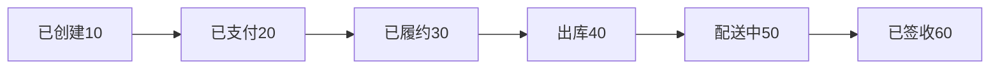
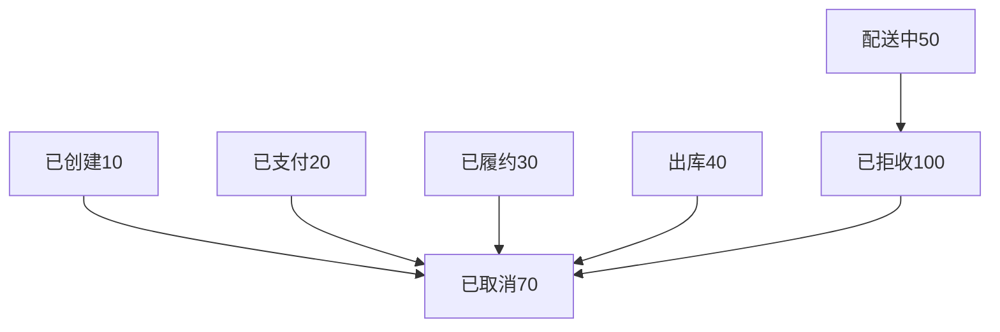

# 订单状态流转详解

## 1. 订单状态定义

### 1.1 状态枚举定义
```java
public enum OrderStatusEnum {
    NULL(0, "未知"),           // 初始状态
    CREATED(10, "已创建"),      // 订单创建完成
    PAID(20, "已支付"),         // 支付完成
    FULFILL(30, "已履约"),      // 开始履约处理
    OUT_STOCK(40, "出库"),      // 仓库出库完成
    DELIVERY(50, "配送中"),     // 物流配送中
    SIGNED(60, "已签收"),       // 用户签收完成
    CANCELED(70, "已取消"),     // 订单取消
    REFUSED(100, "已拒收"),     // 用户拒收
    INVALID(127, "无效订单")    // 无效订单（主要用于拆单场景）
}
```

### 1.2 状态流转规则

#### 1.2.1 正常流转路径


#### 1.2.2 异常流转路径


## 2. 状态流转详细分析

### 2.1 订单创建状态（CREATED = 10）

#### 2.1.1 进入条件
- 用户提交订单成功
- 通过风控检查
- 库存扣减成功
- 优惠券锁定成功
- 订单数据入库成功

#### 2.1.2 业务特征
- 库存已预扣减
- 优惠券已锁定
- 等待用户支付
- 设置支付超时时间（30分钟）

#### 2.1.3 可执行操作
- 用户支付
- 用户取消订单
- 系统超时取消

#### 2.1.4 状态流转代码
```java
// 创建订单时设置状态
OrderInfoDO orderInfoDO = new OrderInfoDO();
orderInfoDO.setOrderStatus(OrderStatusEnum.CREATED.getCode());

// 记录状态变更日志
OrderOperateLogDO orderOperateLogDO = new OrderOperateLogDO();
orderOperateLogDO.setOrderId(orderId);
orderOperateLogDO.setOperateType(OrderOperateTypeEnum.NEW_ORDER.getCode());
orderOperateLogDO.setPreStatus(OrderStatusEnum.NULL.getCode());
orderOperateLogDO.setCurrentStatus(OrderStatusEnum.CREATED.getCode());
orderOperateLogDO.setRemark("创建订单操作0-10");
```

### 2.2 订单支付状态（PAID = 20）

#### 2.2.1 进入条件
- 用户完成支付
- 支付系统回调成功
- 订单状态更新成功

#### 2.2.2 业务特征
- 资金已收取
- 订单不可取消（需要走售后流程）
- 自动触发履约流程

#### 2.2.3 状态流转实现
```java
@Transactional(rollbackFor = Exception.class)
@Override
public void updateOrderStatusPaid(PayCallbackRequest payCallbackRequest,
                                  OrderInfoDO orderInfoDO,
                                  OrderPaymentDetailDO orderPaymentDetailDO) {
    // 更新主单信息
    updateOrderStatus(orderInfoDO, OrderStatusEnum.PAID.getCode());
    
    // 更新主单支付信息
    updateOrderPaymentDetail(orderPaymentDetailDO);
    
    // 新增订单状态变更日志
    saveOrderOperateLog(orderInfoDO.getOrderId(),
            orderInfoDO.getOrderStatus(), OrderStatusEnum.PAID.getCode());
    
    // 处理子订单状态（如果存在）
    handleSubOrdersPaid(orderInfoDO);
}
```

#### 2.2.4 RocketMQ事务消息
```java
// 支付成功后发送事务消息触发履约
TransactionMQProducer producer = defaultProducer.getProducer();
producer.setTransactionListener(new TransactionListener() {
    @Override
    public LocalTransactionState executeLocalTransaction(Message message, Object o) {
        try {
            // 本地事务：更新订单状态
            orderManager.updateOrderStatusPaid(payCallbackRequest, orderInfoDO, orderPaymentDetailDO);
            return LocalTransactionState.COMMIT_MESSAGE;
        } catch (Exception e) {
            return LocalTransactionState.ROLLBACK_MESSAGE;
        }
    }
    
    @Override
    public LocalTransactionState checkLocalTransaction(MessageExt messageExt) {
        // 事务回查：检查订单是否已支付
        OrderInfoDO orderInfoDO = orderInfoDAO.getByOrderId(orderId);
        if(orderInfoDO != null && OrderStatusEnum.PAID.getCode().equals(orderInfoDO.getOrderStatus())) {
            return LocalTransactionState.COMMIT_MESSAGE;
        }
        return LocalTransactionState.ROLLBACK_MESSAGE;
    }
});
```

### 2.3 订单履约状态（FULFILL = 30）

#### 2.3.1 进入条件
- 接收到支付成功消息
- 履约系统处理成功
- 订单状态更新成功

#### 2.3.2 业务特征
- 履约系统开始处理
- 通知仓库准备发货
- 生成拣货任务

#### 2.3.3 履约触发机制
```java
@Component
public class PaidOrderSuccessListener implements MessageListenerConcurrently {
    
    @Override
    public ConsumeConcurrentlyStatus consumeMessage(List<MessageExt> list, ConsumeConcurrentlyContext context) {
        try {
            for(MessageExt messageExt : list) {
                String message = new String(messageExt.getBody());
                PaidOrderSuccessMessage paidOrderSuccessMessage = JSON.parseObject(message, PaidOrderSuccessMessage.class);
                String orderId = paidOrderSuccessMessage.getOrderId();
                
                // 分布式锁防止重复消费
                String key = RedisLockKeyConstants.ORDER_FULFILL_KEY + orderId;
                if(!redisLock.lock(key)) {
                    throw new BaseBizException(OrderErrorCodeEnum.ORDER_FULFILL_ERROR);
                }
                
                try {
                    // 触发履约流程
                    orderFulFillService.triggerOrderFulFill(orderId);
                } finally {
                    redisLock.unlock(key);
                }
            }
            return ConsumeConcurrentlyStatus.CONSUME_SUCCESS;
        } catch (Exception e) {
            return ConsumeConcurrentlyStatus.RECONSUME_LATER;
        }
    }
}
```

### 2.4 订单出库状态（OUT_STOCK = 40）

#### 2.4.1 进入条件
- WMS系统完成拣货
- 商品打包完成
- 生成物流单号

#### 2.4.2 业务特征
- 商品已离开仓库
- 分配配送员
- 开始物流跟踪

#### 2.4.3 WMS回调处理
```java
@Component
public class OrderOutStockedProcessor implements OrderWmsShipResultProcessor {
    
    @Override
    public void execute(WmsShipDTO wmsShipDTO) throws OrderBizException {
        String orderId = wmsShipDTO.getOrderId();
        
        // 更新订单状态
        OrderInfoDO orderInfoDO = orderInfoDAO.getByOrderId(orderId);
        if (orderInfoDO == null) {
            throw new OrderBizException(OrderErrorCodeEnum.ORDER_INFO_IS_NULL);
        }
        
        // 状态流转检查
        if (!OrderStatusEnum.FULFILL.getCode().equals(orderInfoDO.getOrderStatus())) {
            throw new OrderBizException(OrderErrorCodeEnum.ORDER_STATUS_ERROR);
        }
        
        // 更新订单状态为出库
        orderInfoDO.setOrderStatus(OrderStatusEnum.OUT_STOCK.getCode());
        orderInfoDAO.updateById(orderInfoDO);
        
        // 更新配送信息
        updateDeliveryInfo(wmsShipDTO);
        
        // 记录操作日志
        saveOrderOperateLog(orderId, OrderStatusEnum.FULFILL.getCode(), 
                           OrderStatusEnum.OUT_STOCK.getCode(), "订单已出库");
    }
}
```

### 2.5 订单配送状态（DELIVERY = 50）

#### 2.5.1 进入条件
- 配送员接单成功
- 开始配送
- TMS系统更新状态

#### 2.5.2 业务特征
- 配送员信息确定
- 实时位置跟踪
- 预计送达时间

#### 2.5.3 配送状态更新
```java
@Component
public class OrderDeliveredProcessor implements OrderWmsShipResultProcessor {
    
    @Override
    public void execute(WmsShipDTO wmsShipDTO) throws OrderBizException {
        String orderId = wmsShipDTO.getOrderId();
        
        OrderInfoDO orderInfoDO = orderInfoDAO.getByOrderId(orderId);
        if (!OrderStatusEnum.OUT_STOCK.getCode().equals(orderInfoDO.getOrderStatus())) {
            throw new OrderBizException(OrderErrorCodeEnum.ORDER_STATUS_ERROR);
        }
        
        // 更新订单状态为配送中
        orderInfoDO.setOrderStatus(OrderStatusEnum.DELIVERY.getCode());
        orderInfoDAO.updateById(orderInfoDO);
        
        // 更新配送员信息
        OrderDeliveryDetailDO deliveryDetail = orderDeliveryDetailDAO.getByOrderId(orderId);
        deliveryDetail.setDelivererNo(wmsShipDTO.getDelivererNo());
        deliveryDetail.setDelivererName(wmsShipDTO.getDelivererName());
        deliveryDetail.setDelivererPhone(wmsShipDTO.getDelivererPhone());
        orderDeliveryDetailDAO.updateById(deliveryDetail);
        
        // 记录操作日志
        saveOrderOperateLog(orderId, OrderStatusEnum.OUT_STOCK.getCode(), 
                           OrderStatusEnum.DELIVERY.getCode(), "订单已配送");
    }
}
```

### 2.6 订单签收状态（SIGNED = 60）

#### 2.6.1 进入条件
- 用户确认收货
- 配送员确认签收
- 系统更新状态成功

#### 2.6.2 业务特征
- 订单交易完成
- 触发资金结算
- 释放相关资源

#### 2.6.3 签收处理逻辑
```java
@Component
public class OrderSignedProcessor implements OrderWmsShipResultProcessor {
    
    @Override
    public void execute(WmsShipDTO wmsShipDTO) throws OrderBizException {
        String orderId = wmsShipDTO.getOrderId();
        
        OrderInfoDO orderInfoDO = orderInfoDAO.getByOrderId(orderId);
        if (!OrderStatusEnum.DELIVERY.getCode().equals(orderInfoDO.getOrderStatus())) {
            throw new OrderBizException(OrderErrorCodeEnum.ORDER_STATUS_ERROR);
        }
        
        // 更新订单状态为已签收
        orderInfoDO.setOrderStatus(OrderStatusEnum.SIGNED.getCode());
        orderInfoDAO.updateById(orderInfoDO);
        
        // 更新签收时间
        OrderDeliveryDetailDO deliveryDetail = orderDeliveryDetailDAO.getByOrderId(orderId);
        deliveryDetail.setSignedTime(new Date());
        orderDeliveryDetailDAO.updateById(deliveryDetail);
        
        // 记录操作日志
        saveOrderOperateLog(orderId, OrderStatusEnum.DELIVERY.getCode(), 
                           OrderStatusEnum.SIGNED.getCode(), "订单已签收");
        
        // 触发后续流程
        triggerOrderCompletedFlow(orderId);
    }
    
    private void triggerOrderCompletedFlow(String orderId) {
        // 发送订单完成消息
        // 触发资金结算
        // 更新商家收益
        // 释放优惠券锁定
        // 更新用户积分等
    }
}
```

### 2.7 订单取消状态（CANCELED = 70）

#### 2.7.1 进入条件
- 用户主动取消
- 系统超时取消
- 异常情况取消

#### 2.7.2 取消类型
```java
public enum OrderCancelTypeEnum {
    USER_CANCELED(1, "用户手动取消"),
    TIMEOUT_CANCELED(2, "超时未支付自动取消"),
    SYSTEM_CANCELED(3, "系统异常取消"),
    MERCHANT_CANCELED(4, "商家取消")
}
```

#### 2.7.3 取消流程实现
```java
@Override
@GlobalTransactional(rollbackFor = Exception.class)
public void cancelOrderFulfillmentAndUpdateOrderStatus(CancelOrderAssembleRequest cancelOrderAssembleRequest) {
    // 1. 履约取消
    cancelFulfill(cancelOrderAssembleRequest);
    
    // 2. 更新订单状态和记录订单操作日志
    updateOrderStatusAndSaveOperationLog(cancelOrderAssembleRequest);
    
    // 3. 记录售后信息
    insertCancelOrderAfterSale(cancelOrderAssembleRequest);
    
    // 4. 释放资源
    releaseResources(cancelOrderAssembleRequest);
}

private void releaseResources(CancelOrderAssembleRequest request) {
    // 释放库存
    inventoryApi.releaseProductStock(request.getOrderId());
    
    // 释放优惠券
    if (StringUtils.isNotEmpty(request.getCouponId())) {
        marketApi.releaseUserCoupon(request.getCouponId());
    }
    
    // 退款处理（如果已支付）
    if (OrderStatusEnum.PAID.getCode().equals(request.getOrderStatus()) ||
        OrderStatusEnum.FULFILL.getCode().equals(request.getOrderStatus()) ||
        OrderStatusEnum.OUT_STOCK.getCode().equals(request.getOrderStatus())) {
        processRefund(request);
    }
}
```

### 2.8 订单拒收状态（REFUSED = 100）

#### 2.8.1 进入条件
- 用户拒绝签收
- 商品损坏等原因
- 地址问题无法配送

#### 2.8.2 拒收处理流程
```java
public void processOrderRefused(String orderId, String refuseReason) {
    OrderInfoDO orderInfoDO = orderInfoDAO.getByOrderId(orderId);
    
    // 状态检查
    if (!OrderStatusEnum.DELIVERY.getCode().equals(orderInfoDO.getOrderStatus())) {
        throw new OrderBizException(OrderErrorCodeEnum.ORDER_STATUS_ERROR);
    }
    
    // 更新订单状态
    orderInfoDO.setOrderStatus(OrderStatusEnum.REFUSED.getCode());
    orderInfoDAO.updateById(orderInfoDO);
    
    // 记录拒收原因
    OrderOperateLogDO operateLog = new OrderOperateLogDO();
    operateLog.setOrderId(orderId);
    operateLog.setOperateType(OrderOperateTypeEnum.REFUSE_ORDER.getCode());
    operateLog.setPreStatus(OrderStatusEnum.DELIVERY.getCode());
    operateLog.setCurrentStatus(OrderStatusEnum.REFUSED.getCode());
    operateLog.setRemark("用户拒收：" + refuseReason);
    orderOperateLogDAO.save(operateLog);
    
    // 启动售后流程
    startAfterSaleProcess(orderId, refuseReason);
}
```

## 3. 状态流转控制机制

### 3.1 状态流转校验
```java
public class OrderStatusValidator {
    
    // 定义允许的状态流转路径
    private static final Map<Integer, Set<Integer>> ALLOWED_TRANSITIONS = new HashMap<>();
    
    static {
        // 已创建可以流转到：已支付、已取消
        ALLOWED_TRANSITIONS.put(OrderStatusEnum.CREATED.getCode(), 
            Sets.newHashSet(OrderStatusEnum.PAID.getCode(), OrderStatusEnum.CANCELED.getCode()));
        
        // 已支付可以流转到：已履约、已取消
        ALLOWED_TRANSITIONS.put(OrderStatusEnum.PAID.getCode(), 
            Sets.newHashSet(OrderStatusEnum.FULFILL.getCode(), OrderStatusEnum.CANCELED.getCode()));
        
        // 已履约可以流转到：出库、已取消
        ALLOWED_TRANSITIONS.put(OrderStatusEnum.FULFILL.getCode(), 
            Sets.newHashSet(OrderStatusEnum.OUT_STOCK.getCode(), OrderStatusEnum.CANCELED.getCode()));
        
        // 出库可以流转到：配送中、已取消
        ALLOWED_TRANSITIONS.put(OrderStatusEnum.OUT_STOCK.getCode(), 
            Sets.newHashSet(OrderStatusEnum.DELIVERY.getCode(), OrderStatusEnum.CANCELED.getCode()));
        
        // 配送中可以流转到：已签收、已拒收
        ALLOWED_TRANSITIONS.put(OrderStatusEnum.DELIVERY.getCode(), 
            Sets.newHashSet(OrderStatusEnum.SIGNED.getCode(), OrderStatusEnum.REFUSED.getCode()));
        
        // 已拒收可以流转到：已取消
        ALLOWED_TRANSITIONS.put(OrderStatusEnum.REFUSED.getCode(), 
            Sets.newHashSet(OrderStatusEnum.CANCELED.getCode()));
    }
    
    public static boolean isValidTransition(Integer fromStatus, Integer toStatus) {
        Set<Integer> allowedTargets = ALLOWED_TRANSITIONS.get(fromStatus);
        return allowedTargets != null && allowedTargets.contains(toStatus);
    }
}
```

### 3.2 状态更新原子性
```java
@Transactional(rollbackFor = Exception.class)
public void updateOrderStatus(String orderId, Integer fromStatus, Integer toStatus, String remark) {
    // 1. 状态流转校验
    if (!OrderStatusValidator.isValidTransition(fromStatus, toStatus)) {
        throw new OrderBizException(OrderErrorCodeEnum.INVALID_ORDER_STATUS_TRANSITION);
    }
    
    // 2. 乐观锁更新订单状态
    int updatedRows = orderInfoDAO.updateOrderStatus(orderId, fromStatus, toStatus);
    if (updatedRows == 0) {
        throw new OrderBizException(OrderErrorCodeEnum.ORDER_STATUS_UPDATE_FAILED);
    }
    
    // 3. 记录状态变更日志
    OrderOperateLogDO operateLog = new OrderOperateLogDO();
    operateLog.setOrderId(orderId);
    operateLog.setPreStatus(fromStatus);
    operateLog.setCurrentStatus(toStatus);
    operateLog.setRemark(remark);
    operateLog.setGmtCreate(new Date());
    orderOperateLogDAO.save(operateLog);
}
```

### 3.3 分布式锁控制
```java
public void updateOrderStatusWithLock(String orderId, Integer toStatus, String remark) {
    String lockKey = RedisLockKeyConstants.ORDER_STATUS_UPDATE_KEY + orderId;
    boolean lock = redisLock.lock(lockKey);
    
    if (!lock) {
        throw new OrderBizException(OrderErrorCodeEnum.ORDER_STATUS_UPDATE_LOCK_FAILED);
    }
    
    try {
        OrderInfoDO orderInfo = orderInfoDAO.getByOrderId(orderId);
        if (orderInfo == null) {
            throw new OrderBizException(OrderErrorCodeEnum.ORDER_NOT_FOUND);
        }
        
        Integer fromStatus = orderInfo.getOrderStatus();
        updateOrderStatus(orderId, fromStatus, toStatus, remark);
        
    } finally {
        redisLock.unlock(lockKey);
    }
}
```

## 4. 状态查询优化

### 4.1 状态分类查询
```java
public static List<Integer> unPaidStatus() {
    return Lists.newArrayList(CREATED.code);
}

public static List<Integer> unOutStockStatus() {
    return Lists.newArrayList(CREATED.code, PAID.code, FULFILL.code);
}

public static List<Integer> canRemoveStatus() {
    return Lists.newArrayList(SIGNED.code, CANCELED.code, REFUSED.code, INVALID.code);
}

public static Set<Integer> canLack() {
    Set<Integer> canLackStatus = new HashSet<>();
    canLackStatus.add(OUT_STOCK.code);
    return canLackStatus;
}
```

### 4.2 状态统计查询
```java
@Service
public class OrderStatusStatService {
    
    public OrderStatusStatDTO getOrderStatusStat(String userId) {
        OrderStatusStatDTO stat = new OrderStatusStatDTO();
        
        // 待支付订单数
        stat.setUnpaidCount(orderInfoDAO.countByUserIdAndStatus(userId, OrderStatusEnum.CREATED.getCode()));
        
        // 待收货订单数
        List<Integer> unReceivedStatus = Arrays.asList(
            OrderStatusEnum.PAID.getCode(),
            OrderStatusEnum.FULFILL.getCode(),
            OrderStatusEnum.OUT_STOCK.getCode(),
            OrderStatusEnum.DELIVERY.getCode()
        );
        stat.setUnReceivedCount(orderInfoDAO.countByUserIdAndStatusIn(userId, unReceivedStatus));
        
        // 待评价订单数
        stat.setUnCommentCount(orderInfoDAO.countByUserIdAndStatusAndCommentStatus(
            userId, OrderStatusEnum.SIGNED.getCode(), CommentStatusEnum.NO.getCode()));
        
        return stat;
    }
}
```

## 5. 状态流转监控

### 5.1 状态流转耗时监控
```java
@Component
public class OrderStatusTransitionMonitor {
    
    @EventListener
    public void onOrderStatusChanged(OrderStatusChangedEvent event) {
        String orderId = event.getOrderId();
        Integer fromStatus = event.getFromStatus();
        Integer toStatus = event.getToStatus();
        long duration = event.getDuration();
        
        // 记录状态流转耗时
        OrderStatusTransitionLog log = new OrderStatusTransitionLog();
        log.setOrderId(orderId);
        log.setFromStatus(fromStatus);
        log.setToStatus(toStatus);
        log.setDuration(duration);
        log.setTransitionTime(new Date());
        
        // 异步保存监控日志
        asyncSaveTransitionLog(log);
        
        // 检查是否超时
        checkTransitionTimeout(fromStatus, toStatus, duration);
    }
    
    private void checkTransitionTimeout(Integer fromStatus, Integer toStatus, long duration) {
        // 定义各状态流转的超时阈值
        Map<String, Long> timeoutThresholds = getTimeoutThresholds();
        String transitionKey = fromStatus + "->" + toStatus;
        Long threshold = timeoutThresholds.get(transitionKey);
        
        if (threshold != null && duration > threshold) {
            // 发送超时告警
            sendTimeoutAlert(transitionKey, duration, threshold);
        }
    }
}
```

### 5.2 异常状态告警
```java
@Component
@Slf4j
public class OrderStatusAlertService {
    
    @Scheduled(fixedRate = 60000) // 每分钟检查一次
    public void checkAbnormalOrders() {
        // 检查长时间未支付的订单
        checkLongTimeUnpaidOrders();
        
        // 检查长时间未履约的订单
        checkLongTimeFulfillOrders();
        
        // 检查长时间未出库的订单
        checkLongTimeOutStockOrders();
        
        // 检查长时间配送中的订单
        checkLongTimeDeliveryOrders();
    }
    
    private void checkLongTimeUnpaidOrders() {
        Date thirtyMinutesAgo = new Date(System.currentTimeMillis() - 30 * 60 * 1000);
        List<OrderInfoDO> unpaidOrders = orderInfoDAO.findUnpaidOrdersCreatedBefore(thirtyMinutesAgo);
        
        if (!unpaidOrders.isEmpty()) {
            log.warn("发现{}笔超时未支付订单", unpaidOrders.size());
            // 发送告警通知
            alertService.sendUnpaidOrderAlert(unpaidOrders.size());
        }
    }
}
```

## 6. 状态流转性能优化

### 6.1 状态更新批量处理
```java
@Service
public class BatchOrderStatusUpdateService {
    
    @Async
    public void batchUpdateOrderStatus(List<String> orderIds, Integer toStatus, String remark) {
        // 分批处理，避免长事务
        int batchSize = 100;
        for (int i = 0; i < orderIds.size(); i += batchSize) {
            int endIndex = Math.min(i + batchSize, orderIds.size());
            List<String> batchOrderIds = orderIds.subList(i, endIndex);
            
            processBatchUpdate(batchOrderIds, toStatus, remark);
        }
    }
    
    @Transactional(rollbackFor = Exception.class)
    public void processBatchUpdate(List<String> orderIds, Integer toStatus, String remark) {
        // 批量更新订单状态
        orderInfoDAO.batchUpdateOrderStatus(orderIds, toStatus);
        
        // 批量插入操作日志
        List<OrderOperateLogDO> operateLogs = new ArrayList<>();
        for (String orderId : orderIds) {
            OrderOperateLogDO log = new OrderOperateLogDO();
            log.setOrderId(orderId);
            log.setCurrentStatus(toStatus);
            log.setRemark(remark);
            operateLogs.add(log);
        }
        orderOperateLogDAO.batchInsert(operateLogs);
    }
}
```

### 6.2 状态查询缓存优化
```java
@Service
public class OrderStatusCacheService {
    
    @Cacheable(value = "orderStatus", key = "#orderId")
    public Integer getOrderStatus(String orderId) {
        OrderInfoDO orderInfo = orderInfoDAO.getByOrderId(orderId);
        return orderInfo != null ? orderInfo.getOrderStatus() : null;
    }
    
    @CacheEvict(value = "orderStatus", key = "#orderId")
    public void evictOrderStatusCache(String orderId) {
        // 状态更新时清除缓存
    }
    
    @Cacheable(value = "userOrderStat", key = "#userId")
    public OrderStatusStatDTO getUserOrderStatusStat(String userId) {
        return orderStatusStatService.getOrderStatusStat(userId);
    }
}
```

## 总结

订单状态流转是订单系统的核心机制，通过严格的状态定义、流转规则、校验机制和监控告警，确保订单在整个生命周期中的状态变化是可控、可追踪的。同时，通过性能优化和缓存机制，保证了系统的高性能和用户体验。

状态流转的设计要点：
1. **状态定义清晰**：每个状态都有明确的业务含义
2. **流转路径受控**：定义允许的状态流转路径，防止非法流转
3. **原子性保证**：状态更新和日志记录在同一事务中
4. **并发控制**：使用分布式锁防止并发更新冲突
5. **监控告警**：实时监控状态流转异常情况
6. **性能优化**：批量处理和缓存优化提升性能
