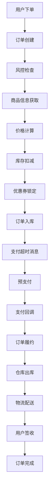

# 订单系统完整业务流程

## 1. 业务流程概览

### 1.1 主要业务流程


### 1.2 订单状态流转
```
已创建(10) → 已支付(20) → 已履约(30) → 出库(40) → 配送中(50) → 已签收(60)
    ↓           ↓           ↓           ↓
  已取消(70)  已取消(70)  已取消(70)  已拒收(100)
```

## 2. 详细业务流程分析

### 2.1 订单创建流程

#### 2.1.1 订单创建前置检查
```java
// 1. 基础参数校验
- 订单ID非空校验
- 业务标识符校验  
- 用户ID校验
- 订单类型校验
- 卖家ID校验
- 配送类型校验
- 地址信息校验(省市区街道)
- 经纬度校验
- 收货人信息校验
- 客户端IP校验
- 商品条目信息校验
- 订单费用信息校验
- 支付信息校验
```

**关键业务规则**：
- 订单支付原价不能为空
- 订单运费不能为空  
- 订单实付金额不能为空
- 使用优惠券时，优惠券抵扣金额不能为空
- 支付类型必须在枚举范围内
- 账户类型必须在枚举范围内

#### 2.1.2 风控检查流程
```java
private void checkRisk(CreateOrderRequest createOrderRequest) {
    // 调用风控服务进行风控检查
    CheckOrderRiskRequest checkOrderRiskRequest = createOrderRequest.clone(CheckOrderRiskRequest.class);
    JsonResult<CheckOrderRiskDTO> jsonResult = riskApi.checkOrderRisk(checkOrderRiskRequest);
    if (!jsonResult.getSuccess()) {
        throw new OrderBizException(jsonResult.getErrorCode(), jsonResult.getErrorMessage());
    }
}
```

**风控检查维度**：
- 用户信用评估
- 订单金额异常检测
- 商品类型风险评估
- 地址信息风险检测
- 支付方式风险评估
- 历史订单行为分析

#### 2.1.3 商品信息获取
```java
private List<ProductSkuDTO> listProductSkus(CreateOrderRequest createOrderRequest) {
    List<CreateOrderRequest.OrderItemRequest> orderItemRequestList = createOrderRequest.getOrderItemRequestList();
    List<ProductSkuDTO> productSkuList = new ArrayList<>();
    
    for (CreateOrderRequest.OrderItemRequest orderItemRequest : orderItemRequestList) {
        String skuCode = orderItemRequest.getSkuCode();
        
        ProductSkuQuery productSkuQuery = new ProductSkuQuery();
        productSkuQuery.setSkuCode(skuCode);
        productSkuQuery.setSellerId(createOrderRequest.getSellerId());
        JsonResult<ProductSkuDTO> jsonResult = productApi.getProductSku(productSkuQuery);
        
        if (!jsonResult.getSuccess()) {
            throw new OrderBizException(jsonResult.getErrorCode(), jsonResult.getErrorMessage());
        }
        ProductSkuDTO productSkuDTO = jsonResult.getData();
        if (productSkuDTO == null) {
            throw new OrderBizException(OrderErrorCodeEnum.PRODUCT_SKU_CODE_ERROR, skuCode);
        }
        productSkuList.add(productSkuDTO);
    }
    return productSkuList;
}
```

**商品信息验证**：
- SKU是否存在
- 商品是否上架
- 库存是否充足
- 价格是否有效
- 商品类型验证

#### 2.1.4 订单价格计算
```java
private CalculateOrderAmountDTO calculateOrderAmount(CreateOrderRequest createOrderRequest, List<ProductSkuDTO> productSkuList) {
    CalculateOrderAmountRequest calculateOrderPriceRequest = createOrderRequest.clone(CalculateOrderAmountRequest.class, CloneDirection.FORWARD);
    
    // 订单条目补充商品信息
    Map<String, ProductSkuDTO> productSkuDTOMap = productSkuList.stream().collect(Collectors.toMap(ProductSkuDTO::getSkuCode, Function.identity()));
    calculateOrderPriceRequest.getOrderItemRequestList().forEach(item -> {
        String skuCode = item.getSkuCode();
        ProductSkuDTO productSkuDTO = productSkuDTOMap.get(skuCode);
        item.setProductId(productSkuDTO.getProductId());
        item.setSalePrice(productSkuDTO.getSalePrice());
    });
    
    // 调用营销服务计算订单价格
    JsonResult<CalculateOrderAmountDTO> jsonResult = marketApi.calculateOrderAmount(calculateOrderPriceRequest);
    
    if (!jsonResult.getSuccess()) {
        throw new OrderBizException(jsonResult.getErrorCode(), jsonResult.getErrorMessage());
    }
    return jsonResult.getData();
}
```

**价格计算逻辑**：
- 商品原价计算：单价 × 数量
- 优惠券抵扣计算
- 运费计算
- 实付金额计算：原价 - 优惠 + 运费
- 价格分摊到每个商品

#### 2.1.5 实付金额验证
```java
private void checkRealPayAmount(CreateOrderRequest createOrderRequest, CalculateOrderAmountDTO calculateOrderAmountDTO) {
    // 前端传入的实付金额
    Integer originRealPayAmount = originOrderAmountMap.get(AmountTypeEnum.REAL_PAY_AMOUNT.getCode()).getAmount();
    
    // 营销系统计算出的实付金额
    Integer realPayAmount = orderAmountMap.get(AmountTypeEnum.REAL_PAY_AMOUNT.getCode()).getAmount();
    
    if (!originRealPayAmount.equals(realPayAmount)) {
        // 订单验价失败
        throw new OrderBizException(OrderErrorCodeEnum.ORDER_CHECK_REAL_PAY_AMOUNT_FAIL);
    }
}
```

**验价机制**：
- 防止前端价格篡改
- 确保价格计算准确性
- 避免资损风险

### 2.2 分布式事务订单创建

#### 2.2.1 Seata分布式事务
```java
@Override
@GlobalTransactional(rollbackFor = Exception.class)
public void createOrder(CreateOrderRequest createOrderRequest, List<ProductSkuDTO> productSkuList, CalculateOrderAmountDTO calculateOrderAmountDTO) {
    // 1. 锁定优惠券
    lockUserCoupon(createOrderRequest);
    
    // 2. 扣减库存
    deductProductStock(createOrderRequest);
    
    // 3. 生成订单到数据库
    addNewOrder(createOrderRequest, productSkuList, calculateOrderAmountDTO);
}
```

#### 2.2.2 优惠券锁定
```java
private void lockUserCoupon(CreateOrderRequest createOrderRequest) {
    String couponId = createOrderRequest.getCouponId();
    if (StringUtils.isEmpty(couponId)) {
        return;
    }
    LockUserCouponRequest lockUserCouponRequest = createOrderRequest.clone(LockUserCouponRequest.class);
    JsonResult<Boolean> jsonResult = marketApi.lockUserCoupon(lockUserCouponRequest);
    if (!jsonResult.getSuccess()) {
        throw new OrderBizException(jsonResult.getErrorCode(), jsonResult.getErrorMessage());
    }
}
```

**优惠券锁定逻辑**：
- 检查优惠券是否可用
- 检查使用条件是否满足
- 锁定优惠券避免重复使用
- 设置锁定超时时间

#### 2.2.3 库存扣减
```java
private void deductProductStock(CreateOrderRequest createOrderRequest) {
    String orderId = createOrderRequest.getOrderId();
    List<DeductProductStockRequest.OrderItemRequest> orderItemRequestList = ObjectUtil.convertList(
            createOrderRequest.getOrderItemRequestList(), DeductProductStockRequest.OrderItemRequest.class);
    
    DeductProductStockRequest lockProductStockRequest = new DeductProductStockRequest();
    lockProductStockRequest.setOrderId(orderId);
    lockProductStockRequest.setOrderItemRequestList(orderItemRequestList);
    JsonResult<Boolean> jsonResult = inventoryApi.deductProductStock(lockProductStockRequest);
    
    if (!jsonResult.getSuccess()) {
        throw new OrderBizException(jsonResult.getErrorCode(), jsonResult.getErrorMessage());
    }
}
```

**库存扣减策略**：
- 预扣减机制：下单时扣减库存
- 库存不足时抛出异常
- 支持库存回滚机制
- 防止超卖问题

#### 2.2.4 订单数据入库
订单创建涉及多个表的数据插入：

**订单主表(order_info)**：
- 基本订单信息
- 订单状态
- 金额信息
- 用户信息

**订单条目表(order_item)**：
- 商品信息
- 数量价格
- 商品快照

**订单配送表(order_delivery_detail)**：
- 配送地址
- 收货人信息
- 配送方式

**订单支付表(order_payment_detail)**：
- 支付方式
- 支付状态
- 支付金额

**订单费用表(order_amount)**：
- 各种费用明细
- 优惠抵扣
- 实付金额

**订单操作日志表(order_operate_log)**：
- 状态变更记录
- 操作时间
- 操作原因

**订单快照表(order_snapshot)**：
- 优惠券快照
- 商品快照
- 价格快照

### 2.3 订单拆单逻辑

#### 2.3.1 拆单条件判断
```java
// 如果存在多种商品类型，需要按商品类型进行拆单
Map<Integer, List<ProductSkuDTO>> productTypeMap = productSkuList.stream().collect(Collectors.groupingBy(ProductSkuDTO::getProductType));
if (productTypeMap.keySet().size() > 1) {
    for (Integer productType : productTypeMap.keySet()) {
        // 生成子订单
        FullOrderData fullSubOrderData = addNewSubOrder(fullMasterOrderData, productType);
        newOrderDataHolder.appendOrderData(fullSubOrderData);
    }
}
```

#### 2.3.2 子订单生成逻辑
```java
private FullOrderData addNewSubOrder(FullOrderData fullOrderData, Integer productType) {
    // 父订单号
    String orderId = orderInfoDO.getOrderId();
    String userId = orderInfoDO.getUserId();
    
    // 生成新的子订单的订单号
    String subOrderId = orderNoManager.genOrderId(OrderNoTypeEnum.SALE_ORDER.getCode(), userId);
    
    // 过滤出当前商品类型的订单条目信息
    List<OrderItemDO> subOrderItemDOList = orderItemDOList.stream()
            .filter(orderItemDO -> productType.equals(orderItemDO.getProductType()))
            .collect(Collectors.toList());
    
    // 统计子单总金额
    Integer subTotalAmount = 0;
    Integer subRealPayAmount = 0;
    for (OrderItemDO subOrderItemDO : subOrderItemDOList) {
        subTotalAmount += subOrderItemDO.getOriginAmount();
        subRealPayAmount += subOrderItemDO.getPayAmount();
    }
    
    // 构建子订单数据...
    return subFullOrderData;
}
```

**拆单业务规则**：
- 按商品类型拆分
- 主订单状态设置为无效
- 子订单继承主订单信息
- 金额按比例分摊
- 保持数据一致性

### 2.4 支付超时延迟消息

#### 2.4.1 延迟消息发送
```java
private void sendPayOrderTimeoutDelayMessage(CreateOrderRequest createOrderRequest) {
    PayOrderTimeoutDelayMessage message = new PayOrderTimeoutDelayMessage();
    
    message.setOrderId(createOrderRequest.getOrderId());
    message.setBusinessIdentifier(createOrderRequest.getBusinessIdentifier());
    message.setCancelType(OrderCancelTypeEnum.TIMEOUT_CANCELED.getCode());
    message.setUserId(createOrderRequest.getUserId());
    message.setOrderType(createOrderRequest.getOrderType());
    message.setOrderStatus(OrderStatusEnum.CREATED.getCode());
    
    String msgJson = JsonUtil.object2Json(message);
    defaultProducer.sendMessage(RocketMqConstant.PAY_ORDER_TIMEOUT_DELAY_TOPIC, msgJson,
            RocketDelayedLevel.DELAYED_30m, "支付订单超时延迟消息");
}
```

**延迟消息机制**：
- 30分钟延迟消息
- 支付超时自动取消
- 防止订单长期占用库存
- 释放锁定的优惠券

## 3. 支付流程详解

### 3.1 预支付流程

#### 3.1.1 预支付前置检查
```java
private void checkPrePayOrderInfo(String orderId, Integer payAmount) {
    // 查询订单信息
    OrderInfoDO orderInfoDO = orderInfoDAO.getByOrderId(orderId);
    OrderPaymentDetailDO orderPaymentDetailDO = orderPaymentDetailDAO.getPaymentDetailByOrderId(orderId);
    
    if (orderInfoDO == null || orderPaymentDetailDO == null) {
        throw new OrderBizException(OrderErrorCodeEnum.ORDER_INFO_IS_NULL);
    }
    
    // 检查订单支付金额
    if (!payAmount.equals(orderInfoDO.getPayAmount())) {
        throw new OrderBizException(OrderErrorCodeEnum.ORDER_PAY_AMOUNT_ERROR);
    }
    
    // 判断订单状态
    if (!OrderStatusEnum.CREATED.getCode().equals(orderInfoDO.getOrderStatus())) {
        throw new OrderBizException(OrderErrorCodeEnum.ORDER_STATUS_ERROR);
    }
    
    // 判断支付状态
    if (PayStatusEnum.PAID.getCode().equals(orderPaymentDetailDO.getPayStatus())) {
        throw new OrderBizException(OrderErrorCodeEnum.ORDER_PAY_STATUS_IS_PAID);
    }
    
    // 判断是否超过支付超时时间
    Date curDate = new Date();
    if (curDate.after(orderInfoDO.getExpireTime())) {
        throw new OrderBizException(OrderErrorCodeEnum.ORDER_PRE_PAY_EXPIRE_ERROR);
    }
}
```

#### 3.1.2 分布式锁控制
```java
@Override
@Transactional(rollbackFor = Exception.class)
public PrePayOrderDTO prePayOrder(PrePayOrderRequest prePayOrderRequest) {
    String orderId = prePayOrderRequest.getOrderId();
    
    // 加分布式锁（与订单支付回调时加的是同一把锁）
    String key = RedisLockKeyConstants.ORDER_PAY_KEY + orderId;
    boolean lock = redisLock.lock(key);
    if (!lock) {
        throw new OrderBizException(OrderErrorCodeEnum.ORDER_PRE_PAY_ERROR);
    }
    
    try {
        // 预支付订单前的检查
        checkPrePayOrderInfo(orderId, payAmount);
        
        // 调用支付系统进行预支付
        PayOrderRequest payOrderRequest = prePayOrderRequest.clone(PayOrderRequest.class);
        JsonResult<PayOrderDTO> jsonResult = payApi.payOrder(payOrderRequest);
        
        // 更新订单表与支付信息表
        updateOrderPaymentInfo(payOrderDTO);
        
        return payOrderDTO.clone(PrePayOrderDTO.class);
    } finally {
        redisLock.unlock(key);
    }
}
```

### 3.2 支付回调流程

#### 3.2.1 多重分布式锁
```java
private void payCallbackMultiLock(List<String> redisKeyList, String orderId) {
    // 加支付分布式锁避免支付系统并发回调
    String orderPayKey = RedisLockKeyConstants.ORDER_PAY_KEY + orderId;
    // 加取消订单分布式锁避免支付和取消订单同时操作同一笔订单
    String cancelOrderKey = RedisLockKeyConstants.CANCEL_KEY + orderId;
    redisKeyList.add(orderPayKey);
    redisKeyList.add(cancelOrderKey);
    boolean lock = redisLock.multiLock(redisKeyList);
    if (!lock) {
        throw new OrderBizException(OrderErrorCodeEnum.ORDER_PAY_CALLBACK_ERROR);
    }
}
```

#### 3.2.2 幂等性处理
```java
// 幂等判断，是否重复的对一个数据进行了支付回调的操作
if (PayStatusEnum.PAID.getCode().equals(orderPaymentDetailDO.getPayStatus())) {
    if (payType.equals(orderPaymentDetailDO.getPayType())) {
        return; // 重复回调，直接返回
    }
}
```

#### 3.2.3 RocketMQ事务消息
```java
private void doPayCallback(PayCallbackRequest payCallbackRequest,
                          OrderInfoDO orderInfoDO,
                          OrderPaymentDetailDO orderPaymentDetailDO,
                          String orderId) throws Exception {
    TransactionMQProducer transactionMQProducer = defaultProducer.getProducer();
    
    // 设置事务监听器
    transactionMQProducer.setTransactionListener(new TransactionListener() {
        @Override
        public LocalTransactionState executeLocalTransaction(Message message, Object o) {
            try {
                // 执行本地事务：更新订单状态为已支付
                orderManager.updateOrderStatusPaid(payCallbackRequest, orderInfoDO, orderPaymentDetailDO);
                return LocalTransactionState.COMMIT_MESSAGE;
            } catch (BaseBizException e) {
                throw e;
            } catch (Exception e) {
                log.error("system error", e);
                return LocalTransactionState.ROLLBACK_MESSAGE;
            }
        }
        
        @Override
        public LocalTransactionState checkLocalTransaction(MessageExt messageExt) {
            // 检查订单是否是已支付状态
            OrderInfoDO orderInfoDO = orderInfoDAO.getByOrderId(orderId);
            if(orderInfoDO != null && OrderStatusEnum.PAID.getCode().equals(orderInfoDO.getOrderStatus())) {
                return LocalTransactionState.COMMIT_MESSAGE;
            }
            return LocalTransactionState.ROLLBACK_MESSAGE;
        }
    });
    
    // 发送事务消息
    sendPaidOrderSuccessMessage(transactionMQProducer, orderInfoDO);
}
```

## 4. 履约流程详解

### 4.1 订单履约触发
```java
@Component
public class PaidOrderSuccessListener implements MessageListenerConcurrently {
    
    @Override
    public ConsumeConcurrentlyStatus consumeMessage(List<MessageExt> list, ConsumeConcurrentlyContext context) {
        try {
            for(MessageExt messageExt : list) {
                String message = new String(messageExt.getBody());
                PaidOrderSuccessMessage paidOrderSuccessMessage = JSON.parseObject(message, PaidOrderSuccessMessage.class);
                String orderId = paidOrderSuccessMessage.getOrderId();
                
                OrderInfoDO order = orderInfoDAO.getByOrderId(orderId);
                if(Objects.isNull(order)) {
                    throw new OrderBizException(OrderErrorCodeEnum.ORDER_INFO_IS_NULL);
                }
                
                // 加分布式锁防止消息重复消费
                String key = RedisLockKeyConstants.ORDER_FULFILL_KEY + orderId;
                if(!redisLock.lock(key)) {
                    throw new BaseBizException(OrderErrorCodeEnum.ORDER_FULFILL_ERROR);
                }
                
                try {
                    // 进行订单履约逻辑
                    triggerOrderFulfill(order);
                } finally {
                    redisLock.unlock(key);
                }
            }
            return ConsumeConcurrentlyStatus.CONSUME_SUCCESS;
        } catch (Exception e) {
            log.error("consumer error", e);
            return ConsumeConcurrentlyStatus.RECONSUME_LATER;
        }
    }
}
```

### 4.2 履约事务消息
履约过程同样使用RocketMQ事务消息保证数据一致性：
- 本地事务：更新订单状态为已履约
- 发送消息：通知履约系统开始处理
- 事务回查：检查订单履约状态

## 5. 物流配送流程

### 5.1 仓库出库
- 履约系统通知WMS系统
- WMS系统进行拣货打包
- 出库后更新订单状态为"出库"
- 分配物流配送员

### 5.2 物流配送
- TMS系统接收配送任务
- 分配配送路线和配送员
- 实时跟踪配送状态
- 更新订单状态为"配送中"

### 5.3 用户签收
- 配送员确认签收
- 更新订单状态为"已签收"
- 触发订单完成流程
- 释放相关资源

## 6. 售后流程详解

### 6.1 订单取消流程

#### 6.1.1 用户主动取消
```java
// 用户取消订单
CancelOrderRequest request = new CancelOrderRequest();
request.setOrderId(orderId);
request.setCancelType(OrderCancelTypeEnum.USER_CANCELED.getCode());
orderAfterSaleService.cancelOrder(request);
```

#### 6.1.2 系统自动取消
```java
@Scheduled(fixedRate = 30 * 60 * 1000)
public void execute() {
    for(OrderInfoDO order : orderInfoDAO.listAllUnPaid()) {
        if(new Date().getTime() - order.getExpireTime().getTime() >= orderProperties.getExpireTime()) {
            // 超时未支付，执行取消订单
            CancelOrderRequest request = new CancelOrderRequest();
            request.setCancelType(OrderCancelTypeEnum.TIMEOUT_CANCELED.getCode());
            orderAfterSaleService.cancelOrder(request);
        }
    }
}
```

#### 6.1.3 售后数据记录
取消订单时需要记录完整的售后信息：

**售后主表(after_sale_info)**：
- 售后类型：退款
- 售后状态：审核通过
- 申请金额：订单实付金额
- 实际金额：订单实付金额

**售后条目表(after_sale_item)**：
- 每个商品的退款信息
- 退货数量
- 退款金额分摊

**售后日志表(after_sale_log)**：
- 售后状态变更记录
- 操作时间和原因

**售后支付表(after_sale_refund)**：
- 退款方式
- 退款状态
- 退款批次号

### 6.2 退货退款流程

#### 6.2.1 用户申请退货
- 用户在订单详情页申请退货
- 选择退货原因和退货商品
- 上传退货凭证
- 填写退货说明

#### 6.2.2 客服审核
- 客服审核退货申请
- 检查退货条件是否满足
- 审核通过后生成退货单
- 通知用户寄回商品

#### 6.2.3 商品验收
- 仓库收到退货商品
- 检查商品状态和完整性
- 验收通过后更新退货状态
- 触发退款流程

#### 6.2.4 退款处理
- 调用支付系统执行退款
- 更新退款状态
- 释放相关资源（库存、优惠券等）
- 发送退款成功通知

## 7. 异常场景处理

### 7.1 库存不足场景
- 下单时库存不足
- 抛出库存不足异常
- 回滚已执行的操作
- 提示用户库存不足

### 7.2 支付失败场景
- 支付系统返回失败
- 订单状态保持"已创建"
- 等待用户重新支付
- 超时后自动取消

### 7.3 履约失败场景
- 履约系统处理失败
- 订单状态回退
- 记录失败原因
- 人工介入处理

### 7.4 配送异常场景
- 配送过程中商品损坏
- 用户拒收商品
- 地址信息错误
- 触发相应的售后流程

## 8. 业务监控和告警

### 8.1 关键指标监控
- 订单创建成功率
- 支付成功率  
- 履约成功率
- 配送及时率
- 售后处理时效

### 8.2 异常告警
- 订单创建失败告警
- 支付回调异常告警
- 库存不足告警
- 系统异常告警

### 8.3 业务大盘
- 实时订单量监控
- 订单金额统计
- 各状态订单分布
- 异常订单统计

## 总结

订单系统的业务流程涵盖了从订单创建到订单完成的全生命周期，每个环节都有严格的业务规则和异常处理机制。通过分布式事务、消息队列、分布式锁等技术手段，保证了系统的高可用性和数据一致性。同时，完善的售后流程和异常处理机制，确保了用户体验和业务的稳定运行。
