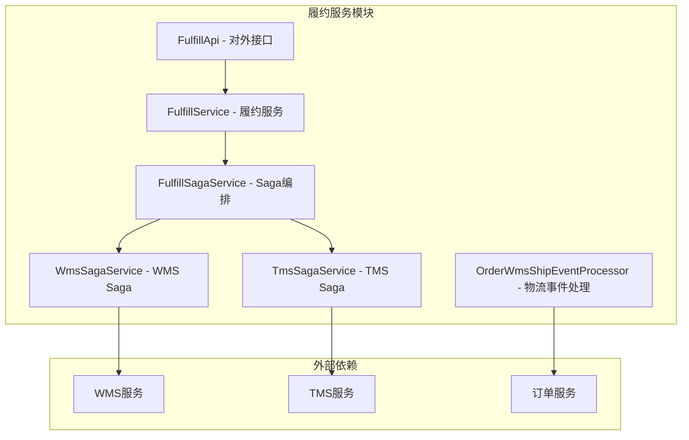
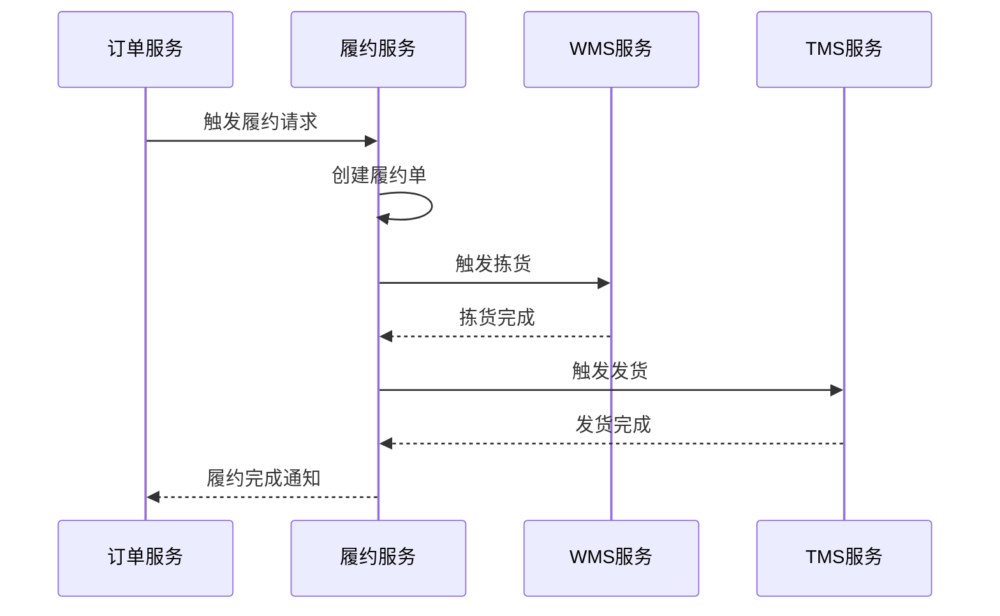

# 履约服务模块详解

## 1. 模块概述

履约服务是订单系统中的关键模块，负责处理订单支付成功后的履约流程，包括创建履约单、协调WMS拣货、TMS发货等环节，确保订单能够顺利完成从支付到发货的全流程处理。

### 1.1 模块职责
- **履约单管理**：创建、查询、取消履约单
- **流程编排**：协调WMS和TMS服务完成履约
- **状态管理**：管理履约流程的各个状态
- **异常处理**：处理履约过程中的异常情况
- **补偿机制**：提供履约失败的补偿逻辑

### 1.2 模块架构


## 2. 核心业务流程

### 2.1 履约流程概览

#### 2.1.1 履约流程图


#### 2.1.2 Saga状态机编排
```json
{
    "Name": "order_fulfill",
    "Comment": "订单履约流程",
    "StartState": "FulfillService",
    "States": {
        "FulfillService": {
            "Type": "ServiceTask",
            "ServiceName": "fulfillSagaService",
            "ServiceMethod": "createFulfillOrder",
            "CompensateState": "CreateFulfillOrderCompensate",
            "Next": "ChoiceWmsState"
        },
        "WmsService": {
            "Type": "ServiceTask", 
            "ServiceName": "wmsSageService",
            "ServiceMethod": "pickGoods",
            "CompensateState": "WmsPickGoodsCompensate",
            "Next": "ChoiceTmsState"
        },
        "TmsService": {
            "Type": "ServiceTask",
            "ServiceName": "tmsSagaService", 
            "ServiceMethod": "sendOut",
            "CompensateState": "TmsSendOutCompensate",
            "Next": "Succeed"
        }
    }
}
```

### 2.2 履约单创建流程

#### 2.2.1 接收履约请求
```java
@Override
public Boolean receiveOrderFulFill(ReceiveFulfillRequest request) {
    log.info("接受订单履约成功，request={}", JSONObject.toJSONString(request));
    
    String orderId = request.getOrderId();
    
    // 1. 加分布式锁（防止重复触发履约）
    String key = RedisLockKeyConstants.ORDER_FULFILL_KEY + orderId;
    boolean lock = redisLock.lock(key);
    if (!lock) {
        throw new FulfillBizException(FulfillErrorCodeEnum.ORDER_FULFILL_ERROR);
    }
    
    try {
        // 2. 幂等性校验：检查订单是否已经履约过
        if(orderFulfilled(request.getOrderId())) {
            log.info("该订单已履约！！！,orderId={}",request.getOrderId());
            return true;
        }
        
        // 3. 启动Saga状态机，触发WMS拣货和TMS发货
        StateMachineEngine stateMachineEngine = (StateMachineEngine) springApplicationContext
                .getBean("stateMachineEngine");
        Map<String, Object> startParams = new HashMap<>(3);
        startParams.put("receiveFulfillRequest", request);
        
        // 4. 执行履约状态机
        String stateMachineName = "order_fulfill";
        log.info("开始触发saga流程，stateMachineName={}", stateMachineName);
        StateMachineInstance inst = stateMachineEngine.startWithBusinessKey(
            stateMachineName, null, null, startParams);
            
        // 5. 检查执行结果
        if(ExecutionStatus.SU.equals(inst.getStatus())) {
            log.info("订单履约流程执行完毕. xid={}", inst.getId());
        } else {
            log.error("订单履约流程执行异常. xid={}", inst.getId());
            throw new FulfillBizException(FulfillErrorCodeEnum.ORDER_FULFILL_IS_ERROR);
        }
        return true;
    } finally {
        redisLock.unlock(key);
    }
}
```

#### 2.2.2 创建履约单
```java
@Override
public void createFulfillOrder(ReceiveFulfillRequest request) {
    // 1. 生成履约单ID
    String fulfillId = genFulfillId();
    
    // 2. 使用Builder模式生成履约单和履约条目
    FulfillDataBuilder builder = FulfillDataBuilder
            .builder(request)
            .buildOrderFulfill(fulfillId)
            .buildOrderFulfillItem();
    OrderFulfillDO orderFulFill = builder.getOrderFulFill();
    List<OrderFulfillItemDO> orderFulFillItems = builder.getOrderFulFillItems();
    
    // 3. 保存履约单和履约条目
    orderFulfillDAO.save(orderFulFill);
    orderFulfillItemDAO.saveBatch(orderFulFillItems);
}

/**
 * 生成履约单ID
 */
private String genFulfillId() {
    return RandomUtil.genRandomNumber(10);
}
```

### 2.3 Saga服务编排

#### 2.3.1 履约Saga服务
```java
@Service("fulfillSagaService")
public class FulfillSagaServiceImpl implements FulfillSagaService {
    
    @Autowired
    private FulfillService fulfillService;
    
    /**
     * 创建履约单
     */
    @Override
    public Boolean createFulfillOrder(ReceiveFulfillRequest request) {
        log.info("创建履约单，request={}", JSONObject.toJSONString(request));
        
        // 模拟异常测试
        String fulfillException = request.getFulfillException();
        if(StringUtils.isNotBlank(fulfillException) && fulfillException.equals("true")) {
            throw new FulfillBizException("创建履约单异常！");
        }
        
        // 创建履约单
        fulfillService.createFulfillOrder(request);
        
        return true;
    }
    
    /**
     * 创建履约单补偿
     */
    @Override
    public Boolean createFulfillOrderCompensate(ReceiveFulfillRequest request) {
        log.info("补偿创建履约单，request={}", JSONObject.toJSONString(request));
        
        // 取消履约单
        fulfillService.cancelFulfillOrder(request.getOrderId());
        
        log.info("补偿创建履约单结束，request={}", JSONObject.toJSONString(request));
        
        return true;
    }
}
```

#### 2.3.2 WMS Saga服务
```java
@Service("wmsSageService")
public class WmsSageServiceImpl implements WmsSagaService {
    
    @Autowired
    private WmsApi wmsApi;
    
    /**
     * WMS拣货
     */
    @Override
    public Boolean pickGoods(ReceiveFulfillRequest request) {
        log.info("wms拣货，request={}", JSONObject.toJSONString(request));
        
        // 模拟异常测试
        String wmsException = request.getWmsException();
        if(StringUtils.isNotBlank(wmsException) && wmsException.equals("true")) {
            throw new FulfillBizException("wms拣货异常！");
        }
        
        // 构建WMS拣货请求
        PickGoodsRequest pickGoodsRequest = buildPickGoodsRequest(request);
        
        // 调用WMS服务进行拣货
        JsonResult<Boolean> result = wmsApi.pickGoods(pickGoodsRequest);
        
        if (!result.getSuccess() || !Boolean.TRUE.equals(result.getData())) {
            log.error("WMS拣货失败, orderId: {}, error: {}", 
                     request.getOrderId(), result.getErrorMessage());
            throw new FulfillBizException("WMS拣货失败: " + result.getErrorMessage());
        }
        
        log.info("wms拣货成功，request={}", JSONObject.toJSONString(request));
        return true;
    }
    
    /**
     * WMS拣货补偿
     */
    @Override
    public Boolean pickGoodsCompensate(ReceiveFulfillRequest request) {
        log.info("补偿wms拣货，request={}", JSONObject.toJSONString(request));
        
        // 取消WMS拣货任务
        CancelPickGoodsRequest cancelRequest = new CancelPickGoodsRequest();
        cancelRequest.setOrderId(request.getOrderId());
        
        JsonResult<Boolean> result = wmsApi.cancelPickGoods(cancelRequest);
        
        if (!result.getSuccess()) {
            log.error("WMS拣货补偿失败, orderId: {}, error: {}", 
                     request.getOrderId(), result.getErrorMessage());
        }
        
        log.info("补偿wms拣货结束，request={}", JSONObject.toJSONString(request));
        return true;
    }
    
    private PickGoodsRequest buildPickGoodsRequest(ReceiveFulfillRequest request) {
        PickGoodsRequest pickGoodsRequest = new PickGoodsRequest();
        pickGoodsRequest.setOrderId(request.getOrderId());
        pickGoodsRequest.setUserId(request.getUserId());
        
        // 转换订单条目为拣货条目
        List<PickGoodsItemRequest> pickItems = request.getReceiveOrderItemRequestList().stream()
            .map(item -> {
                PickGoodsItemRequest pickItem = new PickGoodsItemRequest();
                pickItem.setSkuCode(item.getSkuCode());
                pickItem.setProductName(item.getProductName());
                pickItem.setQuantity(item.getSaleQuantity());
                return pickItem;
            })
            .collect(Collectors.toList());
        
        pickGoodsRequest.setPickItems(pickItems);
        
        return pickGoodsRequest;
    }
}
```

#### 2.3.3 TMS Saga服务
```java
@Service("tmsSagaService")
public class TmsSagaServiceImpl implements TmsSagaService {
    
    @Autowired
    private TmsApi tmsApi;
    
    /**
     * TMS发货
     */
    @Override
    public Boolean sendOut(ReceiveFulfillRequest request) {
        log.info("tms发货，request={}", JSONObject.toJSONString(request));
        
        // 模拟异常测试
        String tmsException = request.getTmsException();
        if(StringUtils.isNotBlank(tmsException) && tmsException.equals("true")) {
            throw new FulfillBizException("tms发货异常！");
        }
        
        // 构建TMS发货请求
        SendOutRequest sendOutRequest = buildSendOutRequest(request);
        
        // 调用TMS服务进行发货
        JsonResult<Boolean> result = tmsApi.sendOut(sendOutRequest);
        
        if (!result.getSuccess() || !Boolean.TRUE.equals(result.getData())) {
            log.error("TMS发货失败, orderId: {}, error: {}", 
                     request.getOrderId(), result.getErrorMessage());
            throw new FulfillBizException("TMS发货失败: " + result.getErrorMessage());
        }
        
        log.info("tms发货成功，request={}", JSONObject.toJSONString(request));
        return true;
    }
    
    /**
     * TMS发货补偿
     */
    @Override
    public Boolean sendOutCompensate(ReceiveFulfillRequest request) {
        log.info("补偿tms发货，request={}", JSONObject.toJSONString(request));
        
        // 取消TMS发货任务
        CancelSendOutRequest cancelRequest = new CancelSendOutRequest();
        cancelRequest.setOrderId(request.getOrderId());
        
        JsonResult<Boolean> result = tmsApi.cancelSendOut(cancelRequest);
        
        if (!result.getSuccess()) {
            log.error("TMS发货补偿失败, orderId: {}, error: {}", 
                     request.getOrderId(), result.getErrorMessage());
        }
        
        log.info("补偿tms发货结束，request={}", JSONObject.toJSONString(request));
        return true;
    }
    
    private SendOutRequest buildSendOutRequest(ReceiveFulfillRequest request) {
        SendOutRequest sendOutRequest = new SendOutRequest();
        sendOutRequest.setOrderId(request.getOrderId());
        sendOutRequest.setUserId(request.getUserId());
        
        // 设置配送信息
        DeliveryInfo deliveryInfo = new DeliveryInfo();
        deliveryInfo.setReceiverName(request.getReceiverName());
        deliveryInfo.setReceiverPhone(request.getReceiverPhone());
        deliveryInfo.setReceiverAddress(request.getReceiverAddress());
        deliveryInfo.setProvince(request.getProvince());
        deliveryInfo.setCity(request.getCity());
        deliveryInfo.setArea(request.getArea());
        
        sendOutRequest.setDeliveryInfo(deliveryInfo);
        
        return sendOutRequest;
    }
}
```

## 3. 数据模型设计

### 3.1 履约单主表

#### 3.1.1 OrderFulfillDO
```java
@Data
@TableName("order_fulfill")
public class OrderFulfillDO {
    
    @TableId(value = "id", type = IdType.AUTO)
    private Long id;
    
    /**
     * 履约单号
     */
    private String fulfillId;
    
    /**
     * 订单号
     */
    private String orderId;
    
    /**
     * 用户ID
     */
    private String userId;
    
    /**
     * 履约状态
     */
    private Integer fulfillStatus;
    
    /**
     * 创建时间
     */
    private Date gmtCreate;
    
    /**
     * 更新时间
     */
    private Date gmtModified;
}
```

#### 3.1.2 OrderFulfillItemDO
```java
@Data
@TableName("order_fulfill_item")
public class OrderFulfillItemDO {
    
    @TableId(value = "id", type = IdType.AUTO)
    private Long id;
    
    /**
     * 履约单号
     */
    private String fulfillId;
    
    /**
     * 订单号
     */
    private String orderId;
    
    /**
     * 商品SKU编码
     */
    private String skuCode;
    
    /**
     * 商品名称
     */
    private String productName;
    
    /**
     * 销售数量
     */
    private Integer saleQuantity;
    
    /**
     * 销售单价
     */
    private Integer salePrice;
    
    /**
     * 商品图片
     */
    private String productImg;
    
    /**
     * 创建时间
     */
    private Date gmtCreate;
    
    /**
     * 更新时间
     */
    private Date gmtModified;
}
```

### 3.2 履约数据建造者

#### 3.2.1 FulfillDataBuilder
```java
public class FulfillDataBuilder {
    
    private ReceiveFulfillRequest request;
    private OrderFulfillDO orderFulFill;
    private List<OrderFulfillItemDO> orderFulFillItems;
    
    public static FulfillDataBuilder builder(ReceiveFulfillRequest request) {
        FulfillDataBuilder builder = new FulfillDataBuilder();
        builder.request = request;
        return builder;
    }
    
    /**
     * 构建履约单
     */
    public FulfillDataBuilder buildOrderFulfill(String fulfillId) {
        OrderFulfillDO orderFulfill = new OrderFulfillDO();
        orderFulfill.setFulfillId(fulfillId);
        orderFulfill.setOrderId(request.getOrderId());
        orderFulfill.setUserId(request.getUserId());
        orderFulfill.setFulfillStatus(FulfillStatusEnum.CREATED.getCode());
        orderFulfill.setGmtCreate(new Date());
        orderFulfill.setGmtModified(new Date());
        
        this.orderFulFill = orderFulfill;
        return this;
    }
    
    /**
     * 构建履约条目
     */
    public FulfillDataBuilder buildOrderFulfillItem() {
        List<OrderFulfillItemDO> fulfillItems = new ArrayList<>();
        
        List<ReceiveOrderItemRequest> orderItems = request.getReceiveOrderItemRequestList();
        for (ReceiveOrderItemRequest item : orderItems) {
            OrderFulfillItemDO fulfillItem = new OrderFulfillItemDO();
            fulfillItem.setFulfillId(orderFulFill.getFulfillId());
            fulfillItem.setOrderId(request.getOrderId());
            fulfillItem.setSkuCode(item.getSkuCode());
            fulfillItem.setProductName(item.getProductName());
            fulfillItem.setSaleQuantity(item.getSaleQuantity());
            fulfillItem.setSalePrice(item.getSalePrice());
            fulfillItem.setProductImg(item.getProductImg());
            fulfillItem.setGmtCreate(new Date());
            fulfillItem.setGmtModified(new Date());
            
            fulfillItems.add(fulfillItem);
        }
        
        this.orderFulFillItems = fulfillItems;
        return this;
    }
    
    public OrderFulfillDO getOrderFulFill() {
        return orderFulFill;
    }
    
    public List<OrderFulfillItemDO> getOrderFulFillItems() {
        return orderFulFillItems;
    }
}
```

## 4. 物流事件处理

### 4.1 WMS物流事件处理

#### 4.1.1 物流事件处理器接口
```java
public interface OrderWmsShipEventProcessor {
    
    /**
     * 执行物流事件处理
     */
    void execute(BaseWmsShipEvent wmsShipEvent);
    
    /**
     * 获取支持的事件类型
     */
    WmsShipEventTypeEnum getEventType();
}
```

#### 4.2.2 订单出库事件处理器
```java
@Service
public class OrderOutStockWmsEventProcessor extends AbstractWmsShipEventProcessor {
    
    @Override
    public void doExecute(BaseWmsShipEvent wmsShipEvent) {
        OrderOutStockWmsEvent outStockEvent = (OrderOutStockWmsEvent) wmsShipEvent;
        String orderId = outStockEvent.getOrderId();
        
        log.info("处理订单出库事件, orderId: {}", orderId);
        
        try {
            // 1. 更新订单状态为出库
            updateOrderStatusToOutStock(orderId);
            
            // 2. 记录出库日志
            recordOutStockLog(outStockEvent);
            
            // 3. 发送出库通知
            sendOutStockNotification(orderId);
            
            log.info("订单出库事件处理完成, orderId: {}", orderId);
            
        } catch (Exception e) {
            log.error("处理订单出库事件失败, orderId: {}", orderId, e);
            throw new FulfillBizException("处理订单出库事件失败: " + e.getMessage());
        }
    }
    
    @Override
    public WmsShipEventTypeEnum getEventType() {
        return WmsShipEventTypeEnum.OUT_STOCK;
    }
    
    private void updateOrderStatusToOutStock(String orderId) {
        // 调用订单服务更新状态
        UpdateOrderStatusRequest request = new UpdateOrderStatusRequest();
        request.setOrderId(orderId);
        request.setOrderStatus(OrderStatusEnum.OUT_STOCK.getCode());
        
        JsonResult<Boolean> result = orderApi.updateOrderStatus(request);
        if (!result.getSuccess()) {
            throw new FulfillBizException("更新订单出库状态失败: " + result.getErrorMessage());
        }
    }
    
    private void recordOutStockLog(OrderOutStockWmsEvent event) {
        OutStockLogDO outStockLog = new OutStockLogDO();
        outStockLog.setOrderId(event.getOrderId());
        outStockLog.setWmsOrderId(event.getWmsOrderId());
        outStockLog.setOutStockTime(event.getOutStockTime());
        outStockLog.setOperator(event.getOperator());
        outStockLogDAO.save(outStockLog);
    }
    
    private void sendOutStockNotification(String orderId) {
        // 发送出库通知消息
        OutStockNotificationMessage message = new OutStockNotificationMessage();
        message.setOrderId(orderId);
        message.setNotifyTime(new Date());
        
        defaultProducer.sendMessage(
            RocketMqConstant.ORDER_OUT_STOCK_NOTIFICATION_TOPIC,
            JSON.toJSONString(message)
        );
    }
}
```

#### 4.2.3 订单配送事件处理器
```java
@Service
public class OrderDeliveredWmsEventProcessor extends AbstractWmsShipEventProcessor {
    
    @Override
    public void doExecute(BaseWmsShipEvent wmsShipEvent) {
        OrderDeliveredWmsEvent deliveredEvent = (OrderDeliveredWmsEvent) wmsShipEvent;
        String orderId = deliveredEvent.getOrderId();
        
        log.info("处理订单配送事件, orderId: {}", orderId);
        
        try {
            // 1. 更新订单状态为配送中
            updateOrderStatusToDelivery(orderId);
            
            // 2. 更新配送信息
            updateDeliveryInfo(deliveredEvent);
            
            // 3. 发送配送通知
            sendDeliveryNotification(orderId, deliveredEvent);
            
            log.info("订单配送事件处理完成, orderId: {}", orderId);
            
        } catch (Exception e) {
            log.error("处理订单配送事件失败, orderId: {}", orderId, e);
            throw new FulfillBizException("处理订单配送事件失败: " + e.getMessage());
        }
    }
    
    @Override
    public WmsShipEventTypeEnum getEventType() {
        return WmsShipEventTypeEnum.DELIVERED;
    }
    
    private void updateOrderStatusToDelivery(String orderId) {
        UpdateOrderStatusRequest request = new UpdateOrderStatusRequest();
        request.setOrderId(orderId);
        request.setOrderStatus(OrderStatusEnum.DELIVERY.getCode());
        
        JsonResult<Boolean> result = orderApi.updateOrderStatus(request);
        if (!result.getSuccess()) {
            throw new FulfillBizException("更新订单配送状态失败: " + result.getErrorMessage());
        }
    }
    
    private void updateDeliveryInfo(OrderDeliveredWmsEvent event) {
        UpdateDeliveryInfoRequest request = new UpdateDeliveryInfoRequest();
        request.setOrderId(event.getOrderId());
        request.setLogisticsCode(event.getLogisticsCode());
        request.setTrackingNumber(event.getTrackingNumber());
        request.setDelivererName(event.getDelivererName());
        request.setDelivererPhone(event.getDelivererPhone());
        request.setEstimatedArrivalTime(event.getEstimatedArrivalTime());
        
        JsonResult<Boolean> result = orderApi.updateDeliveryInfo(request);
        if (!result.getSuccess()) {
            throw new FulfillBizException("更新配送信息失败: " + result.getErrorMessage());
        }
    }
    
    private void sendDeliveryNotification(String orderId, OrderDeliveredWmsEvent event) {
        DeliveryNotificationMessage message = new DeliveryNotificationMessage();
        message.setOrderId(orderId);
        message.setTrackingNumber(event.getTrackingNumber());
        message.setDelivererName(event.getDelivererName());
        message.setDelivererPhone(event.getDelivererPhone());
        message.setEstimatedArrivalTime(event.getEstimatedArrivalTime());
        
        defaultProducer.sendMessage(
            RocketMqConstant.ORDER_DELIVERY_NOTIFICATION_TOPIC,
            JSON.toJSONString(message)
        );
    }
}
```

## 5. 消息队列集成

### 5.1 履约触发消息监听

#### 5.1.1 履约触发监听器
```java
@Component
@RocketMQMessageListener(
    topic = RocketMqConstant.TRIGGER_ORDER_FULFILL_TOPIC,
    consumerGroup = "trigger-order-fulfill-consumer-group",
    messageModel = MessageModel.CLUSTERING
)
public class TriggerOrderFulfillTopicListener implements RocketMQListener<String> {
    
    @Autowired
    private FulfillApi fulfillApi;
    
    @Override
    public void onMessage(String message) {
        log.info("接收到履约触发消息: {}", message);
        
        try {
            ReceiveFulfillRequest request = JSON.parseObject(message, ReceiveFulfillRequest.class);
            String orderId = request.getOrderId();
            
            // 调用履约服务处理
            JsonResult<Boolean> result = fulfillApi.receiveOrderFulFill(request);
            
            if (!result.getSuccess() || !Boolean.TRUE.equals(result.getData())) {
                log.error("履约处理失败, orderId: {}, error: {}", orderId, result.getErrorMessage());
                throw new FulfillBizException("履约处理失败: " + result.getErrorMessage());
            }
            
            log.info("履约触发消息处理完成, orderId: {}", orderId);
            
        } catch (Exception e) {
            log.error("处理履约触发消息失败, message: {}", message, e);
            throw e; // 抛出异常触发重试
        }
    }
}
```

### 5.2 履约取消消息监听

#### 5.2.1 履约取消监听器
```java
@Component
@RocketMQMessageListener(
    topic = RocketMqConstant.CANCEL_FULFILL_TOPIC,
    consumerGroup = "cancel-fulfill-consumer-group",
    messageModel = MessageModel.CLUSTERING
)
public class CancelFulfillTopicListener implements RocketMQListener<String> {
    
    @Autowired
    private FulfillService fulfillService;
    
    @Override
    public void onMessage(String message) {
        log.info("接收到履约取消消息: {}", message);
        
        try {
            CancelFulfillRequest request = JSON.parseObject(message, CancelFulfillRequest.class);
            String orderId = request.getOrderId();
            
            // 取消履约单
            fulfillService.cancelFulfillOrder(orderId);
            
            log.info("履约取消消息处理完成, orderId: {}", orderId);
            
        } catch (Exception e) {
            log.error("处理履约取消消息失败, message: {}", message, e);
            throw e; // 抛出异常触发重试
        }
    }
}
```

## 6. 技术亮点分析

### 6.1 Saga分布式事务

#### 6.1.1 设计优势
- **长事务支持**：适合履约这种长流程业务
- **补偿机制**：每个步骤都有对应的补偿操作
- **状态可视化**：JSON配置文件清晰展示流程
- **异常处理**：完善的异常捕获和处理机制

#### 6.1.2 状态机配置
```json
{
    "States": {
        "FulfillService": {
            "Type": "ServiceTask",
            "ServiceName": "fulfillSagaService",
            "ServiceMethod": "createFulfillOrder",
            "CompensateState": "CreateFulfillOrderCompensate",
            "Catch": [{
                "Exceptions": ["java.lang.Throwable"],
                "Next": "CompensationTrigger"
            }]
        }
    }
}
```

### 6.2 分布式锁应用

#### 6.2.1 防重复履约
```java
// 使用Redis分布式锁防止重复触发履约
String key = RedisLockKeyConstants.ORDER_FULFILL_KEY + orderId;
boolean lock = redisLock.lock(key);
if (!lock) {
    throw new FulfillBizException(FulfillErrorCodeEnum.ORDER_FULFILL_ERROR);
}
```

### 6.3 建造者模式应用

#### 6.3.1 履约数据构建
```java
// 使用Builder模式构建复杂的履约数据
FulfillDataBuilder builder = FulfillDataBuilder
        .builder(request)
        .buildOrderFulfill(fulfillId)
        .buildOrderFulfillItem();
```

### 6.4 策略模式应用

#### 6.4.1 物流事件处理策略
```java
// 根据事件类型选择不同的处理策略
@Service
public class WmsShipEventProcessorFactory {
    
    private final Map<WmsShipEventTypeEnum, OrderWmsShipEventProcessor> processorMap;
    
    public OrderWmsShipEventProcessor getProcessor(WmsShipEventTypeEnum eventType) {
        return processorMap.get(eventType);
    }
}
```

## 7. 技术难点与解决方案

### 7.1 分布式事务一致性

#### 7.1.1 问题描述
履约流程涉及多个服务（履约、WMS、TMS），如何保证事务一致性？

#### 7.1.2 解决方案
- **Saga模式**：使用Seata Saga实现长事务管理
- **补偿机制**：每个步骤都有对应的补偿操作
- **幂等设计**：所有操作都支持幂等，防止重复执行

### 7.2 并发控制

#### 7.2.1 问题描述
同一订单可能被多次触发履约，如何防止重复处理？

#### 7.2.2 解决方案
- **分布式锁**：使用Redis分布式锁防止并发
- **幂等校验**：检查订单是否已履约
- **状态控制**：严格控制履约状态流转

### 7.3 异常处理

#### 7.3.3 问题描述
履约过程中任何环节出现异常，如何处理？

#### 7.3.4 解决方案
- **异常捕获**：Saga配置中定义异常处理
- **补偿触发**：异常时自动触发补偿流程
- **状态回滚**：将相关状态回滚到初始状态

## 8. 监控与运维

### 8.1 履约监控指标

#### 8.1.1 业务指标
```java
@Component
public class FulfillMetrics {
    
    private final Counter fulfillCounter;
    private final Timer fulfillTimer;
    
    public FulfillMetrics(MeterRegistry meterRegistry) {
        this.fulfillCounter = Counter.builder("fulfill.process")
            .description("履约处理次数")
            .register(meterRegistry);
            
        this.fulfillTimer = Timer.builder("fulfill.process.duration")
            .description("履约处理耗时")
            .register(meterRegistry);
    }
    
    public void recordFulfillProcess(boolean success, Duration duration) {
        fulfillCounter.increment(Tags.of("result", success ? "success" : "failure"));
        fulfillTimer.record(duration);
    }
}
```

### 8.2 Saga状态监控

#### 8.2.1 状态机执行监控
```java
@Component
public class SagaExecutionMonitor {
    
    @EventListener
    public void handleSagaStateChanged(SagaStateChangedEvent event) {
        String stateMachineName = event.getStateMachineName();
        String currentState = event.getCurrentState();
        String status = event.getStatus();
        
        log.info("Saga状态变更: stateMachine={}, state={}, status={}", 
                 stateMachineName, currentState, status);
        
        // 记录状态变更指标
        Metrics.counter("saga.state.change", 
                       "stateMachine", stateMachineName,
                       "state", currentState,
                       "status", status)
               .increment();
        
        // 异常状态告警
        if ("FAILED".equals(status)) {
            sendSagaFailureAlert(event);
        }
    }
}
```

## 总结

履约服务模块作为订单系统的关键环节，具有以下特点：

**技术亮点**：
1. **Saga分布式事务**：完美适配长流程业务场景
2. **状态机编排**：JSON配置清晰展示业务流程
3. **补偿机制**：完善的异常处理和回滚机制
4. **事件驱动**：基于消息队列的异步处理

**设计精粹**：
1. **建造者模式**：优雅构建复杂履约数据
2. **策略模式**：灵活处理不同类型的物流事件
3. **分布式锁**：有效防止并发问题
4. **幂等设计**：确保操作的安全性

**业务价值**：
1. **流程自动化**：自动协调WMS和TMS完成履约
2. **异常恢复**：自动处理履约过程中的异常
3. **状态透明**：清晰的履约状态管理
4. **扩展性好**：易于添加新的履约步骤

履约服务通过Saga模式实现了复杂业务流程的可靠编排，为订单系统提供了稳定高效的履约处理能力。
