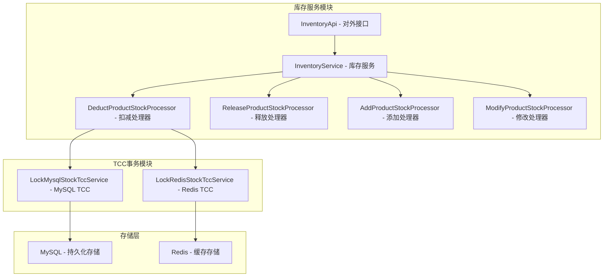
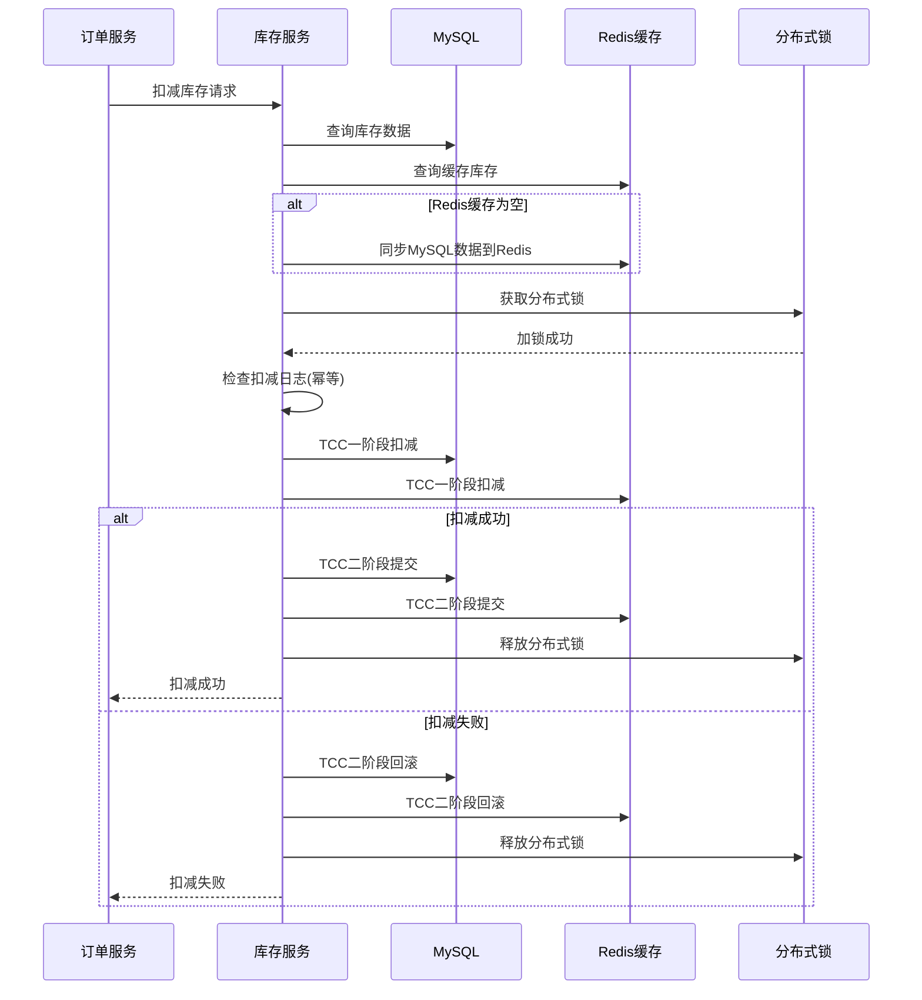

# 库存服务模块详解

## 1. 模块概述

库存服务是订单系统中的核心模块之一，负责管理商品库存的扣减、释放、同步等操作。该模块采用了双存储架构（MySQL + Redis），结合分布式锁和TCC事务模式，确保高并发场景下库存操作的一致性和准确性。

### 1.1 模块职责
- **库存扣减**：订单创建时扣减商品库存
- **库存释放**：订单取消时释放已扣减的库存
- **库存同步**：MySQL和Redis之间的库存数据同步
- **库存管理**：新增、修改商品库存
- **并发控制**：防止超卖和重复扣减
- **事务保证**：保证库存操作的ACID特性

### 1.2 模块架构


## 2. 核心业务流程

### 2.1 库存扣减流程

#### 2.1.1 扣减流程图


#### 2.1.2 扣减核心代码
```java
@Override
public Boolean deductProductStock(DeductProductStockRequest deductProductStockRequest) {
    // 1. 检查入参
    checkLockProductStockRequest(deductProductStockRequest);
    
    String orderId = deductProductStockRequest.getOrderId();
    List<DeductProductStockRequest.OrderItemRequest> orderItemRequestList =
            deductProductStockRequest.getOrderItemRequestList();
            
    for(DeductProductStockRequest.OrderItemRequest orderItemRequest : orderItemRequestList) {
        String skuCode = orderItemRequest.getSkuCode();
        
        // 2. 查询MySQL库存数据
        ProductStockDO productStockDO = productStockDAO.getBySkuCode(skuCode);
        if(productStockDO == null) {
            log.error("商品库存记录不存在，skuCode={}", skuCode);
            throw new InventoryBizException(InventoryErrorCodeEnum.PRODUCT_SKU_STOCK_NOT_FOUND_ERROR);
        }
        
        // 3. 查询Redis库存数据
        String productStockKey = CacheSupport.buildProductStockKey(skuCode);
        Map<String,String> productStockValue = redisCache.hGetAll(productStockKey);
        if(productStockValue.isEmpty()) {
            // 如果查询不到Redis库存数据，将MySQL库存数据放入Redis
            addProductStockProcessor.addStockToRedis(productStockDO);
        }
        
        // 4. 添加Redis锁，防并发
        String lockKey = MessageFormat.format(RedisLockKeyConstants.DEDUCT_PRODUCT_STOCK_KEY, orderId, skuCode);
        Boolean locked = redisLock.lock(lockKey);
        if(!locked) {
            log.error("无法获取扣减库存锁,orderId={},skuCode={}", orderId, skuCode);
            throw new InventoryBizException(InventoryErrorCodeEnum.DEDUCT_PRODUCT_SKU_STOCK_ERROR);
        }
        
        try {
            // 5. 查询库存扣减日志（幂等性检查）
            ProductStockLogDO productStockLog = productStockLogDAO.getLog(orderId, skuCode);
            if(null != productStockLog) {
                log.info("已扣减过，扣减库存日志已存在,orderId={},skuCode={}", orderId, skuCode);
                return true;
            }
            
            Integer saleQuantity = orderItemRequest.getSaleQuantity();
            Integer originSaleStock = productStockDO.getSaleStockQuantity().intValue();
            Integer originSaledStock = productStockDO.getSaledStockQuantity().intValue();
            
            // 6. 执行库存扣减
            DeductStockDTO deductStock = new DeductStockDTO(orderId, skuCode, saleQuantity, originSaleStock, originSaledStock);
            deductProductStockProcessor.doDeduct(deductStock);
        } finally {
            redisLock.unlock(lockKey);
        }
    }
    return true;
}
```

### 2.2 TCC事务处理

#### 2.2.1 MySQL TCC实现

##### Try阶段 - 扣减销售库存
```java
@Transactional(rollbackFor = Exception.class)
@Override
public boolean deductStock(BusinessActionContext actionContext, DeductStockDTO deductStock) {
    String xid = actionContext.getXid();
    String skuCode = deductStock.getSkuCode();
    Integer saleQuantity = deductStock.getSaleQuantity();
    Integer originSaleStock = deductStock.getOriginSaleStock();
    
    // 标识Try阶段开始执行
    TccResultHolder.tagTryStart(getClass(), skuCode, xid);
    
    // 悬挂问题处理：rollback接口比try接口先执行的情况
    if(isEmptyRollback()) {
        return false;
    }
    
    log.info("一阶段方法：扣减MySQL销售库存，deductStock={},xid={}", 
             JSONObject.toJSONString(deductStock), xid);
             
    // 执行库存扣减 SQL: UPDATE product_stock SET sale_stock_quantity = sale_stock_quantity - ? WHERE sku_code = ? AND sale_stock_quantity = ?
    int result = productStockDAO.deductSaleStock(skuCode, saleQuantity, originSaleStock);
    
    // 标识Try阶段执行成功
    if(result > 0) {
        TccResultHolder.tagTrySuccess(getClass(), skuCode, xid);
    }
    
    return result > 0;
}
```

##### Commit阶段 - 增加已销售库存
```java
@Override
public void commit(BusinessActionContext actionContext) {
    String xid = actionContext.getXid();
    DeductStockDTO deductStock = ((JSONObject)actionContext.getActionContext("deductStock")).toJavaObject(DeductStockDTO.class);
    String skuCode = deductStock.getSkuCode();
    Integer saleQuantity = deductStock.getSaleQuantity();
    Integer originSaledStock = deductStock.getOriginSaledStock();
    
    log.info("二阶段方法：增加MySQL已销售库存，deductStock={},xid={}", 
             JSONObject.toJSONString(deductStock), xid);
    
    // 幂等性检查：当出现网络异常或者TC Server异常时，会出现重复调用commit阶段的情况
    if(!TccResultHolder.isTrySuccess(getClass(), skuCode, xid)) {
        return;
    }
    
    // 1. 增加已销售库存
    productStockDAO.increaseSaledStock(skuCode, saleQuantity, originSaledStock);
    
    // 2. 插入一条扣减日志表
    log.info("插入一条扣减日志表");
    productStockLogDAO.save(buildStockLog(deductStock));
    
    // 移除标识
    TccResultHolder.removeResult(getClass(), skuCode, xid);
}
```

##### Rollback阶段 - 还原销售库存
```java
@Override
public void rollback(BusinessActionContext actionContext) {
    String xid = actionContext.getXid();
    DeductStockDTO deductStock = ((JSONObject)actionContext.getActionContext("deductStock")).toJavaObject(DeductStockDTO.class);
    String skuCode = deductStock.getSkuCode();
    Integer saleQuantity = deductStock.getSaleQuantity();
    Integer originSaleStock = deductStock.getOriginSaleStock();
    
    log.info("回滚：增加MySQL销售库存，deductStock={},xid={}", 
             JSONObject.toJSONString(deductStock), xid);
    
    // 空回滚处理
    if(TccResultHolder.isTagNull(getClass(), skuCode, xid)) {
        log.info("MySQL:出现空回滚");
        insertEmptyRollbackTag();
        return;
    }
    
    // 幂等处理：try阶段没有完成的情况下，不必执行回滚
    if(!TccResultHolder.isTrySuccess(getClass(), skuCode, xid)) {
        log.info("MySQL:无需回滚");
        return;
    }
    
    // 1. 还原销售库存
    productStockDAO.restoreSaleStock(skuCode, saleQuantity, originSaleStock - saleQuantity);
    
    // 2. 删除库存扣减日志
    ProductStockLogDO logDO = productStockLogDAO.getLog(deductStock.getOrderId(), skuCode);
    if(null != logDO) {
        productStockLogDAO.removeById(logDO.getId());
    }
    
    // 移除标识
    TccResultHolder.removeResult(getClass(), skuCode, xid);
}
```

#### 2.2.2 Redis TCC实现

##### Try阶段 - 扣减Redis库存
```java
@Override
public boolean deductStock(BusinessActionContext actionContext, DeductStockDTO deductStock) {
    String xid = actionContext.getXid();
    String skuCode = deductStock.getSkuCode();
    Integer saleQuantity = deductStock.getSaleQuantity();
    
    // 标识Try阶段开始执行
    TccResultHolder.tagTryStart(getClass(), skuCode, xid);
    
    log.info("一阶段方法：扣减Redis销售库存，deductStock={},xid={}", 
             JSONObject.toJSONString(deductStock), xid);
    
    // 构建Redis库存Key
    String productStockKey = CacheSupport.buildProductStockKey(skuCode);
    
    // 使用Lua脚本保证原子性扣减
    String luaScript = 
        "local current = redis.call('HGET', KEYS[1], 'saleStockQuantity') " +
        "if current == false or tonumber(current) < tonumber(ARGV[1]) then " +
        "    return 0 " +
        "else " +
        "    redis.call('HINCRBY', KEYS[1], 'saleStockQuantity', -tonumber(ARGV[1])) " +
        "    return 1 " +
        "end";
    
    Long result = (Long) redisTemplate.execute(new DefaultRedisScript<>(luaScript, Long.class), 
                                               Arrays.asList(productStockKey), 
                                               saleQuantity.toString());
    
    // 标识Try阶段执行成功
    if(result != null && result > 0) {
        TccResultHolder.tagTrySuccess(getClass(), skuCode, xid);
    }
    
    return result != null && result > 0;
}
```

##### Commit阶段 - 增加Redis已销售库存
```java
@Override
public void commit(BusinessActionContext actionContext) {
    String xid = actionContext.getXid();
    DeductStockDTO deductStock = ((JSONObject)actionContext.getActionContext("deductStock")).toJavaObject(DeductStockDTO.class);
    String skuCode = deductStock.getSkuCode();
    Integer saleQuantity = deductStock.getSaleQuantity();
    
    log.info("二阶段方法：增加Redis已销售库存，deductStock={},xid={}", 
             JSONObject.toJSONString(deductStock), xid);
    
    // 幂等性检查
    if(!TccResultHolder.isTrySuccess(getClass(), skuCode, xid)) {
        return;
    }
    
    // 增加已销售库存
    String productStockKey = CacheSupport.buildProductStockKey(skuCode);
    redisTemplate.opsForHash().increment(productStockKey, "saledStockQuantity", saleQuantity);
    
    // 移除标识
    TccResultHolder.removeResult(getClass(), skuCode, xid);
}
```

### 2.3 库存释放流程

#### 2.3.1 释放流程实现
```java
@Override
public Boolean releaseProductStock(ReleaseProductStockRequest releaseProductStockRequest) {
    // 1. 检查入参
    checkReleaseProductStockRequest(releaseProductStockRequest);
    
    String orderId = releaseProductStockRequest.getOrderId();
    List<ReleaseProductStockRequest.OrderItemRequest> orderItemRequestList =
            releaseProductStockRequest.getOrderItemRequestList();
            
    for(ReleaseProductStockRequest.OrderItemRequest orderItemRequest : orderItemRequestList) {
        String skuCode = orderItemRequest.getSkuCode();
        
        // 2. 查询MySQL库存数据
        ProductStockDO productStockDO = productStockDAO.getBySkuCode(skuCode);
        if(productStockDO == null) {
            throw new InventoryBizException(InventoryErrorCodeEnum.PRODUCT_SKU_STOCK_NOT_FOUND_ERROR);
        }
        
        // 3. 查询Redis库存数据
        String productStockKey = CacheSupport.buildProductStockKey(skuCode);
        Map<String,String> productStockValue = redisCache.hGetAll(productStockKey);
        if(productStockValue.isEmpty()) {
            // 如果查询不到Redis库存数据，将MySQL库存数据放入Redis
            addProductStockProcessor.addStockToRedis(productStockDO);
        }
        
        Integer saleQuantity = orderItemRequest.getSaleQuantity();
        
        // 4. 添加Redis锁，防并发
        String lockKey = MessageFormat.format(RedisLockKeyConstants.RELEASE_PRODUCT_STOCK_KEY, orderId, skuCode);
        Boolean locked = redisLock.lock(lockKey);
        if(!locked) {
            log.error("无法获取释放库存锁,orderId={},skuCode={}", orderId, skuCode);
            throw new InventoryBizException(InventoryErrorCodeEnum.RELEASE_PRODUCT_SKU_STOCK_ERROR);
        }
        
        try {
            // 5. 校验是否释放过库存（幂等性检查）
            ProductStockLogDO productStockLog = productStockLogDAO.getLog(orderId, skuCode);
            if(null != productStockLog && productStockLog.getStatus().equals(StockLogStatusEnum.RELEASED.getCode())) {
                log.info("已释放过库存,orderId={},skuCode={}", orderId, skuCode);
                return true;
            }
            
            // 6. 释放库存
            releaseProductStockProcessor.doRelease(orderId, skuCode, saleQuantity, productStockLog);
        } finally {
            redisLock.unlock(lockKey);
        }
    }
    return true;
}
```

#### 2.3.2 释放处理器实现
```java
@Component
public class ReleaseProductStockProcessor {
    
    @Autowired
    private ProductStockDAO productStockDAO;
    
    @Autowired
    private ProductStockLogDAO productStockLogDAO;
    
    @Autowired
    private RedisCache redisCache;
    
    /**
     * 执行库存释放逻辑
     */
    @Transactional(rollbackFor = Exception.class)
    public void doRelease(String orderId, String skuCode, Integer saleQuantity, ProductStockLogDO productStockLog) {
        
        // 1. 释放MySQL库存
        if (productStockLog != null) {
            // 还原销售库存：sale_stock_quantity = sale_stock_quantity + saleQuantity
            productStockDAO.restoreSaleStock(skuCode, saleQuantity, 
                                           productStockLog.getDeductedSaleStockQuantity().intValue());
            
            // 减少已销售库存：saled_stock_quantity = saled_stock_quantity - saleQuantity
            productStockDAO.decreaseSaledStock(skuCode, saleQuantity, 
                                             productStockLog.getIncreasedSaledStockQuantity().intValue());
        }
        
        // 2. 释放Redis库存
        String productStockKey = CacheSupport.buildProductStockKey(skuCode);
        
        // 使用Lua脚本保证原子性
        String luaScript = 
            "redis.call('HINCRBY', KEYS[1], 'saleStockQuantity', tonumber(ARGV[1])) " +
            "redis.call('HINCRBY', KEYS[1], 'saledStockQuantity', -tonumber(ARGV[1])) " +
            "return 1";
            
        redisTemplate.execute(new DefaultRedisScript<>(luaScript, Long.class), 
                             Arrays.asList(productStockKey), 
                             saleQuantity.toString());
        
        // 3. 更新库存日志状态
        if (productStockLog != null) {
            productStockLog.setStatus(StockLogStatusEnum.RELEASED.getCode());
            productStockLog.setGmtModified(new Date());
            productStockLogDAO.updateById(productStockLog);
        }
        
        log.info("库存释放成功，orderId={}, skuCode={}, saleQuantity={}", orderId, skuCode, saleQuantity);
    }
}
```

## 3. 数据模型设计

### 3.1 商品库存表

#### 3.1.1 ProductStockDO
```java
@Data
@TableName("product_stock")
public class ProductStockDO {
    
    @TableId(value = "id", type = IdType.AUTO)
    private Long id;
    
    /**
     * 商品SKU编码
     */
    private String skuCode;
    
    /**
     * 销售库存数量
     */
    private Long saleStockQuantity;
    
    /**
     * 已销售库存数量
     */
    private Long saledStockQuantity;
    
    /**
     * 锁定库存数量
     */
    private Long lockedStockQuantity;
    
    /**
     * 创建时间
     */
    private Date gmtCreate;
    
    /**
     * 更新时间
     */
    private Date gmtModified;
}
```

#### 3.1.2 库存表SQL设计
```sql
CREATE TABLE `product_stock` (
  `id` bigint(20) NOT NULL AUTO_INCREMENT COMMENT '主键ID',
  `sku_code` varchar(64) NOT NULL COMMENT '商品SKU编码',
  `sale_stock_quantity` bigint(20) NOT NULL DEFAULT '0' COMMENT '销售库存数量',
  `saled_stock_quantity` bigint(20) NOT NULL DEFAULT '0' COMMENT '已销售库存数量',
  `locked_stock_quantity` bigint(20) NOT NULL DEFAULT '0' COMMENT '锁定库存数量',
  `gmt_create` datetime NOT NULL COMMENT '创建时间',
  `gmt_modified` datetime NOT NULL COMMENT '更新时间',
  PRIMARY KEY (`id`),
  UNIQUE KEY `uk_sku_code` (`sku_code`),
  KEY `idx_sku_code` (`sku_code`)
) ENGINE=InnoDB DEFAULT CHARSET=utf8mb4 COMMENT='商品库存表';
```

### 3.2 库存操作日志表

#### 3.2.1 ProductStockLogDO
```java
@Data
@TableName("product_stock_log")
public class ProductStockLogDO {
    
    @TableId(value = "id", type = IdType.AUTO)
    private Long id;
    
    /**
     * 订单号
     */
    private String orderId;
    
    /**
     * 商品SKU编码
     */
    private String skuCode;
    
    /**
     * 原始销售库存数量
     */
    private Long originSaleStockQuantity;
    
    /**
     * 原始已销售库存数量
     */
    private Long originSaledStockQuantity;
    
    /**
     * 扣减后销售库存数量
     */
    private Long deductedSaleStockQuantity;
    
    /**
     * 增加后已销售库存数量
     */
    private Long increasedSaledStockQuantity;
    
    /**
     * 操作状态：1-扣减，2-释放
     */
    private Integer status;
    
    /**
     * 创建时间
     */
    private Date gmtCreate;
    
    /**
     * 更新时间
     */
    private Date gmtModified;
}
```

### 3.3 Redis缓存结构

#### 3.3.1 库存缓存Key设计
```java
public class CacheSupport {
    
    private static final String PRODUCT_STOCK_KEY_PREFIX = "product_stock:";
    
    /**
     * 构建商品库存缓存Key
     */
    public static String buildProductStockKey(String skuCode) {
        return PRODUCT_STOCK_KEY_PREFIX + skuCode;
    }
}
```

#### 3.3.2 Redis Hash结构
```
Key: product_stock:{skuCode}
Hash Fields:
- saleStockQuantity: 销售库存数量
- saledStockQuantity: 已销售库存数量
- lockedStockQuantity: 锁定库存数量
- gmtModified: 更新时间
```

## 4. 核心处理器设计

### 4.1 扣减库存处理器

#### 4.1.1 DeductProductStockProcessor
```java
@Component
public class DeductProductStockProcessor {
    
    @Autowired
    private LockMysqlStockTccService lockMysqlStockTccService;
    
    @Autowired
    private LockRedisStockTccService lockRedisStockTccService;
    
    /**
     * 执行扣减商品库存逻辑
     */
    public void doDeduct(DeductStockDTO deductStock) {
        // 1. 执行MySQL库存扣减（TCC模式）
        boolean mysqlResult = lockMysqlStockTccService.deductStock(null, deductStock);
        if(!mysqlResult) {
            throw new InventoryBizException(InventoryErrorCodeEnum.PRODUCT_SKU_STOCK_NOT_FOUND_ERROR);
        }
        
        // 2. 执行Redis库存扣减（TCC模式）
        boolean redisResult = lockRedisStockTccService.deductStock(null, deductStock);
        if(!redisResult) {
            throw new InventoryBizException(InventoryErrorCodeEnum.PRODUCT_SKU_STOCK_NOT_FOUND_ERROR);
        }
    }
}
```

### 4.2 添加库存处理器

#### 4.2.1 AddProductStockProcessor
```java
@Component
public class AddProductStockProcessor {
    
    @Autowired
    private ProductStockDAO productStockDAO;
    
    @Autowired
    private RedisCache redisCache;
    
    /**
     * 执行添加商品库存逻辑
     */
    @Transactional(rollbackFor = Exception.class)
    public void doAdd(AddProductStockRequest request) {
        // 1. 构建库存数据对象
        ProductStockDO productStock = new ProductStockDO();
        productStock.setSkuCode(request.getSkuCode());
        productStock.setSaleStockQuantity(request.getSaleStockQuantity());
        productStock.setSaledStockQuantity(0L);
        productStock.setLockedStockQuantity(0L);
        productStock.setGmtCreate(new Date());
        productStock.setGmtModified(new Date());
        
        // 2. 保存到MySQL
        productStockDAO.save(productStock);
        
        // 3. 同步到Redis
        addStockToRedis(productStock);
        
        log.info("添加商品库存成功，skuCode={}, saleStockQuantity={}", 
                 request.getSkuCode(), request.getSaleStockQuantity());
    }
    
    /**
     * 将库存数据添加到Redis
     */
    public void addStockToRedis(ProductStockDO productStock) {
        String productStockKey = CacheSupport.buildProductStockKey(productStock.getSkuCode());
        
        Map<String, String> stockMap = new HashMap<>();
        stockMap.put("saleStockQuantity", productStock.getSaleStockQuantity().toString());
        stockMap.put("saledStockQuantity", productStock.getSaledStockQuantity().toString());
        stockMap.put("lockedStockQuantity", productStock.getLockedStockQuantity().toString());
        stockMap.put("gmtModified", String.valueOf(productStock.getGmtModified().getTime()));
        
        redisCache.hMSet(productStockKey, stockMap);
        
        // 设置过期时间（7天）
        redisCache.expire(productStockKey, 7 * 24 * 60 * 60);
        
        log.info("库存数据同步到Redis成功，skuCode={}", productStock.getSkuCode());
    }
}
```

### 4.3 修改库存处理器

#### 4.3.1 ModifyProductStockProcessor
```java
@Component
public class ModifyProductStockProcessor {
    
    @Autowired
    private ProductStockDAO productStockDAO;
    
    @Autowired
    private RedisCache redisCache;
    
    /**
     * 执行修改商品库存逻辑
     */
    @Transactional(rollbackFor = Exception.class)
    public void doModify(ProductStockDO productStock, Long stockIncremental) {
        String skuCode = productStock.getSkuCode();
        Long newSaleStockQuantity = productStock.getSaleStockQuantity() + stockIncremental;
        
        // 1. 更新MySQL库存
        int updateResult = productStockDAO.updateSaleStock(skuCode, newSaleStockQuantity, 
                                                          productStock.getSaleStockQuantity());
        if (updateResult <= 0) {
            throw new InventoryBizException(InventoryErrorCodeEnum.MODIFY_PRODUCT_SKU_STOCK_ERROR);
        }
        
        // 2. 更新Redis库存
        String productStockKey = CacheSupport.buildProductStockKey(skuCode);
        
        // 使用Lua脚本保证原子性
        String luaScript = 
            "local current = redis.call('HGET', KEYS[1], 'saleStockQuantity') " +
            "if current then " +
            "    redis.call('HSET', KEYS[1], 'saleStockQuantity', tonumber(current) + tonumber(ARGV[1])) " +
            "    redis.call('HSET', KEYS[1], 'gmtModified', ARGV[2]) " +
            "    return 1 " +
            "else " +
            "    return 0 " +
            "end";
            
        Long result = (Long) redisTemplate.execute(new DefaultRedisScript<>(luaScript, Long.class), 
                                                   Arrays.asList(productStockKey), 
                                                   stockIncremental.toString(),
                                                   String.valueOf(System.currentTimeMillis()));
        
        if (result == null || result <= 0) {
            log.warn("Redis库存更新失败，将重新同步，skuCode={}", skuCode);
            // 重新同步MySQL数据到Redis
            ProductStockDO updatedStock = productStockDAO.getBySkuCode(skuCode);
            addProductStockProcessor.addStockToRedis(updatedStock);
        }
        
        log.info("修改商品库存成功，skuCode={}, stockIncremental={}, newSaleStockQuantity={}", 
                 skuCode, stockIncremental, newSaleStockQuantity);
    }
}
```

## 5. 并发控制机制

### 5.1 分布式锁应用

#### 5.1.1 锁Key设计
```java
public class RedisLockKeyConstants {
    
    /**
     * 扣减商品库存锁Key模板：deduct_product_stock:{orderId}:{skuCode}
     */
    public static final String DEDUCT_PRODUCT_STOCK_KEY = "deduct_product_stock:{0}:{1}";
    
    /**
     * 释放商品库存锁Key模板：release_product_stock:{orderId}:{skuCode}
     */
    public static final String RELEASE_PRODUCT_STOCK_KEY = "release_product_stock:{0}:{1}";
    
    /**
     * 添加商品库存锁Key：add_product_stock:{skuCode}
     */
    public static final String ADD_PRODUCT_STOCK_KEY = "add_product_stock:";
    
    /**
     * 修改商品库存锁Key：modify_product_stock:{skuCode}
     */
    public static final String MODIFY_PRODUCT_STOCK_KEY = "modify_product_stock:";
}
```

#### 5.1.2 分布式锁使用模式
```java
// 获取分布式锁
String lockKey = MessageFormat.format(RedisLockKeyConstants.DEDUCT_PRODUCT_STOCK_KEY, orderId, skuCode);
Boolean locked = redisLock.lock(lockKey);
if(!locked) {
    throw new InventoryBizException(InventoryErrorCodeEnum.DEDUCT_PRODUCT_SKU_STOCK_ERROR);
}

try {
    // 执行业务逻辑
    doBusinessLogic();
} finally {
    // 释放分布式锁
    redisLock.unlock(lockKey);
}
```

### 5.2 乐观锁机制

#### 5.2.1 MySQL乐观锁实现
```java
/**
 * 基于版本号的乐观锁扣减库存
 */
public int deductSaleStockWithVersion(String skuCode, Integer saleQuantity, Long version) {
    return productStockMapper.deductSaleStockWithVersion(skuCode, saleQuantity, version);
}
```

```xml
<!-- MyBatis映射文件 -->
<update id="deductSaleStockWithVersion">
    UPDATE product_stock 
    SET sale_stock_quantity = sale_stock_quantity - #{saleQuantity},
        version = version + 1,
        gmt_modified = NOW()
    WHERE sku_code = #{skuCode} 
    AND sale_stock_quantity >= #{saleQuantity}
    AND version = #{version}
</update>
```

#### 5.2.2 Redis Lua脚本保证原子性
```java
/**
 * 使用Lua脚本保证Redis操作的原子性
 */
public boolean deductRedisStockAtomic(String skuCode, Integer saleQuantity) {
    String productStockKey = CacheSupport.buildProductStockKey(skuCode);
    
    String luaScript = 
        "local current = redis.call('HGET', KEYS[1], 'saleStockQuantity') " +
        "if current == false or tonumber(current) < tonumber(ARGV[1]) then " +
        "    return 0 " +
        "else " +
        "    redis.call('HINCRBY', KEYS[1], 'saleStockQuantity', -tonumber(ARGV[1])) " +
        "    redis.call('HSET', KEYS[1], 'gmtModified', ARGV[2]) " +
        "    return 1 " +
        "end";
    
    Long result = (Long) redisTemplate.execute(
        new DefaultRedisScript<>(luaScript, Long.class), 
        Arrays.asList(productStockKey), 
        saleQuantity.toString(),
        String.valueOf(System.currentTimeMillis())
    );
    
    return result != null && result > 0;
}
```

## 6. 缓存一致性保证

### 6.1 双写一致性策略

#### 6.1.1 先更新数据库，再删除缓存
```java
@Transactional(rollbackFor = Exception.class)
public void updateStockWithCacheConsistency(String skuCode, Long newStockQuantity) {
    // 1. 更新MySQL数据库
    int updateResult = productStockDAO.updateSaleStock(skuCode, newStockQuantity);
    if (updateResult <= 0) {
        throw new InventoryBizException("更新数据库失败");
    }
    
    // 2. 删除Redis缓存
    String productStockKey = CacheSupport.buildProductStockKey(skuCode);
    redisCache.delete(productStockKey);
    
    // 3. 异步延迟删除（防止缓存删除失败）
    delayDeleteCache(productStockKey);
}

/**
 * 异步延迟删除缓存
 */
private void delayDeleteCache(String cacheKey) {
    CompletableFuture.runAsync(() -> {
        try {
            Thread.sleep(1000); // 延迟1秒
            redisCache.delete(cacheKey);
            log.info("延迟删除缓存成功，key={}", cacheKey);
        } catch (Exception e) {
            log.error("延迟删除缓存失败，key={}", cacheKey, e);
        }
    });
}
```

### 6.2 缓存同步机制

#### 6.2.1 主动同步
```java
@Override
public Boolean syncStockToCache(SyncStockToCacheRequest request) {
    // 1. 校验参数
    ParamCheckUtil.checkStringNonEmpty(request.getSkuCode(), InventoryErrorCodeEnum.SKU_CODE_IS_EMPTY);
    
    // 2. 查询商品库存
    ProductStockDO productStock = productStockDAO.getBySkuCode(request.getSkuCode());
    ParamCheckUtil.checkObjectNonNull(productStock, InventoryErrorCodeEnum.PRODUCT_SKU_STOCK_NOT_FOUND_ERROR);
    
    // 3. 删除缓存数据
    redisCache.delete(CacheSupport.buildProductStockKey(productStock.getSkuCode()));
    
    // 4. 保存商品库存到Redis
    addProductStockProcessor.addStockToRedis(productStock);
    
    return true;
}
```

#### 6.2.2 缓存预热
```java
@Component
public class StockCacheWarmer {
    
    @Autowired
    private ProductStockDAO productStockDAO;
    
    @Autowired
    private AddProductStockProcessor addProductStockProcessor;
    
    /**
     * 系统启动时预热热点商品库存缓存
     */
    @PostConstruct
    public void warmUpHotProductStock() {
        log.info("开始预热热点商品库存缓存");
        
        // 查询热点商品列表
        List<String> hotSkuCodes = getHotSkuCodes();
        
        for (String skuCode : hotSkuCodes) {
            try {
                ProductStockDO productStock = productStockDAO.getBySkuCode(skuCode);
                if (productStock != null) {
                    addProductStockProcessor.addStockToRedis(productStock);
                    log.info("预热商品库存缓存成功，skuCode={}", skuCode);
                }
            } catch (Exception e) {
                log.error("预热商品库存缓存失败，skuCode={}", skuCode, e);
            }
        }
        
        log.info("热点商品库存缓存预热完成");
    }
    
    private List<String> getHotSkuCodes() {
        // 从配置中心或数据库获取热点商品列表
        return Arrays.asList("SKU001", "SKU002", "SKU003");
    }
}
```

## 7. 技术亮点分析

### 7.1 TCC分布式事务

#### 7.1.1 设计优势
- **强一致性**：保证MySQL和Redis的数据一致性
- **高性能**：避免长时间锁定资源
- **可靠性**：完善的补偿机制和幂等处理
- **可扩展**：易于添加新的资源管理器

#### 7.1.2 TCC实现要点
```java
@LocalTCC
public interface LockMysqlStockTccService {
    
    @TwoPhaseBusinessAction(name = "lockMysqlStockTccService", 
                           commitMethod = "commit", 
                           rollbackMethod = "rollback")
    boolean deductStock(BusinessActionContext actionContext,
                       @BusinessActionContextParameter(paramName = "deductStock") DeductStockDTO deductStock);
    
    void commit(BusinessActionContext actionContext);
    
    void rollback(BusinessActionContext actionContext);
}
```

### 7.2 双存储架构

#### 7.2.1 MySQL + Redis架构优势
- **高性能**：Redis提供高速读写能力
- **高可用**：MySQL提供数据持久化保证
- **一致性**：通过TCC保证双存储一致性
- **扩展性**：支持读写分离和集群部署

### 7.3 分布式锁应用

#### 7.3.1 防并发设计
```java
// 细粒度锁：按订单+SKU维度加锁，减少锁竞争
String lockKey = MessageFormat.format(RedisLockKeyConstants.DEDUCT_PRODUCT_STOCK_KEY, orderId, skuCode);
```

### 7.4 幂等性设计

#### 7.4.1 多层幂等保证
- **业务层幂等**：通过库存扣减日志判断
- **TCC层幂等**：通过TccResultHolder状态管理
- **数据层幂等**：通过唯一约束和乐观锁

## 8. 技术难点与解决方案

### 8.1 超卖问题

#### 8.1.1 问题描述
高并发场景下，多个请求同时扣减同一商品库存，可能导致库存扣减超过实际库存量。

#### 8.1.2 解决方案
```java
// 1. 分布式锁 + 数据库乐观锁
String lockKey = MessageFormat.format(RedisLockKeyConstants.DEDUCT_PRODUCT_STOCK_KEY, orderId, skuCode);
Boolean locked = redisLock.lock(lockKey);

// 2. SQL层面防超卖
UPDATE product_stock 
SET sale_stock_quantity = sale_stock_quantity - #{saleQuantity}
WHERE sku_code = #{skuCode} 
AND sale_stock_quantity >= #{saleQuantity}

// 3. Redis层面防超卖（Lua脚本）
local current = redis.call('HGET', KEYS[1], 'saleStockQuantity')
if current == false or tonumber(current) < tonumber(ARGV[1]) then
    return 0
else
    redis.call('HINCRBY', KEYS[1], 'saleStockQuantity', -tonumber(ARGV[1]))
    return 1
end
```

### 8.2 缓存一致性问题

#### 8.2.1 问题描述
MySQL和Redis数据不一致，导致库存显示错误。

#### 8.2.2 解决方案
- **TCC事务**：保证双写的原子性
- **补偿机制**：失败时自动回滚
- **主动同步**：提供缓存同步接口
- **监控告警**：检测数据不一致并告警

### 8.3 TCC空回滚和悬挂问题

#### 8.3.1 问题描述
- **空回滚**：Try阶段未执行，Rollback阶段被调用
- **悬挂**：Rollback先于Try执行，导致Try阶段资源无法释放

#### 8.3.2 解决方案
```java
// 空回滚处理
if(TccResultHolder.isTagNull(getClass(), skuCode, xid)) {
    log.info("MySQL:出现空回滚");
    insertEmptyRollbackTag();
    return;
}

// 悬挂问题处理
if(isEmptyRollback()) {
    return false;
}
```

## 9. 监控与运维

### 9.1 库存监控指标

#### 9.1.1 业务指标
```java
@Component
public class InventoryMetrics {
    
    private final Counter deductCounter;
    private final Counter releaseCounter;
    private final Timer deductTimer;
    private final Gauge stockGauge;
    
    public InventoryMetrics(MeterRegistry meterRegistry) {
        this.deductCounter = Counter.builder("inventory.deduct")
            .description("库存扣减次数")
            .register(meterRegistry);
            
        this.releaseCounter = Counter.builder("inventory.release")
            .description("库存释放次数")
            .register(meterRegistry);
            
        this.deductTimer = Timer.builder("inventory.deduct.duration")
            .description("库存扣减耗时")
            .register(meterRegistry);
            
        this.stockGauge = Gauge.builder("inventory.stock.level")
            .description("库存水位")
            .register(meterRegistry, this, InventoryMetrics::getCurrentStockLevel);
    }
    
    public void recordDeductOperation(boolean success, Duration duration) {
        deductCounter.increment(Tags.of("result", success ? "success" : "failure"));
        deductTimer.record(duration);
    }
    
    private Double getCurrentStockLevel() {
        // 返回当前库存水位
        return stockLevelCalculator.calculateCurrentLevel();
    }
}
```

### 9.2 TCC事务监控

#### 9.2.1 事务状态监控
```java
@Component
public class TccTransactionMonitor {
    
    @EventListener
    public void handleTccPhaseCompleted(TccPhaseCompletedEvent event) {
        String xid = event.getXid();
        String phase = event.getPhase(); // TRY, COMMIT, ROLLBACK
        String result = event.getResult(); // SUCCESS, FAILURE
        
        log.info("TCC事务阶段完成: xid={}, phase={}, result={}", xid, phase, result);
        
        // 记录TCC事务指标
        Metrics.counter("tcc.transaction.phase", 
                       "phase", phase,
                       "result", result)
               .increment();
        
        // 失败告警
        if ("FAILURE".equals(result)) {
            sendTccFailureAlert(event);
        }
    }
    
    private void sendTccFailureAlert(TccPhaseCompletedEvent event) {
        // 发送告警通知
        AlertMessage alert = AlertMessage.builder()
            .title("TCC事务执行失败")
            .content(String.format("事务ID: %s, 阶段: %s", event.getXid(), event.getPhase()))
            .level(AlertLevel.HIGH)
            .build();
            
        alertService.sendAlert(alert);
    }
}
```

### 9.3 库存预警机制

#### 9.3.1 低库存预警
```java
@Component
@Slf4j
public class StockAlertService {
    
    @Autowired
    private ProductStockDAO productStockDAO;
    
    @Autowired
    private AlertService alertService;
    
    /**
     * 检查低库存并发送预警
     */
    @Scheduled(fixedRate = 5 * 60 * 1000) // 每5分钟检查一次
    public void checkLowStock() {
        List<ProductStockDO> lowStockProducts = productStockDAO.findLowStockProducts(100); // 库存小于100的商品
        
        for (ProductStockDO product : lowStockProducts) {
            sendLowStockAlert(product);
        }
    }
    
    private void sendLowStockAlert(ProductStockDO product) {
        AlertMessage alert = AlertMessage.builder()
            .title("商品库存不足预警")
            .content(String.format("商品SKU: %s, 当前库存: %d", 
                                 product.getSkuCode(), 
                                 product.getSaleStockQuantity()))
            .level(AlertLevel.MEDIUM)
            .build();
            
        alertService.sendAlert(alert);
        
        log.warn("发送低库存预警，skuCode={}, currentStock={}", 
                 product.getSkuCode(), product.getSaleStockQuantity());
    }
}
```

## 总结

库存服务模块作为订单系统的核心组件，具有以下特点：

**技术亮点**：
1. **TCC分布式事务**：保证MySQL和Redis的强一致性
2. **双存储架构**：兼顾性能和可靠性
3. **分布式锁**：有效防止超卖问题
4. **原子操作**：Lua脚本保证Redis操作原子性

**设计精粹**：
1. **处理器模式**：职责分离，易于维护和扩展
2. **幂等设计**：多层幂等保证，确保操作安全性
3. **缓存策略**：完善的缓存一致性保证机制
4. **监控体系**：全面的业务和技术指标监控

**业务价值**：
1. **防超卖**：严格控制库存扣减，避免业务损失
2. **高性能**：Redis缓存提供毫秒级响应
3. **高可用**：完善的容错和恢复机制
4. **可扩展**：支持水平扩展和业务扩展

库存服务通过TCC事务模式和双存储架构，在保证数据一致性的同时提供了高性能的库存管理能力，为订单系统的稳定运行提供了坚实的基础。
