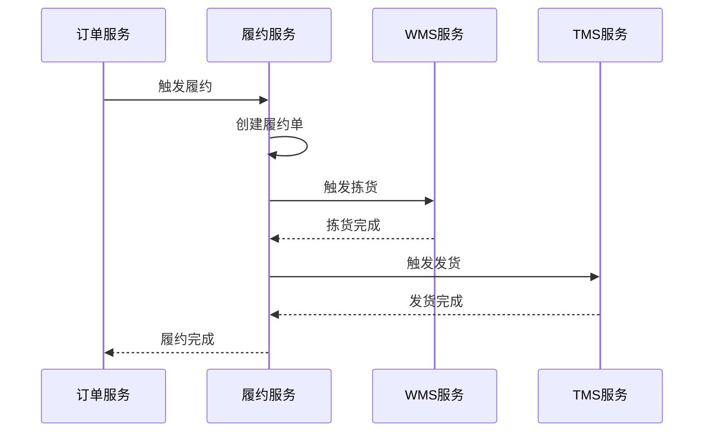
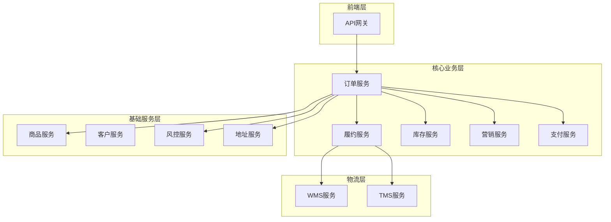
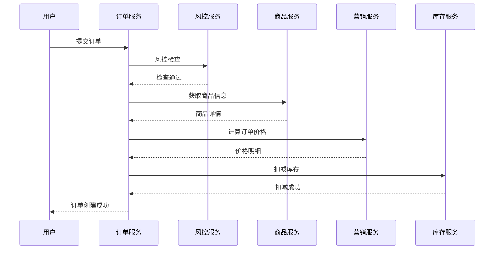
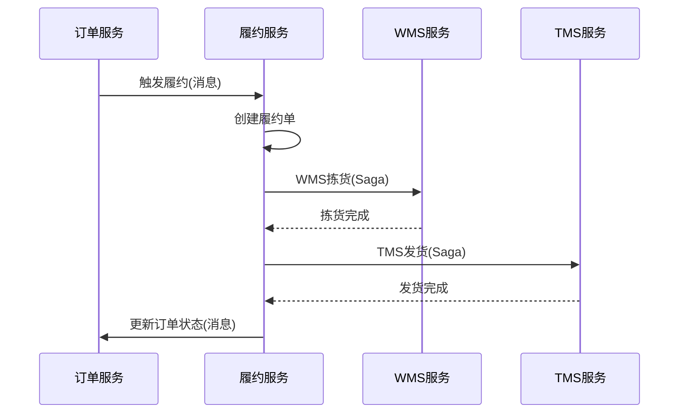
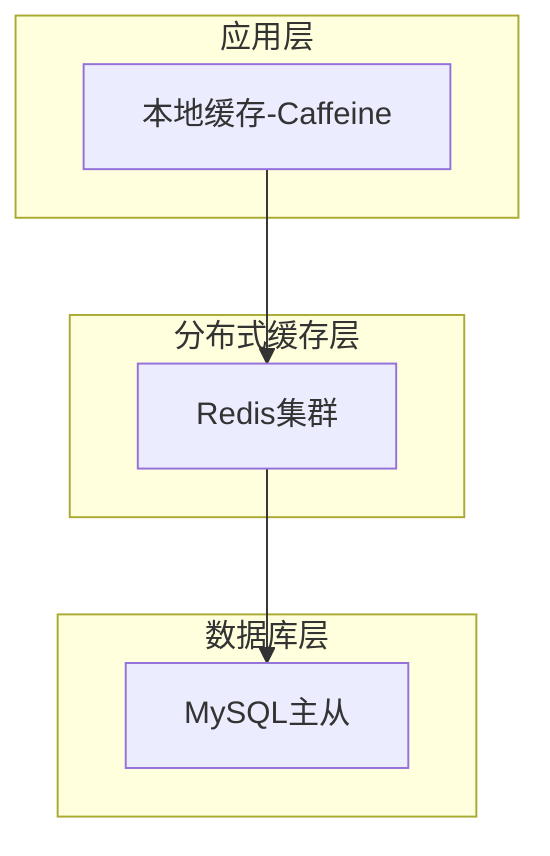
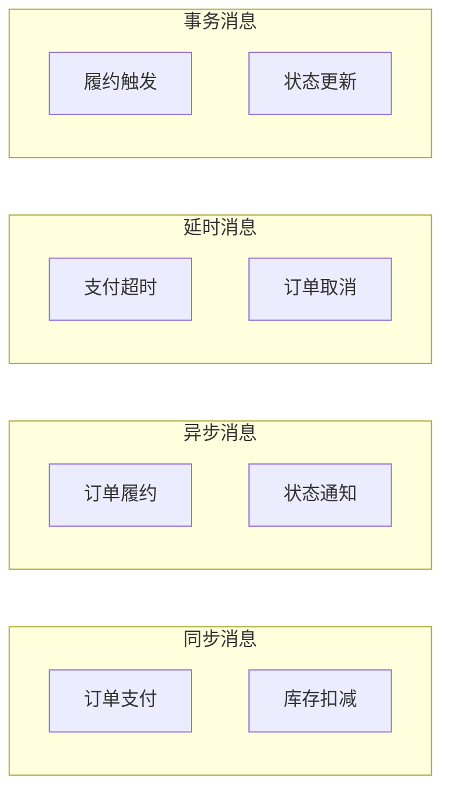

# 如意订单系统模块汇总说明

## 1. 模块概览

如意订单系统采用微服务架构，共包含12个核心服务模块，每个模块负责特定的业务领域，通过Dubbo进行服务治理和通信。

### 1.1 服务模块清单

| 序号 | 服务模块 | 主要职责 | 文档状态 | 技术特点 |
|------|----------|----------|----------|----------|
| 1 | 订单服务 | 订单生命周期管理 | ✅ 已完成 | 分布式事务、状态机、分布式锁 |
| 2 | 履约服务 | 订单履约流程编排 | ✅ 已完成 | Saga事务、状态机编排、补偿机制 |
| 3 | 库存服务 | 商品库存管理 | ✅ 已完成 | TCC事务、双存储、防超卖 |
| 4 | 营销服务 | 价格计算和优惠券 | ✅ 已完成 | 分摊算法、策略模式、精确计算 |
| 5 | 支付服务 | 支付处理 | 📝 待完善 | 支付网关、异步回调、幂等处理 |
| 6 | 商品服务 | 商品信息管理 | 📝 待完善 | 缓存策略、数据同步 |
| 7 | 风控服务 | 风险控制 | 📝 待完善 | 规则引擎、实时计算 |
| 8 | 地址服务 | 地址管理 | 📝 待完善 | 地理编码、区域管理 |
| 9 | WMS服务 | 仓储管理 | 📝 待完善 | 拣货流程、库位管理 |
| 10 | TMS服务 | 运输管理 | 📝 待完善 | 物流跟踪、配送优化 |
| 11 | 客户服务 | 用户管理 | 📝 待完善 | 用户画像、权限管理 |
| 12 | 网关服务 | API网关 | 📝 待完善 | 路由转发、限流熔断 |

## 2. 核心模块深度分析

### 2.1 订单服务模块 ⭐⭐⭐⭐⭐

**核心价值**：订单系统的中枢，负责整个订单生命周期管理

**技术亮点**：
- **分布式事务**：使用Seata AT模式保证数据一致性
- **分布式锁**：Redisson多锁机制防止并发问题
- **状态机管理**：清晰的订单状态流转控制
- **消息驱动**：基于RocketMQ的异步处理
- **建造者模式**：优雅构建复杂订单数据

**关键业务流程**：


**技术难点**：
- 分布式事务一致性保证
- 高并发下的性能优化
- 复杂业务规则的状态管理
- 异常场景的补偿机制

### 2.2 履约服务模块 ⭐⭐⭐⭐

**核心价值**：协调WMS和TMS完成订单履约，确保订单顺利交付

**技术亮点**：
- **Saga分布式事务**：适合长流程业务的事务管理
- **状态机编排**：JSON配置化的业务流程定义
- **补偿机制**：完善的异常处理和回滚逻辑
- **事件驱动**：基于消息队列的异步协调

**核心流程**：


**设计精粹**：
- 建造者模式构建履约数据
- 策略模式处理不同物流事件
- 分布式锁保证幂等性
- Saga模式的补偿机制

### 2.3 库存服务模块 ⭐⭐⭐⭐⭐

**核心价值**：精确的库存管理，防止超卖，保证库存数据一致性

**技术亮点**：
- **TCC分布式事务**：MySQL和Redis的强一致性保证
- **双存储架构**：兼顾性能和可靠性
- **防超卖机制**：分布式锁+乐观锁+原子操作
- **幂等设计**：多层次的幂等性保证

**核心算法**：
```java
// TCC Try阶段：扣减销售库存
UPDATE product_stock 
SET sale_stock_quantity = sale_stock_quantity - #{saleQuantity}
WHERE sku_code = #{skuCode} 
AND sale_stock_quantity >= #{saleQuantity}

// TCC Commit阶段：增加已销售库存
UPDATE product_stock 
SET saled_stock_quantity = saled_stock_quantity + #{saleQuantity}
WHERE sku_code = #{skuCode}
```

**技术难点**：
- 高并发下的超卖防护
- MySQL和Redis数据一致性
- TCC事务的空回滚和悬挂问题
- 缓存穿透和雪崩防护

### 2.4 营销服务模块 ⭐⭐⭐⭐

**核心价值**：精确的价格计算和优惠券管理，确保营销活动的准确执行

**技术亮点**：
- **精确分摊算法**：数学准确的优惠券分摊机制
- **策略模式**：支持多种优惠策略的灵活扩展
- **多维运费计算**：支持按件数、重量、体积计费
- **并发安全**：优惠券使用的原子性保证

**分摊算法**：
```
商品分摊优惠金额 = 优惠券总额 × (商品金额 / 订单总金额)
最后商品承担分摊误差 = 优惠券总额 - 前面所有商品分摊总额
```

**算法特点**：
- O(n)时间复杂度，性能优秀
- 向上取整+误差调整，确保分摊准确
- 支持任意数量商品的分摊计算

## 3. 服务间协作模式

### 3.1 服务调用关系图



### 3.2 数据流转模式

#### 3.2.1 订单创建数据流


#### 3.2.2 订单履约数据流


## 4. 技术架构分析

### 4.1 分布式事务策略

| 场景 | 事务模式 | 适用服务 | 特点 |
|------|----------|----------|------|
| 短事务 | AT模式 | 订单服务 | 简单易用，性能好 |
| 长事务 | Saga模式 | 履约服务 | 适合长流程，补偿机制完善 |
| 强一致性 | TCC模式 | 库存服务 | 强一致性，性能较好 |
| 最终一致性 | 事务消息 | 跨服务通信 | 异步处理，高性能 |

### 4.2 缓存策略设计

#### 4.2.1 多级缓存架构


#### 4.2.2 缓存应用场景
- **商品信息缓存**：热点商品数据，TTL=1小时
- **库存数据缓存**：实时库存信息，TTL=10分钟
- **用户信息缓存**：用户基础信息，TTL=30分钟
- **优惠券缓存**：活动优惠券信息，TTL=1小时

### 4.3 消息队列架构

#### 4.3.1 消息类型分类


#### 4.3.2 消息主题设计
| 主题名称 | 消息类型 | 生产者 | 消费者 | 用途 |
|----------|----------|--------|--------|------|
| order-paid-success | 普通消息 | 支付服务 | 履约服务 | 支付成功通知 |
| order-fulfill-trigger | 事务消息 | 订单服务 | 履约服务 | 履约触发 |
| order-status-change | 普通消息 | 订单服务 | 通知服务 | 状态变更通知 |
| order-timeout-cancel | 延时消息 | 订单服务 | 订单服务 | 支付超时取消 |

## 5. 性能优化策略

### 5.1 数据库优化

#### 5.1.1 索引优化
```sql
-- 订单表核心索引
CREATE INDEX idx_order_user_status ON order_info(user_id, order_status, gmt_create);
CREATE INDEX idx_order_status_time ON order_info(order_status, gmt_create);

-- 库存表核心索引  
CREATE UNIQUE INDEX uk_product_stock_sku ON product_stock(sku_code);
CREATE INDEX idx_stock_quantity ON product_stock(sale_stock_quantity);

-- 优惠券表核心索引
CREATE INDEX idx_coupon_user_status ON coupon(user_id, used, gmt_create);
```

#### 5.1.2 分表分库策略
- **订单表**：按用户ID哈希分表，单表500万数据
- **订单条目表**：按订单ID分表，与订单表保持一致
- **库存日志表**：按时间分表，月表存储
- **支付记录表**：按支付时间分表，便于对账

### 5.2 缓存优化

#### 5.2.1 缓存预热策略
```java
@Component
public class CacheWarmupService {
    
    @PostConstruct
    public void warmupCache() {
        // 预热热点商品缓存
        warmupHotProducts();
        
        // 预热活跃用户缓存
        warmupActiveUsers();
        
        // 预热优惠券配置缓存
        warmupCouponConfigs();
    }
}
```

#### 5.2.2 缓存更新策略
- **主动更新**：数据变更时主动删除相关缓存
- **被动更新**：缓存过期时重新加载
- **异步更新**：通过消息队列异步更新缓存

### 5.3 服务调用优化

#### 5.3.1 批量调用
```java
// 批量获取商品信息，减少网络调用
List<ProductSkuDTO> productSkus = productApi.batchGetProductSkus(skuCodes);

// 批量扣减库存，提高性能
Boolean result = inventoryApi.batchDeductStock(deductRequests);
```

#### 5.3.2 异步调用
```java
// 异步发送通知，不阻塞主流程
CompletableFuture.runAsync(() -> {
    notificationService.sendOrderNotification(orderId);
});
```

## 6. 监控与运维

### 6.1 监控指标体系

#### 6.1.1 业务指标
- **订单量指标**：创建量、支付量、完成量、取消率
- **库存指标**：扣减成功率、超卖次数、库存准确性
- **营销指标**：优惠券使用率、价格计算准确性
- **履约指标**：履约成功率、平均履约时长

#### 6.1.2 技术指标
- **服务指标**：QPS、RT、错误率、可用性
- **数据库指标**：连接数、慢查询、锁等待
- **缓存指标**：命中率、过期率、内存使用率
- **消息队列指标**：生产速率、消费速率、积压量

### 6.2 告警机制

#### 6.2.1 告警规则
```yaml
alerts:
  - name: 订单创建失败率过高
    condition: order.create.failure.rate > 0.05
    duration: 5m
    severity: critical
    
  - name: 库存扣减失败
    condition: inventory.deduct.failure.rate > 0.01
    duration: 2m
    severity: warning
    
  - name: 支付回调延迟
    condition: payment.callback.delay > 30s
    duration: 1m
    severity: warning
```

## 7. 系统扩展性分析

### 7.1 水平扩展能力

#### 7.1.1 无状态服务
所有业务服务都设计为无状态，支持水平扩展：
- 订单服务：可根据负载动态扩缩容
- 库存服务：支持按商品维度分片扩展
- 营销服务：支持按用户维度分片扩展

#### 7.1.2 数据分片策略
```java
// 订单分片策略
public class OrderShardingStrategy implements ShardingStrategy {
    
    @Override
    public String getShardingKey(String userId) {
        return "order_" + (userId.hashCode() % 16);
    }
}
```

### 7.2 功能扩展能力

#### 7.2.1 新增营销策略
```java
// 新增拼团优惠策略
@Component
public class GroupBuyDiscountStrategy implements DiscountStrategy {
    
    @Override
    public Integer calculateDiscount(DiscountContext context) {
        // 拼团优惠计算逻辑
        return calculateGroupBuyDiscount(context);
    }
    
    @Override
    public DiscountTypeEnum getDiscountType() {
        return DiscountTypeEnum.GROUP_BUY;
    }
}
```

#### 7.2.2 新增支付方式
```java
// 新增数字货币支付
@Component
public class CryptocurrencyPaymentHandler implements PaymentHandler {
    
    @Override
    public PaymentResult processPayment(PaymentRequest request) {
        // 数字货币支付处理逻辑
        return processCryptocurrencyPayment(request);
    }
    
    @Override
    public PaymentTypeEnum getPaymentType() {
        return PaymentTypeEnum.CRYPTOCURRENCY;
    }
}
```

## 8. 总结与展望

### 8.1 系统优势

**架构优势**：
- ✅ 微服务架构，服务职责清晰，易于维护和扩展
- ✅ 分布式事务保证数据一致性，支持复杂业务场景
- ✅ 消息驱动架构，异步处理提升系统性能
- ✅ 多级缓存架构，显著提升系统响应速度

**技术优势**：
- ✅ 成熟的技术栈选型，稳定可靠
- ✅ 完善的监控和告警体系
- ✅ 灵活的扩展机制，支持业务快速迭代
- ✅ 丰富的设计模式应用，代码质量高

**业务优势**：
- ✅ 支持复杂的电商业务场景
- ✅ 精确的价格计算和库存管理
- ✅ 完整的订单生命周期管理
- ✅ 灵活的营销策略支持

### 8.2 持续改进方向

**技术改进**：
- 🔄 引入更先进的分布式事务解决方案
- 🔄 优化缓存策略，提升缓存命中率
- 🔄 完善服务治理，增强系统稳定性
- 🔄 引入机器学习，优化业务决策

**业务改进**：
- 🔄 支持更多营销玩法（拼团、砍价、秒杀）
- 🔄 增强个性化推荐能力
- 🔄 优化物流配送算法
- 🔄 完善风控规则引擎

如意订单系统通过精心设计的微服务架构和先进的技术方案，构建了一个高性能、高可用、易扩展的电商订单处理平台，为业务发展提供了坚实的技术基础。
