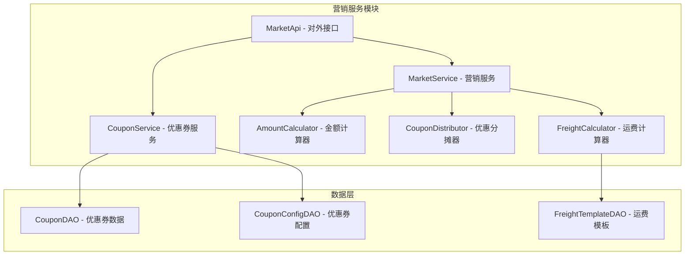
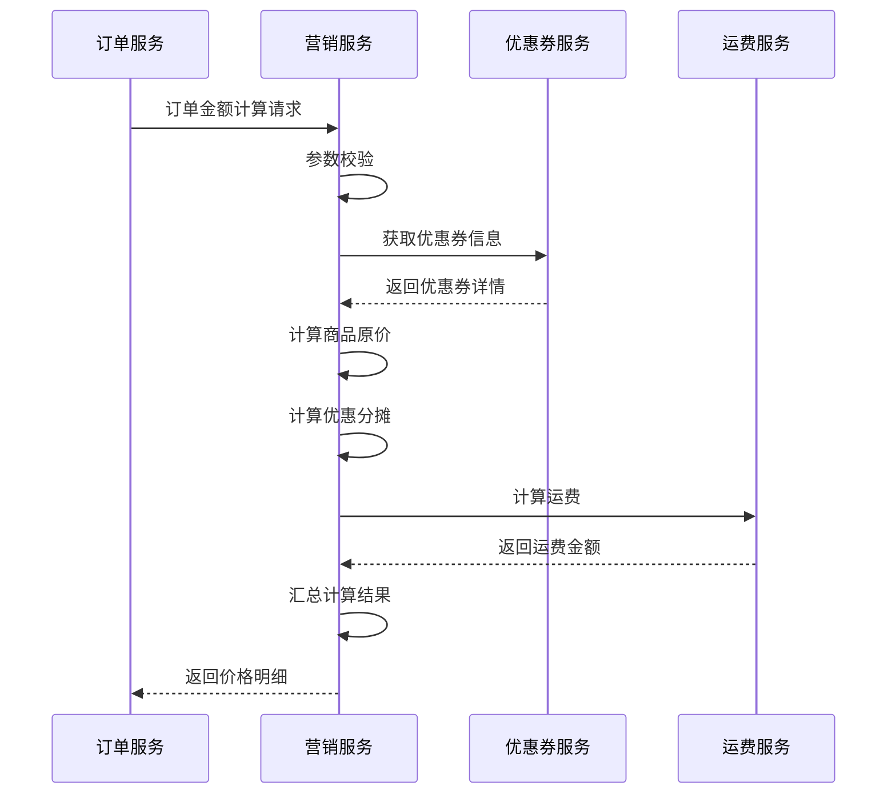

# 营销服务模块详解

## 1. 模块概述

营销服务模块是订单系统中负责价格计算和优惠券管理的核心组件，主要处理订单金额计算、优惠券分摊、运费计算等营销相关功能。该模块通过精确的算法确保订单价格计算的准确性，并提供灵活的优惠券使用机制。

### 1.1 模块职责
- **订单金额计算**：计算订单原价、优惠金额、实付金额
- **优惠券管理**：优惠券锁定、释放、使用状态管理
- **优惠分摊算法**：多商品订单的优惠券分摊计算
- **运费计算**：基于地区和订单金额的运费计算
- **价格策略**：支持多种营销策略和价格规则

### 1.2 模块架构


## 2. 核心业务流程

### 2.1 订单金额计算流程

#### 2.1.1 计算流程图


#### 2.1.2 金额计算核心逻辑
```java
@Override
public CalculateOrderAmountDTO calculateOrderAmount(CalculateOrderAmountRequest calculateOrderAmountRequest) {
    // 1. 检查入参
    this.checkCalculateOrderAmountRequest(calculateOrderAmountRequest);
    
    String orderId = calculateOrderAmountRequest.getOrderId();
    String userId = calculateOrderAmountRequest.getUserId();
    String couponId = calculateOrderAmountRequest.getCouponId();
    String regionId = calculateOrderAmountRequest.getRegionId();
    
    // 2. 获取优惠券抵扣金额
    Integer discountAmount = 0;
    if(StringUtils.isNotEmpty(couponId)) {
        // 锁定优惠券
        CouponDO couponDO = getCouponAchieve(userId, couponId);
        discountAmount = couponDO.getAmount();
    }
    
    // 3. 原订单费用信息
    List<CalculateOrderAmountDTO.OrderAmountDTO> orderAmountList = ObjectUtil.convertList(
            calculateOrderAmountRequest.getOrderAmountRequestList(),
            CalculateOrderAmountDTO.OrderAmountDTO.class, orderAmountDTO -> {
                orderAmountDTO.setOrderId(orderId);
            });
    
    // 4. 订单条目费用信息
    List<CalculateOrderAmountDTO.OrderAmountDetailDTO> orderAmountDetailDTOList = new ArrayList<>();
    List<CalculateOrderAmountRequest.OrderItemRequest> orderItemRequestList =
            calculateOrderAmountRequest.getOrderItemRequestList();
    
    // 5. 先统计全部商品费用
    int totalProductAmount = 0;
    for(CalculateOrderAmountRequest.OrderItemRequest orderItemRequest : orderItemRequestList) {
        totalProductAmount += orderItemRequest.getSalePrice() * orderItemRequest.getSaleQuantity();
    }
    
    // 6. 执行优惠券分摊算法
    distributeCouponDiscount(orderItemRequestList, discountAmount, totalProductAmount, 
                            orderAmountDetailDTOList, orderId);
    
    // 7. 重新计算订单各项金额
    recalculateOrderAmounts(orderAmountDetailDTOList, orderAmountList);
    
    // 8. 计算运费并加入总金额
    addShippingAmount(regionId, orderAmountList);
    
    CalculateOrderAmountDTO calculateOrderAmountDTO = new CalculateOrderAmountDTO();
    calculateOrderAmountDTO.setOrderAmountList(orderAmountList);
    calculateOrderAmountDTO.setOrderAmountDetail(orderAmountDetailDTOList);
    return calculateOrderAmountDTO;
}
```

### 2.2 优惠券分摊算法

#### 2.2.1 分摊算法原理
优惠券分摊是营销模块的核心算法，用于将整单优惠券合理分摊到各个商品条目上。

**算法规则**：
1. 按商品金额占比分摊优惠券
2. 遇到小数向上取整
3. 最后一个商品承担分摊误差

**计算公式**：
```
商品分摊优惠金额 = 优惠券总额 × (商品金额 / 订单总金额)
```

#### 2.2.2 分摊算法实现
```java
/**
 * 优惠券分摊算法
 * 
 * 假设订单有两个商品条目记录，分摊优惠券的规则如下：
 * 商品1: 单价1000分, 购买数量10, 小计10000分
 * 商品2: 单价100分, 购买数量1, 小计100分
 * 整单优惠券抵扣5元，也就是500分
 * 
 * 则商品1分摊的优惠券抵扣金额为：
 * 500 * (1000 * 10) / ((1000 * 10) + (100 * 1)) = 500 * 10000 / 10100 = 495分
 * 
 * 商品2分摊的优惠券抵扣金额为：
 * 500 - 495 = 5分
 */
private void distributeCouponDiscount(List<CalculateOrderAmountRequest.OrderItemRequest> orderItemRequestList,
                                    Integer discountAmount, int totalProductAmount,
                                    List<CalculateOrderAmountDTO.OrderAmountDetailDTO> orderAmountDetailDTOList,
                                    String orderId) {
    
    int index = 0;
    int totalNum = orderItemRequestList.size();
    Integer notLastItemTotalDiscountAmount = 0;
    
    for(CalculateOrderAmountRequest.OrderItemRequest orderItemRequest : orderItemRequestList) {
        // 1. 计算订单条目支付原价
        CalculateOrderAmountDTO.OrderAmountDetailDTO originPayAmountDetail =
                createOrderAmountDetailDTO(orderId,
                        AmountTypeEnum.ORIGIN_PAY_AMOUNT.getCode(),
                        null,
                        null,
                        orderItemRequest);
        orderAmountDetailDTOList.add(originPayAmountDetail);
        
        // 2. 计算优惠券抵扣金额
        CalculateOrderAmountDTO.OrderAmountDetailDTO couponDiscountAmountDetail;
        if(++index < totalNum) {
            // 非最后一个商品：按比例分摊
            double partDiscountAmount = Integer.valueOf(discountAmount
                    * orderItemRequest.getSalePrice() * orderItemRequest.getSaleQuantity()).doubleValue()
                    / Integer.valueOf(totalProductAmount).doubleValue();
            
            // 遇到小数则向上取整
            double curDiscountAmount = Math.ceil(partDiscountAmount);
            couponDiscountAmountDetail =
                    createOrderAmountDetailDTO(orderId,
                            AmountTypeEnum.COUPON_DISCOUNT_AMOUNT.getCode(),
                            Double.valueOf(curDiscountAmount).intValue(),
                            null,
                            orderItemRequest);
            
            notLastItemTotalDiscountAmount += couponDiscountAmountDetail.getAmount();
        } else {
            // 最后一个商品：承担分摊误差
            couponDiscountAmountDetail =
                    createOrderAmountDetailDTO(orderId,
                            AmountTypeEnum.COUPON_DISCOUNT_AMOUNT.getCode(),
                            discountAmount - notLastItemTotalDiscountAmount,
                            null,
                            orderItemRequest);
        }
        orderAmountDetailDTOList.add(couponDiscountAmountDetail);
        
        // 3. 计算实付金额
        Integer realPayAmount = originPayAmountDetail.getAmount() - couponDiscountAmountDetail.getAmount();
        CalculateOrderAmountDTO.OrderAmountDetailDTO realPayAmountDetail =
                createOrderAmountDetailDTO(orderId,
                        AmountTypeEnum.REAL_PAY_AMOUNT.getCode(),
                        null,
                        realPayAmount,
                        orderItemRequest);
        orderAmountDetailDTOList.add(realPayAmountDetail);
    }
}
```

#### 2.2.3 分摊算法示例
```java
/**
 * 优惠券分摊算法示例
 */
public class CouponDistributionExample {
    
    public void demonstrateDistribution() {
        // 订单商品信息
        List<OrderItem> items = Arrays.asList(
            new OrderItem("SKU001", 1000, 10), // 商品1: 单价10元, 数量10, 小计100元
            new OrderItem("SKU002", 100, 1),   // 商品2: 单价1元, 数量1, 小计1元
            new OrderItem("SKU003", 500, 2)    // 商品3: 单价5元, 数量2, 小计10元
        );
        
        // 优惠券金额：5元 = 500分
        Integer couponAmount = 500;
        
        // 订单总金额：111元 = 11100分
        Integer totalAmount = items.stream()
            .mapToInt(item -> item.getPrice() * item.getQuantity())
            .sum();
        
        System.out.println("=== 优惠券分摊计算 ===");
        System.out.println("优惠券金额: " + couponAmount + "分");
        System.out.println("订单总金额: " + totalAmount + "分");
        
        // 执行分摊计算
        List<Integer> distributedAmounts = new ArrayList<>();
        Integer accumulatedDiscount = 0;
        
        for (int i = 0; i < items.size(); i++) {
            OrderItem item = items.get(i);
            Integer itemAmount = item.getPrice() * item.getQuantity();
            
            if (i < items.size() - 1) {
                // 非最后一个商品：按比例分摊并向上取整
                double proportion = (double) itemAmount / totalAmount;
                double distributedAmount = couponAmount * proportion;
                Integer finalAmount = (int) Math.ceil(distributedAmount);
                
                distributedAmounts.add(finalAmount);
                accumulatedDiscount += finalAmount;
                
                System.out.println(String.format("商品%d - SKU: %s, 金额: %d分, 占比: %.4f, 分摊: %d分", 
                    i+1, item.getSku(), itemAmount, proportion, finalAmount));
            } else {
                // 最后一个商品：承担分摊误差
                Integer finalAmount = couponAmount - accumulatedDiscount;
                distributedAmounts.add(finalAmount);
                
                double proportion = (double) itemAmount / totalAmount;
                System.out.println(String.format("商品%d - SKU: %s, 金额: %d分, 占比: %.4f, 分摊: %d分(误差调整)", 
                    i+1, item.getSku(), itemAmount, proportion, finalAmount));
            }
        }
        
        // 验证分摊结果
        Integer totalDistributed = distributedAmounts.stream().mapToInt(Integer::intValue).sum();
        System.out.println("分摊总额: " + totalDistributed + "分");
        System.out.println("分摊准确性: " + (totalDistributed.equals(couponAmount) ? "✓" : "✗"));
    }
    
    static class OrderItem {
        private String sku;
        private Integer price;
        private Integer quantity;
        
        public OrderItem(String sku, Integer price, Integer quantity) {
            this.sku = sku;
            this.price = price;
            this.quantity = quantity;
        }
        
        // getters...
    }
}
```

### 2.3 运费计算机制

#### 2.3.1 运费计算逻辑
```java
/**
 * 计算订单运费
 * @param regionId 区域ID
 * @param orderAmountMap 订单费用
 * @return 运费金额
 */
private Integer calculateOrderShippingAmount(String regionId,
                                           Map<Integer, CalculateOrderAmountDTO.OrderAmountDTO> orderAmountMap) {
    // 1. 查找运费模板
    FreightTemplateDO freightTemplateDO = freightTemplateDAO.getByRegionId(regionId);
    
    Integer shippingAmount;
    Integer conditionAmount;
    
    if(freightTemplateDO != null) {
        // 使用地区专属运费模板
        shippingAmount = freightTemplateDO.getShippingAmount();
        conditionAmount = freightTemplateDO.getConditionAmount();
    } else {
        // 使用默认运费配置
        shippingAmount = MarketConstant.DEFAULT_SHIPPING_AMOUNT;
        conditionAmount = MarketConstant.DEFAULT_CONDITION_AMOUNT;
    }
    
    // 2. 获取订单原价
    Integer originPayAmount = 0;
    if(orderAmountMap.get(AmountTypeEnum.ORIGIN_PAY_AMOUNT.getCode()) != null) {
        originPayAmount = orderAmountMap.get(AmountTypeEnum.ORIGIN_PAY_AMOUNT.getCode()).getAmount();
    }
    
    // 3. 判断是否满足免运费条件
    if(originPayAmount >= conditionAmount) {
        shippingAmount = 0; // 满额免运费
    }
    
    return shippingAmount;
}
```

#### 2.3.2 运费模板设计
```java
@Data
@TableName("freight_template")
public class FreightTemplateDO {
    
    @TableId(value = "id", type = IdType.AUTO)
    private Long id;
    
    /**
     * 模板名称
     */
    private String templateName;
    
    /**
     * 地区ID
     */
    private String regionId;
    
    /**
     * 地区名称
     */
    private String regionName;
    
    /**
     * 运费金额（分）
     */
    private Integer shippingAmount;
    
    /**
     * 免运费条件金额（分）
     */
    private Integer conditionAmount;
    
    /**
     * 计费方式：1-按件数，2-按重量，3-按体积
     */
    private Integer chargingMethod;
    
    /**
     * 首件数/首重/首体积
     */
    private Integer firstUnit;
    
    /**
     * 首费（分）
     */
    private Integer firstFee;
    
    /**
     * 续件数/续重/续体积
     */
    private Integer additionalUnit;
    
    /**
     * 续费（分）
     */
    private Integer additionalFee;
    
    /**
     * 是否启用：0-禁用，1-启用
     */
    private Integer enabled;
    
    /**
     * 创建时间
     */
    private Date gmtCreate;
    
    /**
     * 更新时间
     */
    private Date gmtModified;
}
```

## 3. 优惠券管理

### 3.1 优惠券数据模型

#### 3.1.1 优惠券配置表
```java
@Data
@TableName("coupon_config")
public class CouponConfigDO {
    
    @TableId(value = "id", type = IdType.AUTO)
    private Long id;
    
    /**
     * 优惠券配置ID
     */
    private String couponConfigId;
    
    /**
     * 优惠券名称
     */
    private String name;
    
    /**
     * 优惠券类型：1-满减券，2-折扣券，3-立减券
     */
    private Integer type;
    
    /**
     * 优惠金额（分）
     */
    private Integer amount;
    
    /**
     * 使用条件金额（分）
     */
    private Integer conditionAmount;
    
    /**
     * 有效开始时间
     */
    private Date validStartTime;
    
    /**
     * 有效结束时间
     */
    private Date validEndTime;
    
    /**
     * 发行总量
     */
    private Integer totalCount;
    
    /**
     * 已发行数量
     */
    private Integer issuedCount;
    
    /**
     * 每人限领数量
     */
    private Integer limitPerUser;
    
    /**
     * 状态：0-禁用，1-启用
     */
    private Integer status;
    
    /**
     * 创建时间
     */
    private Date gmtCreate;
    
    /**
     * 更新时间
     */
    private Date gmtModified;
}
```

#### 3.1.2 用户优惠券表
```java
@Data
@TableName("coupon")
public class CouponDO {
    
    @TableId(value = "id", type = IdType.AUTO)
    private Long id;
    
    /**
     * 优惠券ID
     */
    private String couponId;
    
    /**
     * 优惠券配置ID
     */
    private String couponConfigId;
    
    /**
     * 用户ID
     */
    private String userId;
    
    /**
     * 优惠券金额（分）
     */
    private Integer amount;
    
    /**
     * 使用状态：0-未使用，1-已使用
     */
    private Integer used;
    
    /**
     * 使用时间
     */
    private Date usedTime;
    
    /**
     * 获得时间
     */
    private Date receivedTime;
    
    /**
     * 创建时间
     */
    private Date gmtCreate;
    
    /**
     * 更新时间
     */
    private Date gmtModified;
}
```

### 3.2 优惠券服务实现

#### 3.2.1 获取用户优惠券
```java
@Override
public UserCouponDTO getUserCoupon(UserCouponQuery userCouponQuery) {
    // 1. 入参检查
    String userId = userCouponQuery.getUserId();
    String couponId = userCouponQuery.getCouponId();
    ParamCheckUtil.checkStringNonEmpty(userId);
    ParamCheckUtil.checkStringNonEmpty(couponId);
    
    // 2. 判断用户优惠券是否存在
    CouponDO couponDO = couponDAO.getUserCoupon(userId, couponId);
    if (couponDO == null) {
        throw new MarketBizException(MarketErrorCodeEnum.USER_COUPON_IS_NULL);
    }
    String couponConfigId = couponDO.getCouponConfigId();
    
    // 3. 判断优惠券活动配置信息是否存在
    CouponConfigDO couponConfigDO = couponConfigDAO.getByCouponConfigId(couponConfigId);
    if (couponConfigDO == null) {
        throw new MarketBizException(MarketErrorCodeEnum.USER_COUPON_CONFIG_IS_NULL);
    }
    
    // 4. 组装返回数据
    UserCouponDTO userCouponDTO = new UserCouponDTO();
    userCouponDTO.setUserId(userId);
    userCouponDTO.setCouponConfigId(couponConfigId);
    userCouponDTO.setCouponId(couponId);
    userCouponDTO.setName(couponConfigDO.getName());
    userCouponDTO.setType(couponConfigDO.getType());
    userCouponDTO.setAmount(couponConfigDO.getAmount());
    userCouponDTO.setConditionAmount(couponConfigDO.getConditionAmount());
    userCouponDTO.setValidStartTime(couponConfigDO.getValidStartTime());
    userCouponDTO.setValidEndTime(couponConfigDO.getValidEndTime());
    
    return userCouponDTO;
}
```

#### 3.2.2 锁定用户优惠券
```java
/**
 * 锁定用户优惠券
 * 在订单创建时调用，防止优惠券被重复使用
 */
@Transactional(rollbackFor = Exception.class)
@Override
public Boolean lockUserCoupon(LockUserCouponRequest lockUserCouponRequest) {
    // 1. 检查入参
    checkLockUserCouponRequest(lockUserCouponRequest);
    
    String userId = lockUserCouponRequest.getUserId();
    String couponId = lockUserCouponRequest.getCouponId();
    
    // 2. 查询用户优惠券
    CouponDO couponDO = couponDAO.getUserCoupon(userId, couponId);
    if (couponDO == null) {
        throw new MarketBizException(MarketErrorCodeEnum.USER_COUPON_IS_NULL);
    }
    
    // 3. 判断优惠券是否已经使用了
    if (CouponUsedStatusEnum.USED.getCode().equals(couponDO.getUsed())) {
        throw new MarketBizException(MarketErrorCodeEnum.USER_COUPON_IS_USED);
    }
    
    // 4. 更新优惠券状态为已使用
    couponDO.setUsed(CouponUsedStatusEnum.USED.getCode());
    couponDO.setUsedTime(new Date());
    couponDAO.updateById(couponDO);
    
    log.info("锁定用户优惠券成功，userId={}, couponId={}", userId, couponId);
    return true;
}
```

#### 3.2.3 释放用户优惠券
```java
/**
 * 释放用户优惠券
 * 在订单取消时调用，恢复优惠券可用状态
 */
@Override
public Boolean releaseUserCoupon(ReleaseUserCouponRequest releaseUserCouponRequest) {
    String userId = releaseUserCouponRequest.getUserId();
    String couponId = releaseUserCouponRequest.getCouponId();
    
    // 1. 查询用户优惠券
    CouponDO couponAchieve = couponDAO.getUserCoupon(userId, couponId);
    if (couponAchieve == null) {
        throw new MarketBizException(MarketErrorCodeEnum.USER_COUPON_IS_NULL);
    }
    
    // 2. 恢复优惠券状态为未使用
    couponAchieve.setUsed(CouponUsedStatusEnum.UN_USED.getCode());
    couponAchieve.setUsedTime(null);
    couponDAO.updateById(couponAchieve);
    
    log.info("释放用户优惠券成功，userId={}, couponId={}", userId, couponId);
    return true;
}
```

## 4. 价格计算引擎

### 4.1 金额类型枚举
```java
public enum AmountTypeEnum {
    
    /**
     * 订单支付原价
     */
    ORIGIN_PAY_AMOUNT(1, "订单支付原价"),
    
    /**
     * 优惠券抵扣金额
     */
    COUPON_DISCOUNT_AMOUNT(2, "优惠券抵扣金额"),
    
    /**
     * 积分抵扣金额
     */
    POINT_DISCOUNT_AMOUNT(3, "积分抵扣金额"),
    
    /**
     * 实付金额
     */
    REAL_PAY_AMOUNT(4, "实付金额"),
    
    /**
     * 运费
     */
    SHIPPING_AMOUNT(5, "运费");
    
    private Integer code;
    private String msg;
    
    AmountTypeEnum(Integer code, String msg) {
        this.code = code;
        this.msg = msg;
    }
    
    // getters...
}
```

### 4.2 价格计算器设计

#### 4.2.1 抽象价格计算器
```java
public abstract class AbstractPriceCalculator {
    
    /**
     * 计算价格
     */
    public abstract PriceCalculationResult calculate(PriceCalculationContext context);
    
    /**
     * 校验计算结果
     */
    protected void validateResult(PriceCalculationResult result) {
        if (result.getTotalAmount() < 0) {
            throw new MarketBizException("计算结果不能为负数");
        }
        
        if (!result.getTotalAmount().equals(result.getOriginAmount() - result.getDiscountAmount())) {
            throw new MarketBizException("价格计算结果不一致");
        }
    }
}
```

#### 4.2.2 订单价格计算器
```java
@Component
public class OrderPriceCalculator extends AbstractPriceCalculator {
    
    @Autowired
    private CouponService couponService;
    
    @Autowired
    private FreightCalculator freightCalculator;
    
    @Override
    public PriceCalculationResult calculate(PriceCalculationContext context) {
        PriceCalculationResult result = new PriceCalculationResult();
        
        // 1. 计算商品原价
        Integer originAmount = calculateOriginAmount(context.getOrderItems());
        result.setOriginAmount(originAmount);
        
        // 2. 计算优惠券抵扣
        Integer discountAmount = calculateDiscountAmount(context);
        result.setDiscountAmount(discountAmount);
        
        // 3. 计算运费
        Integer shippingAmount = freightCalculator.calculate(context.getRegionId(), originAmount);
        result.setShippingAmount(shippingAmount);
        
        // 4. 计算实付金额
        Integer totalAmount = originAmount - discountAmount + shippingAmount;
        result.setTotalAmount(totalAmount);
        
        // 5. 校验计算结果
        validateResult(result);
        
        return result;
    }
    
    private Integer calculateOriginAmount(List<OrderItem> orderItems) {
        return orderItems.stream()
            .mapToInt(item -> item.getPrice() * item.getQuantity())
            .sum();
    }
    
    private Integer calculateDiscountAmount(PriceCalculationContext context) {
        if (StringUtils.isEmpty(context.getCouponId())) {
            return 0;
        }
        
        UserCouponQuery query = new UserCouponQuery();
        query.setUserId(context.getUserId());
        query.setCouponId(context.getCouponId());
        
        UserCouponDTO coupon = couponService.getUserCoupon(query);
        
        // 检查使用条件
        if (context.getOriginAmount() < coupon.getConditionAmount()) {
            throw new MarketBizException("订单金额不满足优惠券使用条件");
        }
        
        return coupon.getAmount();
    }
}
```

### 4.3 价格计算上下文
```java
@Data
public class PriceCalculationContext {
    
    /**
     * 用户ID
     */
    private String userId;
    
    /**
     * 订单ID
     */
    private String orderId;
    
    /**
     * 优惠券ID
     */
    private String couponId;
    
    /**
     * 地区ID
     */
    private String regionId;
    
    /**
     * 订单商品列表
     */
    private List<OrderItem> orderItems;
    
    /**
     * 订单原价
     */
    private Integer originAmount;
    
    /**
     * 计算时间
     */
    private Date calculateTime;
}
```

## 5. 营销策略扩展

### 5.1 策略模式应用

#### 5.1.1 优惠策略接口
```java
public interface DiscountStrategy {
    
    /**
     * 计算优惠金额
     */
    Integer calculateDiscount(DiscountContext context);
    
    /**
     * 获取策略类型
     */
    DiscountTypeEnum getDiscountType();
    
    /**
     * 校验使用条件
     */
    boolean validateCondition(DiscountContext context);
}
```

#### 5.1.2 满减券策略
```java
@Component
public class FullReductionStrategy implements DiscountStrategy {
    
    @Override
    public Integer calculateDiscount(DiscountContext context) {
        CouponConfigDO couponConfig = context.getCouponConfig();
        
        // 满减券直接返回优惠金额
        return couponConfig.getAmount();
    }
    
    @Override
    public DiscountTypeEnum getDiscountType() {
        return DiscountTypeEnum.FULL_REDUCTION;
    }
    
    @Override
    public boolean validateCondition(DiscountContext context) {
        CouponConfigDO couponConfig = context.getCouponConfig();
        Integer orderAmount = context.getOrderAmount();
        
        // 检查是否满足使用条件
        return orderAmount >= couponConfig.getConditionAmount();
    }
}
```

#### 5.1.3 折扣券策略
```java
@Component
public class PercentageDiscountStrategy implements DiscountStrategy {
    
    @Override
    public Integer calculateDiscount(DiscountContext context) {
        CouponConfigDO couponConfig = context.getCouponConfig();
        Integer orderAmount = context.getOrderAmount();
        
        // 折扣券按比例计算优惠金额
        double discountRate = couponConfig.getAmount() / 100.0; // amount存储折扣比例，如85表示8.5折
        Integer discountAmount = (int) Math.round(orderAmount * (1 - discountRate / 10));
        
        return discountAmount;
    }
    
    @Override
    public DiscountTypeEnum getDiscountType() {
        return DiscountTypeEnum.PERCENTAGE_DISCOUNT;
    }
    
    @Override
    public boolean validateCondition(DiscountContext context) {
        CouponConfigDO couponConfig = context.getCouponConfig();
        Integer orderAmount = context.getOrderAmount();
        
        return orderAmount >= couponConfig.getConditionAmount();
    }
}
```

#### 5.1.4 策略工厂
```java
@Component
public class DiscountStrategyFactory {
    
    private final Map<DiscountTypeEnum, DiscountStrategy> strategyMap;
    
    public DiscountStrategyFactory(List<DiscountStrategy> strategies) {
        this.strategyMap = strategies.stream()
            .collect(Collectors.toMap(
                DiscountStrategy::getDiscountType,
                Function.identity()
            ));
    }
    
    public DiscountStrategy getStrategy(DiscountTypeEnum discountType) {
        DiscountStrategy strategy = strategyMap.get(discountType);
        if (strategy == null) {
            throw new MarketBizException("不支持的优惠策略类型: " + discountType);
        }
        return strategy;
    }
}
```

## 6. 技术亮点分析

### 6.1 精确的分摊算法

#### 6.1.1 设计优势
- **数学精确性**：通过向上取整和误差调整确保分摊准确
- **业务合理性**：按商品金额占比分摊，符合业务逻辑
- **扩展性好**：支持任意数量的商品条目
- **性能优化**：算法复杂度为O(n)，性能优秀

#### 6.1.2 算法验证
```java
@Component
public class CouponDistributionValidator {
    
    /**
     * 验证分摊算法的准确性
     */
    public boolean validateDistribution(List<Integer> distributedAmounts, Integer totalCouponAmount) {
        // 1. 验证分摊总额是否等于优惠券总额
        Integer totalDistributed = distributedAmounts.stream()
            .mapToInt(Integer::intValue)
            .sum();
        
        if (!totalDistributed.equals(totalCouponAmount)) {
            log.error("分摊总额不等于优惠券总额, distributed={}, coupon={}", 
                     totalDistributed, totalCouponAmount);
            return false;
        }
        
        // 2. 验证没有负数分摊
        boolean hasNegative = distributedAmounts.stream()
            .anyMatch(amount -> amount < 0);
        
        if (hasNegative) {
            log.error("存在负数分摊金额");
            return false;
        }
        
        log.info("优惠券分摊验证通过");
        return true;
    }
}
```

### 6.2 策略模式应用

#### 6.2.1 设计优势
- **扩展性**：易于添加新的优惠策略
- **可维护性**：每种策略独立实现，职责清晰
- **可测试性**：每种策略可以独立测试
- **灵活性**：运行时动态选择策略

### 6.3 运费计算机制

#### 6.3.1 多维度计费支持
```java
public enum ChargingMethodEnum {
    
    BY_QUANTITY(1, "按件数计费"),
    BY_WEIGHT(2, "按重量计费"),
    BY_VOLUME(3, "按体积计费");
    
    private Integer code;
    private String description;
    
    // 构造器和getter方法
}
```

#### 6.3.2 灵活的运费计算
```java
@Component
public class FlexibleFreightCalculator {
    
    public Integer calculateFreight(FreightCalculationRequest request) {
        FreightTemplateDO template = request.getFreightTemplate();
        ChargingMethodEnum method = ChargingMethodEnum.getByCode(template.getChargingMethod());
        
        switch (method) {
            case BY_QUANTITY:
                return calculateByQuantity(request);
            case BY_WEIGHT:
                return calculateByWeight(request);
            case BY_VOLUME:
                return calculateByVolume(request);
            default:
                throw new MarketBizException("不支持的计费方式");
        }
    }
    
    private Integer calculateByQuantity(FreightCalculationRequest request) {
        FreightTemplateDO template = request.getFreightTemplate();
        Integer totalQuantity = request.getTotalQuantity();
        
        if (totalQuantity <= template.getFirstUnit()) {
            return template.getFirstFee();
        }
        
        Integer additionalQuantity = totalQuantity - template.getFirstUnit();
        Integer additionalUnits = (int) Math.ceil((double) additionalQuantity / template.getAdditionalUnit());
        
        return template.getFirstFee() + additionalUnits * template.getAdditionalFee();
    }
    
    // calculateByWeight 和 calculateByVolume 的实现...
}
```

## 7. 技术难点与解决方案

### 7.1 分摊精度问题

#### 7.1.1 问题描述
优惠券分摊到商品时可能出现小数，需要确保分摊总额等于优惠券金额。

#### 7.1.2 解决方案
- **向上取整**：非最后商品分摊金额向上取整
- **误差调整**：最后一个商品承担分摊误差
- **验证机制**：分摊后验证总额是否正确

### 7.2 并发安全问题

#### 7.2.1 问题描述
多个订单同时使用同一张优惠券可能导致重复使用。

#### 7.2.2 解决方案
```java
@Transactional(rollbackFor = Exception.class)
public Boolean lockUserCoupon(LockUserCouponRequest request) {
    // 使用数据库行锁防止并发
    CouponDO coupon = couponDAO.selectForUpdate(request.getUserId(), request.getCouponId());
    
    if (CouponUsedStatusEnum.USED.getCode().equals(coupon.getUsed())) {
        throw new MarketBizException(MarketErrorCodeEnum.USER_COUPON_IS_USED);
    }
    
    // 原子性更新状态
    coupon.setUsed(CouponUsedStatusEnum.USED.getCode());
    coupon.setUsedTime(new Date());
    couponDAO.updateById(coupon);
    
    return true;
}
```

### 7.3 价格计算一致性

#### 7.3.1 问题描述
多次计算同一订单可能出现不同结果，影响业务一致性。

#### 7.3.2 解决方案
- **幂等设计**：相同输入保证相同输出
- **快照机制**：保存计算结果快照
- **版本控制**：优惠券和商品价格版本化

## 8. 监控与运维

### 8.1 营销指标监控

#### 8.1.1 业务指标
```java
@Component
public class MarketingMetrics {
    
    private final Counter priceCalculationCounter;
    private final Timer priceCalculationTimer;
    private final Counter couponUsageCounter;
    private final Gauge activeCouponGauge;
    
    public MarketingMetrics(MeterRegistry meterRegistry) {
        this.priceCalculationCounter = Counter.builder("marketing.price.calculation")
            .description("价格计算次数")
            .register(meterRegistry);
            
        this.priceCalculationTimer = Timer.builder("marketing.price.calculation.duration")
            .description("价格计算耗时")
            .register(meterRegistry);
            
        this.couponUsageCounter = Counter.builder("marketing.coupon.usage")
            .description("优惠券使用次数")
            .register(meterRegistry);
            
        this.activeCouponGauge = Gauge.builder("marketing.coupon.active")
            .description("活跃优惠券数量")
            .register(meterRegistry, this, MarketingMetrics::getActiveCouponCount);
    }
    
    public void recordPriceCalculation(Duration duration, boolean success) {
        priceCalculationCounter.increment(Tags.of("result", success ? "success" : "failure"));
        priceCalculationTimer.record(duration);
    }
    
    public void recordCouponUsage(String couponType) {
        couponUsageCounter.increment(Tags.of("type", couponType));
    }
    
    private Double getActiveCouponCount() {
        // 返回当前活跃优惠券数量
        return activeCouponService.getActiveCouponCount().doubleValue();
    }
}
```

### 8.2 价格计算监控

#### 8.2.1 计算结果审计
```java
@Component
public class PriceCalculationAuditor {
    
    @Autowired
    private PriceCalculationLogDAO priceCalculationLogDAO;
    
    @EventListener
    public void auditPriceCalculation(PriceCalculationEvent event) {
        PriceCalculationLogDO log = new PriceCalculationLogDO();
        log.setOrderId(event.getOrderId());
        log.setUserId(event.getUserId());
        log.setCouponId(event.getCouponId());
        log.setOriginAmount(event.getOriginAmount());
        log.setDiscountAmount(event.getDiscountAmount());
        log.setShippingAmount(event.getShippingAmount());
        log.setTotalAmount(event.getTotalAmount());
        log.setCalculationTime(new Date());
        
        priceCalculationLogDAO.save(log);
        
        // 异常检测
        if (event.getTotalAmount() < 0) {
            sendPriceCalculationAlert(event);
        }
    }
    
    private void sendPriceCalculationAlert(PriceCalculationEvent event) {
        AlertMessage alert = AlertMessage.builder()
            .title("价格计算异常")
            .content(String.format("订单: %s, 计算结果为负数: %d", 
                                 event.getOrderId(), event.getTotalAmount()))
            .level(AlertLevel.HIGH)
            .build();
            
        alertService.sendAlert(alert);
    }
}
```

## 总结

营销服务模块作为订单系统的定价核心，具有以下特点：

**技术亮点**：
1. **精确分摊算法**：确保优惠券分摊的数学准确性
2. **策略模式应用**：支持多种优惠策略的灵活扩展
3. **多维度运费计算**：支持按件数、重量、体积等多种计费方式
4. **完善的验证机制**：多层次的数据一致性保证

**设计精粹**：
1. **算法优化**：O(n)复杂度的分摊算法，性能优秀
2. **扩展性设计**：易于添加新的营销策略和计算规则
3. **并发安全**：通过数据库锁保证优惠券使用的原子性
4. **监控完善**：全面的业务指标和异常监控

**业务价值**：
1. **精确计价**：确保每笔订单的价格计算准确无误
2. **营销灵活**：支持多种营销策略和优惠方式
3. **用户体验**：合理的优惠分摊提升用户满意度
4. **风险控制**：防止优惠券重复使用和价格计算错误

营销服务模块通过精确的算法设计和完善的策略模式，为订单系统提供了可靠、灵活、高性能的价格计算和营销管理能力。
