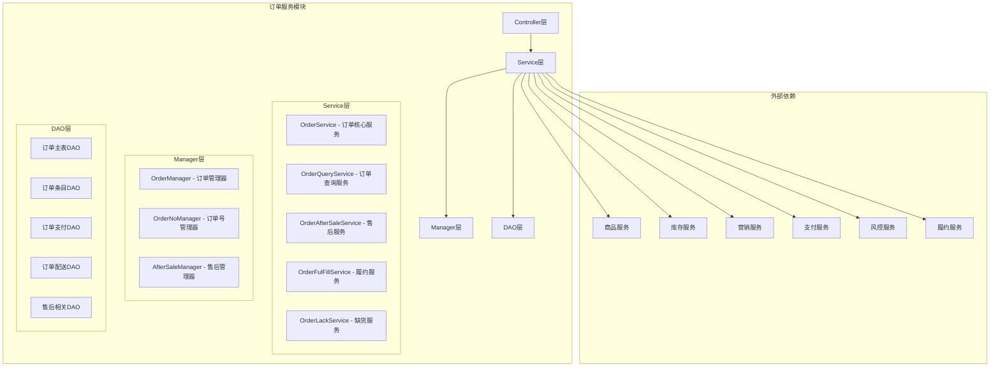
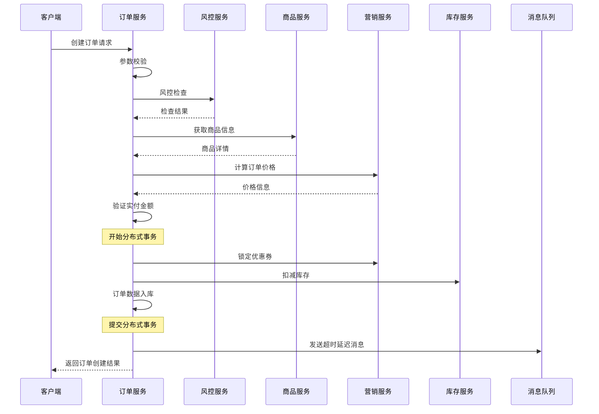

# 订单服务模块详解

## 1. 模块概述

订单服务是整个电商系统的核心模块，负责处理订单的完整生命周期管理，包括订单创建、支付、履约、配送、签收、售后等各个环节。

### 1.1 模块职责
- **订单管理**：订单创建、查询、修改、取消
- **支付管理**：预支付、支付回调、退款处理
- **状态管理**：订单状态流转控制
- **售后管理**：退货退款、换货处理
- **数据同步**：与其他服务的数据同步

### 1.2 模块架构


## 2. 核心组件详解

### 2.1 订单核心服务 (OrderService)

#### 2.1.1 服务接口定义
```java
public interface OrderService {
    /**
     * 生成订单号
     */
    GenOrderIdDTO genOrderId(GenOrderIdRequest genOrderIdRequest);
    
    /**
     * 创建订单
     */
    CreateOrderDTO createOrder(CreateOrderRequest createOrderRequest);
    
    /**
     * 预支付订单
     */
    PrePayOrderDTO prePayOrder(PrePayOrderRequest prePayOrderRequest);
    
    /**
     * 支付回调
     */
    void payCallback(PayCallbackRequest payCallbackRequest);
    
    /**
     * 移除订单
     */
    boolean removeOrders(List<String> orderIds);
    
    /**
     * 调整配送地址
     */
    boolean adjustDeliveryAddress(AdjustDeliveryAddressRequest request);
}
```

#### 2.1.2 订单创建核心逻辑
```java
@Override
public CreateOrderDTO createOrder(CreateOrderRequest createOrderRequest) {
    // 1、入参检查 - 严格的参数校验
    checkCreateOrderRequestParam(createOrderRequest);

    // 2、风控检查 - 防止恶意订单
    checkRisk(createOrderRequest);

    // 3、获取商品信息 - 验证商品有效性
    List<ProductSkuDTO> productSkuList = listProductSkus(createOrderRequest);

    // 4、计算订单价格 - 营销计算
    CalculateOrderAmountDTO calculateOrderAmountDTO = calculateOrderAmount(createOrderRequest, productSkuList);

    // 5、验证订单实付金额 - 防止前端篡改
    checkRealPayAmount(createOrderRequest, calculateOrderAmountDTO);

    // 6、生成订单（分布式事务）
    createOrder(createOrderRequest, productSkuList, calculateOrderAmountDTO);

    // 7、发送支付超时延迟消息
    sendPayOrderTimeoutDelayMessage(createOrderRequest);

    return new CreateOrderDTO(createOrderRequest.getOrderId());
}
```

**技术亮点**：
1. **严格的参数校验**：多层次参数验证，防止无效数据
2. **风控集成**：实时风控检查，防范欺诈订单
3. **价格验证**：前后端价格一致性校验，防止篡改
4. **分布式事务**：使用Seata保证数据一致性
5. **异步处理**：延迟消息处理超时取消

#### 2.1.3 支付回调处理
```java
@Override
public void payCallback(PayCallbackRequest payCallbackRequest) {
    String orderId = payCallbackRequest.getOrderId();
    
    // 多重分布式锁防止并发
    List<String> redisKeyList = Lists.newArrayList();
    payCallbackMultiLock(redisKeyList, orderId);
    
    try {
        // 幂等性判断
        if (PayStatusEnum.PAID.getCode().equals(orderPaymentDetailDO.getPayStatus())) {
            if (payType.equals(orderPaymentDetailDO.getPayType())) {
                return; // 重复回调直接返回
            }
        }
        
        // 根据订单状态执行不同逻辑
        Integer orderStatus = orderInfoDO.getOrderStatus();
        if (OrderStatusEnum.CREATED.getCode().equals(orderStatus)) {
            // 正常支付流程
            doPayCallback(payCallbackRequest, orderInfoDO, orderPaymentDetailDO, orderId);
        } else if(OrderStatusEnum.CANCELED.getCode().equals(orderStatus)) {
            // 已取消订单的支付处理
            payCallbackCancel(orderInfoDO, orderPaymentDetailDO, payType);
        } else {
            // 其他状态的退款处理
            payCallbackRefund(orderInfoDO, orderPaymentDetailDO);
        }
    } finally {
        redisLock.unMultiLock(redisKeyList);
    }
}
```

**技术难点**：
1. **并发控制**：多重分布式锁防止支付和取消并发
2. **幂等处理**：防止重复支付回调
3. **状态判断**：根据订单状态执行不同逻辑
4. **异常处理**：完善的异常情况处理机制

### 2.2 订单管理器 (OrderManager)

#### 2.2.1 分布式事务订单创建
```java
@Override
@GlobalTransactional(rollbackFor = Exception.class)
public void createOrder(CreateOrderRequest createOrderRequest, 
                       List<ProductSkuDTO> productSkuList, 
                       CalculateOrderAmountDTO calculateOrderAmountDTO) {
    // 1. 锁定优惠券
    lockUserCoupon(createOrderRequest);
    
    // 2. 扣减库存
    deductProductStock(createOrderRequest);
    
    // 3. 生成订单到数据库
    addNewOrder(createOrderRequest, productSkuList, calculateOrderAmountDTO);
}
```

**设计精粹**：
- **原子操作**：三个关键操作要么全成功，要么全失败
- **资源锁定**：优惠券锁定和库存扣减防止超卖
- **数据一致性**：Seata保证分布式事务一致性

#### 2.2.2 复杂订单数据构建
```java
private void addNewOrder(CreateOrderRequest createOrderRequest, 
                        List<ProductSkuDTO> productSkuList, 
                        CalculateOrderAmountDTO calculateOrderAmountDTO) {
    
    NewOrderDataHolder newOrderDataHolder = new NewOrderDataHolder();
    
    // 生成主订单
    FullOrderData fullMasterOrderData = addNewMasterOrder(createOrderRequest, productSkuList, calculateOrderAmountDTO);
    newOrderDataHolder.appendOrderData(fullMasterOrderData);
    
    // 如果存在多种商品类型，需要按商品类型进行拆单
    Map<Integer, List<ProductSkuDTO>> productTypeMap = 
        productSkuList.stream().collect(Collectors.groupingBy(ProductSkuDTO::getProductType));
    
    if (productTypeMap.keySet().size() > 1) {
        for (Integer productType : productTypeMap.keySet()) {
            FullOrderData fullSubOrderData = addNewSubOrder(fullMasterOrderData, productType);
            newOrderDataHolder.appendOrderData(fullSubOrderData);
        }
    }
    
    // 批量保存所有订单数据
    batchSaveOrderData(newOrderDataHolder);
}
```

**技术亮点**：
1. **建造者模式**：复杂对象构建过程清晰
2. **自动拆单**：按商品类型自动拆分订单
3. **批量操作**：提高数据库写入性能
4. **数据完整性**：确保所有相关数据一致性

### 2.3 订单状态管理

#### 2.3.1 支付状态更新
```java
@Transactional(rollbackFor = Exception.class)
@Override
public void updateOrderStatusPaid(PayCallbackRequest payCallbackRequest,
                                  OrderInfoDO orderInfoDO,
                                  OrderPaymentDetailDO orderPaymentDetailDO) {
    // 更新主单信息
    updateOrderStatus(orderInfoDO, OrderStatusEnum.PAID.getCode());
    
    // 更新主单支付信息
    updateOrderPaymentDetail(orderPaymentDetailDO);
    
    // 新增订单状态变更日志
    saveOrderOperateLog(orderInfoDO.getOrderId(),
            orderInfoDO.getOrderStatus(), OrderStatusEnum.PAID.getCode());
    
    // 处理子订单状态
    handleSubOrdersPaid(orderInfoDO);
}
```

#### 2.3.2 RocketMQ事务消息集成
```java
private void doPayCallback(PayCallbackRequest payCallbackRequest,
                          OrderInfoDO orderInfoDO,
                          OrderPaymentDetailDO orderPaymentDetailDO,
                          String orderId) throws Exception {
    
    TransactionMQProducer transactionMQProducer = defaultProducer.getProducer();
    
    // 设置事务监听器
    setupPaidOrderSuccessMessageListener(transactionMQProducer, payCallbackRequest,
            orderInfoDO, orderPaymentDetailDO, orderId);
    
    // 发送事务消息
    sendPaidOrderSuccessMessage(transactionMQProducer, orderInfoDO);
}

private void setupPaidOrderSuccessMessageListener(TransactionMQProducer transactionMQProducer,
                                                  PayCallbackRequest payCallbackRequest,
                                                  OrderInfoDO orderInfoDO,
                                                  OrderPaymentDetailDO orderPaymentDetailDO,
                                                  String orderId) {
    transactionMQProducer.setTransactionListener(new TransactionListener() {
        
        @Override
        public LocalTransactionState executeLocalTransaction(Message message, Object o) {
            try {
                // 执行本地事务：更新订单状态
                orderManager.updateOrderStatusPaid(payCallbackRequest, orderInfoDO, orderPaymentDetailDO);
                return LocalTransactionState.COMMIT_MESSAGE;
            } catch (BaseBizException e) {
                throw e;
            } catch (Exception e) {
                log.error("system error", e);
                return LocalTransactionState.ROLLBACK_MESSAGE;
            }
        }
        
        @Override
        public LocalTransactionState checkLocalTransaction(MessageExt messageExt) {
            // 事务回查：检查订单是否已支付
            OrderInfoDO orderInfoDO = orderInfoDAO.getByOrderId(orderId);
            if(orderInfoDO != null && OrderStatusEnum.PAID.getCode().equals(orderInfoDO.getOrderStatus())) {
                return LocalTransactionState.COMMIT_MESSAGE;
            }
            return LocalTransactionState.ROLLBACK_MESSAGE;
        }
    });
}
```

**技术精粹**：
1. **最终一致性**：事务消息保证最终一致性
2. **事务回查**：自动检查本地事务状态
3. **异常处理**：完善的异常回滚机制

## 3. 数据模型设计

### 3.1 核心数据表

#### 3.1.1 订单主表 (order_info)
```sql
CREATE TABLE `order_info` (
  `id` bigint(20) NOT NULL AUTO_INCREMENT COMMENT '主键ID',
  `business_identifier` tinyint(4) NOT NULL COMMENT '业务线标识',
  `order_id` varchar(50) NOT NULL DEFAULT '' COMMENT '订单编号',
  `parent_order_id` varchar(50) DEFAULT NULL COMMENT '父订单编号',
  `business_order_id` varchar(50) DEFAULT NULL COMMENT '业务订单号',
  `order_type` tinyint(4) NOT NULL COMMENT '订单类型',
  `order_status` tinyint(4) NOT NULL COMMENT '订单状态',
  `cancel_type` varchar(255) DEFAULT NULL COMMENT '取消类型',
  `cancel_time` datetime DEFAULT NULL COMMENT '取消时间',
  `seller_id` varchar(50) DEFAULT NULL COMMENT '卖家编号',
  `user_id` varchar(50) DEFAULT NULL COMMENT '买家编号',
  `total_amount` int(11) DEFAULT NULL COMMENT '交易总金额',
  `pay_amount` int(11) DEFAULT NULL COMMENT '实付金额',
  `pay_type` tinyint(4) DEFAULT NULL COMMENT '支付方式',
  `coupon_id` varchar(50) DEFAULT NULL COMMENT '优惠券编号',
  `pay_time` datetime DEFAULT NULL COMMENT '支付时间',
  `expire_time` datetime NOT NULL COMMENT '支付截止时间',
  `user_remark` varchar(255) DEFAULT NULL COMMENT '用户备注',
  `delete_status` tinyint(4) NOT NULL COMMENT '删除状态',
  `comment_status` tinyint(4) NOT NULL DEFAULT '0' COMMENT '评论状态',
  `ext_json` varchar(1024) DEFAULT NULL COMMENT '扩展信息',
  `gmt_create` datetime NOT NULL COMMENT '创建时间',
  `gmt_modified` datetime NOT NULL COMMENT '更新时间',
  PRIMARY KEY (`id`) USING BTREE,
  UNIQUE KEY `idx_order_id` (`order_id`) USING BTREE,
  KEY `idx_user_status` (`user_id`, `order_status`),
  KEY `idx_status_time` (`order_status`, `gmt_create`)
) ENGINE=InnoDB DEFAULT CHARSET=utf8 COMMENT='订单表';
```

**设计要点**：
- **唯一约束**：订单号全局唯一
- **索引设计**：支持高效查询
- **状态字段**：支持完整的状态流转
- **扩展字段**：ext_json支持业务扩展

#### 3.1.2 订单条目表 (order_item)
```sql
CREATE TABLE `order_item` (
  `id` bigint(20) NOT NULL AUTO_INCREMENT COMMENT '主键ID',
  `order_id` varchar(50) NOT NULL COMMENT '订单编号',
  `order_item_id` varchar(50) NOT NULL COMMENT '订单明细编号',
  `product_type` tinyint(4) NOT NULL COMMENT '商品类型',
  `product_id` varchar(50) NOT NULL COMMENT '商品编号',
  `product_img` varchar(255) DEFAULT NULL COMMENT '商品图片',
  `product_name` varchar(50) NOT NULL COMMENT '商品名称',
  `sku_code` varchar(50) NOT NULL COMMENT 'sku编码',
  `sale_quantity` int(11) NOT NULL COMMENT '销售数量',
  `sale_price` int(11) NOT NULL COMMENT '销售单价',
  `origin_amount` int(11) NOT NULL COMMENT '原始总价',
  `pay_amount` int(11) NOT NULL COMMENT '实付金额',
  `product_unit` varchar(10) NOT NULL COMMENT '商品单位',
  `purchase_price` int(11) DEFAULT NULL COMMENT '采购成本价',
  `seller_id` varchar(50) DEFAULT NULL COMMENT '卖家编号',
  `gmt_create` datetime NOT NULL COMMENT '创建时间',
  `gmt_modified` datetime NOT NULL COMMENT '更新时间',
  PRIMARY KEY (`id`) USING BTREE,
  KEY `idx_order_id` (`order_id`) USING BTREE,
  KEY `idx_sku_code` (`sku_code`)
) ENGINE=InnoDB DEFAULT CHARSET=utf8 COMMENT='订单条目表';
```

### 3.2 数据快照设计

#### 3.2.1 订单快照表 (order_snapshot)
```sql
CREATE TABLE `order_snapshot` (
  `id` bigint(20) NOT NULL AUTO_INCREMENT COMMENT '主键ID',
  `order_id` varchar(50) NOT NULL COMMENT '订单号',
  `snapshot_type` tinyint(4) unsigned NOT NULL COMMENT '快照类型',
  `snapshot_json` varchar(2000) NOT NULL COMMENT '快照内容',
  `gmt_create` datetime NOT NULL COMMENT '创建时间',
  `gmt_modified` datetime NOT NULL COMMENT '更新时间',
  PRIMARY KEY (`id`) USING BTREE,
  KEY `idx_order_id` (`order_id`) USING BTREE
) ENGINE=InnoDB DEFAULT CHARSET=utf8 COMMENT='订单快照表';
```

**快照类型**：
```java
public enum SnapshotTypeEnum {
    ORDER_COUPON(1, "订单优惠券快照"),
    ORDER_AMOUNT(2, "订单费用快照"),
    ORDER_ITEM(3, "订单条目快照")
}
```

**设计精粹**：
- **数据保护**：防止外部数据变更影响订单
- **历史追溯**：保留订单创建时的数据状态
- **审计需要**：满足财务和法务审计要求

## 4. 业务流程设计

### 4.1 订单创建流程

#### 4.1.1 流程时序图


#### 4.1.2 关键节点处理
```java
// 1. 参数校验节点
private void checkCreateOrderRequestParam(CreateOrderRequest request) {
    // 基础参数校验
    ParamCheckUtil.checkObjectNonNull(request);
    ParamCheckUtil.checkStringNonEmpty(request.getOrderId(), OrderErrorCodeEnum.ORDER_ID_IS_NULL);
    
    // 业务规则校验
    if (BusinessIdentifierEnum.getByCode(request.getBusinessIdentifier()) == null) {
        throw new OrderBizException(OrderErrorCodeEnum.BUSINESS_IDENTIFIER_ERROR);
    }
    
    // 金额校验
    validateOrderAmounts(request.getOrderAmountRequestList());
    
    // 支付信息校验
    validatePaymentInfo(request.getPaymentRequestList());
}

// 2. 风控检查节点
private void checkRisk(CreateOrderRequest createOrderRequest) {
    CheckOrderRiskRequest checkOrderRiskRequest = createOrderRequest.clone(CheckOrderRiskRequest.class);
    JsonResult<CheckOrderRiskDTO> jsonResult = riskApi.checkOrderRisk(checkOrderRiskRequest);
    if (!jsonResult.getSuccess()) {
        throw new OrderBizException(jsonResult.getErrorCode(), jsonResult.getErrorMessage());
    }
}

// 3. 价格验证节点
private void checkRealPayAmount(CreateOrderRequest createOrderRequest, CalculateOrderAmountDTO calculateOrderAmountDTO) {
    Integer originRealPayAmount = getOriginRealPayAmount(createOrderRequest);
    Integer calculatedRealPayAmount = getCalculatedRealPayAmount(calculateOrderAmountDTO);
    
    if (!originRealPayAmount.equals(calculatedRealPayAmount)) {
        throw new OrderBizException(OrderErrorCodeEnum.ORDER_CHECK_REAL_PAY_AMOUNT_FAIL);
    }
}
```

### 4.2 支付回调流程

#### 4.2.1 支付回调处理逻辑
```java
@Override
public void payCallback(PayCallbackRequest payCallbackRequest) {
    String orderId = payCallbackRequest.getOrderId();
    
    // 1. 获取订单信息
    OrderInfoDO orderInfoDO = orderInfoDAO.getByOrderId(orderId);
    OrderPaymentDetailDO orderPaymentDetailDO = orderPaymentDetailDAO.getPaymentDetailByOrderId(orderId);
    
    // 2. 参数校验
    checkPayCallbackRequestParam(payCallbackRequest, orderInfoDO, orderPaymentDetailDO);
    
    // 3. 加分布式锁
    List<String> redisKeyList = Lists.newArrayList();
    payCallbackMultiLock(redisKeyList, orderId);
    
    try {
        // 4. 幂等性检查
        if (isAlreadyPaid(orderPaymentDetailDO, payCallbackRequest.getPayType())) {
            return;
        }
        
        // 5. 根据订单状态执行不同逻辑
        Integer orderStatus = orderInfoDO.getOrderStatus();
        if (OrderStatusEnum.CREATED.getCode().equals(orderStatus)) {
            doPayCallback(payCallbackRequest, orderInfoDO, orderPaymentDetailDO, orderId);
        } else if(OrderStatusEnum.CANCELED.getCode().equals(orderStatus)) {
            payCallbackCancel(orderInfoDO, orderPaymentDetailDO, payCallbackRequest.getPayType());
        } else {
            payCallbackRefund(orderInfoDO, orderPaymentDetailDO);
        }
    } finally {
        redisLock.unMultiLock(redisKeyList);
    }
}
```

## 5. 性能优化设计

### 5.1 数据库优化

#### 5.1.1 索引优化策略
```sql
-- 订单查询优化索引
CREATE INDEX idx_user_status_time ON order_info(user_id, order_status, gmt_create);
CREATE INDEX idx_status_time ON order_info(order_status, gmt_create);
CREATE INDEX idx_pay_time ON order_info(pay_time);

-- 订单条目查询优化
CREATE INDEX idx_order_product ON order_item(order_id, product_id);
CREATE INDEX idx_sku_time ON order_item(sku_code, gmt_create);

-- 支付信息查询优化
CREATE INDEX idx_order_pay_status ON order_payment_detail(order_id, pay_status);
CREATE INDEX idx_trade_no ON order_payment_detail(out_trade_no);
```

#### 5.1.2 分库分表策略
```java
// 订单分库分表配置
@Configuration
public class OrderShardingConfig {
    
    @Bean
    public DataSource getShardingDataSource() throws SQLException {
        ShardingRuleConfiguration shardingRuleConfig = new ShardingRuleConfiguration();
        
        // 订单主表分片规则
        TableRuleConfiguration orderTableRuleConfig = new TableRuleConfiguration("order_info");
        orderTableRuleConfig.setActualDataNodes("ds${0..3}.order_info_${0..15}");
        
        // 分库策略：按用户ID哈希
        orderTableRuleConfig.setDatabaseShardingStrategyConfig(
            new InlineShardingStrategyConfiguration("user_id", "ds${user_id.hashCode() % 4}"));
        
        // 分表策略：按订单ID哈希
        orderTableRuleConfig.setTableShardingStrategyConfig(
            new InlineShardingStrategyConfiguration("order_id", "order_info_${order_id.hashCode() % 16}"));
        
        shardingRuleConfig.getTableRuleConfigs().add(orderTableRuleConfig);
        
        // 绑定表配置（订单相关表使用相同分片键）
        shardingRuleConfig.getBindingTableGroups().add("order_info,order_item,order_payment_detail");
        
        return ShardingDataSourceFactory.createDataSource(createDataSourceMap(), shardingRuleConfig, new Properties());
    }
}
```

### 5.2 缓存优化

#### 5.2.1 多级缓存设计
```java
@Service
public class OrderCacheService {
    
    // L1缓存：本地缓存（Caffeine）
    private final Cache<String, OrderInfoDTO> localCache = Caffeine.newBuilder()
            .maximumSize(10000)
            .expireAfterWrite(Duration.ofMinutes(5))
            .build();
    
    // L2缓存：Redis缓存
    @Autowired
    private RedisTemplate<String, String> redisTemplate;
    
    public OrderInfoDTO getOrderInfo(String orderId) {
        // 1. 查询本地缓存
        OrderInfoDTO orderInfo = localCache.getIfPresent(orderId);
        if (orderInfo != null) {
            return orderInfo;
        }
        
        // 2. 查询Redis缓存
        String cacheKey = "order:info:" + orderId;
        String orderJson = redisTemplate.opsForValue().get(cacheKey);
        if (StringUtils.isNotEmpty(orderJson)) {
            orderInfo = JSON.parseObject(orderJson, OrderInfoDTO.class);
            // 异步写入本地缓存
            localCache.put(orderId, orderInfo);
            return orderInfo;
        }
        
        // 3. 查询数据库
        orderInfo = orderInfoDAO.getByOrderId(orderId);
        if (orderInfo != null) {
            // 写入Redis缓存
            redisTemplate.opsForValue().set(cacheKey, JSON.toJSONString(orderInfo), Duration.ofMinutes(30));
            // 写入本地缓存
            localCache.put(orderId, orderInfo);
        }
        
        return orderInfo;
    }
    
    // 缓存更新策略
    @CacheEvict(value = "orderInfo", key = "#orderId")
    public void evictOrderCache(String orderId) {
        // 删除本地缓存
        localCache.invalidate(orderId);
        
        // 删除Redis缓存
        String cacheKey = "order:info:" + orderId;
        redisTemplate.delete(cacheKey);
        
        // 发送缓存失效消息到其他节点
        CacheInvalidateMessage message = new CacheInvalidateMessage();
        message.setCacheKey(cacheKey);
        message.setOrderId(orderId);
        defaultProducer.sendMessage("CACHE_INVALIDATE_TOPIC", JSON.toJSONString(message));
    }
}
```

### 5.3 异步处理优化

#### 5.3.1 异步任务处理
```java
@Configuration
@EnableAsync
public class AsyncOrderConfig {
    
    @Bean("orderAsyncExecutor")
    public Executor orderAsyncExecutor() {
        ThreadPoolTaskExecutor executor = new ThreadPoolTaskExecutor();
        executor.setCorePoolSize(20);
        executor.setMaxPoolSize(50);
        executor.setQueueCapacity(200);
        executor.setKeepAliveSeconds(60);
        executor.setThreadNamePrefix("order-async-");
        executor.setRejectedExecutionHandler(new ThreadPoolExecutor.CallerRunsPolicy());
        executor.initialize();
        return executor;
    }
}

@Service
public class AsyncOrderProcessService {
    
    @Async("orderAsyncExecutor")
    public CompletableFuture<Void> asyncProcessOrderCreated(String orderId) {
        try {
            // 异步处理订单创建后的逻辑
            processOrderCreatedEvent(orderId);
            return CompletableFuture.completedFuture(null);
        } catch (Exception e) {
            log.error("异步处理订单创建事件失败, orderId: {}", orderId, e);
            return CompletableFuture.failedFuture(e);
        }
    }
    
    @Async("orderAsyncExecutor")
    public void asyncSendOrderNotification(String orderId, String userId) {
        try {
            // 异步发送订单通知
            notificationService.sendOrderCreatedNotification(orderId, userId);
        } catch (Exception e) {
            log.error("异步发送订单通知失败, orderId: {}", orderId, e);
        }
    }
}
```

## 6. 监控与运维

### 6.1 业务监控

#### 6.1.1 关键指标监控
```java
@Component
public class OrderBusinessMetrics {
    
    private final MeterRegistry meterRegistry;
    
    // 订单创建监控
    private final Counter orderCreateCounter;
    private final Timer orderCreateTimer;
    
    // 支付监控
    private final Counter orderPayCounter;
    private final Timer orderPayTimer;
    
    public OrderBusinessMetrics(MeterRegistry meterRegistry) {
        this.meterRegistry = meterRegistry;
        
        this.orderCreateCounter = Counter.builder("order.create.total")
            .description("订单创建总数")
            .register(meterRegistry);
            
        this.orderCreateTimer = Timer.builder("order.create.duration")
            .description("订单创建耗时")
            .register(meterRegistry);
            
        this.orderPayCounter = Counter.builder("order.pay.total")
            .description("订单支付总数")
            .register(meterRegistry);
            
        this.orderPayTimer = Timer.builder("order.pay.duration")
            .description("订单支付耗时")
            .register(meterRegistry);
    }
    
    public void recordOrderCreate(boolean success, Duration duration) {
        orderCreateCounter.increment(Tags.of("result", success ? "success" : "failure"));
        orderCreateTimer.record(duration);
    }
    
    public void recordOrderPay(boolean success, Duration duration) {
        orderPayCounter.increment(Tags.of("result", success ? "success" : "failure"));
        orderPayTimer.record(duration);
    }
}
```

#### 6.1.2 实时监控大盘
```java
@RestController
@RequestMapping("/monitor")
public class OrderMonitorController {
    
    @GetMapping("/dashboard")
    public OrderDashboardDTO getOrderDashboard() {
        OrderDashboardDTO dashboard = new OrderDashboardDTO();
        
        // 实时订单统计
        dashboard.setTotalOrdersToday(orderStatService.getTotalOrdersToday());
        dashboard.setPaidOrdersToday(orderStatService.getPaidOrdersToday());
        dashboard.setCanceledOrdersToday(orderStatService.getCanceledOrdersToday());
        
        // 实时金额统计
        dashboard.setTotalAmountToday(orderStatService.getTotalAmountToday());
        dashboard.setAvgOrderAmount(orderStatService.getAvgOrderAmount());
        
        // 成功率统计
        dashboard.setPaySuccessRate(orderStatService.getPaySuccessRate());
        dashboard.setFulfillSuccessRate(orderStatService.getFulfillSuccessRate());
        
        // 异常统计
        dashboard.setExceptionCount(orderExceptionService.getExceptionCountToday());
        dashboard.setTimeoutCount(orderTimeoutService.getTimeoutCountToday());
        
        return dashboard;
    }
}
```

### 6.2 告警机制

#### 6.2.1 异常告警
```java
@Component
public class OrderAlertService {
    
    @EventListener
    public void handleOrderException(OrderExceptionEvent event) {
        OrderBizException exception = event.getException();
        String orderId = event.getOrderId();
        
        // 根据异常类型判断告警级别
        AlertLevel level = determineAlertLevel(exception);
        
        // 发送告警
        AlertMessage alert = new AlertMessage();
        alert.setTitle("订单异常告警");
        alert.setContent(String.format("订单ID: %s, 异常信息: %s", orderId, exception.getMessage()));
        alert.setLevel(level);
        alert.setService("order-service");
        alert.setTimestamp(new Date());
        
        alertService.sendAlert(alert);
        
        // 记录异常统计
        exceptionMetrics.recordException(exception.getErrorCode());
    }
    
    private AlertLevel determineAlertLevel(OrderBizException exception) {
        String errorCode = exception.getErrorCode();
        
        // 高优先级异常
        if (errorCode.startsWith("PAY_") || 
            errorCode.startsWith("INVENTORY_") || 
            errorCode.equals("SYSTEM_ERROR")) {
            return AlertLevel.HIGH;
        }
        
        // 中优先级异常
        if (errorCode.startsWith("ORDER_") || 
            errorCode.startsWith("RISK_")) {
            return AlertLevel.MEDIUM;
        }
        
        return AlertLevel.LOW;
    }
}
```

## 7. 技术难点与解决方案

### 7.1 并发控制难点

**问题**：订单支付回调和订单取消可能并发执行，导致数据不一致。

**解决方案**：
```java
// 多重分布式锁机制
private void payCallbackMultiLock(List<String> redisKeyList, String orderId) {
    // 支付锁
    String orderPayKey = RedisLockKeyConstants.ORDER_PAY_KEY + orderId;
    // 取消锁
    String cancelOrderKey = RedisLockKeyConstants.CANCEL_KEY + orderId;
    
    redisKeyList.add(orderPayKey);
    redisKeyList.add(cancelOrderKey);
    
    boolean lock = redisLock.multiLock(redisKeyList);
    if (!lock) {
        throw new OrderBizException(OrderErrorCodeEnum.ORDER_PAY_CALLBACK_ERROR);
    }
}
```

### 7.2 分布式事务难点

**问题**：订单创建涉及多个服务，如何保证数据一致性。

**解决方案**：
```java
// Seata AT模式 + 事务消息
@GlobalTransactional(rollbackFor = Exception.class)
public void createOrder(CreateOrderRequest request) {
    // 本地事务
    orderManager.insertOrderData(request);
    
    // 远程事务
    inventoryApi.deductProductStock(request);
    marketApi.lockUserCoupon(request);
}

// 事务消息保证最终一致性
public void sendTransactionMessage(OrderInfoDO orderInfo) {
    TransactionMQProducer producer = defaultProducer.getProducer();
    producer.setTransactionListener(new OrderTransactionListener(orderInfo));
    
    Message message = new Message("ORDER_PAID_TOPIC", orderInfo.getOrderId().getBytes());
    producer.sendMessageInTransaction(message, orderInfo);
}
```

### 7.3 数据一致性难点

**问题**：订单快照数据如何保证与外部系统数据的一致性。

**解决方案**：
```java
// 订单快照机制
private void saveOrderSnapshot(String orderId, CalculateOrderAmountDTO calculateOrderAmountDTO) {
    List<OrderSnapshotDO> snapshots = new ArrayList<>();
    
    // 优惠券快照
    if (StringUtils.isNotEmpty(couponId)) {
        UserCouponDTO coupon = marketApi.getUserCoupon(couponId);
        OrderSnapshotDO couponSnapshot = new OrderSnapshotDO();
        couponSnapshot.setOrderId(orderId);
        couponSnapshot.setSnapshotType(SnapshotTypeEnum.ORDER_COUPON.getCode());
        couponSnapshot.setSnapshotJson(JSON.toJSONString(coupon));
        snapshots.add(couponSnapshot);
    }
    
    // 价格快照
    OrderSnapshotDO amountSnapshot = new OrderSnapshotDO();
    amountSnapshot.setOrderId(orderId);
    amountSnapshot.setSnapshotType(SnapshotTypeEnum.ORDER_AMOUNT.getCode());
    amountSnapshot.setSnapshotJson(JSON.toJSONString(calculateOrderAmountDTO.getOrderAmountList()));
    snapshots.add(amountSnapshot);
    
    // 商品快照
    OrderSnapshotDO itemSnapshot = new OrderSnapshotDO();
    itemSnapshot.setOrderId(orderId);
    itemSnapshot.setSnapshotType(SnapshotTypeEnum.ORDER_ITEM.getCode());
    itemSnapshot.setSnapshotJson(JSON.toJSONString(productSkuList));
    snapshots.add(itemSnapshot);
    
    orderSnapshotDAO.saveBatch(snapshots);
}
```

## 总结

订单服务模块作为电商系统的核心，具有以下特点：

**技术亮点**：
1. **分布式事务**：Seata + 事务消息双重保障
2. **并发控制**：多重分布式锁机制
3. **数据一致性**：快照机制保证数据不变性
4. **性能优化**：多级缓存 + 异步处理
5. **监控完善**：业务指标 + 异常告警

**设计精粹**：
1. **建造者模式**：复杂订单对象构建
2. **状态机模式**：订单状态流转控制
3. **策略模式**：不同业务场景处理
4. **观察者模式**：订单事件处理

**技术难点**：
1. **并发控制**：支付回调与订单取消的并发处理
2. **分布式事务**：多服务间的数据一致性保证
3. **性能优化**：大量订单的高效处理
4. **数据安全**：敏感信息的加密存储

通过这些技术手段和设计模式，订单服务模块实现了高可用、高性能、高一致性的订单处理能力。
