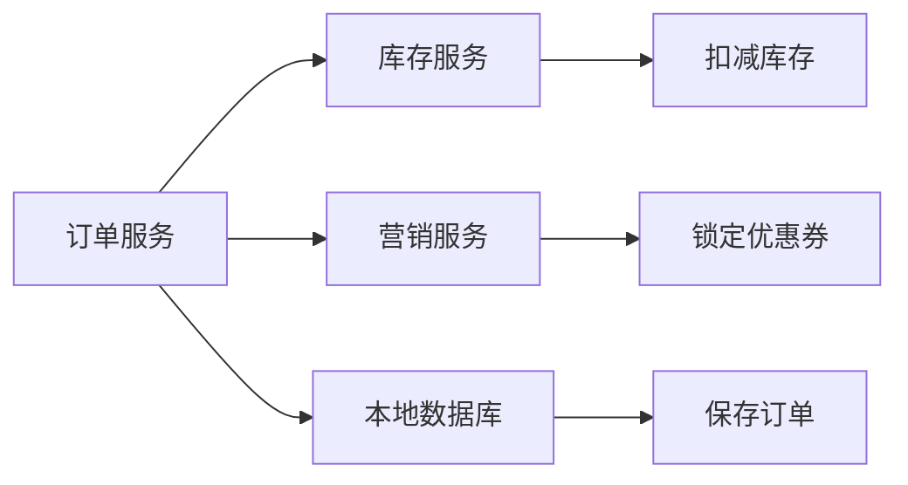
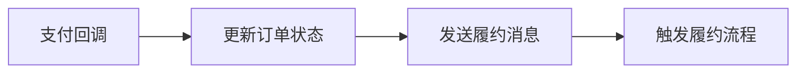
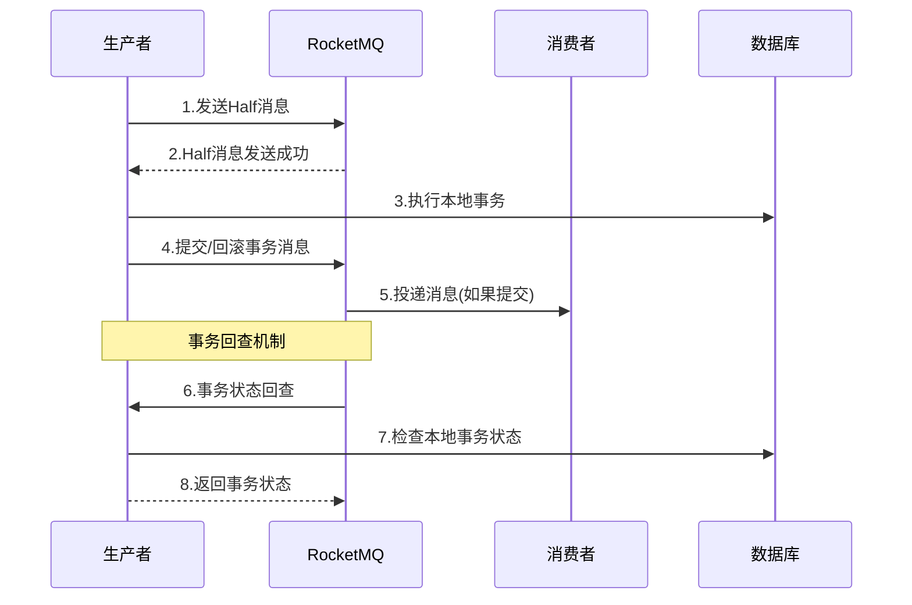

# 分布式事务设计

## 1. 分布式事务概述

在如意订单系统中，分布式事务是保证数据一致性的核心机制。系统采用了多种分布式事务解决方案，包括Seata AT模式、RocketMQ事务消息、以及基于Redis的补偿机制。

### 1.1 事务场景分析

#### 1.1.1 订单创建事务


**涉及的操作**：
- 订单服务：保存订单数据
- 库存服务：扣减商品库存
- 营销服务：锁定用户优惠券

#### 1.1.2 支付回调事务


**涉及的操作**：
- 更新订单支付状态
- 发送履约消息
- 触发后续业务流程

### 1.2 技术选型对比

| 方案 | 优点 | 缺点 | 适用场景 |
|------|------|------|----------|
| Seata AT | 对业务代码侵入小，支持回滚 | 性能开销大，依赖数据库 | 强一致性要求的短事务 |
| 事务消息 | 最终一致性，高性能 | 不支持回滚，编程复杂 | 异步处理，最终一致性 |
| Saga模式 | 灵活性高，支持长事务 | 编程复杂，需要补偿逻辑 | 长流程事务 |
| TCC模式 | 数据一致性强 | 编程复杂，业务侵入大 | 高一致性要求场景 |

## 2. Seata AT模式实现

### 2.1 Seata架构集成

#### 2.1.1 Seata配置
```yaml
# Seata配置
seata:
  enabled: true
  application-id: order-service
  tx-service-group: order-service-group
  service:
    vgroup-mapping:
      order-service-group: default
    grouplist:
      default: 127.0.0.1:8091
  config:
    type: nacos
    nacos:
      server-addr: 127.0.0.1:8848
      group: SEATA_GROUP
      namespace: seata
  registry:
    type: nacos
    nacos:
      server-addr: 127.0.0.1:8848
      group: SEATA_GROUP
      namespace: seata
```

#### 2.1.2 数据源代理配置
```java
@Configuration
public class SeataDataSourceConfig {
    
    @Bean
    @ConfigurationProperties(prefix = "spring.datasource")
    public DataSource druidDataSource() {
        return new DruidDataSource();
    }
    
    @Bean
    @Primary
    public DataSourceProxy dataSourceProxy(DataSource druidDataSource) {
        return new DataSourceProxy(druidDataSource);
    }
}
```

### 2.2 全局事务实现

#### 2.2.1 订单创建全局事务
```java
@Service
public class OrderManagerImpl implements OrderManager {
    
    @Override
    @GlobalTransactional(rollbackFor = Exception.class, timeoutMills = 30000)
    public void createOrder(CreateOrderRequest createOrderRequest, 
                           List<ProductSkuDTO> productSkuList, 
                           CalculateOrderAmountDTO calculateOrderAmountDTO) {
        
        String orderId = createOrderRequest.getOrderId();
        log.info("开始创建订单全局事务, orderId: {}, XID: {}", orderId, RootContext.getXID());
        
        try {
            // 1. 锁定优惠券 - 远程事务分支
            lockUserCoupon(createOrderRequest);
            
            // 2. 扣减库存 - 远程事务分支  
            deductProductStock(createOrderRequest);
            
            // 3. 生成订单到数据库 - 本地事务分支
            addNewOrder(createOrderRequest, productSkuList, calculateOrderAmountDTO);
            
            log.info("订单创建全局事务提交成功, orderId: {}", orderId);
            
        } catch (Exception e) {
            log.error("订单创建全局事务失败, orderId: {}, 将进行回滚", orderId, e);
            throw e; // 抛出异常触发全局回滚
        }
    }
    
    /**
     * 锁定用户优惠券 - 远程事务分支
     */
    private void lockUserCoupon(CreateOrderRequest createOrderRequest) {
        String couponId = createOrderRequest.getCouponId();
        if (StringUtils.isEmpty(couponId)) {
            return;
        }
        
        log.info("开始锁定优惠券, couponId: {}, XID: {}", couponId, RootContext.getXID());
        
        LockUserCouponRequest lockUserCouponRequest = createOrderRequest.clone(LockUserCouponRequest.class);
        JsonResult<Boolean> jsonResult = marketApi.lockUserCoupon(lockUserCouponRequest);
        
        if (!jsonResult.getSuccess()) {
            log.error("锁定优惠券失败, couponId: {}, error: {}", couponId, jsonResult.getErrorMessage());
            throw new OrderBizException(jsonResult.getErrorCode(), jsonResult.getErrorMessage());
        }
        
        log.info("锁定优惠券成功, couponId: {}", couponId);
    }
    
    /**
     * 扣减商品库存 - 远程事务分支
     */
    private void deductProductStock(CreateOrderRequest createOrderRequest) {
        String orderId = createOrderRequest.getOrderId();
        log.info("开始扣减库存, orderId: {}, XID: {}", orderId, RootContext.getXID());
        
        List<DeductProductStockRequest.OrderItemRequest> orderItemRequestList = ObjectUtil.convertList(
                createOrderRequest.getOrderItemRequestList(), DeductProductStockRequest.OrderItemRequest.class);
        
        DeductProductStockRequest lockProductStockRequest = new DeductProductStockRequest();
        lockProductStockRequest.setOrderId(orderId);
        lockProductStockRequest.setOrderItemRequestList(orderItemRequestList);
        
        JsonResult<Boolean> jsonResult = inventoryApi.deductProductStock(lockProductStockRequest);
        
        if (!jsonResult.getSuccess()) {
            log.error("扣减库存失败, orderId: {}, error: {}", orderId, jsonResult.getErrorMessage());
            throw new OrderBizException(jsonResult.getErrorCode(), jsonResult.getErrorMessage());
        }
        
        log.info("扣减库存成功, orderId: {}", orderId);
    }
}
```

### 2.3 分支事务管理

#### 2.3.1 库存服务分支事务
```java
@Service
public class InventoryServiceImpl implements InventoryService {
    
    @Override
    @Transactional(rollbackFor = Exception.class)
    public JsonResult<Boolean> deductProductStock(DeductProductStockRequest request) {
        String orderId = request.getOrderId();
        String xid = RootContext.getXID();
        
        log.info("库存服务开始处理扣减请求, orderId: {}, XID: {}", orderId, xid);
        
        try {
            for (DeductProductStockRequest.OrderItemRequest item : request.getOrderItemRequestList()) {
                String skuCode = item.getSkuCode();
                Integer quantity = item.getSaleQuantity();
                
                // 检查库存是否充足
                InventoryDO inventory = inventoryDAO.getBySkuCode(skuCode);
                if (inventory == null || inventory.getAvailableStock() < quantity) {
                    log.error("库存不足, skuCode: {}, 需要: {}, 可用: {}", 
                             skuCode, quantity, inventory != null ? inventory.getAvailableStock() : 0);
                    return JsonResult.buildError("INVENTORY_NOT_ENOUGH", "库存不足");
                }
                
                // 扣减库存
                int updatedRows = inventoryDAO.deductStock(skuCode, quantity);
                if (updatedRows == 0) {
                    log.error("扣减库存失败, skuCode: {}, quantity: {}", skuCode, quantity);
                    return JsonResult.buildError("DEDUCT_STOCK_FAILED", "扣减库存失败");
                }
                
                // 记录库存变更日志
                InventoryLogDO inventoryLog = new InventoryLogDO();
                inventoryLog.setSkuCode(skuCode);
                inventoryLog.setOrderId(orderId);
                inventoryLog.setChangeType(InventoryChangeTypeEnum.DEDUCT.getCode());
                inventoryLog.setChangeQuantity(quantity);
                inventoryLog.setXid(xid);
                inventoryLogDAO.save(inventoryLog);
            }
            
            log.info("库存服务扣减成功, orderId: {}", orderId);
            return JsonResult.buildSuccess(true);
            
        } catch (Exception e) {
            log.error("库存服务扣减失败, orderId: {}", orderId, e);
            return JsonResult.buildError("SYSTEM_ERROR", "系统异常");
        }
    }
}
```

#### 2.3.2 营销服务分支事务
```java
@Service
public class MarketServiceImpl implements MarketService {
    
    @Override
    @Transactional(rollbackFor = Exception.class)
    public JsonResult<Boolean> lockUserCoupon(LockUserCouponRequest request) {
        String couponId = request.getCouponId();
        String userId = request.getUserId();
        String orderId = request.getOrderId();
        String xid = RootContext.getXID();
        
        log.info("营销服务开始锁定优惠券, couponId: {}, userId: {}, orderId: {}, XID: {}", 
                 couponId, userId, orderId, xid);
        
        try {
            // 查询用户优惠券
            UserCouponDO userCoupon = userCouponDAO.getByCouponIdAndUserId(couponId, userId);
            if (userCoupon == null) {
                return JsonResult.buildError("COUPON_NOT_FOUND", "优惠券不存在");
            }
            
            // 检查优惠券状态
            if (!CouponStatusEnum.AVAILABLE.getCode().equals(userCoupon.getStatus())) {
                return JsonResult.buildError("COUPON_NOT_AVAILABLE", "优惠券不可用");
            }
            
            // 检查优惠券是否过期
            if (userCoupon.getExpireTime().before(new Date())) {
                return JsonResult.buildError("COUPON_EXPIRED", "优惠券已过期");
            }
            
            // 锁定优惠券
            int updatedRows = userCouponDAO.lockCoupon(couponId, userId, orderId);
            if (updatedRows == 0) {
                return JsonResult.buildError("LOCK_COUPON_FAILED", "锁定优惠券失败");
            }
            
            // 记录优惠券变更日志
            CouponLogDO couponLog = new CouponLogDO();
            couponLog.setCouponId(couponId);
            couponLog.setUserId(userId);
            couponLog.setOrderId(orderId);
            couponLog.setOperationType(CouponOperationTypeEnum.LOCK.getCode());
            couponLog.setXid(xid);
            couponLogDAO.save(couponLog);
            
            log.info("营销服务锁定优惠券成功, couponId: {}, userId: {}", couponId, userId);
            return JsonResult.buildSuccess(true);
            
        } catch (Exception e) {
            log.error("营销服务锁定优惠券失败, couponId: {}, userId: {}", couponId, userId, e);
            return JsonResult.buildError("SYSTEM_ERROR", "系统异常");
        }
    }
}
```

### 2.4 事务回滚机制

#### 2.4.1 自动回滚
```java
// Seata会自动执行以下回滚操作：
// 1. 回滚本地数据库事务（基于undo_log表）
// 2. 回滚远程服务的分支事务
// 3. 清理全局事务状态

// undo_log表结构
CREATE TABLE `undo_log` (
  `id` bigint(20) NOT NULL AUTO_INCREMENT,
  `branch_id` bigint(20) NOT NULL,
  `xid` varchar(100) NOT NULL,
  `context` varchar(128) NOT NULL,
  `rollback_info` longblob NOT NULL,
  `log_status` int(11) NOT NULL,
  `log_created` datetime NOT NULL,
  `log_modified` datetime NOT NULL,
  PRIMARY KEY (`id`),
  UNIQUE KEY `ux_undo_log` (`xid`,`branch_id`)
) ENGINE=InnoDB DEFAULT CHARSET=utf8;
```

#### 2.4.2 手动补偿机制
```java
@Service
public class OrderCompensationService {
    
    /**
     * 订单创建失败补偿
     */
    public void compensateOrderCreation(String orderId) {
        log.info("开始订单创建失败补偿, orderId: {}", orderId);
        
        try {
            // 1. 释放锁定的优惠券
            releaseCoupon(orderId);
            
            // 2. 释放扣减的库存
            releaseInventory(orderId);
            
            // 3. 清理订单数据
            cleanOrderData(orderId);
            
            log.info("订单创建失败补偿完成, orderId: {}", orderId);
            
        } catch (Exception e) {
            log.error("订单创建失败补偿异常, orderId: {}", orderId, e);
            // 记录补偿失败，需要人工处理
            recordCompensationFailure(orderId, e.getMessage());
        }
    }
    
    private void releaseCoupon(String orderId) {
        // 查询锁定的优惠券
        List<CouponLogDO> couponLogs = couponLogDAO.getByOrderIdAndOperation(orderId, 
                                                                             CouponOperationTypeEnum.LOCK.getCode());
        
        for (CouponLogDO couponLog : couponLogs) {
            try {
                ReleaseCouponRequest request = new ReleaseCouponRequest();
                request.setCouponId(couponLog.getCouponId());
                request.setUserId(couponLog.getUserId());
                request.setOrderId(orderId);
                
                JsonResult<Boolean> result = marketApi.releaseCoupon(request);
                if (!result.getSuccess()) {
                    log.error("释放优惠券失败, couponId: {}, error: {}", 
                             couponLog.getCouponId(), result.getErrorMessage());
                }
            } catch (Exception e) {
                log.error("释放优惠券异常, couponId: {}", couponLog.getCouponId(), e);
            }
        }
    }
    
    private void releaseInventory(String orderId) {
        // 查询扣减的库存
        List<InventoryLogDO> inventoryLogs = inventoryLogDAO.getByOrderIdAndChangeType(orderId, 
                                                                                       InventoryChangeTypeEnum.DEDUCT.getCode());
        
        for (InventoryLogDO inventoryLog : inventoryLogs) {
            try {
                ReleaseInventoryRequest request = new ReleaseInventoryRequest();
                request.setSkuCode(inventoryLog.getSkuCode());
                request.setQuantity(inventoryLog.getChangeQuantity());
                request.setOrderId(orderId);
                
                JsonResult<Boolean> result = inventoryApi.releaseInventory(request);
                if (!result.getSuccess()) {
                    log.error("释放库存失败, skuCode: {}, error: {}", 
                             inventoryLog.getSkuCode(), result.getErrorMessage());
                }
            } catch (Exception e) {
                log.error("释放库存异常, skuCode: {}", inventoryLog.getSkuCode(), e);
            }
        }
    }
}
```

## 3. RocketMQ事务消息实现

### 3.1 事务消息架构

#### 3.1.1 事务消息流程


### 3.2 支付回调事务消息

#### 3.2.1 事务消息发送
```java
@Service
public class PaymentCallbackService {
    
    @Autowired
    private DefaultProducer defaultProducer;
    
    @Autowired
    private OrderManager orderManager;
    
    public void handlePayCallback(PayCallbackRequest payCallbackRequest) {
        String orderId = payCallbackRequest.getOrderId();
        
        // 获取订单信息
        OrderInfoDO orderInfoDO = orderInfoDAO.getByOrderId(orderId);
        OrderPaymentDetailDO orderPaymentDetailDO = orderPaymentDetailDAO.getPaymentDetailByOrderId(orderId);
        
        // 发送事务消息
        sendPaidOrderSuccessMessage(payCallbackRequest, orderInfoDO, orderPaymentDetailDO);
    }
    
    private void sendPaidOrderSuccessMessage(PayCallbackRequest payCallbackRequest,
                                           OrderInfoDO orderInfoDO,
                                           OrderPaymentDetailDO orderPaymentDetailDO) {
        
        TransactionMQProducer producer = defaultProducer.getProducer();
        
        // 设置事务监听器
        producer.setTransactionListener(new TransactionListener() {
            
            @Override
            public LocalTransactionState executeLocalTransaction(Message message, Object arg) {
                try {
                    log.info("执行支付回调本地事务, orderId: {}", orderInfoDO.getOrderId());
                    
                    // 执行本地事务：更新订单支付状态
                    orderManager.updateOrderStatusPaid(payCallbackRequest, orderInfoDO, orderPaymentDetailDO);
                    
                    log.info("支付回调本地事务执行成功, orderId: {}", orderInfoDO.getOrderId());
                    return LocalTransactionState.COMMIT_MESSAGE;
                    
                } catch (BaseBizException e) {
                    log.error("支付回调本地事务业务异常, orderId: {}", orderInfoDO.getOrderId(), e);
                    throw e;
                } catch (Exception e) {
                    log.error("支付回调本地事务系统异常, orderId: {}", orderInfoDO.getOrderId(), e);
                    return LocalTransactionState.ROLLBACK_MESSAGE;
                }
            }
            
            @Override
            public LocalTransactionState checkLocalTransaction(MessageExt messageExt) {
                String orderId = new String(messageExt.getBody());
                log.info("回查支付回调事务状态, orderId: {}", orderId);
                
                try {
                    // 查询订单支付状态
                    OrderInfoDO orderInfo = orderInfoDAO.getByOrderId(orderId);
                    if (orderInfo != null && OrderStatusEnum.PAID.getCode().equals(orderInfo.getOrderStatus())) {
                        log.info("回查结果：订单已支付, orderId: {}", orderId);
                        return LocalTransactionState.COMMIT_MESSAGE;
                    } else {
                        log.info("回查结果：订单未支付, orderId: {}", orderId);
                        return LocalTransactionState.ROLLBACK_MESSAGE;
                    }
                } catch (Exception e) {
                    log.error("回查支付回调事务状态异常, orderId: {}", orderId, e);
                    return LocalTransactionState.ROLLBACK_MESSAGE;
                }
            }
        });
        
        try {
            // 构建消息
            PaidOrderSuccessMessage paidOrderMessage = new PaidOrderSuccessMessage();
            paidOrderMessage.setOrderId(orderInfoDO.getOrderId());
            paidOrderMessage.setUserId(orderInfoDO.getUserId());
            paidOrderMessage.setPayAmount(orderInfoDO.getPayAmount());
            paidOrderMessage.setPayTime(new Date());
            
            String topic = RocketMqConstant.PAID_ORDER_SUCCESS_TOPIC;
            byte[] body = JSON.toJSONString(paidOrderMessage).getBytes(StandardCharsets.UTF_8);
            Message message = new Message(topic, body);
            message.setKeys(orderInfoDO.getOrderId());
            
            // 发送事务消息
            TransactionSendResult result = producer.sendMessageInTransaction(message, orderInfoDO);
            
            if (!result.getLocalTransactionState().equals(LocalTransactionState.COMMIT_MESSAGE)) {
                log.error("支付回调事务消息发送失败, orderId: {}, result: {}", 
                         orderInfoDO.getOrderId(), result.getLocalTransactionState());
                throw new OrderBizException(OrderErrorCodeEnum.ORDER_PAY_CALLBACK_SEND_MQ_ERROR);
            }
            
            log.info("支付回调事务消息发送成功, orderId: {}", orderInfoDO.getOrderId());
            
        } catch (MQClientException e) {
            log.error("支付回调事务消息发送异常, orderId: {}", orderInfoDO.getOrderId(), e);
            throw new OrderBizException(OrderErrorCodeEnum.ORDER_PAY_CALLBACK_SEND_MQ_ERROR);
        }
    }
}
```

### 3.3 履约事务消息

#### 3.3.1 履约消息监听器
```java
@Component
public class PaidOrderSuccessListener implements MessageListenerConcurrently {
    
    @Autowired
    private OrderInfoDAO orderInfoDAO;
    
    @Autowired
    private OrderFulFillService orderFulFillService;
    
    @Autowired
    private RedisLock redisLock;
    
    @Autowired
    private DefaultProducer defaultProducer;
    
    @Override
    public ConsumeConcurrentlyStatus consumeMessage(List<MessageExt> list, 
                                                   ConsumeConcurrentlyContext context) {
        try {
            for (MessageExt messageExt : list) {
                String message = new String(messageExt.getBody());
                PaidOrderSuccessMessage paidOrderSuccessMessage = JSON.parseObject(message, PaidOrderSuccessMessage.class);
                String orderId = paidOrderSuccessMessage.getOrderId();
                
                log.info("接收到订单支付成功消息，开始触发履约, orderId: {}", orderId);
                
                // 获取订单信息
                OrderInfoDO order = orderInfoDAO.getByOrderId(orderId);
                if (Objects.isNull(order)) {
                    log.error("订单不存在, orderId: {}", orderId);
                    throw new OrderBizException(OrderErrorCodeEnum.ORDER_INFO_IS_NULL);
                }
                
                // 分布式锁防止重复消费
                String key = RedisLockKeyConstants.ORDER_FULFILL_KEY + orderId;
                if (!redisLock.lock(key)) {
                    log.error("获取履约锁失败, orderId: {}", orderId);
                    throw new BaseBizException(OrderErrorCodeEnum.ORDER_FULFILL_ERROR);
                }
                
                try {
                    // 发送履约事务消息
                    sendFulfillTransactionMessage(order);
                    
                } finally {
                    redisLock.unlock(key);
                }
            }
            
            return ConsumeConcurrentlyStatus.CONSUME_SUCCESS;
            
        } catch (Exception e) {
            log.error("处理订单支付成功消息失败", e);
            return ConsumeConcurrentlyStatus.RECONSUME_LATER;
        }
    }
    
    private void sendFulfillTransactionMessage(OrderInfoDO order) throws MQClientException {
        TransactionMQProducer producer = defaultProducer.getProducer();
        
        // 设置履约事务监听器
        producer.setTransactionListener(new TransactionListener() {
            
            @Override
            public LocalTransactionState executeLocalTransaction(Message message, Object arg) {
                try {
                    String orderId = order.getOrderId();
                    log.info("执行履约本地事务, orderId: {}", orderId);
                    
                    // 执行本地事务：触发订单履约
                    orderFulFillService.triggerOrderFulFill(orderId);
                    
                    log.info("履约本地事务执行成功, orderId: {}", orderId);
                    return LocalTransactionState.COMMIT_MESSAGE;
                    
                } catch (BaseBizException e) {
                    log.error("履约本地事务业务异常, orderId: {}", order.getOrderId(), e);
                    throw e;
                } catch (Exception e) {
                    log.error("履约本地事务系统异常, orderId: {}", order.getOrderId(), e);
                    return LocalTransactionState.ROLLBACK_MESSAGE;
                }
            }
            
            @Override
            public LocalTransactionState checkLocalTransaction(MessageExt messageExt) {
                String orderId = order.getOrderId();
                log.info("回查履约事务状态, orderId: {}", orderId);
                
                try {
                    // 检查订单是否已履约
                    OrderInfoDO orderInfo = orderInfoDAO.getByOrderId(orderId);
                    if (orderInfo != null && OrderStatusEnum.FULFILL.getCode().equals(orderInfo.getOrderStatus())) {
                        log.info("回查结果：订单已履约, orderId: {}", orderId);
                        return LocalTransactionState.COMMIT_MESSAGE;
                    } else {
                        log.info("回查结果：订单未履约, orderId: {}", orderId);
                        return LocalTransactionState.ROLLBACK_MESSAGE;
                    }
                } catch (Exception e) {
                    log.error("回查履约事务状态异常, orderId: {}", orderId, e);
                    return LocalTransactionState.ROLLBACK_MESSAGE;
                }
            }
        });
        
        // 构建履约消息
        ReceiveFulfillRequest receiveFulfillRequest = orderFulFillService.buildReceiveFulFillRequest(order);
        
        String topic = RocketMqConstant.TRIGGER_ORDER_FULFILL_TOPIC;
        byte[] body = JSON.toJSONString(receiveFulfillRequest).getBytes(StandardCharsets.UTF_8);
        Message message = new Message(topic, body);
        message.setKeys(order.getOrderId());
        
        // 发送履约事务消息
        TransactionSendResult result = producer.sendMessageInTransaction(message, order);
        
        if (!result.getLocalTransactionState().equals(LocalTransactionState.COMMIT_MESSAGE)) {
            log.error("履约事务消息发送失败, orderId: {}, result: {}", 
                     order.getOrderId(), result.getLocalTransactionState());
            throw new OrderBizException(OrderErrorCodeEnum.ORDER_PAY_CALLBACK_SEND_MQ_ERROR);
        }
        
        log.info("履约事务消息发送成功, orderId: {}", order.getOrderId());
    }
}
```

## 4. 基于Redis的补偿机制

### 4.1 补偿事务设计

#### 4.1.1 补偿任务表
```sql
CREATE TABLE `compensation_task` (
  `id` bigint(20) NOT NULL AUTO_INCREMENT COMMENT '主键ID',
  `task_id` varchar(64) NOT NULL COMMENT '任务ID',
  `task_type` varchar(32) NOT NULL COMMENT '任务类型',
  `business_id` varchar(64) NOT NULL COMMENT '业务ID',
  `task_data` text COMMENT '任务数据',
  `retry_count` int(11) NOT NULL DEFAULT '0' COMMENT '重试次数',
  `max_retry_count` int(11) NOT NULL DEFAULT '3' COMMENT '最大重试次数',
  `status` tinyint(4) NOT NULL COMMENT '任务状态',
  `next_execute_time` datetime NOT NULL COMMENT '下次执行时间',
  `error_message` varchar(1024) DEFAULT NULL COMMENT '错误信息',
  `gmt_create` datetime NOT NULL COMMENT '创建时间',
  `gmt_modified` datetime NOT NULL COMMENT '更新时间',
  PRIMARY KEY (`id`),
  UNIQUE KEY `idx_task_id` (`task_id`),
  KEY `idx_status_next_time` (`status`, `next_execute_time`)
) ENGINE=InnoDB DEFAULT CHARSET=utf8 COMMENT='补偿任务表';
```

#### 4.1.2 补偿任务执行器
```java
@Component
public class CompensationTaskExecutor {
    
    @Autowired
    private CompensationTaskDAO compensationTaskDAO;
    
    @Autowired
    private RedisLock redisLock;
    
    @Scheduled(fixedRate = 30000) // 每30秒执行一次
    public void executeCompensationTasks() {
        String lockKey = "compensation:task:executor";
        boolean lock = redisLock.lock(lockKey, 25); // 锁定25秒
        
        if (!lock) {
            return; // 获取锁失败，跳过本次执行
        }
        
        try {
            // 查询待执行的补偿任务
            Date now = new Date();
            List<CompensationTaskDO> pendingTasks = compensationTaskDAO.findPendingTasks(now, 100);
            
            log.info("查询到{}个待执行的补偿任务", pendingTasks.size());
            
            for (CompensationTaskDO task : pendingTasks) {
                try {
                    executeCompensationTask(task);
                } catch (Exception e) {
                    log.error("执行补偿任务失败, taskId: {}", task.getTaskId(), e);
                    handleTaskExecutionFailure(task, e);
                }
            }
            
        } finally {
            redisLock.unlock(lockKey);
        }
    }
    
    private void executeCompensationTask(CompensationTaskDO task) {
        String taskType = task.getTaskType();
        String businessId = task.getBusinessId();
        String taskData = task.getTaskData();
        
        log.info("开始执行补偿任务, taskId: {}, taskType: {}, businessId: {}", 
                 task.getTaskId(), taskType, businessId);
        
        CompensationHandler handler = getCompensationHandler(taskType);
        if (handler == null) {
            log.error("未找到补偿处理器, taskType: {}", taskType);
            task.setStatus(CompensationTaskStatusEnum.FAILED.getCode());
            task.setErrorMessage("未找到补偿处理器");
            compensationTaskDAO.updateById(task);
            return;
        }
        
        try {
            boolean success = handler.execute(businessId, taskData);
            
            if (success) {
                // 执行成功
                task.setStatus(CompensationTaskStatusEnum.SUCCESS.getCode());
                task.setErrorMessage(null);
                log.info("补偿任务执行成功, taskId: {}", task.getTaskId());
            } else {
                // 执行失败，需要重试
                handleTaskExecutionFailure(task, new Exception("补偿任务执行失败"));
            }
            
        } catch (Exception e) {
            handleTaskExecutionFailure(task, e);
        }
        
        compensationTaskDAO.updateById(task);
    }
    
    private void handleTaskExecutionFailure(CompensationTaskDO task, Exception e) {
        task.setRetryCount(task.getRetryCount() + 1);
        task.setErrorMessage(e.getMessage());
        
        if (task.getRetryCount() >= task.getMaxRetryCount()) {
            // 超过最大重试次数，标记为失败
            task.setStatus(CompensationTaskStatusEnum.FAILED.getCode());
            log.error("补偿任务重试次数超限，标记为失败, taskId: {}", task.getTaskId());
            
            // 发送告警
            sendCompensationTaskFailureAlert(task);
        } else {
            // 计算下次重试时间（指数退避）
            long delayMs = (long) (Math.pow(2, task.getRetryCount()) * 60 * 1000); // 2^n 分钟
            Date nextExecuteTime = new Date(System.currentTimeMillis() + delayMs);
            task.setNextExecuteTime(nextExecuteTime);
            
            log.info("补偿任务执行失败，将在{}后重试, taskId: {}, retryCount: {}", 
                     nextExecuteTime, task.getTaskId(), task.getRetryCount());
        }
    }
}
```

### 4.2 具体补偿处理器

#### 4.2.1 订单取消补偿处理器
```java
@Component("orderCancelCompensationHandler")
public class OrderCancelCompensationHandler implements CompensationHandler {
    
    @Autowired
    private MarketApi marketApi;
    
    @Autowired
    private InventoryApi inventoryApi;
    
    @Override
    public boolean execute(String businessId, String taskData) {
        String orderId = businessId;
        
        try {
            OrderCancelCompensationData compensationData = JSON.parseObject(taskData, OrderCancelCompensationData.class);
            
            log.info("开始执行订单取消补偿, orderId: {}", orderId);
            
            // 1. 释放优惠券
            if (StringUtils.isNotEmpty(compensationData.getCouponId())) {
                boolean couponReleased = releaseCoupon(orderId, compensationData.getCouponId(), compensationData.getUserId());
                if (!couponReleased) {
                    log.error("释放优惠券失败, orderId: {}, couponId: {}", orderId, compensationData.getCouponId());
                    return false;
                }
            }
            
            // 2. 释放库存
            for (OrderCancelCompensationData.ItemData item : compensationData.getItems()) {
                boolean inventoryReleased = releaseInventory(orderId, item.getSkuCode(), item.getQuantity());
                if (!inventoryReleased) {
                    log.error("释放库存失败, orderId: {}, skuCode: {}", orderId, item.getSkuCode());
                    return false;
                }
            }
            
            log.info("订单取消补偿执行成功, orderId: {}", orderId);
            return true;
            
        } catch (Exception e) {
            log.error("订单取消补偿执行异常, orderId: {}", orderId, e);
            return false;
        }
    }
    
    private boolean releaseCoupon(String orderId, String couponId, String userId) {
        try {
            ReleaseCouponRequest request = new ReleaseCouponRequest();
            request.setOrderId(orderId);
            request.setCouponId(couponId);
            request.setUserId(userId);
            
            JsonResult<Boolean> result = marketApi.releaseCoupon(request);
            return result.getSuccess() && Boolean.TRUE.equals(result.getData());
            
        } catch (Exception e) {
            log.error("释放优惠券异常, orderId: {}, couponId: {}", orderId, couponId, e);
            return false;
        }
    }
    
    private boolean releaseInventory(String orderId, String skuCode, Integer quantity) {
        try {
            ReleaseInventoryRequest request = new ReleaseInventoryRequest();
            request.setOrderId(orderId);
            request.setSkuCode(skuCode);
            request.setQuantity(quantity);
            
            JsonResult<Boolean> result = inventoryApi.releaseInventory(request);
            return result.getSuccess() && Boolean.TRUE.equals(result.getData());
            
        } catch (Exception e) {
            log.error("释放库存异常, orderId: {}, skuCode: {}", orderId, skuCode, e);
            return false;
        }
    }
}
```

## 5. 事务监控与运维

### 5.1 事务监控

#### 5.1.1 Seata事务监控
```java
@Component
public class SeataTransactionMonitor {
    
    @Autowired
    private MeterRegistry meterRegistry;
    
    private final Counter globalTransactionCounter;
    private final Timer globalTransactionTimer;
    private final Gauge activeTransactionGauge;
    
    public SeataTransactionMonitor(MeterRegistry meterRegistry) {
        this.meterRegistry = meterRegistry;
        
        this.globalTransactionCounter = Counter.builder("seata.global.transaction")
            .description("Seata全局事务计数")
            .register(meterRegistry);
            
        this.globalTransactionTimer = Timer.builder("seata.global.transaction.duration")
            .description("Seata全局事务耗时")
            .register(meterRegistry);
            
        this.activeTransactionGauge = Gauge.builder("seata.active.transaction.count")
            .description("Seata活跃事务数量")
            .register(meterRegistry, this, SeataTransactionMonitor::getActiveTransactionCount);
    }
    
    @EventListener
    public void handleGlobalTransactionEvent(GlobalTransactionEvent event) {
        String status = event.getStatus();
        long duration = event.getDuration();
        
        // 记录事务计数
        globalTransactionCounter.increment(Tags.of("status", status));
        
        // 记录事务耗时
        globalTransactionTimer.record(Duration.ofMillis(duration));
        
        // 记录事务详情
        log.info("全局事务监控, XID: {}, 状态: {}, 耗时: {}ms", 
                 event.getXid(), status, duration);
        
        // 异常事务告警
        if ("ROLLBACK".equals(status)) {
            sendTransactionRollbackAlert(event);
        }
        
        if (duration > 30000) { // 超过30秒
            sendTransactionTimeoutAlert(event);
        }
    }
    
    private double getActiveTransactionCount() {
        // 获取当前活跃事务数量
        return GlobalTransactionScanner.getActiveTransactionCount();
    }
}
```

#### 5.1.2 事务消息监控
```java
@Component
public class TransactionMessageMonitor {
    
    @EventListener
    public void handleTransactionMessageEvent(TransactionMessageEvent event) {
        String topic = event.getTopic();
        String messageId = event.getMessageId();
        String status = event.getStatus();
        long duration = event.getDuration();
        
        // 记录事务消息指标
        Metrics.counter("rocketmq.transaction.message", 
                       "topic", topic, 
                       "status", status)
               .increment();
        
        Metrics.timer("rocketmq.transaction.message.duration", 
                     "topic", topic)
               .record(Duration.ofMillis(duration));
        
        log.info("事务消息监控, Topic: {}, MessageId: {}, 状态: {}, 耗时: {}ms", 
                 topic, messageId, status, duration);
        
        // 异常消息告警
        if ("ROLLBACK".equals(status)) {
            sendMessageRollbackAlert(event);
        }
    }
}
```

### 5.2 事务运维

#### 5.2.1 事务状态查询
```java
@RestController
@RequestMapping("/transaction")
public class TransactionController {
    
    @GetMapping("/global/{xid}")
    public GlobalTransactionInfo getGlobalTransaction(@PathVariable String xid) {
        // 查询全局事务信息
        GlobalTransactionInfo transactionInfo = seataTransactionManager.getGlobalTransaction(xid);
        return transactionInfo;
    }
    
    @GetMapping("/branch/{branchId}")
    public BranchTransactionInfo getBranchTransaction(@PathVariable Long branchId) {
        // 查询分支事务信息
        BranchTransactionInfo branchInfo = seataTransactionManager.getBranchTransaction(branchId);
        return branchInfo;
    }
    
    @PostMapping("/rollback/{xid}")
    public JsonResult<Boolean> rollbackGlobalTransaction(@PathVariable String xid) {
        try {
            // 手动回滚全局事务
            boolean success = seataTransactionManager.rollback(xid);
            return JsonResult.buildSuccess(success);
        } catch (Exception e) {
            return JsonResult.buildError("ROLLBACK_FAILED", e.getMessage());
        }
    }
}
```

#### 5.2.2 补偿任务管理
```java
@RestController
@RequestMapping("/compensation")
public class CompensationController {
    
    @GetMapping("/tasks")
    public PageResult<CompensationTaskDTO> getCompensationTasks(
            @RequestParam(defaultValue = "1") int page,
            @RequestParam(defaultValue = "20") int size,
            @RequestParam(required = false) String status) {
        
        // 查询补偿任务列表
        Page<CompensationTaskDO> taskPage = compensationTaskDAO.findTasks(page, size, status);
        
        List<CompensationTaskDTO> taskDTOs = taskPage.getRecords().stream()
            .map(task -> task.clone(CompensationTaskDTO.class))
            .collect(Collectors.toList());
        
        return PageResult.buildSuccess(taskDTOs, taskPage.getTotal());
    }
    
    @PostMapping("/tasks/{taskId}/retry")
    public JsonResult<Boolean> retryCompensationTask(@PathVariable String taskId) {
        try {
            // 手动重试补偿任务
            boolean success = compensationTaskService.retryTask(taskId);
            return JsonResult.buildSuccess(success);
        } catch (Exception e) {
            return JsonResult.buildError("RETRY_FAILED", e.getMessage());
        }
    }
    
    @PostMapping("/tasks/{taskId}/cancel")
    public JsonResult<Boolean> cancelCompensationTask(@PathVariable String taskId) {
        try {
            // 取消补偿任务
            boolean success = compensationTaskService.cancelTask(taskId);
            return JsonResult.buildSuccess(success);
        } catch (Exception e) {
            return JsonResult.buildError("CANCEL_FAILED", e.getMessage());
        }
    }
}
```

## 6. 最佳实践与注意事项

### 6.1 事务设计原则

1. **事务边界最小化**：尽量减少事务涉及的资源和时间
2. **幂等性设计**：所有分布式事务操作都要支持幂等
3. **补偿机制**：为每个事务操作设计相应的补偿操作
4. **监控告警**：完善的事务监控和异常告警机制
5. **降级策略**：事务失败时的降级处理方案

### 6.2 性能优化建议

1. **异步化处理**：非核心流程使用异步事务消息
2. **批量操作**：合并多个小事务为批量事务
3. **缓存优化**：减少事务过程中的数据库查询
4. **连接池调优**：合理配置数据库连接池参数
5. **超时设置**：设置合理的事务超时时间

### 6.3 常见问题处理

#### 6.3.1 事务超时处理
```java
// 设置合理的超时时间
@GlobalTransactional(rollbackFor = Exception.class, timeoutMills = 30000)
public void createOrder() {
    // 事务操作
}

// 监控事务超时
@EventListener
public void handleTransactionTimeout(TransactionTimeoutEvent event) {
    log.error("事务超时, XID: {}, 耗时: {}ms", event.getXid(), event.getDuration());
    alertService.sendTransactionTimeoutAlert(event);
}
```

#### 6.3.2 事务回滚处理
```java
// 记录回滚原因
@EventListener
public void handleTransactionRollback(TransactionRollbackEvent event) {
    String xid = event.getXid();
    String reason = event.getReason();
    
    log.error("事务回滚, XID: {}, 原因: {}", xid, reason);
    
    // 记录回滚日志
    TransactionRollbackLog rollbackLog = new TransactionRollbackLog();
    rollbackLog.setXid(xid);
    rollbackLog.setReason(reason);
    rollbackLog.setRollbackTime(new Date());
    transactionRollbackLogDAO.save(rollbackLog);
    
    // 发送告警
    alertService.sendTransactionRollbackAlert(event);
}
```

## 总结

如意订单系统的分布式事务设计采用了多种技术方案：

**技术优势**：
1. **Seata AT模式**：提供强一致性保证，对业务代码侵入小
2. **RocketMQ事务消息**：保证最终一致性，性能优异
3. **Redis补偿机制**：处理异常情况，提高系统可靠性
4. **完善监控**：全面的事务监控和告警机制

**设计亮点**：
1. **多层次保障**：AT模式 + 事务消息 + 补偿机制
2. **幂等设计**：所有操作都支持幂等处理
3. **异常处理**：完善的异常情况处理和恢复机制
4. **运维友好**：提供丰富的运维管理接口

**注意事项**：
1. **性能考虑**：分布式事务会带来性能开销
2. **复杂度管理**：需要合理控制事务复杂度
3. **监控运维**：需要完善的监控和运维体系
4. **降级策略**：需要考虑事务失败时的降级方案

通过合理的分布式事务设计，系统能够在保证数据一致性的同时，提供良好的性能和可用性。
