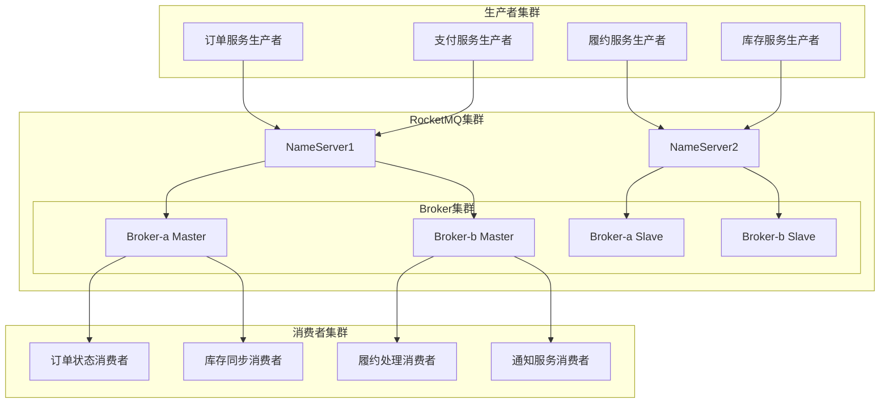

# 消息队列架构设计

## 1. 消息队列架构概述

如意订单系统采用RocketMQ作为核心消息中间件，构建了完整的异步消息处理架构。通过消息队列实现了服务解耦、异步处理、流量削峰、最终一致性等关键功能。

### 1.1 架构设计图


### 1.2 消息分类设计

#### 1.2.1 消息主题定义
```java
public class RocketMqConstant {
    
    // 订单相关消息主题
    public static final String PAID_ORDER_SUCCESS_TOPIC = "PAID_ORDER_SUCCESS";
    public static final String ORDER_CANCELED_TOPIC = "ORDER_CANCELED";
    public static final String ORDER_CREATED_TOPIC = "ORDER_CREATED";
    
    // 履约相关消息主题
    public static final String TRIGGER_ORDER_FULFILL_TOPIC = "TRIGGER_ORDER_FULFILL";
    public static final String ORDER_FULFILL_SUCCESS_TOPIC = "ORDER_FULFILL_SUCCESS";
    public static final String ORDER_OUT_STOCK_TOPIC = "ORDER_OUT_STOCK";
    public static final String ORDER_DELIVERY_TOPIC = "ORDER_DELIVERY";
    public static final String ORDER_SIGNED_TOPIC = "ORDER_SIGNED";
    
    // 库存相关消息主题
    public static final String INVENTORY_DEDUCT_TOPIC = "INVENTORY_DEDUCT";
    public static final String INVENTORY_RELEASE_TOPIC = "INVENTORY_RELEASE";
    public static final String INVENTORY_SYNC_TOPIC = "INVENTORY_SYNC";
    
    // 营销相关消息主题
    public static final String COUPON_LOCKED_TOPIC = "COUPON_LOCKED";
    public static final String COUPON_USED_TOPIC = "COUPON_USED";
    public static final String COUPON_RELEASED_TOPIC = "COUPON_RELEASED";
    
    // 延迟消息主题
    public static final String PAY_TIMEOUT_DELAY_TOPIC = "PAY_TIMEOUT_DELAY";
    public static final String ORDER_AUTO_CANCEL_TOPIC = "ORDER_AUTO_CANCEL";
    
    // 通知消息主题
    public static final String ORDER_NOTIFICATION_TOPIC = "ORDER_NOTIFICATION";
    public static final String SMS_NOTIFICATION_TOPIC = "SMS_NOTIFICATION";
    public static final String EMAIL_NOTIFICATION_TOPIC = "EMAIL_NOTIFICATION";
    
    // 数据同步主题
    public static final String ORDER_DATA_SYNC_TOPIC = "ORDER_DATA_SYNC";
    public static final String CACHE_INVALIDATE_TOPIC = "CACHE_INVALIDATE";
}
```

#### 1.2.2 消息类型分类
```java
public enum MessageTypeEnum {
    // 事务消息
    TRANSACTION_MESSAGE(1, "事务消息"),
    
    // 普通消息
    NORMAL_MESSAGE(2, "普通消息"),
    
    // 延迟消息
    DELAY_MESSAGE(3, "延迟消息"),
    
    // 顺序消息
    ORDER_MESSAGE(4, "顺序消息"),
    
    // 批量消息
    BATCH_MESSAGE(5, "批量消息");
    
    private final Integer code;
    private final String desc;
    
    MessageTypeEnum(Integer code, String desc) {
        this.code = code;
        this.desc = desc;
    }
}
```

## 2. 消息生产者设计

### 2.1 通用消息生产者

#### 2.1.1 默认消息生产者
```java
@Component
public class DefaultProducer {
    
    private TransactionMQProducer producer;
    
    @Value("${rocketmq.name-server}")
    private String nameServer;
    
    @Value("${rocketmq.producer.group}")
    private String producerGroup;
    
    @PostConstruct
    public void init() throws MQClientException {
        producer = new TransactionMQProducer(producerGroup);
        producer.setNamesrvAddr(nameServer);
        producer.setInstanceName(UUID.randomUUID().toString());
        
        // 生产者配置
        producer.setSendMsgTimeout(3000);                    // 发送超时时间
        producer.setRetryTimesWhenSendFailed(2);            // 发送失败重试次数
        producer.setRetryTimesWhenSendAsyncFailed(2);       // 异步发送失败重试次数
        producer.setMaxMessageSize(1024 * 1024 * 4);        // 最大消息大小4MB
        producer.setCompressMsgBodyOverHowmuch(1024 * 4);   // 消息压缩阈值4KB
        producer.setRetryAnotherBrokerWhenNotStoreOK(true); // 存储失败时重试其他Broker
        
        producer.start();
        log.info("RocketMQ生产者启动成功, group: {}, nameServer: {}", producerGroup, nameServer);
    }
    
    @PreDestroy
    public void destroy() {
        if (producer != null) {
            producer.shutdown();
            log.info("RocketMQ生产者关闭成功");
        }
    }
    
    public TransactionMQProducer getProducer() {
        return producer;
    }
    
    /**
     * 发送普通消息
     */
    public SendResult sendMessage(String topic, String message) throws MQClientException {
        return sendMessage(topic, null, null, message);
    }
    
    /**
     * 发送带标签的消息
     */
    public SendResult sendMessage(String topic, String tags, String message) throws MQClientException {
        return sendMessage(topic, tags, null, message);
    }
    
    /**
     * 发送完整消息
     */
    public SendResult sendMessage(String topic, String tags, String keys, String message) throws MQClientException {
        Message msg = new Message(topic, tags, keys, message.getBytes(StandardCharsets.UTF_8));
        
        SendResult sendResult = producer.send(msg);
        
        log.info("发送普通消息成功, topic: {}, tags: {}, keys: {}, msgId: {}", 
                 topic, tags, keys, sendResult.getMsgId());
        
        return sendResult;
    }
    
    /**
     * 异步发送消息
     */
    public void sendMessageAsync(String topic, String tags, String keys, String message, 
                                SendCallback sendCallback) throws MQClientException {
        Message msg = new Message(topic, tags, keys, message.getBytes(StandardCharsets.UTF_8));
        
        producer.send(msg, sendCallback);
        
        log.info("发送异步消息, topic: {}, tags: {}, keys: {}", topic, tags, keys);
    }
    
    /**
     * 发送单向消息（不关心结果）
     */
    public void sendOneWayMessage(String topic, String tags, String keys, String message) throws MQClientException {
        Message msg = new Message(topic, tags, keys, message.getBytes(StandardCharsets.UTF_8));
        
        producer.sendOneway(msg);
        
        log.info("发送单向消息, topic: {}, tags: {}, keys: {}", topic, tags, keys);
    }
}
```

#### 2.1.2 延迟消息生产者
```java
@Service
public class DelayMessageProducer {
    
    @Autowired
    private DefaultProducer defaultProducer;
    
    /**
     * 发送延迟消息
     * @param topic 主题
     * @param message 消息内容
     * @param delayLevel 延迟级别 (1s 5s 10s 30s 1m 2m 3m 4m 5m 6m 7m 8m 9m 10m 20m 30m 1h 2h)
     */
    public SendResult sendDelayMessage(String topic, String message, int delayLevel) throws MQClientException {
        Message msg = new Message(topic, message.getBytes(StandardCharsets.UTF_8));
        msg.setDelayTimeLevel(delayLevel);
        
        SendResult sendResult = defaultProducer.getProducer().send(msg);
        
        log.info("发送延迟消息成功, topic: {}, delayLevel: {}, msgId: {}", 
                 topic, delayLevel, sendResult.getMsgId());
        
        return sendResult;
    }
    
    /**
     * 发送支付超时延迟消息
     */
    public void sendPayTimeoutDelayMessage(String orderId, Date expireTime) {
        try {
            PayTimeoutMessage payTimeoutMessage = new PayTimeoutMessage();
            payTimeoutMessage.setOrderId(orderId);
            payTimeoutMessage.setExpireTime(expireTime);
            
            String messageBody = JSON.toJSONString(payTimeoutMessage);
            
            // 计算延迟级别（30分钟 = 级别16）
            int delayLevel = calculateDelayLevel(expireTime);
            
            sendDelayMessage(RocketMqConstant.PAY_TIMEOUT_DELAY_TOPIC, messageBody, delayLevel);
            
            log.info("发送支付超时延迟消息成功, orderId: {}, expireTime: {}", orderId, expireTime);
            
        } catch (Exception e) {
            log.error("发送支付超时延迟消息失败, orderId: {}", orderId, e);
        }
    }
    
    private int calculateDelayLevel(Date expireTime) {
        long delayMs = expireTime.getTime() - System.currentTimeMillis();
        
        if (delayMs <= 1000) return 1;          // 1s
        else if (delayMs <= 5000) return 2;     // 5s
        else if (delayMs <= 10000) return 3;    // 10s
        else if (delayMs <= 30000) return 4;    // 30s
        else if (delayMs <= 60000) return 5;    // 1m
        else if (delayMs <= 120000) return 6;   // 2m
        else if (delayMs <= 180000) return 7;   // 3m
        else if (delayMs <= 240000) return 8;   // 4m
        else if (delayMs <= 300000) return 9;   // 5m
        else if (delayMs <= 360000) return 10;  // 6m
        else if (delayMs <= 420000) return 11;  // 7m
        else if (delayMs <= 480000) return 12;  // 8m
        else if (delayMs <= 540000) return 13;  // 9m
        else if (delayMs <= 600000) return 14;  // 10m
        else if (delayMs <= 1200000) return 15; // 20m
        else if (delayMs <= 1800000) return 16; // 30m
        else if (delayMs <= 3600000) return 17; // 1h
        else return 18;                         // 2h
    }
}
```

### 2.2 事务消息生产者

#### 2.2.1 支付回调事务消息
```java
@Service
public class PaymentTransactionProducer {
    
    @Autowired
    private DefaultProducer defaultProducer;
    
    @Autowired
    private OrderManager orderManager;
    
    /**
     * 发送支付成功事务消息
     */
    public void sendPaidOrderSuccessMessage(PayCallbackRequest payCallbackRequest,
                                          OrderInfoDO orderInfoDO,
                                          OrderPaymentDetailDO orderPaymentDetailDO) throws MQClientException {
        
        TransactionMQProducer producer = defaultProducer.getProducer();
        
        // 设置事务监听器
        producer.setTransactionListener(new TransactionListener() {
            
            @Override
            public LocalTransactionState executeLocalTransaction(Message message, Object arg) {
                try {
                    log.info("执行支付回调本地事务, orderId: {}", orderInfoDO.getOrderId());
                    
                    // 执行本地事务：更新订单支付状态
                    orderManager.updateOrderStatusPaid(payCallbackRequest, orderInfoDO, orderPaymentDetailDO);
                    
                    log.info("支付回调本地事务执行成功, orderId: {}", orderInfoDO.getOrderId());
                    return LocalTransactionState.COMMIT_MESSAGE;
                    
                } catch (BaseBizException e) {
                    log.error("支付回调本地事务业务异常, orderId: {}", orderInfoDO.getOrderId(), e);
                    throw e;
                } catch (Exception e) {
                    log.error("支付回调本地事务系统异常, orderId: {}", orderInfoDO.getOrderId(), e);
                    return LocalTransactionState.ROLLBACK_MESSAGE;
                }
            }
            
            @Override
            public LocalTransactionState checkLocalTransaction(MessageExt messageExt) {
                String orderId = orderInfoDO.getOrderId();
                log.info("回查支付回调事务状态, orderId: {}", orderId);
                
                try {
                    // 查询订单支付状态
                    OrderInfoDO orderInfo = orderInfoDAO.getByOrderId(orderId);
                    if (orderInfo != null && OrderStatusEnum.PAID.getCode().equals(orderInfo.getOrderStatus())) {
                        log.info("回查结果：订单已支付, orderId: {}", orderId);
                        return LocalTransactionState.COMMIT_MESSAGE;
                    } else {
                        log.info("回查结果：订单未支付, orderId: {}", orderId);
                        return LocalTransactionState.ROLLBACK_MESSAGE;
                    }
                } catch (Exception e) {
                    log.error("回查支付回调事务状态异常, orderId: {}", orderId, e);
                    return LocalTransactionState.ROLLBACK_MESSAGE;
                }
            }
        });
        
        // 构建支付成功消息
        PaidOrderSuccessMessage paidOrderMessage = new PaidOrderSuccessMessage();
        paidOrderMessage.setOrderId(orderInfoDO.getOrderId());
        paidOrderMessage.setUserId(orderInfoDO.getUserId());
        paidOrderMessage.setPayAmount(orderInfoDO.getPayAmount());
        paidOrderMessage.setPayTime(new Date());
        
        String topic = RocketMqConstant.PAID_ORDER_SUCCESS_TOPIC;
        byte[] body = JSON.toJSONString(paidOrderMessage).getBytes(StandardCharsets.UTF_8);
        Message message = new Message(topic, body);
        message.setKeys(orderInfoDO.getOrderId());
        
        // 发送事务消息
        TransactionSendResult result = producer.sendMessageInTransaction(message, orderInfoDO);
        
        if (!result.getLocalTransactionState().equals(LocalTransactionState.COMMIT_MESSAGE)) {
            log.error("支付回调事务消息发送失败, orderId: {}, result: {}", 
                     orderInfoDO.getOrderId(), result.getLocalTransactionState());
            throw new OrderBizException(OrderErrorCodeEnum.ORDER_PAY_CALLBACK_SEND_MQ_ERROR);
        }
        
        log.info("支付回调事务消息发送成功, orderId: {}, msgId: {}", 
                 orderInfoDO.getOrderId(), result.getMsgId());
    }
}
```

### 2.3 批量消息生产者

#### 2.3.1 批量消息发送器
```java
@Service
public class BatchMessageProducer {
    
    @Autowired
    private DefaultProducer defaultProducer;
    
    private static final int MAX_BATCH_SIZE = 100;
    private static final int MAX_BATCH_BYTES = 1024 * 1024; // 1MB
    
    /**
     * 批量发送消息
     */
    public List<SendResult> sendBatchMessages(String topic, List<String> messages) throws MQClientException {
        if (messages == null || messages.isEmpty()) {
            return Collections.emptyList();
        }
        
        List<SendResult> results = new ArrayList<>();
        List<Message> batch = new ArrayList<>();
        int batchSize = 0;
        
        for (String messageBody : messages) {
            Message message = new Message(topic, messageBody.getBytes(StandardCharsets.UTF_8));
            
            // 检查批次大小
            if (batch.size() >= MAX_BATCH_SIZE || 
                (batchSize + messageBody.length()) > MAX_BATCH_BYTES) {
                
                // 发送当前批次
                if (!batch.isEmpty()) {
                    SendResult result = sendBatch(batch);
                    results.add(result);
                    batch.clear();
                    batchSize = 0;
                }
            }
            
            batch.add(message);
            batchSize += messageBody.length();
        }
        
        // 发送剩余消息
        if (!batch.isEmpty()) {
            SendResult result = sendBatch(batch);
            results.add(result);
        }
        
        log.info("批量发送消息完成, topic: {}, total: {}, batches: {}", 
                 topic, messages.size(), results.size());
        
        return results;
    }
    
    private SendResult sendBatch(List<Message> batch) throws MQClientException {
        SendResult result = defaultProducer.getProducer().send(batch);
        
        log.debug("发送批量消息, size: {}, msgId: {}", batch.size(), result.getMsgId());
        
        return result;
    }
    
    /**
     * 批量发送库存同步消息
     */
    public void sendInventorySyncMessages(List<InventorySyncMessage> syncMessages) {
        try {
            List<String> messageStrings = syncMessages.stream()
                .map(JSON::toJSONString)
                .collect(Collectors.toList());
            
            sendBatchMessages(RocketMqConstant.INVENTORY_SYNC_TOPIC, messageStrings);
            
            log.info("批量发送库存同步消息成功, count: {}", syncMessages.size());
            
        } catch (Exception e) {
            log.error("批量发送库存同步消息失败, count: {}", syncMessages.size(), e);
        }
    }
}
```

## 3. 消息消费者设计

### 3.1 订单支付成功消费者

#### 3.1.1 支付成功消息监听器
```java
@Component
@RocketMQMessageListener(
    topic = RocketMqConstant.PAID_ORDER_SUCCESS_TOPIC,
    consumerGroup = "paid-order-success-consumer-group",
    messageModel = MessageModel.CLUSTERING,
    consumeMode = ConsumeMode.CONCURRENTLY,
    consumeThreadMax = 20,
    consumeThreadMin = 10
)
public class PaidOrderSuccessListener implements RocketMQListener<String> {
    
    @Autowired
    private OrderInfoDAO orderInfoDAO;
    
    @Autowired
    private OrderFulFillService orderFulFillService;
    
    @Autowired
    private RedisLock redisLock;
    
    @Autowired
    private MessageIdempotentService messageIdempotentService;
    
    @Override
    public void onMessage(String message) {
        PaidOrderSuccessMessage paidOrderSuccessMessage = null;
        
        try {
            paidOrderSuccessMessage = JSON.parseObject(message, PaidOrderSuccessMessage.class);
            String orderId = paidOrderSuccessMessage.getOrderId();
            
            log.info("接收到订单支付成功消息, orderId: {}", orderId);
            
            // 幂等性检查
            String messageId = generateMessageId(paidOrderSuccessMessage);
            if (messageIdempotentService.isProcessed(messageId)) {
                log.info("消息已处理，跳过, orderId: {}, messageId: {}", orderId, messageId);
                return;
            }
            
            // 获取订单信息
            OrderInfoDO order = orderInfoDAO.getByOrderId(orderId);
            if (Objects.isNull(order)) {
                log.error("订单不存在, orderId: {}", orderId);
                throw new OrderBizException(OrderErrorCodeEnum.ORDER_INFO_IS_NULL);
            }
            
            // 状态检查
            if (!OrderStatusEnum.PAID.getCode().equals(order.getOrderStatus())) {
                log.warn("订单状态不是已支付, orderId: {}, status: {}", orderId, order.getOrderStatus());
                return;
            }
            
            // 分布式锁防止重复消费
            String lockKey = RedisLockKeyConstants.ORDER_FULFILL_KEY + orderId;
            boolean locked = redisLock.lock(lockKey, 30);
            
            if (!locked) {
                log.error("获取履约锁失败, orderId: {}", orderId);
                throw new BaseBizException(OrderErrorCodeEnum.ORDER_FULFILL_ERROR);
            }
            
            try {
                // 触发订单履约
                orderFulFillService.triggerOrderFulFill(orderId);
                
                // 标记消息已处理
                messageIdempotentService.markProcessed(messageId);
                
                log.info("订单支付成功消息处理完成, orderId: {}", orderId);
                
            } finally {
                redisLock.unlock(lockKey);
            }
            
        } catch (Exception e) {
            log.error("处理订单支付成功消息失败, message: {}", message, e);
            
            // 记录消费失败
            recordConsumeFailure(paidOrderSuccessMessage, e);
            
            // 抛出异常触发重试
            throw e;
        }
    }
    
    private String generateMessageId(PaidOrderSuccessMessage message) {
        return "paid_order_" + message.getOrderId() + "_" + message.getPayTime().getTime();
    }
    
    private void recordConsumeFailure(PaidOrderSuccessMessage message, Exception e) {
        if (message != null) {
            ConsumeFailureLogDO failureLog = new ConsumeFailureLogDO();
            failureLog.setTopic(RocketMqConstant.PAID_ORDER_SUCCESS_TOPIC);
            failureLog.setOrderId(message.getOrderId());
            failureLog.setMessageBody(JSON.toJSONString(message));
            failureLog.setErrorMessage(e.getMessage());
            failureLog.setFailureTime(new Date());
            consumeFailureLogDAO.save(failureLog);
        }
    }
}
```

### 3.2 订单履约消费者

#### 3.2.1 履约消息监听器
```java
@Component
@RocketMQMessageListener(
    topic = RocketMqConstant.TRIGGER_ORDER_FULFILL_TOPIC,
    consumerGroup = "order-fulfill-consumer-group",
    messageModel = MessageModel.CLUSTERING,
    consumeMode = ConsumeMode.ORDERLY, // 顺序消费
    consumeThreadMax = 10,
    consumeThreadMin = 5
)
public class OrderFulfillListener implements RocketMQListener<String> {
    
    @Autowired
    private FulfillApi fulfillApi;
    
    @Autowired
    private OrderInfoDAO orderInfoDAO;
    
    @Autowired
    private MessageRetryService messageRetryService;
    
    @Override
    public void onMessage(String message) {
        ReceiveFulfillRequest fulfillRequest = null;
        
        try {
            fulfillRequest = JSON.parseObject(message, ReceiveFulfillRequest.class);
            String orderId = fulfillRequest.getOrderId();
            
            log.info("接收到订单履约消息, orderId: {}", orderId);
            
            // 调用履约服务
            JsonResult<Boolean> result = fulfillApi.receiveOrderFulfillRequest(fulfillRequest);
            
            if (result.getSuccess() && Boolean.TRUE.equals(result.getData())) {
                log.info("订单履约处理成功, orderId: {}", orderId);
                
                // 更新订单状态为已履约
                updateOrderStatusToFulfilled(orderId);
                
            } else {
                log.error("订单履约处理失败, orderId: {}, error: {}", orderId, result.getErrorMessage());
                throw new OrderBizException(OrderErrorCodeEnum.ORDER_FULFILL_FAILED, result.getErrorMessage());
            }
            
        } catch (Exception e) {
            log.error("处理订单履约消息失败, message: {}", message, e);
            
            // 记录重试信息
            if (fulfillRequest != null) {
                messageRetryService.recordRetry(RocketMqConstant.TRIGGER_ORDER_FULFILL_TOPIC, 
                                              fulfillRequest.getOrderId(), message, e.getMessage());
            }
            
            // 抛出异常触发重试
            throw e;
        }
    }
    
    private void updateOrderStatusToFulfilled(String orderId) {
        try {
            OrderInfoDO orderInfo = orderInfoDAO.getByOrderId(orderId);
            if (orderInfo != null && OrderStatusEnum.PAID.getCode().equals(orderInfo.getOrderStatus())) {
                orderInfo.setOrderStatus(OrderStatusEnum.FULFILL.getCode());
                orderInfoDAO.updateById(orderInfo);
                
                log.info("更新订单状态为已履约, orderId: {}", orderId);
            }
        } catch (Exception e) {
            log.error("更新订单履约状态失败, orderId: {}", orderId, e);
        }
    }
}
```

### 3.3 延迟消息消费者

#### 3.3.1 支付超时消费者
```java
@Component
@RocketMQMessageListener(
    topic = RocketMqConstant.PAY_TIMEOUT_DELAY_TOPIC,
    consumerGroup = "pay-timeout-consumer-group",
    messageModel = MessageModel.CLUSTERING,
    consumeMode = ConsumeMode.CONCURRENTLY
)
public class PayTimeoutListener implements RocketMQListener<String> {
    
    @Autowired
    private OrderService orderService;
    
    @Autowired
    private OrderInfoDAO orderInfoDAO;
    
    @Override
    public void onMessage(String message) {
        PayTimeoutMessage payTimeoutMessage = null;
        
        try {
            payTimeoutMessage = JSON.parseObject(message, PayTimeoutMessage.class);
            String orderId = payTimeoutMessage.getOrderId();
            Date expireTime = payTimeoutMessage.getExpireTime();
            
            log.info("接收到支付超时消息, orderId: {}, expireTime: {}", orderId, expireTime);
            
            // 检查订单当前状态
            OrderInfoDO orderInfo = orderInfoDAO.getByOrderId(orderId);
            if (orderInfo == null) {
                log.warn("订单不存在, orderId: {}", orderId);
                return;
            }
            
            // 如果订单已支付，则不处理
            if (OrderStatusEnum.PAID.getCode().equals(orderInfo.getOrderStatus())) {
                log.info("订单已支付，跳过超时处理, orderId: {}", orderId);
                return;
            }
            
            // 如果订单已取消，则不处理
            if (OrderStatusEnum.CANCELED.getCode().equals(orderInfo.getOrderStatus())) {
                log.info("订单已取消，跳过超时处理, orderId: {}", orderId);
                return;
            }
            
            // 检查是否真的超时
            if (new Date().after(expireTime)) {
                log.info("订单支付超时，开始自动取消, orderId: {}", orderId);
                
                // 构建取消订单请求
                CancelOrderRequest cancelRequest = new CancelOrderRequest();
                cancelRequest.setOrderId(orderId);
                cancelRequest.setUserId(orderInfo.getUserId());
                cancelRequest.setCancelType(OrderCancelTypeEnum.TIMEOUT_CANCELED.getCode());
                cancelRequest.setCancelReason("支付超时自动取消");
                
                // 执行订单取消
                boolean cancelSuccess = orderService.cancelOrder(cancelRequest);
                
                if (cancelSuccess) {
                    log.info("订单超时自动取消成功, orderId: {}", orderId);
                } else {
                    log.error("订单超时自动取消失败, orderId: {}", orderId);
                }
                
            } else {
                log.info("订单未超时，跳过处理, orderId: {}, expireTime: {}, now: {}", 
                        orderId, expireTime, new Date());
            }
            
        } catch (Exception e) {
            log.error("处理支付超时消息失败, message: {}", message, e);
            
            // 记录处理失败日志
            recordTimeoutProcessFailure(payTimeoutMessage, e);
            
            // 不抛出异常，避免重试
        }
    }
    
    private void recordTimeoutProcessFailure(PayTimeoutMessage message, Exception e) {
        if (message != null) {
            TimeoutProcessFailureLogDO failureLog = new TimeoutProcessFailureLogDO();
            failureLog.setOrderId(message.getOrderId());
            failureLog.setExpireTime(message.getExpireTime());
            failureLog.setErrorMessage(e.getMessage());
            failureLog.setProcessTime(new Date());
            timeoutProcessFailureLogDAO.save(failureLog);
        }
    }
}
```

## 4. 消息幂等性设计

### 4.1 消息幂等性服务

#### 4.1.1 幂等性检查服务
```java
@Service
public class MessageIdempotentService {
    
    @Autowired
    private RedisTemplate<String, String> redisTemplate;
    
    @Autowired
    private MessageProcessLogDAO messageProcessLogDAO;
    
    private static final String IDEMPOTENT_KEY_PREFIX = "msg:idempotent:";
    private static final long IDEMPOTENT_EXPIRE_SECONDS = 24 * 60 * 60; // 24小时
    
    /**
     * 检查消息是否已处理
     */
    public boolean isProcessed(String messageId) {
        // 先检查Redis缓存
        String cacheKey = IDEMPOTENT_KEY_PREFIX + messageId;
        Boolean exists = redisTemplate.hasKey(cacheKey);
        
        if (Boolean.TRUE.equals(exists)) {
            log.debug("消息已处理（Redis缓存）, messageId: {}", messageId);
            return true;
        }
        
        // 再检查数据库
        MessageProcessLogDO processLog = messageProcessLogDAO.getByMessageId(messageId);
        if (processLog != null) {
            log.debug("消息已处理（数据库）, messageId: {}", messageId);
            
            // 回写Redis缓存
            redisTemplate.opsForValue().set(cacheKey, "1", Duration.ofSeconds(IDEMPOTENT_EXPIRE_SECONDS));
            
            return true;
        }
        
        return false;
    }
    
    /**
     * 标记消息已处理
     */
    public void markProcessed(String messageId) {
        markProcessed(messageId, null, null);
    }
    
    /**
     * 标记消息已处理（带业务信息）
     */
    public void markProcessed(String messageId, String businessId, String businessType) {
        // 写入Redis缓存
        String cacheKey = IDEMPOTENT_KEY_PREFIX + messageId;
        redisTemplate.opsForValue().set(cacheKey, "1", Duration.ofSeconds(IDEMPOTENT_EXPIRE_SECONDS));
        
        // 异步写入数据库
        asyncSaveProcessLog(messageId, businessId, businessType);
        
        log.debug("标记消息已处理, messageId: {}, businessId: {}", messageId, businessId);
    }
    
    @Async
    private void asyncSaveProcessLog(String messageId, String businessId, String businessType) {
        try {
            MessageProcessLogDO processLog = new MessageProcessLogDO();
            processLog.setMessageId(messageId);
            processLog.setBusinessId(businessId);
            processLog.setBusinessType(businessType);
            processLog.setProcessTime(new Date());
            
            messageProcessLogDAO.save(processLog);
            
        } catch (Exception e) {
            log.error("保存消息处理日志失败, messageId: {}", messageId, e);
        }
    }
    
    /**
     * 生成消息ID
     */
    public String generateMessageId(String topic, String businessId) {
        return topic + ":" + businessId + ":" + System.currentTimeMillis();
    }
    
    /**
     * 生成消息ID（带时间戳）
     */
    public String generateMessageId(String topic, String businessId, long timestamp) {
        return topic + ":" + businessId + ":" + timestamp;
    }
}
```

#### 4.1.2 消息处理日志表
```sql
CREATE TABLE `message_process_log` (
  `id` bigint(20) NOT NULL AUTO_INCREMENT COMMENT '主键ID',
  `message_id` varchar(128) NOT NULL COMMENT '消息ID',
  `business_id` varchar(64) DEFAULT NULL COMMENT '业务ID',
  `business_type` varchar(32) DEFAULT NULL COMMENT '业务类型',
  `process_time` datetime NOT NULL COMMENT '处理时间',
  `gmt_create` datetime NOT NULL COMMENT '创建时间',
  `gmt_modified` datetime NOT NULL COMMENT '更新时间',
  PRIMARY KEY (`id`),
  UNIQUE KEY `idx_message_id` (`message_id`),
  KEY `idx_business` (`business_id`, `business_type`),
  KEY `idx_process_time` (`process_time`)
) ENGINE=InnoDB DEFAULT CHARSET=utf8 COMMENT='消息处理日志表';
```

## 5. 消息重试机制

### 5.1 消息重试服务

#### 5.1.1 重试策略配置
```java
@Configuration
public class MessageRetryConfig {
    
    // 最大重试次数
    public static final int MAX_RETRY_TIMES = 3;
    
    // 重试间隔配置（秒）
    public static final int[] RETRY_INTERVALS = {10, 30, 60, 300}; // 10s, 30s, 1m, 5m
    
    // 重试队列配置
    public static final Map<String, String> RETRY_TOPIC_MAPPING = new HashMap<>();
    
    static {
        RETRY_TOPIC_MAPPING.put(RocketMqConstant.PAID_ORDER_SUCCESS_TOPIC, "PAID_ORDER_SUCCESS_RETRY");
        RETRY_TOPIC_MAPPING.put(RocketMqConstant.TRIGGER_ORDER_FULFILL_TOPIC, "TRIGGER_ORDER_FULFILL_RETRY");
        RETRY_TOPIC_MAPPING.put(RocketMqConstant.INVENTORY_DEDUCT_TOPIC, "INVENTORY_DEDUCT_RETRY");
    }
}
```

#### 5.1.2 重试服务实现
```java
@Service
public class MessageRetryService {
    
    @Autowired
    private DefaultProducer defaultProducer;
    
    @Autowired
    private MessageRetryLogDAO messageRetryLogDAO;
    
    @Autowired
    private DelayMessageProducer delayMessageProducer;
    
    /**
     * 记录重试信息
     */
    public void recordRetry(String originalTopic, String businessId, String messageBody, String errorMessage) {
        try {
            MessageRetryLogDO retryLog = new MessageRetryLogDO();
            retryLog.setOriginalTopic(originalTopic);
            retryLog.setBusinessId(businessId);
            retryLog.setMessageBody(messageBody);
            retryLog.setErrorMessage(errorMessage);
            retryLog.setRetryCount(0);
            retryLog.setMaxRetryCount(MessageRetryConfig.MAX_RETRY_TIMES);
            retryLog.setStatus(RetryStatusEnum.PENDING.getCode());
            retryLog.setNextRetryTime(calculateNextRetryTime(0));
            retryLog.setGmtCreate(new Date());
            
            messageRetryLogDAO.save(retryLog);
            
            log.info("记录消息重试信息, topic: {}, businessId: {}", originalTopic, businessId);
            
        } catch (Exception e) {
            log.error("记录消息重试信息失败, topic: {}, businessId: {}", originalTopic, businessId, e);
        }
    }
    
    /**
     * 处理重试消息
     */
    @Scheduled(fixedRate = 60000) // 每分钟执行一次
    public void processRetryMessages() {
        try {
            Date now = new Date();
            List<MessageRetryLogDO> pendingRetries = messageRetryLogDAO.findPendingRetries(now, 100);
            
            log.info("查询到{}条待重试消息", pendingRetries.size());
            
            for (MessageRetryLogDO retryLog : pendingRetries) {
                processRetryMessage(retryLog);
            }
            
        } catch (Exception e) {
            log.error("处理重试消息异常", e);
        }
    }
    
    private void processRetryMessage(MessageRetryLogDO retryLog) {
        String originalTopic = retryLog.getOriginalTopic();
        String businessId = retryLog.getBusinessId();
        String messageBody = retryLog.getMessageBody();
        
        try {
            log.info("开始重试消息, topic: {}, businessId: {}, retryCount: {}", 
                     originalTopic, businessId, retryLog.getRetryCount());
            
            // 发送重试消息
            String retryTopic = MessageRetryConfig.RETRY_TOPIC_MAPPING.get(originalTopic);
            if (retryTopic != null) {
                defaultProducer.sendMessage(retryTopic, businessId, messageBody);
            } else {
                // 直接重新发送到原主题
                defaultProducer.sendMessage(originalTopic, businessId, messageBody);
            }
            
            // 更新重试日志
            retryLog.setRetryCount(retryLog.getRetryCount() + 1);
            retryLog.setLastRetryTime(new Date());
            
            if (retryLog.getRetryCount() >= retryLog.getMaxRetryCount()) {
                // 达到最大重试次数
                retryLog.setStatus(RetryStatusEnum.MAX_RETRY_REACHED.getCode());
                log.warn("消息重试次数达到上限, topic: {}, businessId: {}", originalTopic, businessId);
                
                // 发送死信队列告警
                sendDeadLetterAlert(retryLog);
            } else {
                // 计算下次重试时间
                retryLog.setNextRetryTime(calculateNextRetryTime(retryLog.getRetryCount()));
            }
            
            messageRetryLogDAO.updateById(retryLog);
            
            log.info("消息重试成功, topic: {}, businessId: {}, retryCount: {}", 
                     originalTopic, businessId, retryLog.getRetryCount());
            
        } catch (Exception e) {
            log.error("消息重试失败, topic: {}, businessId: {}", originalTopic, businessId, e);
            
            // 更新重试失败信息
            retryLog.setRetryCount(retryLog.getRetryCount() + 1);
            retryLog.setLastRetryTime(new Date());
            retryLog.setErrorMessage(e.getMessage());
            
            if (retryLog.getRetryCount() >= retryLog.getMaxRetryCount()) {
                retryLog.setStatus(RetryStatusEnum.FAILED.getCode());
                sendDeadLetterAlert(retryLog);
            } else {
                retryLog.setNextRetryTime(calculateNextRetryTime(retryLog.getRetryCount()));
            }
            
            messageRetryLogDAO.updateById(retryLog);
        }
    }
    
    private Date calculateNextRetryTime(int retryCount) {
        int interval = MessageRetryConfig.RETRY_INTERVALS[Math.min(retryCount, MessageRetryConfig.RETRY_INTERVALS.length - 1)];
        return new Date(System.currentTimeMillis() + interval * 1000L);
    }
    
    private void sendDeadLetterAlert(MessageRetryLogDO retryLog) {
        try {
            DeadLetterAlert alert = new DeadLetterAlert();
            alert.setOriginalTopic(retryLog.getOriginalTopic());
            alert.setBusinessId(retryLog.getBusinessId());
            alert.setRetryCount(retryLog.getRetryCount());
            alert.setErrorMessage(retryLog.getErrorMessage());
            alert.setAlertTime(new Date());
            
            // 发送告警通知
            alertService.sendDeadLetterAlert(alert);
            
        } catch (Exception e) {
            log.error("发送死信队列告警失败", e);
        }
    }
}
```

## 6. 消息监控与运维

### 6.1 消息监控指标

#### 6.1.1 生产者监控
```java
@Component
public class ProducerMetricsCollector {
    
    private final MeterRegistry meterRegistry;
    private final Counter messageSendCounter;
    private final Timer messageSendTimer;
    
    public ProducerMetricsCollector(MeterRegistry meterRegistry) {
        this.meterRegistry = meterRegistry;
        
        this.messageSendCounter = Counter.builder("rocketmq.producer.send")
            .description("RocketMQ消息发送次数")
            .register(meterRegistry);
            
        this.messageSendTimer = Timer.builder("rocketmq.producer.send.duration")
            .description("RocketMQ消息发送耗时")
            .register(meterRegistry);
    }
    
    public void recordMessageSend(String topic, boolean success, Duration duration) {
        messageSendCounter.increment(Tags.of("topic", topic, "result", success ? "success" : "failure"));
        messageSendTimer.record(duration, Tags.of("topic", topic));
    }
}
```

#### 6.1.2 消费者监控
```java
@Component
public class ConsumerMetricsCollector {
    
    private final MeterRegistry meterRegistry;
    private final Counter messageConsumeCounter;
    private final Timer messageConsumeTimer;
    private final Gauge consumerLagGauge;
    
    public ConsumerMetricsCollector(MeterRegistry meterRegistry) {
        this.meterRegistry = meterRegistry;
        
        this.messageConsumeCounter = Counter.builder("rocketmq.consumer.consume")
            .description("RocketMQ消息消费次数")
            .register(meterRegistry);
            
        this.messageConsumeTimer = Timer.builder("rocketmq.consumer.consume.duration")
            .description("RocketMQ消息消费耗时")
            .register(meterRegistry);
            
        this.consumerLagGauge = Gauge.builder("rocketmq.consumer.lag")
            .description("RocketMQ消费延迟")
            .register(meterRegistry, this, ConsumerMetricsCollector::getConsumerLag);
    }
    
    public void recordMessageConsume(String topic, String consumerGroup, boolean success, Duration duration) {
        messageConsumeCounter.increment(Tags.of("topic", topic, "group", consumerGroup, "result", success ? "success" : "failure"));
        messageConsumeTimer.record(duration, Tags.of("topic", topic, "group", consumerGroup));
    }
    
    private double getConsumerLag() {
        // 获取消费延迟的实现
        return RocketMQAdminService.getConsumerLag();
    }
}
```

### 6.2 消息管理接口

#### 6.2.1 消息查询接口
```java
@RestController
@RequestMapping("/message")
public class MessageManagementController {
    
    @Autowired
    private MessageQueryService messageQueryService;
    
    @GetMapping("/send-records")
    public PageResult<MessageSendRecordDTO> getSendRecords(
            @RequestParam(defaultValue = "1") int page,
            @RequestParam(defaultValue = "20") int size,
            @RequestParam(required = false) String topic,
            @RequestParam(required = false) String status) {
        
        return messageQueryService.getSendRecords(page, size, topic, status);
    }
    
    @GetMapping("/consume-records")
    public PageResult<MessageConsumeRecordDTO> getConsumeRecords(
            @RequestParam(defaultValue = "1") int page,
            @RequestParam(defaultValue = "20") int size,
            @RequestParam(required = false) String topic,
            @RequestParam(required = false) String consumerGroup) {
        
        return messageQueryService.getConsumeRecords(page, size, topic, consumerGroup);
    }
    
    @GetMapping("/retry-records")
    public PageResult<MessageRetryLogDTO> getRetryRecords(
            @RequestParam(defaultValue = "1") int page,
            @RequestParam(defaultValue = "20") int size,
            @RequestParam(required = false) String topic,
            @RequestParam(required = false) String status) {
        
        return messageQueryService.getRetryRecords(page, size, topic, status);
    }
    
    @PostMapping("/retry/{retryId}")
    public JsonResult<Boolean> manualRetry(@PathVariable Long retryId) {
        try {
            boolean success = messageRetryService.manualRetry(retryId);
            return JsonResult.buildSuccess(success);
        } catch (Exception e) {
            return JsonResult.buildError("RETRY_FAILED", e.getMessage());
        }
    }
}
```

## 7. 最佳实践与注意事项

### 7.1 消息设计原则

1. **消息幂等性**：所有消息处理都要支持幂等
2. **消息顺序性**：关键业务流程使用顺序消息
3. **消息可靠性**：重要消息使用事务消息保证可靠性
4. **消息分类**：不同类型消息使用不同的主题
5. **消息监控**：完善的消息监控和告警机制

### 7.2 性能优化建议

1. **批量处理**：支持批量发送和消费
2. **异步处理**：非关键路径使用异步消息
3. **消费并发**：合理设置消费者线程数
4. **消息压缩**：大消息启用压缩
5. **连接复用**：合理配置生产者和消费者连接池

### 7.3 常见问题处理

#### 7.3.1 消息堆积处理
```java
@Component
public class MessageBacklogMonitor {
    
    @Scheduled(fixedRate = 60000) // 每分钟检查一次
    public void checkMessageBacklog() {
        Map<String, Long> backlogInfo = rocketMQAdminService.getConsumerBacklog();
        
        for (Map.Entry<String, Long> entry : backlogInfo.entrySet()) {
            String consumerGroup = entry.getKey();
            Long backlogCount = entry.getValue();
            
            if (backlogCount > 10000) { // 堆积超过1万条
                log.warn("消息堆积严重, consumerGroup: {}, backlog: {}", consumerGroup, backlogCount);
                
                // 发送堆积告警
                sendBacklogAlert(consumerGroup, backlogCount);
                
                // 自动扩容消费者
                autoScaleConsumer(consumerGroup);
            }
        }
    }
}
```

## 总结

如意订单系统的消息队列架构具有以下特点：

**技术优势**：
1. **RocketMQ集群**：高可用、高性能的消息中间件
2. **事务消息**：保证分布式事务的最终一致性
3. **延迟消息**：支持定时任务和超时处理
4. **顺序消息**：保证关键业务流程的顺序性
5. **批量消息**：提高消息处理效率

**可靠性保障**：
1. **消息幂等**：防止重复消费
2. **重试机制**：失败消息自动重试
3. **死信队列**：处理最终失败的消息
4. **监控告警**：及时发现和处理问题

**最佳实践**：
1. **消息分类**：不同业务使用不同主题
2. **异步解耦**：通过消息实现服务解耦
3. **流量削峰**：缓解系统压力
4. **最终一致性**：保证数据最终一致

通过完善的消息队列架构，系统实现了高可用、高性能、高一致性的异步消息处理能力。
