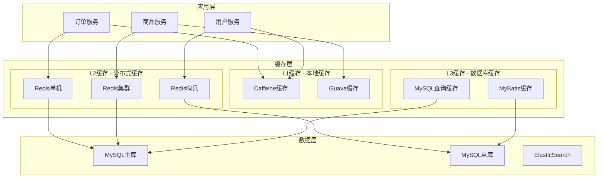

# 缓存策略设计

## 1. 缓存架构概述

如意订单系统采用多层缓存架构，结合本地缓存、分布式缓存、数据库缓存等多种缓存技术，实现了高性能的数据访问和存储。

### 1.1 缓存架构图


### 1.2 缓存分层策略

#### 1.2.1 L1缓存 - 本地缓存
- **技术选型**：Caffeine、Guava Cache
- **适用场景**：热点数据、配置信息、计算结果
- **特点**：访问速度最快，但存储容量有限
- **过期策略**：基于时间、基于大小、基于访问频率

#### 1.2.2 L2缓存 - 分布式缓存
- **技术选型**：Redis集群
- **适用场景**：用户会话、订单信息、商品信息
- **特点**：容量大、支持持久化、支持集群
- **过期策略**：TTL过期、LRU淘汰、定期清理

#### 1.2.3 L3缓存 - 数据库缓存
- **技术选型**：MyBatis一级缓存、二级缓存
- **适用场景**：SQL查询结果、数据库连接池
- **特点**：与数据库紧密集成、自动管理
- **过期策略**：基于事务、基于时间

## 2. 本地缓存实现

### 2.1 Caffeine缓存配置

#### 2.1.1 缓存配置类
```java
@Configuration
@EnableCaching
public class CaffeineConfig {
    
    @Bean("orderLocalCache")
    public CacheManager orderCacheManager() {
        CaffeineCacheManager cacheManager = new CaffeineCacheManager();
        
        // 订单信息缓存配置
        Caffeine<Object, Object> orderCaffeine = Caffeine.newBuilder()
                .maximumSize(10000)                    // 最大缓存数量
                .expireAfterWrite(Duration.ofMinutes(30))  // 写入30分钟后过期
                .expireAfterAccess(Duration.ofMinutes(10)) // 访问10分钟后过期
                .recordStats()                         // 开启统计
                .removalListener((key, value, cause) -> {
                    log.debug("订单缓存移除, key: {}, cause: {}", key, cause);
                });
        
        cacheManager.setCaffeine(orderCaffeine);
        return cacheManager;
    }
    
    @Bean("productLocalCache")
    public CacheManager productCacheManager() {
        CaffeineCacheManager cacheManager = new CaffeineCacheManager();
        
        // 商品信息缓存配置
        Caffeine<Object, Object> productCaffeine = Caffeine.newBuilder()
                .maximumSize(50000)                    // 商品信息缓存更多
                .expireAfterWrite(Duration.ofHours(2))     // 2小时后过期
                .refreshAfterWrite(Duration.ofMinutes(30)) // 30分钟后刷新
                .recordStats()
                .removalListener((key, value, cause) -> {
                    log.debug("商品缓存移除, key: {}, cause: {}", key, cause);
                });
        
        cacheManager.setCaffeine(productCaffeine);
        return cacheManager;
    }
    
    @Bean("configLocalCache")
    public Cache<String, Object> configCache() {
        return Caffeine.newBuilder()
                .maximumSize(1000)
                .expireAfterWrite(Duration.ofMinutes(60)) // 配置信息1小时过期
                .build();
    }
}
```

#### 2.1.2 本地缓存服务
```java
@Service
public class LocalCacheService {
    
    @Autowired
    @Qualifier("orderLocalCache")
    private CacheManager orderCacheManager;
    
    @Autowired
    @Qualifier("configLocalCache")
    private Cache<String, Object> configCache;
    
    /**
     * 订单信息本地缓存
     */
    @Cacheable(value = "orderInfo", key = "#orderId", cacheManager = "orderLocalCache")
    public OrderInfoDTO getOrderInfoFromLocal(String orderId) {
        // 缓存未命中时返回null，由调用方处理
        return null;
    }
    
    @CacheEvict(value = "orderInfo", key = "#orderId", cacheManager = "orderLocalCache")
    public void evictOrderInfoLocal(String orderId) {
        log.debug("清除订单本地缓存, orderId: {}", orderId);
    }
    
    @CachePut(value = "orderInfo", key = "#orderInfo.orderId", cacheManager = "orderLocalCache")
    public OrderInfoDTO putOrderInfoLocal(OrderInfoDTO orderInfo) {
        return orderInfo;
    }
    
    /**
     * 配置信息本地缓存
     */
    public <T> T getConfig(String configKey, Class<T> type, Supplier<T> loader) {
        try {
            @SuppressWarnings("unchecked")
            T cachedValue = (T) configCache.getIfPresent(configKey);
            
            if (cachedValue != null) {
                return cachedValue;
            }
            
            // 缓存未命中，加载数据
            T value = loader.get();
            if (value != null) {
                configCache.put(configKey, value);
            }
            
            return value;
            
        } catch (Exception e) {
            log.error("获取配置缓存失败, configKey: {}", configKey, e);
            return loader.get(); // 降级到直接加载
        }
    }
    
    /**
     * 获取缓存统计信息
     */
    public CacheStats getOrderCacheStats() {
        Cache<Object, Object> cache = (Cache<Object, Object>) orderCacheManager.getCache("orderInfo").getNativeCache();
        return cache.stats();
    }
    
    /**
     * 清理过期缓存
     */
    @Scheduled(fixedRate = 300000) // 每5分钟执行一次
    public void cleanupExpiredCache() {
        try {
            Cache<Object, Object> orderCache = (Cache<Object, Object>) orderCacheManager.getCache("orderInfo").getNativeCache();
            orderCache.cleanUp();
            
            configCache.cleanUp();
            
            log.debug("本地缓存清理完成");
        } catch (Exception e) {
            log.error("本地缓存清理失败", e);
        }
    }
}
```

### 2.2 缓存预热机制

#### 2.2.1 系统启动时预热
```java
@Component
public class CacheWarmupService {
    
    @Autowired
    private LocalCacheService localCacheService;
    
    @Autowired
    private OrderInfoDAO orderInfoDAO;
    
    @Autowired
    private ProductService productService;
    
    @EventListener
    public void onApplicationReady(ApplicationReadyEvent event) {
        log.info("开始缓存预热...");
        
        // 预热热点订单数据
        warmupHotOrders();
        
        // 预热热点商品数据
        warmupHotProducts();
        
        // 预热系统配置
        warmupSystemConfig();
        
        log.info("缓存预热完成");
    }
    
    @Async
    public void warmupHotOrders() {
        try {
            // 获取最近1小时的热点订单
            Date oneHourAgo = new Date(System.currentTimeMillis() - 3600 * 1000);
            List<String> hotOrderIds = orderInfoDAO.getHotOrderIds(oneHourAgo, 1000);
            
            for (String orderId : hotOrderIds) {
                try {
                    OrderInfoDO orderInfo = orderInfoDAO.getByOrderId(orderId);
                    if (orderInfo != null) {
                        OrderInfoDTO orderInfoDTO = orderInfo.clone(OrderInfoDTO.class);
                        localCacheService.putOrderInfoLocal(orderInfoDTO);
                    }
                } catch (Exception e) {
                    log.warn("预热订单缓存失败, orderId: {}", orderId, e);
                }
            }
            
            log.info("订单缓存预热完成, count: {}", hotOrderIds.size());
            
        } catch (Exception e) {
            log.error("订单缓存预热失败", e);
        }
    }
    
    @Async
    public void warmupHotProducts() {
        try {
            // 获取热销商品
            List<String> hotProductIds = productService.getHotProductIds(500);
            
            for (String productId : hotProductIds) {
                try {
                    ProductInfoDTO productInfo = productService.getProductInfo(productId);
                    if (productInfo != null) {
                        // 触发商品缓存
                        productService.getProductInfoCached(productId);
                    }
                } catch (Exception e) {
                    log.warn("预热商品缓存失败, productId: {}", productId, e);
                }
            }
            
            log.info("商品缓存预热完成, count: {}", hotProductIds.size());
            
        } catch (Exception e) {
            log.error("商品缓存预热失败", e);
        }
    }
    
    @Async
    public void warmupSystemConfig() {
        try {
            // 预热系统配置
            List<String> configKeys = Arrays.asList(
                "order.payment.timeout",
                "order.auto.cancel.delay",
                "inventory.threshold.warning",
                "coupon.usage.limit"
            );
            
            for (String configKey : configKeys) {
                try {
                    String configValue = configService.getConfigValue(configKey);
                    localCacheService.getConfig(configKey, String.class, () -> configValue);
                } catch (Exception e) {
                    log.warn("预热配置缓存失败, configKey: {}", configKey, e);
                }
            }
            
            log.info("系统配置缓存预热完成, count: {}", configKeys.size());
            
        } catch (Exception e) {
            log.error("系统配置缓存预热失败", e);
        }
    }
}
```

## 3. 分布式缓存实现

### 3.1 Redis缓存配置

#### 3.1.1 Redis集群配置
```yaml
spring:
  redis:
    cluster:
      nodes:
        - 192.168.1.101:6379
        - 192.168.1.102:6379
        - 192.168.1.103:6379
        - 192.168.1.104:6379
        - 192.168.1.105:6379
        - 192.168.1.106:6379
      max-redirects: 3
    timeout: 3000ms
    password: redis123
    lettuce:
      pool:
        max-active: 20
        max-idle: 10
        min-idle: 5
        max-wait: 3000ms
      cluster:
        refresh:
          adaptive: true
          period: 30s
```

#### 3.1.2 Redis缓存服务
```java
@Service
public class RedisCacheService {
    
    @Autowired
    private RedisTemplate<String, String> redisTemplate;
    
    @Autowired
    private StringRedisTemplate stringRedisTemplate;
    
    private static final String ORDER_CACHE_PREFIX = "order:info:";
    private static final String PRODUCT_CACHE_PREFIX = "product:info:";
    private static final String USER_CACHE_PREFIX = "user:info:";
    private static final int DEFAULT_EXPIRE_SECONDS = 1800; // 30分钟
    
    /**
     * 订单信息缓存
     */
    public OrderInfoDTO getOrderInfo(String orderId) {
        try {
            String cacheKey = ORDER_CACHE_PREFIX + orderId;
            String orderJson = stringRedisTemplate.opsForValue().get(cacheKey);
            
            if (StringUtils.isNotEmpty(orderJson)) {
                if ("NULL".equals(orderJson)) {
                    return null; // 缓存的空值
                }
                return JSON.parseObject(orderJson, OrderInfoDTO.class);
            }
            
            return null; // 缓存未命中
            
        } catch (Exception e) {
            log.error("获取订单Redis缓存失败, orderId: {}", orderId, e);
            return null;
        }
    }
    
    public void setOrderInfo(String orderId, OrderInfoDTO orderInfo) {
        setOrderInfo(orderId, orderInfo, DEFAULT_EXPIRE_SECONDS);
    }
    
    public void setOrderInfo(String orderId, OrderInfoDTO orderInfo, int expireSeconds) {
        try {
            String cacheKey = ORDER_CACHE_PREFIX + orderId;
            
            if (orderInfo != null) {
                String orderJson = JSON.toJSONString(orderInfo);
                stringRedisTemplate.opsForValue().set(cacheKey, orderJson, Duration.ofSeconds(expireSeconds));
            } else {
                // 缓存空值，防止缓存穿透
                stringRedisTemplate.opsForValue().set(cacheKey, "NULL", Duration.ofSeconds(300)); // 5分钟
            }
            
        } catch (Exception e) {
            log.error("设置订单Redis缓存失败, orderId: {}", orderId, e);
        }
    }
    
    public void deleteOrderInfo(String orderId) {
        try {
            String cacheKey = ORDER_CACHE_PREFIX + orderId;
            stringRedisTemplate.delete(cacheKey);
            
        } catch (Exception e) {
            log.error("删除订单Redis缓存失败, orderId: {}", orderId, e);
        }
    }
    
    /**
     * 批量获取订单信息
     */
    public Map<String, OrderInfoDTO> batchGetOrderInfo(List<String> orderIds) {
        Map<String, OrderInfoDTO> result = new HashMap<>();
        
        if (orderIds == null || orderIds.isEmpty()) {
            return result;
        }
        
        try {
            List<String> cacheKeys = orderIds.stream()
                .map(orderId -> ORDER_CACHE_PREFIX + orderId)
                .collect(Collectors.toList());
            
            List<String> cachedValues = stringRedisTemplate.opsForValue().multiGet(cacheKeys);
            
            for (int i = 0; i < orderIds.size(); i++) {
                String orderId = orderIds.get(i);
                String cachedValue = cachedValues.get(i);
                
                if (StringUtils.isNotEmpty(cachedValue) && !"NULL".equals(cachedValue)) {
                    try {
                        OrderInfoDTO orderInfo = JSON.parseObject(cachedValue, OrderInfoDTO.class);
                        result.put(orderId, orderInfo);
                    } catch (Exception e) {
                        log.warn("解析订单缓存失败, orderId: {}", orderId, e);
                    }
                }
            }
            
        } catch (Exception e) {
            log.error("批量获取订单Redis缓存失败, orderIds: {}", orderIds, e);
        }
        
        return result;
    }
    
    /**
     * 批量设置订单信息
     */
    public void batchSetOrderInfo(Map<String, OrderInfoDTO> orderInfoMap) {
        batchSetOrderInfo(orderInfoMap, DEFAULT_EXPIRE_SECONDS);
    }
    
    public void batchSetOrderInfo(Map<String, OrderInfoDTO> orderInfoMap, int expireSeconds) {
        if (orderInfoMap == null || orderInfoMap.isEmpty()) {
            return;
        }
        
        try {
            // 使用Pipeline提高性能
            redisTemplate.executePipelined(new RedisCallback<Object>() {
                @Override
                public Object doInRedis(RedisConnection connection) throws DataAccessException {
                    for (Map.Entry<String, OrderInfoDTO> entry : orderInfoMap.entrySet()) {
                        String orderId = entry.getKey();
                        OrderInfoDTO orderInfo = entry.getValue();
                        
                        String cacheKey = ORDER_CACHE_PREFIX + orderId;
                        byte[] keyBytes = cacheKey.getBytes(StandardCharsets.UTF_8);
                        
                        if (orderInfo != null) {
                            String orderJson = JSON.toJSONString(orderInfo);
                            byte[] valueBytes = orderJson.getBytes(StandardCharsets.UTF_8);
                            connection.setEx(keyBytes, expireSeconds, valueBytes);
                        } else {
                            byte[] nullBytes = "NULL".getBytes(StandardCharsets.UTF_8);
                            connection.setEx(keyBytes, 300, nullBytes); // 空值缓存5分钟
                        }
                    }
                    return null;
                }
            });
            
            log.debug("批量设置订单Redis缓存完成, count: {}", orderInfoMap.size());
            
        } catch (Exception e) {
            log.error("批量设置订单Redis缓存失败, count: {}", orderInfoMap.size(), e);
        }
    }
}
```

### 3.2 缓存一致性策略

#### 3.2.1 Cache-Aside模式
```java
@Service
public class OrderCacheService {
    
    @Autowired
    private LocalCacheService localCacheService;
    
    @Autowired
    private RedisCacheService redisCacheService;
    
    @Autowired
    private OrderInfoDAO orderInfoDAO;
    
    /**
     * 多级缓存查询
     */
    public OrderInfoDTO getOrderInfo(String orderId) {
        // L1缓存：本地缓存
        OrderInfoDTO orderInfo = localCacheService.getOrderInfoFromLocal(orderId);
        if (orderInfo != null) {
            log.debug("订单信息命中本地缓存, orderId: {}", orderId);
            return orderInfo;
        }
        
        // L2缓存：Redis缓存
        orderInfo = redisCacheService.getOrderInfo(orderId);
        if (orderInfo != null) {
            log.debug("订单信息命中Redis缓存, orderId: {}", orderId);
            // 异步写入本地缓存
            asyncPutLocalCache(orderId, orderInfo);
            return orderInfo;
        }
        
        // L3缓存：数据库查询
        OrderInfoDO orderInfoDO = orderInfoDAO.getByOrderId(orderId);
        if (orderInfoDO != null) {
            orderInfo = orderInfoDO.clone(OrderInfoDTO.class);
            log.debug("订单信息从数据库查询, orderId: {}", orderId);
            
            // 异步写入缓存
            asyncPutAllCache(orderId, orderInfo);
            
            return orderInfo;
        }
        
        // 数据不存在，缓存空值防止缓存穿透
        asyncPutAllCache(orderId, null);
        
        return null;
    }
    
    /**
     * 更新订单信息
     */
    @Transactional(rollbackFor = Exception.class)
    public void updateOrderInfo(OrderInfoDO orderInfo) {
        String orderId = orderInfo.getOrderId();
        
        // 1. 更新数据库
        orderInfoDAO.updateById(orderInfo);
        
        // 2. 删除缓存（Cache-Aside模式）
        evictAllCache(orderId);
        
        log.info("更新订单信息并清除缓存, orderId: {}", orderId);
    }
    
    /**
     * 清除所有层级缓存
     */
    public void evictAllCache(String orderId) {
        try {
            // 清除本地缓存
            localCacheService.evictOrderInfoLocal(orderId);
            
            // 清除Redis缓存
            redisCacheService.deleteOrderInfo(orderId);
            
            // 发送缓存失效消息到其他节点
            sendCacheInvalidateMessage(orderId);
            
        } catch (Exception e) {
            log.error("清除订单缓存失败, orderId: {}", orderId, e);
        }
    }
    
    @Async
    private void asyncPutLocalCache(String orderId, OrderInfoDTO orderInfo) {
        try {
            localCacheService.putOrderInfoLocal(orderInfo);
        } catch (Exception e) {
            log.error("异步写入本地缓存失败, orderId: {}", orderId, e);
        }
    }
    
    @Async
    private void asyncPutAllCache(String orderId, OrderInfoDTO orderInfo) {
        try {
            // 写入Redis缓存
            redisCacheService.setOrderInfo(orderId, orderInfo);
            
            // 写入本地缓存
            if (orderInfo != null) {
                localCacheService.putOrderInfoLocal(orderInfo);
            }
            
        } catch (Exception e) {
            log.error("异步写入缓存失败, orderId: {}", orderId, e);
        }
    }
    
    private void sendCacheInvalidateMessage(String orderId) {
        try {
            CacheInvalidateMessage message = new CacheInvalidateMessage();
            message.setCacheType("order_info");
            message.setCacheKey(orderId);
            message.setInvalidateTime(new Date());
            
            // 发送到消息队列
            defaultProducer.sendMessage(RocketMqConstant.CACHE_INVALIDATE_TOPIC, 
                                       JSON.toJSONString(message));
            
        } catch (Exception e) {
            log.error("发送缓存失效消息失败, orderId: {}", orderId, e);
        }
    }
}
```

#### 3.2.2 缓存失效消息处理
```java
@Component
@RocketMQMessageListener(
    topic = RocketMqConstant.CACHE_INVALIDATE_TOPIC,
    consumerGroup = "cache-invalidate-consumer-group"
)
public class CacheInvalidateListener implements RocketMQListener<String> {
    
    @Autowired
    private LocalCacheService localCacheService;
    
    @Override
    public void onMessage(String message) {
        try {
            CacheInvalidateMessage invalidateMessage = JSON.parseObject(message, CacheInvalidateMessage.class);
            String cacheType = invalidateMessage.getCacheType();
            String cacheKey = invalidateMessage.getCacheKey();
            
            log.info("接收到缓存失效消息, type: {}, key: {}", cacheType, cacheKey);
            
            // 根据缓存类型处理失效
            switch (cacheType) {
                case "order_info":
                    localCacheService.evictOrderInfoLocal(cacheKey);
                    break;
                case "product_info":
                    // 处理商品缓存失效
                    break;
                case "user_info":
                    // 处理用户缓存失效
                    break;
                default:
                    log.warn("未知的缓存类型, type: {}", cacheType);
            }
            
        } catch (Exception e) {
            log.error("处理缓存失效消息失败, message: {}", message, e);
        }
    }
}
```

## 4. 缓存穿透、击穿、雪崩防护

### 4.1 缓存穿透防护

#### 4.1.1 布隆过滤器
```java
@Configuration
public class BloomFilterConfig {
    
    @Bean
    public BloomFilter<String> orderBloomFilter() {
        // 预计100万个订单，误判率0.01%
        BloomFilter<String> bloomFilter = BloomFilter.create(
            Funnels.stringFunnel(StandardCharsets.UTF_8),
            1000000,
            0.0001
        );
        
        // 初始化布隆过滤器
        initOrderBloomFilter(bloomFilter);
        
        return bloomFilter;
    }
    
    @Async
    public void initOrderBloomFilter(BloomFilter<String> bloomFilter) {
        try {
            // 从数据库加载所有订单ID
            List<String> allOrderIds = orderInfoDAO.getAllOrderIds();
            
            for (String orderId : allOrderIds) {
                bloomFilter.put(orderId);
            }
            
            log.info("布隆过滤器初始化完成, 订单数量: {}", allOrderIds.size());
            
        } catch (Exception e) {
            log.error("布隆过滤器初始化失败", e);
        }
    }
}

@Service
public class OrderBloomFilterService {
    
    @Autowired
    private BloomFilter<String> orderBloomFilter;
    
    public boolean mightContain(String orderId) {
        return orderBloomFilter.mightContain(orderId);
    }
    
    public void put(String orderId) {
        orderBloomFilter.put(orderId);
    }
}
```

#### 4.1.2 空值缓存
```java
@Service
public class AntiPenetrationService {
    
    @Autowired
    private OrderBloomFilterService bloomFilterService;
    
    @Autowired
    private RedisCacheService redisCacheService;
    
    @Autowired
    private OrderInfoDAO orderInfoDAO;
    
    public OrderInfoDTO getOrderInfoWithBloomFilter(String orderId) {
        // 1. 布隆过滤器检查
        if (!bloomFilterService.mightContain(orderId)) {
            log.debug("布隆过滤器判断订单不存在, orderId: {}", orderId);
            return null;
        }
        
        // 2. 查询缓存
        OrderInfoDTO orderInfo = redisCacheService.getOrderInfo(orderId);
        if (orderInfo != null) {
            return orderInfo;
        }
        
        // 3. 查询数据库
        OrderInfoDO orderInfoDO = orderInfoDAO.getByOrderId(orderId);
        if (orderInfoDO != null) {
            orderInfo = orderInfoDO.clone(OrderInfoDTO.class);
            // 缓存有效数据，随机过期时间防止雪崩
            int expireSeconds = 1800 + new Random().nextInt(600); // 30-40分钟
            redisCacheService.setOrderInfo(orderId, orderInfo, expireSeconds);
        } else {
            // 缓存空值，防止缓存穿透
            redisCacheService.setOrderInfo(orderId, null, 300); // 5分钟
        }
        
        return orderInfo;
    }
}
```

### 4.2 缓存击穿防护

#### 4.2.2 分布式锁防护
```java
@Service
public class AntiBreakdownService {
    
    @Autowired
    private RedisLock redisLock;
    
    @Autowired
    private RedisCacheService redisCacheService;
    
    @Autowired
    private OrderInfoDAO orderInfoDAO;
    
    private static final String CACHE_REBUILD_LOCK_PREFIX = "cache:rebuild:";
    
    public OrderInfoDTO getOrderInfoWithLock(String orderId) {
        // 1. 查询缓存
        OrderInfoDTO orderInfo = redisCacheService.getOrderInfo(orderId);
        if (orderInfo != null) {
            return orderInfo;
        }
        
        // 2. 获取分布式锁
        String lockKey = CACHE_REBUILD_LOCK_PREFIX + orderId;
        boolean locked = redisLock.tryLock(lockKey, 100, 30, TimeUnit.SECONDS);
        
        if (locked) {
            try {
                // 双重检查，防止并发问题
                orderInfo = redisCacheService.getOrderInfo(orderId);
                if (orderInfo != null) {
                    return orderInfo;
                }
                
                // 查询数据库重建缓存
                OrderInfoDO orderInfoDO = orderInfoDAO.getByOrderId(orderId);
                if (orderInfoDO != null) {
                    orderInfo = orderInfoDO.clone(OrderInfoDTO.class);
                    
                    // 设置随机过期时间，防止缓存雪崩
                    int expireSeconds = 1800 + new Random().nextInt(600);
                    redisCacheService.setOrderInfo(orderId, orderInfo, expireSeconds);
                    
                    log.info("重建订单缓存成功, orderId: {}", orderId);
                } else {
                    // 缓存空值
                    redisCacheService.setOrderInfo(orderId, null, 300);
                }
                
                return orderInfo;
                
            } finally {
                redisLock.unlock(lockKey);
            }
        } else {
            // 获取锁失败，等待一段时间后重试
            try {
                Thread.sleep(50);
            } catch (InterruptedException e) {
                Thread.currentThread().interrupt();
            }
            
            // 再次尝试获取缓存
            orderInfo = redisCacheService.getOrderInfo(orderId);
            if (orderInfo != null) {
                return orderInfo;
            }
            
            // 降级到数据库查询
            OrderInfoDO orderInfoDO = orderInfoDAO.getByOrderId(orderId);
            return orderInfoDO != null ? orderInfoDO.clone(OrderInfoDTO.class) : null;
        }
    }
}
```

### 4.3 缓存雪崩防护

#### 4.3.1 随机过期时间
```java
@Service
public class AntiAvalancheService {
    
    @Autowired
    private RedisCacheService redisCacheService;
    
    private final Random random = new Random();
    
    /**
     * 设置随机过期时间防止雪崩
     */
    public void setOrderInfoWithRandomExpire(String orderId, OrderInfoDTO orderInfo) {
        // 基础过期时间30分钟，随机增加0-10分钟
        int baseExpireSeconds = 1800;
        int randomSeconds = random.nextInt(600);
        int expireSeconds = baseExpireSeconds + randomSeconds;
        
        redisCacheService.setOrderInfo(orderId, orderInfo, expireSeconds);
    }
    
    /**
     * 批量设置随机过期时间
     */
    public void batchSetOrderInfoWithRandomExpire(Map<String, OrderInfoDTO> orderInfoMap) {
        Map<String, OrderInfoDTO> randomExpireMap = new HashMap<>();
        
        for (Map.Entry<String, OrderInfoDTO> entry : orderInfoMap.entrySet()) {
            String orderId = entry.getKey();
            OrderInfoDTO orderInfo = entry.getValue();
            
            // 每个订单设置不同的过期时间
            int baseExpireSeconds = 1800;
            int randomSeconds = random.nextInt(600);
            int expireSeconds = baseExpireSeconds + randomSeconds;
            
            randomExpireMap.put(orderId, orderInfo);
            
            // 异步设置单个缓存的过期时间
            asyncSetWithExpire(orderId, orderInfo, expireSeconds);
        }
    }
    
    @Async
    private void asyncSetWithExpire(String orderId, OrderInfoDTO orderInfo, int expireSeconds) {
        redisCacheService.setOrderInfo(orderId, orderInfo, expireSeconds);
    }
}
```

#### 4.3.2 缓存预热和降级
```java
@Service
public class CacheAvalancheProtectionService {
    
    @Autowired
    private RedisCacheService redisCacheService;
    
    @Autowired
    private OrderInfoDAO orderInfoDAO;
    
    @Autowired
    private CircuitBreaker circuitBreaker;
    
    /**
     * 带熔断器的缓存查询
     */
    public OrderInfoDTO getOrderInfoWithCircuitBreaker(String orderId) {
        return circuitBreaker.executeSupplier(() -> {
            OrderInfoDTO orderInfo = redisCacheService.getOrderInfo(orderId);
            if (orderInfo != null) {
                return orderInfo;
            }
            
            // 缓存未命中，查询数据库
            OrderInfoDO orderInfoDO = orderInfoDAO.getByOrderId(orderId);
            if (orderInfoDO != null) {
                orderInfo = orderInfoDO.clone(OrderInfoDTO.class);
                // 异步写入缓存
                asyncSetCache(orderId, orderInfo);
            }
            
            return orderInfo;
        });
    }
    
    /**
     * 缓存服务降级
     */
    public OrderInfoDTO getOrderInfoWithFallback(String orderId) {
        try {
            return getOrderInfoWithCircuitBreaker(orderId);
        } catch (Exception e) {
            log.warn("缓存服务异常，降级到数据库查询, orderId: {}", orderId, e);
            
            // 降级到数据库查询
            OrderInfoDO orderInfoDO = orderInfoDAO.getByOrderId(orderId);
            return orderInfoDO != null ? orderInfoDO.clone(OrderInfoDTO.class) : null;
        }
    }
    
    @Async
    private void asyncSetCache(String orderId, OrderInfoDTO orderInfo) {
        try {
            redisCacheService.setOrderInfo(orderId, orderInfo);
        } catch (Exception e) {
            log.error("异步设置缓存失败, orderId: {}", orderId, e);
        }
    }
    
    /**
     * 缓存恢复检测
     */
    @Scheduled(fixedRate = 60000) // 每分钟检查一次
    public void checkCacheHealth() {
        try {
            // 简单的健康检查
            String testKey = "health:check:" + System.currentTimeMillis();
            redisCacheService.setOrderInfo(testKey, null, 60);
            
            String result = redisCacheService.getOrderInfo(testKey);
            if (result == null) {
                log.info("Redis缓存健康检查通过");
                circuitBreaker.onSuccess(0, TimeUnit.MILLISECONDS);
            }
            
        } catch (Exception e) {
            log.error("Redis缓存健康检查失败", e);
            circuitBreaker.onError(0, TimeUnit.MILLISECONDS, e);
        }
    }
}
```

## 5. 缓存监控与运维

### 5.1 缓存监控指标

#### 5.1.1 缓存性能监控
```java
@Component
public class CacheMetricsCollector {
    
    private final MeterRegistry meterRegistry;
    private final Counter cacheHitCounter;
    private final Counter cacheMissCounter;
    private final Timer cacheQueryTimer;
    private final Gauge cacheMemoryUsageGauge;
    
    public CacheMetricsCollector(MeterRegistry meterRegistry) {
        this.meterRegistry = meterRegistry;
        
        this.cacheHitCounter = Counter.builder("cache.hit")
            .description("缓存命中次数")
            .register(meterRegistry);
            
        this.cacheMissCounter = Counter.builder("cache.miss")
            .description("缓存未命中次数")
            .register(meterRegistry);
            
        this.cacheQueryTimer = Timer.builder("cache.query.duration")
            .description("缓存查询耗时")
            .register(meterRegistry);
            
        this.cacheMemoryUsageGauge = Gauge.builder("cache.memory.usage")
            .description("缓存内存使用量")
            .register(meterRegistry, this, CacheMetricsCollector::getCacheMemoryUsage);
    }
    
    public void recordCacheHit(String cacheType) {
        cacheHitCounter.increment(Tags.of("type", cacheType));
    }
    
    public void recordCacheMiss(String cacheType) {
        cacheMissCounter.increment(Tags.of("type", cacheType));
    }
    
    public void recordCacheQuery(String cacheType, Duration duration) {
        cacheQueryTimer.record(duration, Tags.of("type", cacheType));
    }
    
    private double getCacheMemoryUsage() {
        // 获取缓存内存使用量的实现
        return Runtime.getRuntime().totalMemory() - Runtime.getRuntime().freeMemory();
    }
    
    /**
     * 计算缓存命中率
     */
    public double getCacheHitRate(String cacheType) {
        Counter hitCounter = meterRegistry.find("cache.hit").tag("type", cacheType).counter();
        Counter missCounter = meterRegistry.find("cache.miss").tag("type", cacheType).counter();
        
        if (hitCounter != null && missCounter != null) {
            double hits = hitCounter.count();
            double misses = missCounter.count();
            double total = hits + misses;
            
            return total > 0 ? hits / total : 0.0;
        }
        
        return 0.0;
    }
}
```

#### 5.1.2 缓存统计报告
```java
@Service
public class CacheStatisticsService {
    
    @Autowired
    private LocalCacheService localCacheService;
    
    @Autowired
    private RedisTemplate<String, String> redisTemplate;
    
    @Autowired
    private CacheMetricsCollector metricsCollector;
    
    public CacheStatisticsReport generateStatisticsReport() {
        CacheStatisticsReport report = new CacheStatisticsReport();
        
        // 本地缓存统计
        CacheStats localCacheStats = localCacheService.getOrderCacheStats();
        report.setLocalCacheHitRate(localCacheStats.hitRate());
        report.setLocalCacheEvictionCount(localCacheStats.evictionCount());
        report.setLocalCacheRequestCount(localCacheStats.requestCount());
        
        // Redis缓存统计
        Properties redisInfo = redisTemplate.execute((RedisCallback<Properties>) connection -> {
            return connection.info("memory");
        });
        
        if (redisInfo != null) {
            report.setRedisMemoryUsage(redisInfo.getProperty("used_memory"));
            report.setRedisMemoryPeak(redisInfo.getProperty("used_memory_peak"));
            report.setRedisKeyspaceHits(redisInfo.getProperty("keyspace_hits"));
            report.setRedisKeyspaceMisses(redisInfo.getProperty("keyspace_misses"));
        }
        
        // 应用级缓存统计
        report.setOrderCacheHitRate(metricsCollector.getCacheHitRate("order"));
        report.setProductCacheHitRate(metricsCollector.getCacheHitRate("product"));
        report.setUserCacheHitRate(metricsCollector.getCacheHitRate("user"));
        
        report.setGenerateTime(new Date());
        
        return report;
    }
    
    @Scheduled(fixedRate = 300000) // 每5分钟生成一次统计报告
    public void generateAndLogStatistics() {
        try {
            CacheStatisticsReport report = generateStatisticsReport();
            
            log.info("缓存统计报告 - 本地缓存命中率: {:.2%}, Redis内存使用: {}, 订单缓存命中率: {:.2%}",
                     report.getLocalCacheHitRate(),
                     report.getRedisMemoryUsage(),
                     report.getOrderCacheHitRate());
            
            // 检查缓存性能阈值
            checkCachePerformanceThresholds(report);
            
        } catch (Exception e) {
            log.error("生成缓存统计报告失败", e);
        }
    }
    
    private void checkCachePerformanceThresholds(CacheStatisticsReport report) {
        // 检查命中率阈值
        if (report.getOrderCacheHitRate() < 0.8) {
            log.warn("订单缓存命中率过低: {:.2%}", report.getOrderCacheHitRate());
            // 发送告警
            sendCachePerformanceAlert("订单缓存命中率过低", report.getOrderCacheHitRate());
        }
        
        // 检查内存使用阈值
        if (report.getRedisMemoryUsage() != null) {
            try {
                long memoryBytes = Long.parseLong(report.getRedisMemoryUsage());
                long memoryMB = memoryBytes / (1024 * 1024);
                
                if (memoryMB > 1024) { // 超过1GB
                    log.warn("Redis内存使用量过高: {}MB", memoryMB);
                    sendCachePerformanceAlert("Redis内存使用量过高", memoryMB);
                }
            } catch (NumberFormatException e) {
                log.warn("解析Redis内存使用量失败: {}", report.getRedisMemoryUsage());
            }
        }
    }
    
    private void sendCachePerformanceAlert(String message, Object value) {
        try {
            CachePerformanceAlert alert = new CachePerformanceAlert();
            alert.setMessage(message);
            alert.setValue(value.toString());
            alert.setAlertTime(new Date());
            
            // 发送告警通知
            alertService.sendCachePerformanceAlert(alert);
            
        } catch (Exception e) {
            log.error("发送缓存性能告警失败", e);
        }
    }
}
```

### 5.2 缓存管理接口

#### 5.2.1 缓存操作接口
```java
@RestController
@RequestMapping("/cache")
public class CacheManagementController {
    
    @Autowired
    private OrderCacheService orderCacheService;
    
    @Autowired
    private CacheStatisticsService statisticsService;
    
    @Autowired
    private LocalCacheService localCacheService;
    
    @GetMapping("/statistics")
    public JsonResult<CacheStatisticsReport> getCacheStatistics() {
        try {
            CacheStatisticsReport report = statisticsService.generateStatisticsReport();
            return JsonResult.buildSuccess(report);
        } catch (Exception e) {
            return JsonResult.buildError("QUERY_FAILED", e.getMessage());
        }
    }
    
    @PostMapping("/evict/order/{orderId}")
    public JsonResult<Boolean> evictOrderCache(@PathVariable String orderId) {
        try {
            orderCacheService.evictAllCache(orderId);
            return JsonResult.buildSuccess(true);
        } catch (Exception e) {
            return JsonResult.buildError("EVICT_FAILED", e.getMessage());
        }
    }
    
    @PostMapping("/evict/all/local")
    public JsonResult<Boolean> evictAllLocalCache() {
        try {
            localCacheService.evictAllLocalCache();
            return JsonResult.buildSuccess(true);
        } catch (Exception e) {
            return JsonResult.buildError("EVICT_FAILED", e.getMessage());
        }
    }
    
    @PostMapping("/warmup/orders")
    public JsonResult<Boolean> warmupOrderCache() {
        try {
            cacheWarmupService.warmupHotOrders();
            return JsonResult.buildSuccess(true);
        } catch (Exception e) {
            return JsonResult.buildError("WARMUP_FAILED", e.getMessage());
        }
    }
    
    @GetMapping("/hit-rate/{cacheType}")
    public JsonResult<Double> getCacheHitRate(@PathVariable String cacheType) {
        try {
            double hitRate = metricsCollector.getCacheHitRate(cacheType);
            return JsonResult.buildSuccess(hitRate);
        } catch (Exception e) {
            return JsonResult.buildError("QUERY_FAILED", e.getMessage());
        }
    }
}
```

## 6. 最佳实践与注意事项

### 6.1 缓存设计原则

1. **分层设计**：合理规划多级缓存，发挥各层缓存优势
2. **过期策略**：设置合理的过期时间，避免数据过时
3. **一致性保证**：选择合适的一致性策略，平衡性能和数据准确性
4. **容量规划**：根据业务量合理规划缓存容量
5. **监控告警**：完善的缓存监控和性能告警

### 6.2 性能优化建议

1. **热点数据预热**：系统启动时预热热点数据
2. **批量操作**：支持批量缓存读写操作
3. **异步更新**：非关键路径的缓存更新使用异步方式
4. **压缩存储**：大对象启用压缩存储
5. **连接池优化**：合理配置Redis连接池参数

### 6.3 常见问题处理

#### 6.3.1 缓存数据不一致
```java
@Service
public class CacheConsistencyService {
    
    @EventListener
    public void handleDataChanged(DataChangedEvent event) {
        String dataType = event.getDataType();
        String dataId = event.getDataId();
        
        // 根据数据类型清除相关缓存
        switch (dataType) {
            case "order":
                orderCacheService.evictAllCache(dataId);
                break;
            case "product":
                productCacheService.evictAllCache(dataId);
                break;
            default:
                log.warn("未知的数据变更类型: {}", dataType);
        }
    }
}
```

#### 6.3.2 缓存内存溢出
```java
@Component
public class CacheMemoryMonitor {
    
    @Scheduled(fixedRate = 60000) // 每分钟检查一次
    public void checkMemoryUsage() {
        Runtime runtime = Runtime.getRuntime();
        long totalMemory = runtime.totalMemory();
        long freeMemory = runtime.freeMemory();
        long usedMemory = totalMemory - freeMemory;
        
        double memoryUsageRate = (double) usedMemory / totalMemory;
        
        if (memoryUsageRate > 0.8) {
            log.warn("内存使用率过高: {:.2%}", memoryUsageRate);
            
            // 清理本地缓存
            localCacheService.cleanupExpiredCache();
            
            // 触发GC
            System.gc();
        }
    }
}
```

## 总结

如意订单系统的缓存策略设计具有以下特点：

**架构优势**：
1. **多级缓存**：本地缓存 + 分布式缓存 + 数据库缓存
2. **高性能**：Caffeine本地缓存 + Redis集群
3. **高可用**：缓存失效策略 + 降级机制
4. **一致性保证**：Cache-Aside模式 + 消息通知

**防护机制**：
1. **缓存穿透**：布隆过滤器 + 空值缓存
2. **缓存击穿**：分布式锁 + 双重检查
3. **缓存雪崩**：随机过期时间 + 缓存预热
4. **数据一致性**：缓存失效消息 + 异步更新

**监控运维**：
1. **性能监控**：命中率、响应时间、内存使用
2. **统计报告**：定期生成缓存统计报告
3. **告警机制**：性能阈值告警
4. **管理接口**：缓存操作和管理接口

通过完善的缓存策略设计，系统实现了高性能、高可用、数据一致的缓存服务，大幅提升了系统的响应速度和用户体验。
